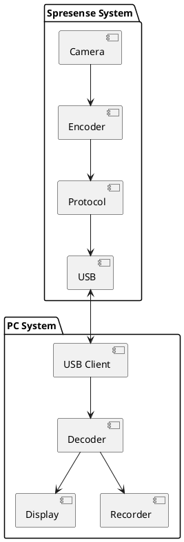
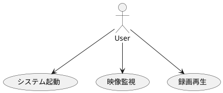
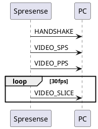
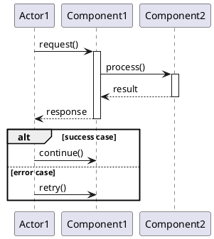
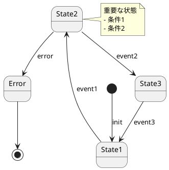

# ソフトウェア仕様書作成手法 - 実践ガイド

**作成日**: 2025-12-15
**対象プロジェクト**: Spresense HDRカメラ防犯カメラシステム
**適用範囲**: 組み込みシステム開発全般

---

## 📋 目次

1. [概要](#概要)
2. [仕様書の階層構造](#仕様書の階層構造)
3. [各仕様書の作成方法](#各仕様書の作成方法)
4. [PlantUML図の活用](#plantuml図の活用)
5. [実装プロンプトの設計](#実装プロンプトの設計)
6. [ベストプラクティス](#ベストプラクティス)
7. [テンプレート](#テンプレート)

---

## 概要

### 本手法の目的

包括的で実装可能な仕様書セットを効率的に作成し、Claude Codeを使った段階的実装を可能にする。

### 本手法の特徴

✅ **要求→設計→実装の一貫性**
✅ **PlantUML図による可視化**
✅ **実装プロンプトによる実装ガイド**
✅ **NuttX等の特殊な環境への対応**

### 適用プロジェクト例

- 組み込みシステム開発（NuttX, FreeRTOS等）
- IoTデバイス開発
- センサーアプリケーション
- 通信プロトコル実装
- ハイブリッドシステム（組み込み + PC/クラウド）

---

## 仕様書の階層構造

### 推奨構成（5+1階層）

```
1. REQUIREMENTS.md (要求仕様書)
   ↓ ユーザー要求の明確化

2. FUNCTIONAL_SPEC.md (機能仕様書)
   ↓ システム全体の機能定義

3. SOFTWARE_SPEC_xxx.md (ソフトウェア仕様書)
   ↓ 各サブシステムの詳細設計

4. PROTOCOL_SPEC.md (プロトコル仕様書) ※必要に応じて
   ↓ 通信プロトコルの詳細

5. IMPLEMENTATION_PROMPT.md (実装プロンプト)
   ↓ Claude Code用の段階的実装ガイド

6. README.md (プロジェクト概要)
   全ドキュメントのインデックス
```

### 各階層の役割

| 階層 | 抽象度 | 対象読者 | 主な内容 |
|------|--------|---------|---------|
| REQUIREMENTS | 最高 | ユーザー、PM | 何を作るか（質問リスト） |
| FUNCTIONAL_SPEC | 高 | アーキテクト、リーダー | どんな機能か（ユースケース） |
| SOFTWARE_SPEC | 中 | 開発者 | どう実装するか（API、データ構造） |
| PROTOCOL_SPEC | 中 | 開発者 | どう通信するか（バイト列） |
| IMPLEMENTATION_PROMPT | 低 | Claude Code | どう作るか（ステップ） |
| README | - | 全員 | 全体像（インデックス） |

---

## 各仕様書の作成方法

### 1. REQUIREMENTS.md（要求仕様書）

#### 目的
ユーザー要求を明確化し、曖昧さを排除する。

#### 構成

```markdown
# プロジェクト名 - 要求仕様書

## 1. システム概要
- システムの目的
- 主要機能
- システム構成図（簡易）

## 2. 機能要求（ドラフト）
### 2.1 カテゴリ1
#### Q1: 質問タイトル 🔴 **要確認**
- 質問内容
- 選択肢（表形式）
- 補足説明

## 3. 非機能要求
- パフォーマンス
- 信頼性
- 運用性

## 4. ハードウェア構成
- 必要なハードウェア
- 拡張ボード

## 5. 開発スコープ
### 5.1 Phase 1（MVP）
- 必須機能リスト

### 5.2 Phase 2（拡張）
- オプション機能リスト

## 6. まとめ - 確認事項一覧
### 🔴 最優先
### 🟡 次に確認
### 🟢 後で確認

## 7. 付録A: 参考仕様（暫定案）
- 標準構成の提案（YAML形式）
```

#### 質問の設計ポイント

**良い質問の例**:
```markdown
#### Q1: 映像解像度・フレームレート 🔴 **要確認**

以下のどれを優先しますか？

| オプション | 解像度 | FPS | 用途 |
|-----------|--------|-----|------|
| A. 高画質 | 1920x1080 | 15-30 | 詳細な記録重視 |
| B. 標準画質 | 1280x720 | 30 | バランス型 |
| C. 低画質・高速 | 640x480 | 60 | 動き検出重視 |

**質問**:
- 希望する解像度は？
- 希望するフレームレートは？
```

**ポイント**:
- 選択肢を明確に
- 各選択肢の影響を説明
- 優先度を付ける（🔴🟡🟢）

#### 標準構成案の提示

```yaml
# 付録A: 標準構成案
映像:
  解像度: 1280x720
  FPS: 30
  圧縮: H.264

通信:
  インターフェース: USB CDC

録画:
  トリガー: 常時
  分割: 1時間
  保存期間: 7日
```

**効果**:
- ユーザーが比較しやすい
- 実現可能性の目安
- Phase 1の基準

---

### 2. FUNCTIONAL_SPEC.md（機能仕様書）

#### 目的
システム全体の機能を定義し、実装の指針を示す。

#### 必須PlantUML図（8種類）

1. **システムアーキテクチャ図**


2. **ユースケース図**


3. **データフロー図**
4. **システム起動シーケンス図**
5. **メインループシーケンス図**
6. **エラー回復シーケンス図**
7. **状態遷移図**
8. **配置図（デプロイメント図）**

#### 機能要求の記述方法

```markdown
#### F-001: カメラ初期化

| 項目 | 内容 |
|------|------|
| **説明** | HDRカメラボードを初期化し、撮影準備を行う |
| **入力** | なし |
| **出力** | 初期化成功/失敗ステータス |
| **処理** | 1. カメラドライバ初期化<br>2. 解像度設定（1280x720）<br>3. フレームレート設定（30fps） |
| **エラー** | カメラ未接続、初期化失敗 |
| **参照** | SOFTWARE_SPEC_SPRESENSE.md Section 7.1 |
```

**ポイント**:
- 機能IDを付与（F-001, F-002...）
- 入力・出力を明確に
- 処理フローをステップ化
- 参照先を明記

#### データ仕様の記述

```markdown
### 4.2 データ仕様

| 段階 | 形式 | 解像度 | FPS | サイズ |
|------|------|--------|-----|--------|
| キャプチャ | YUV422 | 1280x720 | 30 | ~27.6 MB/s |
| エンコード | H.264 | 1280x720 | 30 | 2 Mbps |
| 保存 | MP4 | 1280x720 | 30 | ~900 MB/hour |
```

**効果**:
- データ量の見積もり
- ボトルネック特定
- ストレージ計画

---

### 3. SOFTWARE_SPEC_xxx.md（ソフトウェア仕様書）

#### 目的
サブシステムごとの詳細設計を記述。

#### Spresense側の例

**必須PlantUML図（7種類）**:
1. レイヤー構成図
2. コンポーネント図
3. クラス図（データ構造）
4. 初期化シーケンス図
5. メインループシーケンス図
6. エラーハンドリングシーケンス図
7. 状態遷移図

**モジュール設計**:
```markdown
### 2.1 モジュール一覧

| モジュール | ファイル | 責務 | 依存関係 |
|----------|---------|------|---------|
| Camera Manager | camera_manager.c/h | カメラ制御 | NuttX Camera Driver |
| Encoder Manager | encoder_manager.c/h | H.264エンコード | NuttX Video Driver |
```

**API仕様**:
```markdown
#### camera_manager_init()

\`\`\`c
/**
 * @brief カメラマネージャ初期化
 * @param config カメラ設定
 * @return 0: 成功, <0: エラー
 */
int camera_manager_init(const camera_config_t *config);
\`\`\`

**処理フロー**:
1. カメラデバイスオープン (`/dev/video0`)
2. フォーマット設定 (`VIDIOC_S_FMT`)
3. フレームレート設定 (`VIDIOC_S_PARM`)

**エラーコード**:
- `-1`: デバイスオープン失敗
- `-2`: フォーマット設定失敗
```

**データ構造**:
```c
typedef struct camera_config_s {
    uint16_t width;      /* 1280 */
    uint16_t height;     /* 720 */
    uint8_t  fps;        /* 30 */
} camera_config_t;
```

#### PC/Rust側の例

**モジュール設計**:
```markdown
| モジュール | ファイル | 主要クレート |
|----------|---------|------------|
| USB Transport | usb_transport.rs | tokio-serial |
| H.264 Decoder | decoder.rs | ffmpeg-next |
```

**実装例**:
```rust
// USB Transport
pub struct UsbTransport {
    port_name: String,
    packet_tx: mpsc::Sender<Packet>,
}

impl UsbTransport {
    pub async fn receive_loop(&mut self) -> Result<()> {
        // 非同期受信ループ
    }
}
```

---

### 4. PROTOCOL_SPEC.md（プロトコル仕様書）

#### 目的
通信プロトコルのバイトレベル仕様を定義。

#### 必須PlantUML図（7種類）

1. 通信モデル図
2. データフロー図
3. 接続確立シーケンス図
4. ストリーミングシーケンス図
5. ハートビートシーケンス図
6. フラグメント再構成シーケンス図
7. プロトコル状態遷移図

#### パケット構造の記述

```markdown
### 2.1 基本パケット形式

\`\`\`
+--------+--------+--------+--------+
| Offset |   0-1  |   2    |   3    |
+--------+--------+--------+--------+
| Field  | Magic  | Ver    | Type   |
|        | 0x5350 | 0x01   | 0x10   |
+--------+--------+--------+--------+
\`\`\`

### 2.2 ヘッダフィールド詳細

| フィールド | オフセット | サイズ | 型 | 説明 |
|-----------|----------|-------|---|------|
| Magic | 0 | 2 | uint16_t (LE) | 0x5350 |
| Version | 2 | 1 | uint8_t | 0x01 |
```

#### パケットタイプ定義

```markdown
### 3.1 タイプ一覧

| 値 | 名前 | 説明 | ペイロード |
|----|------|------|-----------|
| 0x01 | HANDSHAKE | 接続確立 | HandshakePayload |
| 0x10 | VIDEO_SPS | H.264 SPS | SPS NAL Unit |
```

#### シーケンス図



---

### 5. IMPLEMENTATION_PROMPT.md（実装プロンプト）

#### 目的
Claude Codeで段階的に実装するためのガイド。

#### 構成

```markdown
# 実装プロンプト案

## Phase 1: Spresense側実装

### プロンプト 1-1: プロジェクト構造作成

\`\`\`
仕様書に基づいて、以下を実装してください:

1. **プロジェクト構造作成**
   - ディレクトリ作成
   - Makefile, Kconfig作成

2. **重要な注意事項**
   NuttXは二重コンフィグ構造です:
   - Kconfigで依存関係定義
   - defconfigで値設定
   - ./tools/config.py で反映

3. **実装内容**
   [具体的な手順]

注意事項:
- [注意点1]
- [注意点2]
\`\`\`
```

#### プロンプト設計のポイント

**良いプロンプトの特徴**:
1. **明確な目的**: 何を実装するか
2. **具体的な手順**: どう実装するか
3. **参照先**: 仕様書のどこを見るか
4. **注意事項**: 何に気をつけるか
5. **コード例**: どう書くか

**段階の分け方**:
- 1プロンプト = 15-30分程度の作業
- 依存関係を考慮した順序
- 各ステップで動作確認可能

**NuttX固有の注意事項テンプレート**:
```markdown
## 重要な注意事項

### NuttX固有
1. **二重コンフィグ構造**
   - Kconfig: 依存関係定義
   - defconfig: 値設定
   - ./tools/config.py: 反映（必須）

2. **命名規則**
   - 正: CONFIG_EXAMPLES_*
   - 誤: CONFIG_MYPRO_*

3. **デバイスファイル**
   - カメラ: /dev/video0
   - USB CDC: /dev/ttyACM0
```

---

## PlantUML図の活用

### 推奨図の種類と用途

| 図の種類 | 用途 | 作成難易度 | 効果 |
|---------|------|----------|------|
| システムアーキテクチャ図 | 全体構造 | 中 | ⭐⭐⭐ |
| コンポーネント図 | モジュール関係 | 低 | ⭐⭐⭐ |
| シーケンス図 | 動的振る舞い | 中 | ⭐⭐⭐⭐⭐ |
| 状態遷移図 | ライフサイクル | 中 | ⭐⭐⭐⭐ |
| データフロー図 | データ変換 | 低 | ⭐⭐⭐ |
| ユースケース図 | 機能概要 | 低 | ⭐⭐ |
| クラス図 | データ構造 | 中 | ⭐⭐⭐ |
| 配置図 | 物理構成 | 低 | ⭐⭐ |

### シーケンス図のテンプレート



### 状態遷移図のテンプレート



---

## 実装プロンプトの設計

### Phase分割の基準

**Phase 1: MVP（Minimum Viable Product）**
- 基本機能のみ
- 1つのサブシステムで完結
- 動作確認可能

**Phase 2: 拡張機能**
- オプション機能
- 複雑な処理
- 最適化

**Phase 3: 統合・テスト**
- 複数サブシステム統合
- 長時間テスト
- パフォーマンス測定

### ステップ分割の例

**Phase 1を5ステップに分割**:
```
1-1: プロジェクト構造 + Kconfig (30分)
1-2: データ取得モジュール (30分)
1-3: データ処理モジュール (30分)
1-4: 通信モジュール (30分)
1-5: メインアプリ統合 (30分)
```

**各ステップの構成**:
```markdown
### プロンプト X-Y: [タイトル]

\`\`\`
[仕様書参照]の仕様に基づいて、以下を実装してください。

# Phase X-Y: [タイトル]

実装内容:
1. [項目1]
   - [詳細1-1]
   - [詳細1-2]

2. [項目2]
   - [詳細2-1]

参考:
- [参考ファイル1]
- [参考ドキュメント]

注意:
- [注意点1]
- [注意点2]

実装例:
\`\`\`c
// コード例
\`\`\`
\`\`\`
```

---

## ベストプラクティス

### 1. 要求仕様書作成

✅ **質問は25個程度が最適**
- 多すぎる（50+）: ユーザーが疲れる
- 少なすぎる（10-）: 要求が曖昧

✅ **優先度を必ず付ける**
- 🔴 Critical: 実装前に必須
- 🟡 Important: Phase 1完了前に必要
- 🟢 Later: Phase 2で検討

✅ **標準構成案を提示**
- ユーザーが判断しやすい
- 実現可能性を示す

### 2. 機能仕様書作成

✅ **PlantUML図は最低8種類**
- システムアーキテクチャ図（必須）
- シーケンス図3種類以上（起動、メイン、エラー）
- 状態遷移図（必須）

✅ **データフロー図で帯域幅を明記**
```
Camera → Encoder → USB
27.6 MB/s  2 Mbps  17.5%使用
```

✅ **ストレージ要件を明記**
- 1時間、1日、保存期間の容量
- 推奨ストレージサイズ

### 3. ソフトウェア仕様書作成

✅ **モジュールは5-10個が最適**
- 多すぎる: 複雑
- 少なすぎる: 責務不明確

✅ **API仕様はDoxygen形式**
```c
/**
 * @brief 関数の説明
 * @param arg1 引数1の説明
 * @return 戻り値の説明
 */
```

✅ **エラーコードを定義**
```c
#define ERR_OK           0
#define ERR_INIT        -1
#define ERR_INVALID     -2
```

### 4. プロトコル仕様書作成

✅ **パケット構造は表+図**
- オフセット表（必須）
- バイト配置図（わかりやすい）

✅ **エンディアンを明記**
- Little Endian (LE)
- Big Endian (BE)

✅ **実装例を含める**
- C言語での送信例
- Rustでのパース例

### 5. 実装プロンプト作成

✅ **環境固有の注意を冒頭に**
- NuttX二重コンフィグ
- WSL2 USB設定
- 権限問題

✅ **チェックリストを付ける**
```markdown
## 実装チェックリスト
- [ ] ファイル作成
- [ ] ビルド成功
- [ ] 動作確認
```

✅ **トラブルシューティングを含める**
```markdown
## トラブルシューティング
- ビルドエラー → make clean
- USB認識しない → デバイス確認
```

---

## テンプレート

### REQUIREMENTS.mdテンプレート

```markdown
# [プロジェクト名] - 要求仕様書

## 📋 ドキュメント情報
- **作成日**: YYYY-MM-DD
- **バージョン**: 0.1 (ドラフト)
- **ステータス**: **要確認事項あり**

## 1. システム概要
### 1.1 システムの目的
[目的を記述]

### 1.2 主要機能
- ✅ [機能1]
- ✅ [機能2]

### 1.3 システム構成（暫定）
\`\`\`
[簡易図]
\`\`\`

## 2. 機能要求（ドラフト)
### 2.1 [カテゴリ1]
#### Q1: [質問タイトル] 🔴 **要確認**
[質問内容]

## 9. まとめ - 確認事項一覧
### 🔴 最優先で確認が必要な項目
| # | 項目 | 選択肢 |
|---|------|--------|

## 10. 付録A: 参考仕様（暫定案）
\`\`\`yaml
[標準構成]
\`\`\`
```

### FUNCTIONAL_SPEC.mdテンプレート

```markdown
# [プロジェクト名] - 機能仕様書

## 1. システムアーキテクチャ

\`\`\`plantuml
@startuml
[PlantUML図]
@enduml
\`\`\`

## 2. 機能要求
### F-001: [機能名]
| 項目 | 内容 |
|------|------|
| **説明** | [説明] |
| **入力** | [入力] |
| **出力** | [出力] |
| **処理** | [処理フロー] |

## 4. データフロー
### 4.2 データ仕様
| 段階 | 形式 | サイズ |
|------|------|--------|

## 5. シーケンス図
\`\`\`plantuml
@startuml
[シーケンス図]
@enduml
\`\`\`
```

### IMPLEMENTATION_PROMPT.mdテンプレート

```markdown
# [プロジェクト名] 実装プロンプト案

## Phase 1: [サブシステム名]実装

### プロンプト 1-1: [タイトル]

\`\`\`
仕様書に基づいて実装してください。

# Phase 1-1: [タイトル]

実装内容:
1. [項目1]

注意事項:
- [環境固有の注意]

参考:
- [ドキュメント参照]
\`\`\`

## 重要な注意事項
### [環境名]固有の注意
1. [注意点1]

## 実装チェックリスト
- [ ] [項目1]
```

---

## まとめ

### 仕様書作成の流れ

```
1. REQUIREMENTS.md作成 (1-2時間)
   ↓ 25の質問で要求明確化

2. FUNCTIONAL_SPEC.md作成 (3-4時間)
   ↓ 8種類のPlantUML図

3. SOFTWARE_SPEC_xxx.md作成 (各2-3時間)
   ↓ モジュール設計、API仕様

4. PROTOCOL_SPEC.md作成 (2-3時間) ※必要時
   ↓ バイトレベル仕様

5. IMPLEMENTATION_PROMPT.md作成 (2-3時間)
   ↓ 15ステップのプロンプト

6. README.md作成 (1時間)
   全体のインデックス

合計: 12-18時間 (1.5-2日)
```

### 期待される効果

✅ **実装スピード向上**
- プロンプトに従うだけで実装可能
- 迷う時間を削減

✅ **品質向上**
- 設計の一貫性
- エラーハンドリング漏れ防止

✅ **保守性向上**
- ドキュメントが最新
- 変更影響範囲が明確

✅ **知識共有**
- 新メンバーのオンボーディング高速化
- 設計意図の伝達

---

**文書作成日**: 2025-12-15
**バージョン**: 1.0
**適用プロジェクト**: Spresense HDRカメラ防犯カメラシステム
