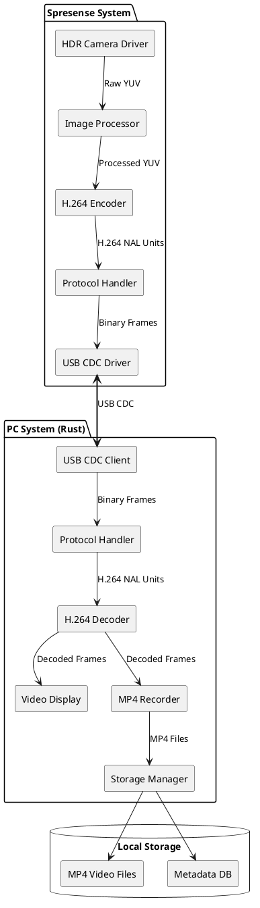
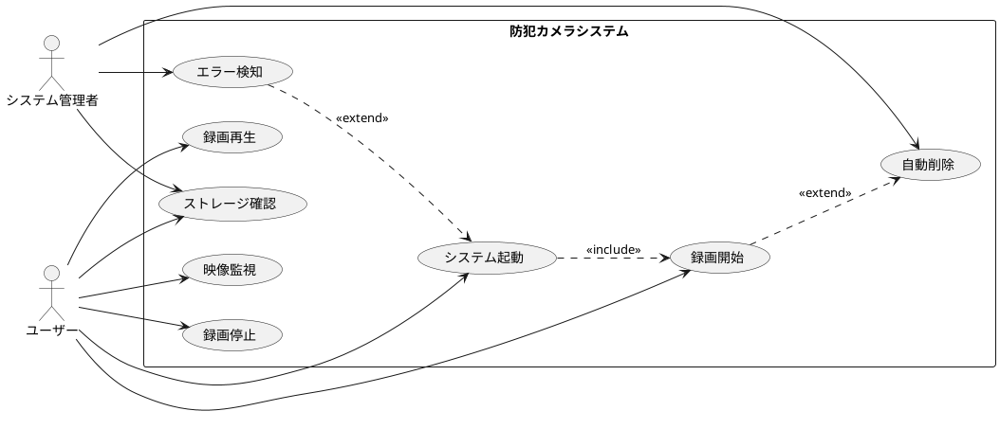
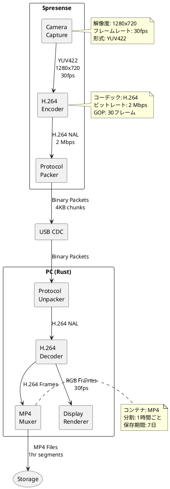
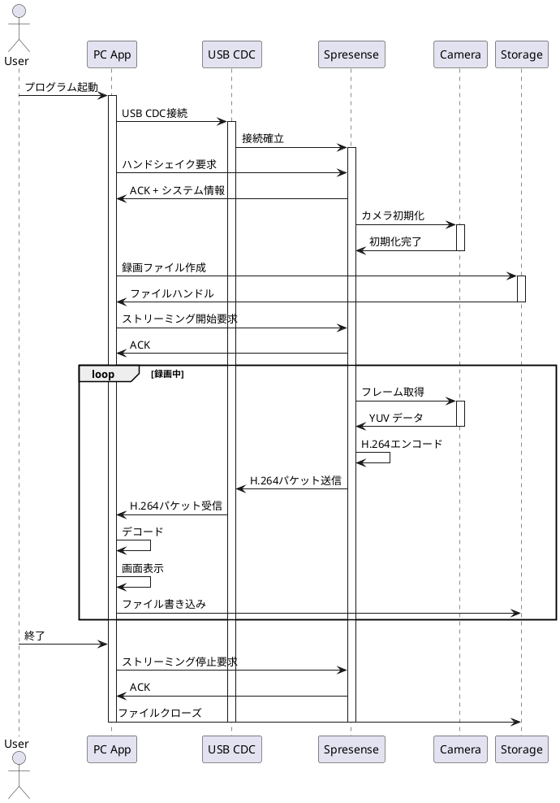
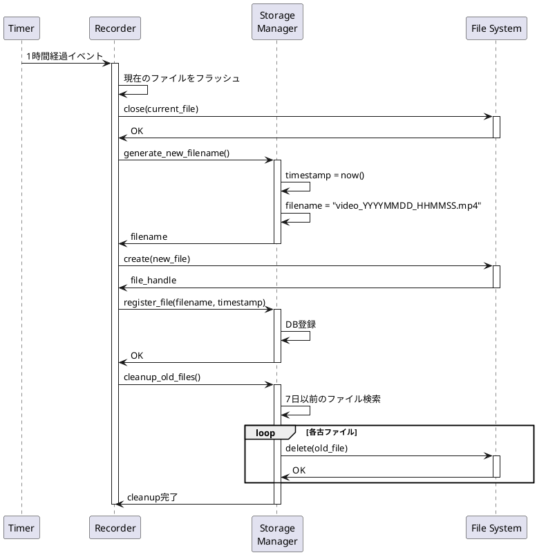
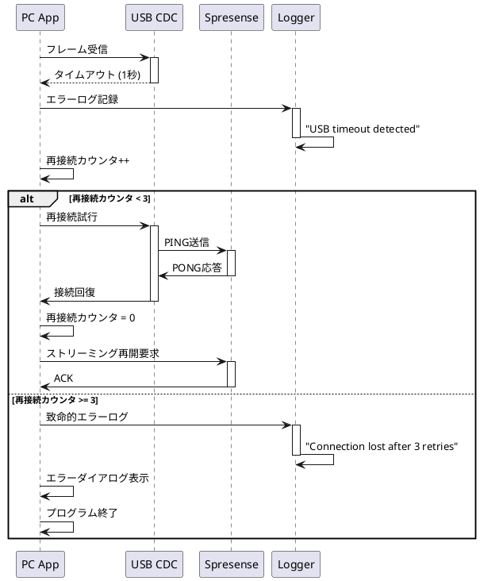
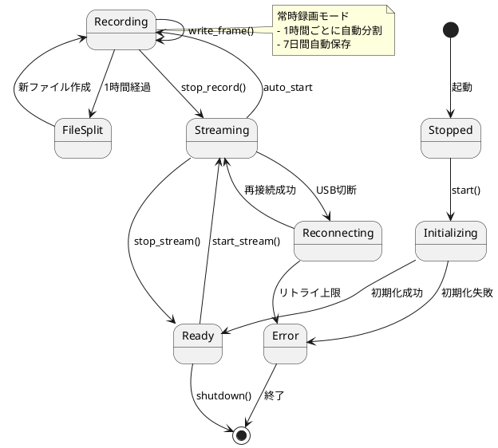
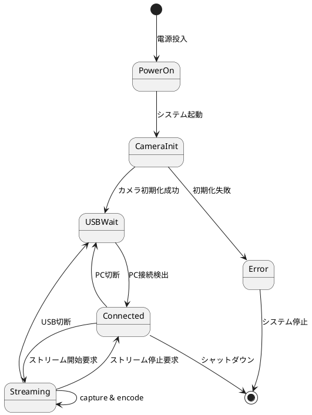
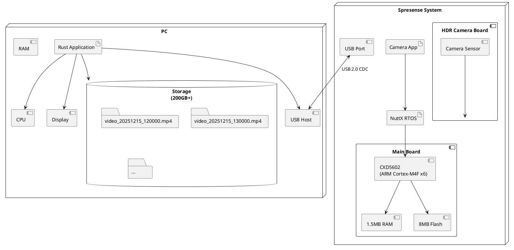

# Spresense HDRカメラ防犯カメラシステム - 機能仕様書

## 📋 ドキュメント情報

- **作成日**: 2025-12-15
- **バージョン**: 1.0
- **ステータス**: 確定
- **ベース構成**: 標準構成（HD 30fps, H.264, USB接続）

---

## 1. システム概要

### 1.1 目的

Spresense HDRカメラボードを使用した防犯カメラシステム。リアルタイム映像をPC側に送信し、録画・表示を行う。

### 1.2 システム構成

```
┌─────────────────────────────────┐         ┌─────────────────────────────────┐
│  Spresense System               │         │  PC System (Rust)               │
│  ┌───────────────────────────┐  │  USB    │  ┌───────────────────────────┐  │
│  │ HDR Camera Board          │  │  CDC    │  │ Video Receiver            │  │
│  │ - Image Capture (HD 30fps)│  ├────────►│  │ - Decode H.264            │  │
│  │ - HDR Processing          │  │         │  │ - Display (GUI)           │  │
│  └───────────┬───────────────┘  │         │  │ - Record to MP4           │  │
│              │                   │         │  └───────────┬───────────────┘  │
│  ┌───────────▼───────────────┐  │         │  ┌───────────▼───────────────┐  │
│  │ Video Encoder             │  │         │  │ Storage Manager           │  │
│  │ - H.264 Hardware Encode   │  │         │  │ - File Management         │  │
│  │ - 2 Mbps @ 30fps          │  │         │  │ - 7-day Rotation          │  │
│  └───────────┬───────────────┘  │         │  │ - Hourly Split            │  │
│              │                   │         │  └───────────────────────────┘  │
│  ┌───────────▼───────────────┐  │         │                                  │
│  │ USB CDC Transport         │  │         │                                  │
│  │ - Binary Protocol         │  │         │                                  │
│  │ - Frame Packetization     │  │         │                                  │
│  └───────────────────────────┘  │         │                                  │
└─────────────────────────────────┘         └─────────────────────────────────┘
```

### 1.3 システムアーキテクチャ（PlantUML）



---

## 2. 機能要求

### 2.1 映像取得機能（Spresense側）

#### F-001: カメラ初期化
- **説明**: HDRカメラボードを初期化し、撮影準備を行う
- **入力**: なし
- **出力**: 初期化成功/失敗ステータス
- **処理**:
  1. カメラドライバ初期化
  2. 解像度設定（1280x720）
  3. フレームレート設定（30fps）
  4. HDRモード有効化（Optional）

#### F-002: 映像キャプチャ
- **説明**: 30fpsで連続的に映像をキャプチャ
- **入力**: なし
- **出力**: YUV422形式の画像データ
- **処理**:
  1. カメラから画像取得
  2. HDR処理適用（明暗補正）
  3. YUV422形式で出力

#### F-003: H.264エンコード
- **説明**: YUV映像をH.264形式に圧縮
- **入力**: YUV422画像データ（1280x720）
- **出力**: H.264 NAL Units
- **処理**:
  1. ハードウェアエンコーダ初期化
  2. ビットレート設定（2 Mbps）
  3. GOP設定（Iフレーム間隔: 30フレーム）
  4. エンコード実行

### 2.2 通信機能

#### F-004: USB CDC接続
- **説明**: PC側とUSB CDC経由で接続確立
- **入力**: なし
- **出力**: 接続ステータス
- **処理**:
  1. USB CDC初期化
  2. PC側からの接続要求待ち
  3. ハンドシェイク実行

#### F-005: フレーム送信
- **説明**: H.264フレームをPC側に送信
- **入力**: H.264 NAL Units
- **出力**: 送信完了ステータス
- **処理**:
  1. NAL Unitをパケット化（最大4KB/パケット）
  2. ヘッダ付加（シーケンス番号、タイムスタンプ）
  3. USB CDC経由で送信

### 2.3 録画機能（PC側）

#### F-006: 映像受信
- **説明**: Spresenseから映像データを受信
- **入力**: USB CDC受信データ
- **出力**: H.264 NAL Units
- **処理**:
  1. パケット受信
  2. ヘッダ検証
  3. NAL Unitの再構成
  4. シーケンス番号チェック

#### F-007: 常時録画
- **説明**: 起動時から自動的に録画開始
- **入力**: デコードされた映像フレーム
- **出力**: MP4ファイル
- **処理**:
  1. プログラム起動時に録画開始
  2. H.264ストリームをMP4コンテナに格納
  3. 1時間ごとに新ファイル作成
  4. タイムスタンプ付きファイル名生成

#### F-008: ファイル分割
- **説明**: 録画ファイルを1時間ごとに分割
- **入力**: 録画経過時間
- **出力**: 新しいMP4ファイル
- **処理**:
  1. 録画開始から1時間経過を検出
  2. 現在のファイルをクローズ
  3. 新しいファイル作成
  4. メタデータ更新

#### F-009: ストレージ管理
- **説明**: 7日間を超えた録画ファイルを自動削除
- **入力**: ファイル作成日時
- **出力**: 削除ステータス
- **処理**:
  1. 1時間ごとに古いファイルをスキャン
  2. 作成日時が7日以上前のファイルを検出
  3. ファイル削除
  4. ログ記録

### 2.4 表示機能（PC側）

#### F-010: リアルタイム表示
- **説明**: 受信映像をGUIウィンドウに表示
- **入力**: デコードされた映像フレーム
- **出力**: GUIウィンドウへの描画
- **処理**:
  1. H.264デコード
  2. RGB形式に変換
  3. GUIフレームワークで表示
  4. フレームレート表示

#### F-011: 録画ステータス表示
- **説明**: 現在の録画状態を表示
- **入力**: 録画状態情報
- **出力**: ステータステキスト
- **表示内容**:
  - 録画中/停止
  - 現在のファイル名
  - 録画時間
  - ストレージ使用量

---

## 3. ユースケース

### 3.1 ユースケース図



### 3.2 ユースケース詳細

#### UC-001: システム起動

| 項目 | 内容 |
|------|------|
| **アクター** | ユーザー |
| **事前条件** | Spresenseとカメラが接続されている |
| **事後条件** | 録画が開始される |
| **主フロー** | 1. ユーザーがPC側プログラムを起動<br>2. システムがSpresenseとUSB接続確立<br>3. カメラ初期化<br>4. 自動的に録画開始<br>5. リアルタイム映像表示 |
| **代替フロー** | 2a. USB接続失敗 → エラー表示、リトライ<br>3a. カメラ初期化失敗 → エラー表示、終了 |

#### UC-002: 映像監視

| 項目 | 内容 |
|------|------|
| **アクター** | ユーザー |
| **事前条件** | システムが起動している |
| **事後条件** | なし |
| **主フロー** | 1. ユーザーがGUIウィンドウで映像確認<br>2. リアルタイム映像が30fpsで表示される<br>3. 録画ステータスが表示される |

#### UC-003: 録画開始

| 項目 | 内容 |
|------|------|
| **アクター** | システム（自動） |
| **事前条件** | システムが起動している |
| **事後条件** | MP4ファイルが作成される |
| **主フロー** | 1. プログラム起動時に自動的に録画開始<br>2. タイムスタンプ付きMP4ファイル作成<br>3. H.264ストリームをファイルに書き込み |

#### UC-007: 自動削除

| 項目 | 内容 |
|------|------|
| **アクター** | システム（自動） |
| **事前条件** | 7日以上前のファイルが存在 |
| **事後条件** | 古いファイルが削除される |
| **主フロー** | 1. 1時間ごとにファイルスキャン<br>2. 7日以上前のファイルを検出<br>3. ファイル削除<br>4. ログ記録 |

---

## 4. データフロー

### 4.1 データフロー図



### 4.2 データ仕様

#### 4.2.1 映像データ

| 段階 | 形式 | 解像度 | フレームレート | ビットレート/サイズ |
|------|------|--------|--------------|-------------------|
| キャプチャ | YUV422 | 1280x720 | 30fps | 約27.6 MB/s |
| エンコード後 | H.264 | 1280x720 | 30fps | 2 Mbps (0.25 MB/s) |
| 表示 | RGB24 | 1280x720 | 30fps | 約66.3 MB/s |
| 保存 | MP4 | 1280x720 | 30fps | 約900 MB/hour |

#### 4.2.2 ストレージ要件

- **1時間の録画サイズ**: 約900 MB
- **1日の録画サイズ**: 約21.6 GB
- **7日間の録画サイズ**: 約151 GB
- **推奨ストレージ**: 200 GB以上

---

## 5. シーケンス図

### 5.1 システム起動シーケンス



### 5.2 ファイル分割シーケンス



### 5.3 エラー回復シーケンス



---

## 6. 状態遷移図

### 6.1 システム状態遷移



### 6.2 Spresense状態遷移



---

## 7. 配置図

### 7.1 物理配置



---

## 8. 非機能要求

### 8.1 パフォーマンス要求

| 項目 | 要求値 | 備考 |
|------|--------|------|
| 映像遅延 | < 500ms | エンコード+転送+デコード |
| フレームドロップ率 | < 1% | 通常動作時 |
| CPU使用率（Spresense） | < 80% | 連続動作時 |
| CPU使用率（PC） | < 30% | 1コア換算 |
| メモリ使用量（PC） | < 500MB | バッファ含む |

### 8.2 信頼性要求

| 項目 | 要求値 | 対策 |
|------|--------|------|
| 連続稼働時間 | 7日以上 | メモリリーク対策 |
| USB切断からの復旧時間 | < 10秒 | 自動再接続 |
| データ損失率 | 0% | ファイル同期書き込み |

### 8.3 運用要求

| 項目 | 内容 |
|------|------|
| 自動起動 | PC起動時に自動起動可能（Systemdサービス） |
| ログ出力 | エラー、警告、情報レベルのログ出力 |
| 設定ファイル | TOML形式で解像度、ビットレート等を設定可能 |

---

## 9. 制約事項

### 9.1 ハードウェア制約

- Spresense RAM制約: 1.5MB（大きなバッファは使用不可）
- USB CDC帯域: 最大12Mbps（実効9Mbps程度）
- H.264ビットレート上限: 2Mbps（USB帯域を考慮）

### 9.2 ソフトウェア制約

- Spresense: NuttX RTOS、C/C++のみ
- PC: Rust 1.70以上
- H.264プロファイル: Baseline Profile（互換性重視）

---

## 10. 設定パラメータ

### 10.1 設定ファイル例（config.toml）

```toml
[camera]
resolution = "1280x720"
fps = 30
hdr_enabled = false

[encoder]
codec = "h264"
bitrate = 2_000_000  # 2 Mbps
gop_size = 30

[connection]
interface = "usb_cdc"
port = "/dev/ttyACM0"  # Linux
# port = "COM3"        # Windows
timeout_ms = 1000

[recorder]
output_dir = "/home/user/videos"
file_format = "mp4"
split_interval_sec = 3600  # 1 hour
retention_days = 7
auto_start = true

[display]
enabled = true
window_width = 1280
window_height = 720
show_fps = true
show_status = true

[logging]
level = "info"  # debug, info, warn, error
file = "/var/log/security_camera.log"
```

---

## 11. まとめ

本仕様書では、Spresense HDRカメラを使用した防犯カメラシステムの機能要求を定義した。

**主要機能**:
- ✅ HD 30fps映像のリアルタイム配信
- ✅ H.264圧縮による効率的な転送
- ✅ USB CDC経由の安定した通信
- ✅ 常時録画とMP4ファイル保存
- ✅ 1時間ごとの自動ファイル分割
- ✅ 7日間の自動ストレージ管理
- ✅ リアルタイム映像表示

**Phase 2以降の拡張機能**:
- 動き検出
- 複数カメラ対応
- Web UI
- 通知機能

---

**文書バージョン**: 1.0
**最終更新**: 2025-12-15
**ステータス**: ✅ 確定
