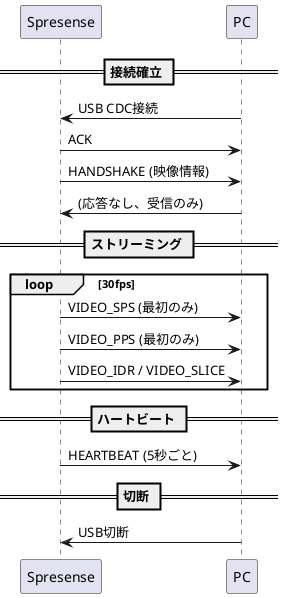
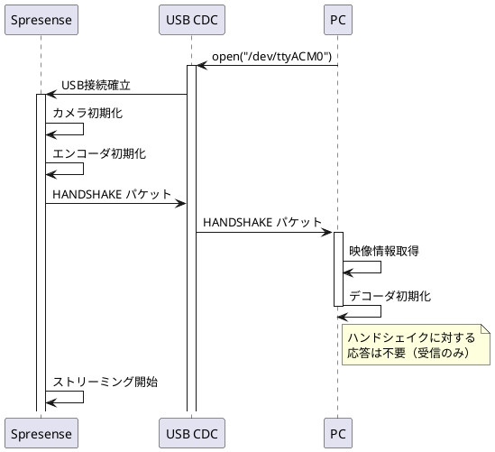
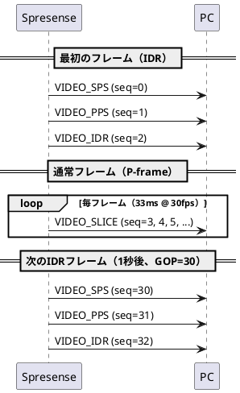
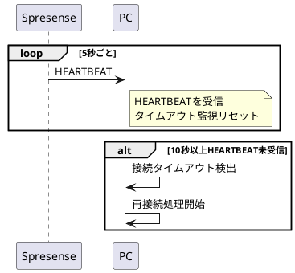
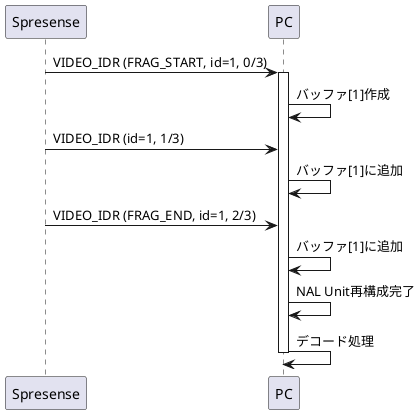
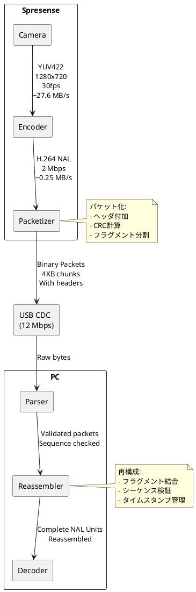
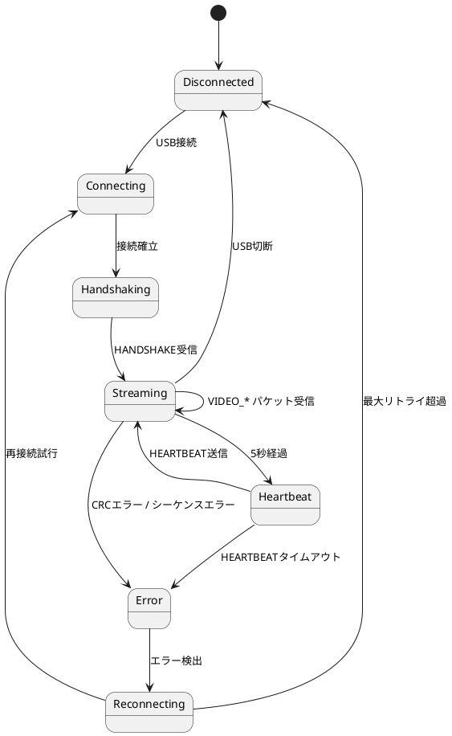

# 通信プロトコル仕様書 - 防犯カメラシステム

## 📋 ドキュメント情報

- **作成日**: 2025-12-15
- **バージョン**: 1.0
- **プロトコル名**: Security Camera Binary Protocol (SCBP)
- **プロトコルバージョン**: 0x01

---

## 1. プロトコル概要

### 1.1 目的

Spresense（送信側）とPC（受信側）間でH.264映像ストリームを効率的に転送するためのバイナリプロトコル。

### 1.2 特徴

- ✅ バイナリ形式（オーバーヘッド最小化）
- ✅ CRC16によるデータ整合性保証
- ✅ シーケンス番号による順序保証
- ✅ タイムスタンプ同期
- ✅ フラグメンテーション対応（大きなNAL Unit分割）
- ✅ ハンドシェイク機能
- ✅ ハートビートによる接続監視

### 1.3 通信モデル



---

## 2. パケット構造

### 2.1 基本パケット形式

```
+--------+--------+--------+--------+--------+--------+--------+--------+
| Offset |   0    |   1    |   2    |   3    |   4    |   5    |   6    |   7    |
+--------+--------+--------+--------+--------+--------+--------+--------+
|   0    |      Magic      | Ver    | Type   |       Sequence Number       |
+--------+-----------------+--------+--------+-----------------------------+
|   8    |                    Timestamp (μs)                              |
+--------+----------------------------------------------------------------+
|  16    |                    Payload Size                                |
+--------+----------------------------------------------------------------+
|  20    |     Checksum    |                                               |
+--------+-----------------+                                               +
|  22    |                         Payload                                |
|        |                      (0 ~ 4096 bytes)                          |
+--------+----------------------------------------------------------------+
```

**サイズ**: 22バイト（ヘッダ） + 可変長（ペイロード）

### 2.2 ヘッダフィールド詳細

| フィールド | オフセット | サイズ | 型 | 説明 |
|-----------|----------|-------|---|------|
| Magic | 0 | 2 | uint16_t (LE) | マジックナンバー `0x5350` ('SP') |
| Version | 2 | 1 | uint8_t | プロトコルバージョン `0x01` |
| Type | 3 | 1 | uint8_t | パケットタイプ（後述） |
| Sequence | 4 | 4 | uint32_t (LE) | シーケンス番号（0から開始、パケットごとに+1） |
| Timestamp | 8 | 8 | uint64_t (LE) | タイムスタンプ（マイクロ秒、起動時からの経過時間） |
| Payload Size | 16 | 4 | uint32_t (LE) | ペイロードサイズ（0～4096） |
| Checksum | 20 | 2 | uint16_t (LE) | CRC16（ペイロードに対して計算） |
| Payload | 22 | 可変 | uint8_t[] | ペイロードデータ |

**注**: LEはLittle Endian

---

## 3. パケットタイプ

### 3.1 タイプ一覧

| タイプ値 | 名前 | 説明 | ペイロード |
|---------|------|------|----------|
| 0x01 | HANDSHAKE | 接続確立・映像情報通知 | HandshakePayload |
| 0x10 | VIDEO_SPS | H.264 Sequence Parameter Set | SPS NAL Unit |
| 0x11 | VIDEO_PPS | H.264 Picture Parameter Set | PPS NAL Unit |
| 0x12 | VIDEO_IDR | H.264 IDR Frame (I-frame) | IDR NAL Unit |
| 0x13 | VIDEO_SLICE | H.264 Slice (P-frame) | Slice NAL Unit |
| 0x20 | HEARTBEAT | 接続確認 | なし（0バイト） |
| 0xFF | ERROR | エラー通知 | ErrorPayload |

### 3.2 ペイロード定義

#### 3.2.1 HANDSHAKE Payload

```c
struct handshake_payload {
    uint16_t video_width;     // 映像幅（例: 1280）
    uint16_t video_height;    // 映像高さ（例: 720）
    uint8_t  fps;             // フレームレート（例: 30）
    uint8_t  codec;           // コーデック（0x01 = H.264）
    uint32_t bitrate;         // ビットレート（例: 2000000）
} __attribute__((packed));
```

**サイズ**: 10バイト

**例**:
```
1280x720, 30fps, H.264, 2Mbps の場合:
00 05  D0 02  1E  01  00 27 8D 00
```

#### 3.2.2 VIDEO_SPS / VIDEO_PPS / VIDEO_IDR / VIDEO_SLICE Payload

H.264 NAL Unitをそのまま格納（最大4096バイト）。

**注**: NAL Unitが4096バイトを超える場合はフラグメンテーション（後述）。

#### 3.2.3 ERROR Payload

```c
struct error_payload {
    uint8_t  error_code;      // エラーコード
    uint8_t  message_len;     // メッセージ長
    char     message[];       // エラーメッセージ（可変長）
} __attribute__((packed));
```

**エラーコード**:
- 0x01: Camera initialization failed
- 0x02: Encoder error
- 0x03: USB error
- 0xFF: Unknown error

---

## 4. 通信シーケンス

### 4.1 接続確立シーケンス



### 4.2 ストリーミングシーケンス



### 4.3 ハートビートシーケンス



---

## 5. フラグメンテーション

### 5.1 概要

NAL Unitが4096バイトを超える場合、複数のパケットに分割して送信。

### 5.2 フラグメントパケット拡張

フラグメント対応のため、Payloadの先頭に以下のヘッダを追加:

```c
struct fragment_header {
    uint8_t  flags;           // フラグ（下記参照）
    uint16_t fragment_id;     // フラグメントID（同一NAL Unitで共通）
    uint16_t fragment_index;  // フラグメント番号（0から開始）
    uint16_t total_fragments; // 総フラグメント数
} __attribute__((packed));
```

**サイズ**: 7バイト

**フラグ**:
- Bit 0: `FRAGMENT_START` (1 = 最初のフラグメント)
- Bit 1: `FRAGMENT_END` (1 = 最後のフラグメント)
- Bit 2-7: 予約（0）

### 5.3 フラグメント送信例

10KB のIDR NAL Unitを送信する場合:

```
パケット1: FRAGMENT_START | fragment_id=1, index=0, total=3 | 4089バイト
パケット2:                  fragment_id=1, index=1, total=3 | 4089バイト
パケット3: FRAGMENT_END   | fragment_id=1, index=2, total=3 | 1822バイト
```

### 5.4 フラグメント再構成シーケンス



---

## 6. エラーハンドリング

### 6.1 パケット検証エラー

| エラー | 原因 | 対処 |
|-------|------|------|
| Magic不一致 | ノイズ、同期ずれ | パケット破棄、次のMagic検索 |
| CRC不一致 | データ破損 | パケット破棄、次のパケット待機 |
| Sequence不連続 | パケットロス | ログ記録、次のパケット続行 |

### 6.2 タイムアウトエラー

| タイムアウト | 時間 | 対処 |
|------------|------|------|
| Handshakeタイムアウト | 5秒 | 再接続 |
| Heartbeatタイムアウト | 10秒 | 再接続 |
| パケット受信タイムアウト | 1秒 | 警告ログ、待機継続 |

### 6.3 エラー通知パケット

Spresense側でエラーが発生した場合、ERRORパケットを送信:

```
Type: 0xFF (ERROR)
Payload:
  error_code: 0x02 (Encoder error)
  message_len: 20
  message: "Encoder init failed"
```

---

## 7. データフロー図



---

## 8. 帯域幅計算

### 8.1 理論値

| 項目 | 値 | 計算 |
|------|---|------|
| 映像ビットレート | 2 Mbps | 設定値 |
| パケットヘッダオーバーヘッド | ~5% | 22バイト / 4096バイト |
| 実効ビットレート | 2.1 Mbps | 2 Mbps × 1.05 |
| USB CDC帯域 | 12 Mbps | USB 2.0 Full Speed |
| 帯域使用率 | 17.5% | 2.1 / 12 |

### 8.2 パケット送信レート

**30fps, 2Mbps の場合**:

- 1フレームあたりデータ量: `2,000,000 bps / 30 fps = 66,667 bytes/frame ≈ 65 KB/frame`
- 1フレームあたりパケット数: `65 KB / 4 KB = 16 packets/frame`
- パケット送信レート: `16 packets/frame × 30 fps = 480 packets/sec`
- パケット間隔: `1000 ms / 480 = 2.08 ms/packet`

---

## 9. プロトコル状態遷移



---

## 10. 実装例

### 10.1 パケット送信（Spresense側 C言語）

```c
// パケット送信関数
int send_packet(int usb_fd, uint8_t type, const uint8_t *payload, uint32_t payload_size)
{
    static uint32_t sequence = 0;
    packet_t packet;

    // ヘッダ設定
    packet.header.magic = 0x5350;
    packet.header.version = 0x01;
    packet.header.type = type;
    packet.header.sequence = sequence++;
    packet.header.timestamp_us = get_timestamp_us();
    packet.header.payload_size = payload_size;

    // ペイロードコピー
    memcpy(packet.payload, payload, payload_size);

    // CRC計算
    packet.header.checksum = crc16(payload, payload_size);

    // 送信
    int total_size = sizeof(packet_header_t) + payload_size;
    int ret = write(usb_fd, &packet, total_size);

    return ret;
}
```

### 10.2 パケット受信（PC側 Rust）

```rust
// パケットパース
pub fn parse_packet(input: &[u8]) -> IResult<&[u8], Packet> {
    let (input, magic) = le_u16(input)?;
    if magic != 0x5350 {
        return Err(nom::Err::Error(nom::error::Error::new(
            input,
            nom::error::ErrorKind::Tag,
        )));
    }

    let (input, version) = le_u8(input)?;
    let (input, pkt_type) = le_u8(input)?;
    let (input, sequence) = le_u32(input)?;
    let (input, timestamp_us) = le_u64(input)?;
    let (input, payload_size) = le_u32(input)?;
    let (input, checksum) = le_u16(input)?;
    let (input, payload_data) = take(payload_size)(input)?;

    // CRC検証
    let calculated_crc = calculate_crc16(payload_data);
    if calculated_crc != checksum {
        return Err(nom::Err::Error(nom::error::Error::new(
            input,
            nom::error::ErrorKind::Verify,
        )));
    }

    Ok((input, Packet {
        magic,
        version,
        packet_type: PacketType::from_u8(pkt_type).unwrap(),
        sequence,
        timestamp_us,
        payload: Bytes::copy_from_slice(payload_data),
        checksum,
    }))
}
```

---

## 11. テストケース

### 11.1 基本パケット送受信

| テスト | 入力 | 期待出力 |
|-------|------|---------|
| HANDSHAKE送信 | 1280x720, 30fps | PC側で正しくパース |
| VIDEO_SPS送信 | SPS NAL (50バイト) | PC側で正しく受信 |
| VIDEO_IDR送信 | IDR NAL (5000バイト) | フラグメント化して送信 |

### 11.2 エラーケース

| テスト | 条件 | 期待動作 |
|-------|------|---------|
| CRCエラー | CRC値を改変 | パケット破棄、次のパケット待機 |
| Magic不一致 | 先頭2バイトを改変 | パケット破棄、Magic再探索 |
| シーケンス不連続 | seq=5の後にseq=7 | ログ警告、処理続行 |
| タイムアウト | 10秒間データなし | 再接続処理 |

---

## 12. パフォーマンス要件

| 項目 | 要件 | 測定方法 |
|------|------|---------|
| パケット送信遅延 | < 1 ms | USB write完了までの時間 |
| パケット受信遅延 | < 1 ms | USB read後のパース時間 |
| CRC計算時間 | < 100 μs | 4KBデータのCRC計算時間 |
| フラグメント再構成 | < 5 ms | 10KBのNAL Unit再構成時間 |

---

## 13. セキュリティ考慮事項

### 13.1 現在の実装

- ❌ 暗号化なし（平文通信）
- ❌ 認証なし
- ✅ CRC16によるデータ整合性チェック

### 13.2 Phase 2での拡張案

- AES暗号化追加（ペイロードを暗号化）
- HMACによる認証
- チャレンジ・レスポンス認証

---

## 14. まとめ

本仕様書では、Spresense-PC間の通信プロトコルを詳細に定義した。

**主要機能**:
- ✅ バイナリプロトコル（効率的）
- ✅ CRC16によるデータ整合性
- ✅ シーケンス番号による順序保証
- ✅ フラグメンテーション対応
- ✅ ハートビート機能

**プロトコルパラメータ**:
- Magic: 0x5350
- Version: 0x01
- Max Payload: 4096 bytes
- Header Size: 22 bytes

---

**文書バージョン**: 1.0
**最終更新**: 2025-12-15
**ステータス**: ✅ 確定
