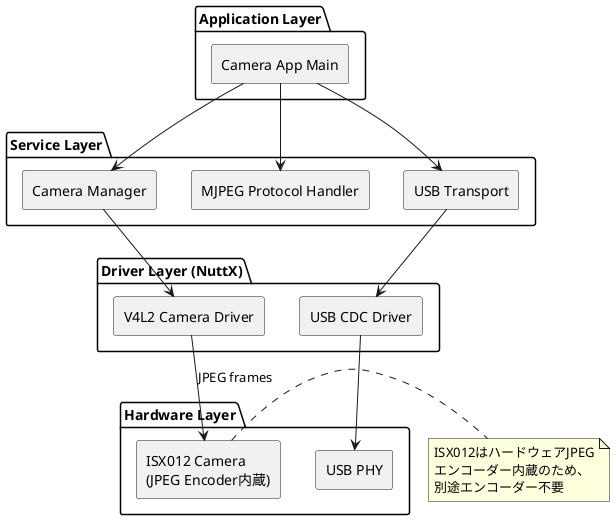
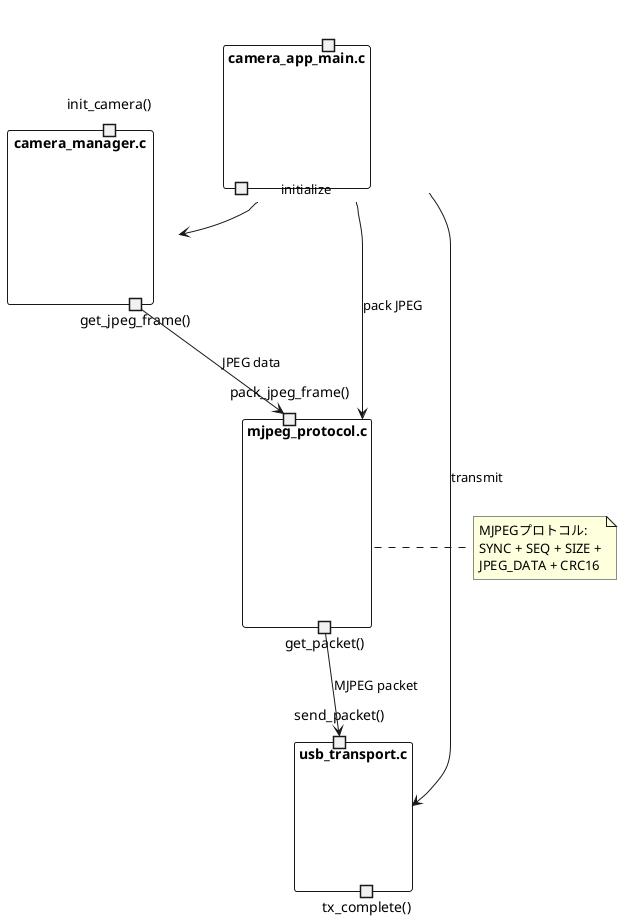
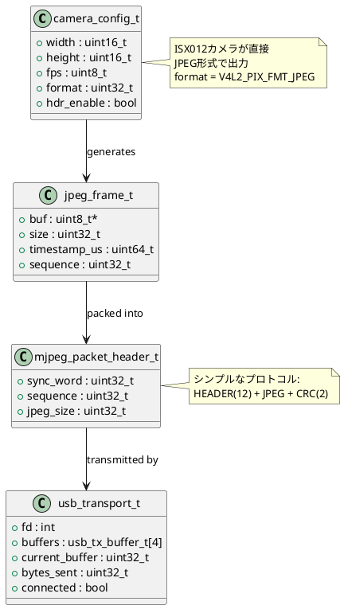
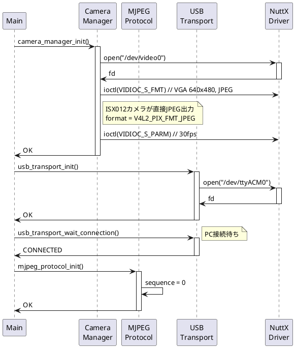
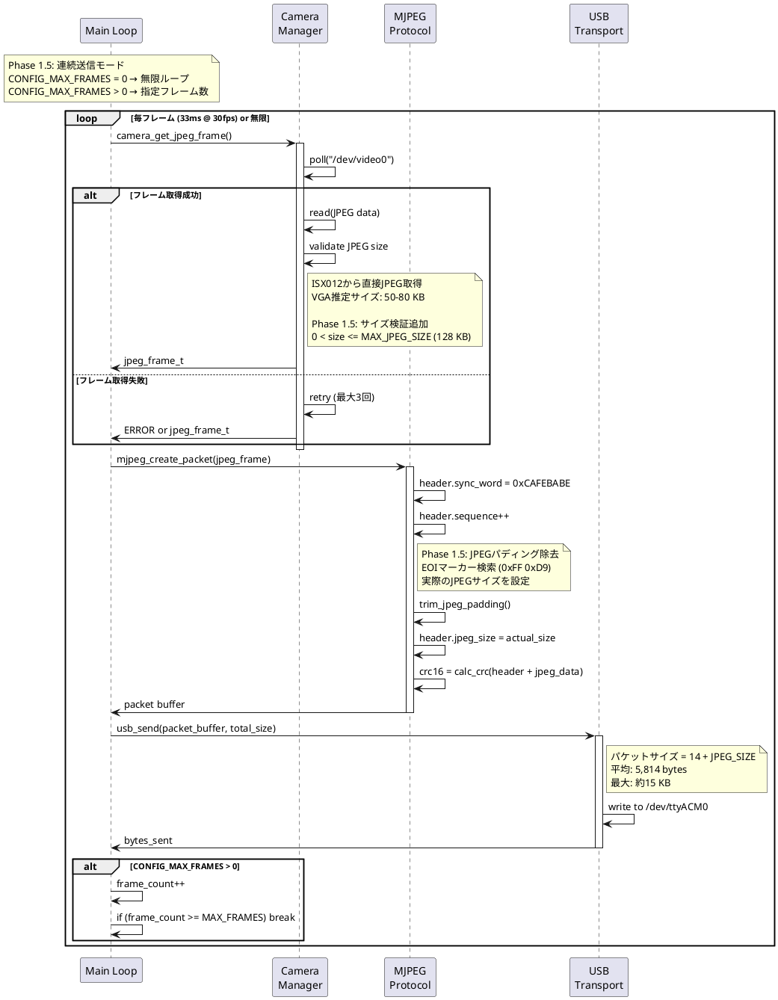
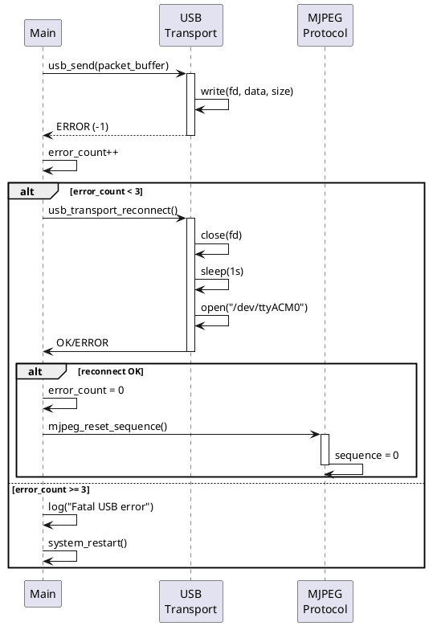
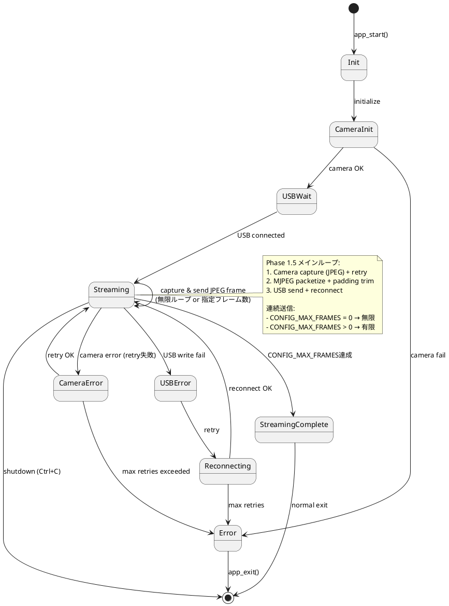

# Spresense側ソフトウェア仕様書 - 防犯カメラシステム

## 📋 ドキュメント情報

- **作成日**: 2025-12-15
- **最終更新**: 2025-12-25
- **バージョン**: 2.1 (Phase 1.5 安定性向上版)
- **対象**: Spresense側ソフトウェア
- **プラットフォーム**: NuttX RTOS
- **言語**: C
- **コーデック**: MJPEG (ISX012内蔵JPEGエンコーダー)

---

## 1. ソフトウェアアーキテクチャ

### 1.1 レイヤー構成



### 1.2 コンポーネント図



---

## 2. モジュール設計

### 2.1 モジュール一覧

| モジュール名 | ファイル名 | 責務 | 依存関係 |
|------------|-----------|------|---------|
| Main Application | camera_app_main.c | アプリケーション制御 | 全モジュール |
| Camera Manager | camera_manager.c/h | カメラ初期化・JPEG取得 | NuttX V4L2 Driver |
| MJPEG Protocol | mjpeg_protocol.c/h | MJPEGパケット化・CRC計算 | なし |
| USB Transport | usb_transport.c/h | USB CDC送信制御 | NuttX USB CDC |
| Config Manager | config.h | 設定パラメータ管理 | なし |

**削除されたモジュール**:
- Encoder Manager (ISX012が直接JPEG出力するため不要)

### 2.2 ディレクトリ構成

```
security_camera/
├── Makefile
├── Kconfig
├── Make.defs
├── camera_app_main.c          # メインアプリケーション
├── camera_manager.c            # カメラ管理（V4L2 JPEG）
├── camera_manager.h
├── mjpeg_protocol.c            # MJPEGプロトコル処理
├── mjpeg_protocol.h
├── usb_transport.c             # USB送信（CDC-ACM）
├── usb_transport.h
├── config.h                    # 設定定義
└── README.md
```

---

## 3. データ構造

### 3.1 主要データ構造

#### 3.1.1 カメラ設定構造体

```c
/* camera_manager.h */

typedef struct camera_config_s
{
  uint16_t width;              /* 画像幅 (640 for VGA) */
  uint16_t height;             /* 画像高さ (480 for VGA) */
  uint8_t  fps;                /* フレームレート (30) */
  uint32_t format;             /* 画像フォーマット (V4L2_PIX_FMT_JPEG) */
  bool     hdr_enable;         /* HDR有効/無効 */
} camera_config_t;

typedef struct jpeg_frame_s
{
  uint8_t  *buf;               /* JPEGデータバッファポインタ */
  uint32_t size;               /* JPEGデータサイズ */
  uint64_t timestamp_us;       /* タイムスタンプ (マイクロ秒) */
  uint32_t sequence;           /* シーケンス番号 */
} jpeg_frame_t;

/* V4L2 フォーマット定義 */
#define V4L2_PIX_FMT_JPEG  0x4745504a  /* JPEG */
```

**注**: エンコーダ設定構造体は不要です。ISX012カメラが直接JPEG形式で出力するため、別途エンコーダモジュールは存在しません。

#### 3.1.2 MJPEGプロトコルパケット構造体

```c
/* mjpeg_protocol.h */

#define MJPEG_SYNC_WORD   0xCAFEBABE  /* 同期ワード */
#define MAX_JPEG_SIZE     524288      /* 512 KB (最大JPEGサイズ) */

/**
 * MJPEG パケット構造:
 *
 * ┌──────────┬──────────┬──────────┬───────────────┬──────────┐
 * │  HEADER  │   SEQ    │   SIZE   │  JPEG DATA    │ CHECKSUM │
 * │ (4 bytes)│ (4 bytes)│ (4 bytes)│  (variable)   │ (2 bytes)│
 * └──────────┴──────────┴──────────┴───────────────┴──────────┘
 */

typedef struct mjpeg_packet_s
{
  uint32_t sync_word;          /* 同期ワード (0xCAFEBABE) */
  uint32_t sequence;           /* シーケンス番号 (フレーム番号) */
  uint32_t jpeg_size;          /* JPEG データサイズ (bytes) */
  /* この後に jpeg_size バイトの JPEG データが続く */
  /* 最後に 2 バイトの CRC-16-CCITT チェックサム */
} __attribute__((packed)) mjpeg_packet_header_t;

/* パケット全体サイズ = ヘッダー(12) + JPEGデータ(可変) + チェックサム(2) */
#define MJPEG_HEADER_SIZE    12   /* sync_word + sequence + jpeg_size */
#define MJPEG_CHECKSUM_SIZE  2    /* CRC-16 */
#define MJPEG_OVERHEAD       (MJPEG_HEADER_SIZE + MJPEG_CHECKSUM_SIZE)
```

#### 3.1.4 USB転送バッファ

```c
/* usb_transport.h */

#define USB_TX_BUFFER_COUNT   4     /* 送信バッファ数 */
#define USB_TX_BUFFER_SIZE    8192  /* 8KB */

typedef struct usb_tx_buffer_s
{
  uint8_t  data[USB_TX_BUFFER_SIZE];
  uint32_t size;
  bool     in_use;
} usb_tx_buffer_t;

typedef struct usb_transport_s
{
  int fd;                          /* USB CDC デバイスファイルディスクリプタ */
  usb_tx_buffer_t buffers[USB_TX_BUFFER_COUNT];
  uint32_t current_buffer;         /* 現在使用中のバッファインデックス */
  uint32_t bytes_sent;             /* 送信済みバイト数 */
  bool     connected;              /* 接続状態 */
} usb_transport_t;
```

---

## 4. クラス図（データ構造関連図）



---

## 5. シーケンス図

### 5.1 初期化シーケンス



### 5.2 メインループシーケンス（連続送信モード）



**Phase 1.5 改善点**:
1. **連続送信モード**: `CONFIG_MAX_FRAMES = 0` で無限ループ、`> 0` で指定フレーム数
2. **フレームドロップ対策**: カメラからの無効フレームに対してリトライ処理（最大3回）
3. **JPEGパディング除去**: EOIマーカー検索により不要なパディングを除去

### 5.3 エラーハンドリングシーケンス



---

## 6. 状態遷移図

### 6.1 アプリケーション状態（Phase 1.5 連続送信モード対応）



---

## 7. API仕様

### 7.1 Camera Manager API

#### camera_manager_init()

```c
/**
 * @brief カメラマネージャ初期化
 * @param config カメラ設定
 * @return 0: 成功, <0: エラー
 */
int camera_manager_init(const camera_config_t *config);
```

**処理フロー**:
1. **ビデオドライバ初期化** (`video_initialize("/dev/video")`) ⭐ 重要!
   - `/dev/video` デバイスノードを作成
   - カメラセンサードライバ (ISX012) を初期化
   - この手順を省略すると `/dev/video` が存在せず、オープンに失敗する
2. カメラデバイスオープン (`/dev/video`)
3. フォーマット設定 (`VIDIOC_S_FMT`)
4. フレームレート設定 (`VIDIOC_S_PARM`)
5. バッファ確保 (`VIDIOC_REQBUFS`)

**注意**: NuttX では、カメラデバイスを使用する前に必ず `video_initialize()` を呼び出す必要があります。

#### camera_get_jpeg_frame() (Phase 1.5 リトライ対応)

```c
/**
 * @brief JPEGフレーム取得（ブロッキング）
 * @param frame 出力JPEGフレーム構造体
 * @return 0: 成功, <0: エラー
 */
int camera_get_jpeg_frame(jpeg_frame_t *frame);
```

**処理フロー（Phase 1.5 改善版）**:
1. `poll()` でフレーム待機
2. **リトライループ開始** (最大3回)
3. `ioctl(VIDIOC_DQBUF)` でバッファ取得
4. **JPEGサイズ検証** (Phase 1.5 新規)
   - `bytesused > 0` かつ `bytesused <= MAX_JPEG_SIZE` をチェック
   - 無効な場合はバッファ返却してリトライ
5. JPEG データコピー（ISX012が生成したJPEG）
6. タイムスタンプ設定
7. シーケンス番号インクリメント
8. `ioctl(VIDIOC_QBUF)` でバッファ返却

**Phase 1.5 リトライロジック**:
```c
int camera_get_jpeg_frame(jpeg_frame_t *frame) {
    int retry_count = 0;
    const int max_retries = 3;

    while (retry_count < max_retries) {
        ret = ioctl(cam_fd, VIDIOC_DQBUF, &buf);
        if (ret < 0) {
            LOG_WARN("DQBUF failed, retry %d/%d", retry_count + 1, max_retries);
            retry_count++;
            continue;
        }

        // JPEGサイズ検証
        if (buf.bytesused == 0 || buf.bytesused > MAX_JPEG_SIZE) {
            LOG_WARN("Invalid JPEG size: %d bytes, skipping", buf.bytesused);
            ioctl(cam_fd, VIDIOC_QBUF, &buf);  // バッファ返却
            retry_count++;
            continue;
        }

        // 成功
        break;
    }

    if (retry_count >= max_retries) {
        return ERR_CAMERA_CAPTURE;
    }

    // フレームコピー...
    return ERR_OK;
}
```

**パフォーマンス**:
- **Phase 1**: QVGA (320×240) @ 30fps, 平均 5.8 KB, 最大 ~15 KB
- **Phase 1.5**: VGA (640×480) @ 30fps, 推定平均 50-80 KB, 最大 ~128 KB
- **フレームドロップ率**: 3.3% (Phase 1) → **< 1% (Phase 1.5 目標)**

**注**: エンコーダマネージャAPIは存在しません。ISX012カメラが直接JPEG形式で出力するため、別途エンコーダモジュールは不要です。

### 7.2 MJPEG Protocol API

#### mjpeg_protocol_init()

```c
/**
 * @brief MJPEGプロトコル初期化
 * @return 0: 成功, <0: エラー
 */
int mjpeg_protocol_init(void);
```

**処理フロー**:
1. シーケンス番号を0に初期化
2. CRC計算テーブル初期化（オプション）

#### mjpeg_create_packet() (Phase 1.5 パディング除去対応)

```c
/**
 * @brief JPEGフレームからMJPEGパケット生成
 * @param jpeg_frame JPEG フレーム
 * @param packet_buffer 出力パケットバッファ
 * @param buffer_size バッファサイズ
 * @return パケット全体のサイズ, <0: エラー
 */
int mjpeg_create_packet(const jpeg_frame_t *jpeg_frame,
                        uint8_t *packet_buffer,
                        size_t buffer_size);
```

**処理フロー（Phase 1.5 改善版）**:
1. **JPEGパディング除去** (Phase 1.5 新規)
   - EOIマーカー (0xFF 0xD9) を検索
   - EOI以降のパディング (0xFF など) を除外
   - 実際のJPEGサイズを特定
2. パケットヘッダ作成
   - sync_word = 0xCAFEBABE
   - sequence = グローバルカウンタ（インクリメント）
   - jpeg_size = **actual_jpeg_size** (パディング除外後)
3. ヘッダをバッファにコピー（12バイト）
4. JPEGデータをバッファにコピー（パディング除外）
5. CRC-16-CCITT計算（ヘッダ + JPEGデータ）
6. CRCをバッファ末尾に追加（2バイト）
7. シーケンス番号インクリメント
8. 合計サイズ返却（14 + actual_jpeg_size）

**Phase 1.5 パディング除去ロジック**:
```c
int mjpeg_create_packet(const jpeg_frame_t *jpeg_frame,
                        uint8_t *packet_buffer,
                        size_t buffer_size)
{
    // JPEGデータの実際の終端を検索
    uint32_t actual_jpeg_size = jpeg_frame->size;

    // EOIマーカー (0xFF 0xD9) を後方検索
    for (int i = actual_jpeg_size - 2; i >= 0; i--) {
        if (jpeg_frame->buf[i] == 0xFF && jpeg_frame->buf[i + 1] == 0xD9) {
            actual_jpeg_size = i + 2;  // EOI含む
            LOG_DEBUG("JPEG padding trimmed: %u -> %u bytes",
                     jpeg_frame->size, actual_jpeg_size);
            break;
        }
    }

    // パケット作成
    header.sync_word = MJPEG_SYNC_WORD;
    header.sequence = sequence++;
    header.jpeg_size = actual_jpeg_size;  // パディング除外サイズ

    // ヘッダ + JPEG + CRC
    memcpy(packet_buffer, &header, MJPEG_HEADER_SIZE);
    memcpy(packet_buffer + MJPEG_HEADER_SIZE, jpeg_frame->buf, actual_jpeg_size);

    uint16_t crc = mjpeg_calc_crc16(packet_buffer, MJPEG_HEADER_SIZE + actual_jpeg_size);
    memcpy(packet_buffer + MJPEG_HEADER_SIZE + actual_jpeg_size, &crc, 2);

    return MJPEG_HEADER_SIZE + actual_jpeg_size + 2;
}
```

**パケット構造**:
```
Offset | Field      | Size    | Description
-------|------------|---------|---------------------------
0      | SYNC_WORD  | 4 bytes | 0xCAFEBABE (固定)
4      | SEQUENCE   | 4 bytes | フレーム番号
8      | JPEG_SIZE  | 4 bytes | JPEGデータサイズ (パディング除外)
12     | JPEG_DATA  | N bytes | JPEG画像データ (EOIまで)
12+N   | CRC16      | 2 bytes | CRC-16-CCITT チェックサム
```

**Phase 1.5 改善効果**:
- 不要なパディングバイトの送信を削減
- PC側でのfalse negative CRCエラーを防止
- 転送効率向上（わずかだが確実）

#### mjpeg_calc_crc16()

```c
/**
 * @brief CRC-16-CCITT 計算
 * @param data データポインタ
 * @param len データ長
 * @return CRC-16値
 */
uint16_t mjpeg_calc_crc16(const uint8_t *data, size_t len);
```

**アルゴリズム**: CRC-16-CCITT (Polynomial: 0x1021, Initial: 0xFFFF)

### 7.3 USB Transport API

#### usb_transport_init()

```c
/**
 * @brief USB転送初期化
 * @return 0: 成功, <0: エラー
 */
int usb_transport_init(void);
```

#### usb_transport_send() (Phase 1.5 自動再接続対応)

```c
/**
 * @brief データ送信（自動再接続機能付き）
 * @param data 送信データバッファ
 * @param size データサイズ
 * @return 送信バイト数, <0: エラー
 */
int usb_transport_send(const uint8_t *data, size_t size);
```

**処理フロー（Phase 1.5 改善版）**:
1. `/dev/ttyACM0` に `write()` で送信
2. **エラー検出時に自動再接続** (Phase 1.5 新規)
   - `errno == EPIPE` または `errno == ENOTCONN` の場合
   - `usb_transport_reconnect()` を呼び出し
3. 送信バイト数を返却

**Phase 1.5 自動再接続ロジック**:
```c
int usb_transport_send(const uint8_t *data, size_t size) {
    ssize_t written = write(usb_fd, data, size);

    if (written < 0) {
        if (errno == EPIPE || errno == ENOTCONN) {
            LOG_WARN("USB disconnected (errno=%d), attempting reconnect...", errno);
            int ret = usb_transport_reconnect();
            if (ret == 0) {
                // 再接続成功、再送信を試みる
                written = write(usb_fd, data, size);
            } else {
                return ERR_USB_DISCONNECTED;
            }
        } else {
            LOG_ERROR("USB write error: %d", errno);
            return ERR_USB_WRITE;
        }
    }

    return written;
}
```

#### usb_transport_reconnect() (Phase 1.5 新規API)

```c
/**
 * @brief USB再接続処理
 * @return 0: 成功, <0: エラー
 */
int usb_transport_reconnect(void);
```

**処理フロー**:
1. 既存の接続をクローズ (`close(usb_fd)`)
2. 1秒待機 (`sleep(1)`)
3. `/dev/ttyACM0` を再オープン
4. 成功時はシーケンス番号をリセット（呼び出し元で実施）

**使用例**:
```c
uint8_t packet_buf[16384];  /* 最大 ~15KB JPEG + 14 bytes ヘッダ */
int packet_size = mjpeg_create_packet(&jpeg_frame, packet_buf, sizeof(packet_buf));
int sent = usb_transport_send(packet_buf, packet_size);
if (sent < 0) {
    LOG_ERROR("USB send failed after reconnect attempt");
    // エラーハンドリング
}
```

---

## 8. メモリ配置

### 8.1 メモリマップ

```
┌─────────────────────────────┐ 0x00000000
│  Code (.text)               │ ~500 KB
├─────────────────────────────┤
│  Read-only Data (.rodata)   │ ~50 KB
├─────────────────────────────┤
│  Initialized Data (.data)   │ ~20 KB
├─────────────────────────────┤
│  BSS (.bss)                 │ ~100 KB
│  - Global variables         │
│  - Static buffers           │
├─────────────────────────────┤
│  Heap                       │ ~700 KB
│  - Camera JPEG buffers      │
│  - MJPEG packet buffers     │
│  - USB TX buffers           │
├─────────────────────────────┤
│  Stack                      │ ~100 KB
└─────────────────────────────┘ 0x00180000 (1.5MB)
```

### 8.2 バッファサイズ見積もり（Phase 1.5: VGA対応）

#### Phase 1.5 メモリ構成（VGA 640×480）

| バッファ | 割り当てサイズ | 個数 | Phase 1 (QVGA) | Phase 1.5 (VGA) |
|---------|--------------|------|---------------|----------------|
| Camera JPEG frame | 64 KB → **128 KB** | 2 → 3 | 128 KB | **384 KB** |
| MJPEG packet buffer | 64 KB → **128 KB** | 1 | 64 KB | **128 KB** |
| USB TX buffer | 8 KB | 4 | 32 KB | 32 KB |
| Code + Data | | 1 | 150 KB | 150 KB |
| Stack | | 1 | 100 KB | 100 KB |
| **合計** | | | **~474 KB** | **~794 KB** |

**ハードウェア制約**:
- Spresense RAM: **1,536 KB (1.5 MB)**
- Phase 1.5 使用量: **794 KB**
- **使用率**: 51.7%
- **残余**: 742 KB → **問題なし！** ✅

#### 解像度別JPEG サイズ実測・推定

| 解像度 | ピクセル数 | 実測/推定JPEGサイズ | バッファ割り当て | 余裕 |
|--------|----------|------------------|----------------|------|
| QVGA (320×240) | 76,800 | 15-22 KB (実測) | 64 KB | ✅ 42 KB |
| **VGA (640×480)** | 307,200 | **50-80 KB (推定)** | **128 KB** | ✅ 48 KB |
| HD (1280×720) | 921,600 | 150-250 KB (推定) | 256 KB | Phase 2 |

**Phase 1.5 設計方針**:
- **ベースライン解像度**: VGA (640×480)
- **バッファサイズ**: 128 KB（実測最大80 KB + 余裕48 KB）
- **トリプルバッファリング**: フレームドロップ対策

**MJPEG のメリット**:
- YUV422 バッファ不要 (ISX012が直接JPEG出力)
- エンコーダバッファ不要 (エンコーダモジュール自体が不要)
- メモリ使用量が大幅削減（VGAでも1 MB以下）
- HD解像度への拡張余地あり（将来のPhase 2）

### 8.3 メモリ最適化戦略（MJPEG実装）

1. **ISX012 ハードウェアJPEGエンコーダ活用**:
   - YUV422バッファ不要
   - ソフトウェアエンコーダ不要
   - 直接JPEG取得（平均5.8KB）

2. **適切なバッファサイズ**:
   - VGA (640×480) 解像度（Phase 1.5）
   - JPEG圧縮効率が高い
   - 最大80 KB程度（128 KBバッファで余裕あり）

3. **動的メモリ使用最小化**:
   - 静的バッファ配置
   - V4L2ドライバが管理するJPEGバッファのみ

4. **Phase 1.5 メモリ使用量** (VGA対応):
   - Camera JPEG buffers: 384 KB (128 KB × 3)
   - MJPEG packet: 128 KB
   - USB TX: 32 KB
   - Code + Data: 150 KB
   - Stack: 100 KB
   - **合計**: 約794 KB (51.7%使用率) → **余裕あり！**

**結論**: VGA対応でもメモリ問題なし。HD拡張の余地も確保。外部メモリ不要。

---

## 9. 設定ファイル

### 9.1 config.h (Phase 1.5 VGA対応版)

```c
/* config.h - Configuration parameters (Phase 1.5: VGA + Stability) */

#ifndef __SECURITY_CAMERA_CONFIG_H
#define __SECURITY_CAMERA_CONFIG_H

/* Camera Configuration - Phase 1.5: VGA baseline */
#define CONFIG_CAMERA_WIDTH          640        /* VGA width */
#define CONFIG_CAMERA_HEIGHT         480        /* VGA height */
#define CONFIG_CAMERA_FPS            30         /* 30 fps */
#define CONFIG_CAMERA_FORMAT         V4L2_PIX_FMT_JPEG  /* JPEG format */
#define CONFIG_CAMERA_HDR_ENABLE     false
#define CONFIG_CAMERA_BUFFER_COUNT   3          /* Triple buffering (frame drop mitigation) */

/* MJPEG Protocol Configuration - Phase 1.5: VGA buffers */
#define CONFIG_MJPEG_SYNC_WORD       0xCAFEBABE /* Sync word */
#define CONFIG_MJPEG_MAX_JPEG_SIZE   131072     /* 128 KB (VGA最大80KB + 余裕) */
#define CONFIG_MJPEG_PACKET_BUFFER   131072     /* 128 KB packet buffer */

/* USB Configuration */
#define CONFIG_USB_DEVICE_PATH       "/dev/ttyACM0"
#define CONFIG_USB_TX_BUFFER_COUNT   4
#define CONFIG_USB_TX_BUFFER_SIZE    8192       /* 8 KB (VGAでは十分) */
#define CONFIG_USB_WRITE_TIMEOUT_MS  1000

/* Application Configuration */
#define CONFIG_APP_PRIORITY          100
#define CONFIG_APP_STACK_SIZE        (8 * 1024)  /* 8KB */
#define CONFIG_MAX_RECONNECT_RETRY   3
#define CONFIG_RECONNECT_DELAY_MS    1000

/* Phase 1.5: Continuous Transmission Mode */
#define CONFIG_MAX_FRAMES            0          /* 0 = 無限ループ, >0 = 指定フレーム数 */
#define CONFIG_CAMERA_RETRY_COUNT    3          /* フレーム取得リトライ回数 */

/* Debug Configuration */
#define CONFIG_DEBUG_ENABLE          1
#define CONFIG_LOG_LEVEL             LOG_INFO  /* LOG_DEBUG, LOG_INFO, LOG_WARN, LOG_ERROR */

#endif /* __SECURITY_CAMERA_CONFIG_H */
```

**Phase 1.5 主要変更点**:
1. **解像度**: QVGA (320×240) → **VGA (640×480)**
2. **最大JPEGサイズ**: 64 KB → **128 KB**（VGA推定最大80 KB対応）
3. **パケットバッファ**: 16 KB → **128 KB**
4. **カメラバッファ数**: 2 → **3**（トリプルバッファリング）
5. **連続送信モード**: `CONFIG_MAX_FRAMES = 0` で無限ループ
6. **リトライ機能**: `CONFIG_CAMERA_RETRY_COUNT = 3`

**Phase 2 拡張予定** (仕様のみ記載):
- 解像度切り替え機能（VGA ⇔ HD動的切り替え）
- HD (1280×720) 対応（バッファ: 256 KB）

### 9.2 Kconfig (Phase 1.5 更新版)

```kconfig
config SECURITY_CAMERA
    bool "Security Camera Application"
    default n
    select VIDEO
    select VIDEO_ISX012
    select USBDEV
    select CDCACM
    ---help---
        Enable security camera application with MJPEG streaming over USB CDC-ACM

if SECURITY_CAMERA

config SECURITY_CAMERA_PROGNAME
    string "Program name"
    default "security_camera"

config SECURITY_CAMERA_PRIORITY
    int "Task priority"
    default 100

config SECURITY_CAMERA_STACKSIZE
    int "Stack size"
    default 8192

config SECURITY_CAMERA_CAMERA_WIDTH
    int "Camera width (VGA)"
    default 640

config SECURITY_CAMERA_CAMERA_HEIGHT
    int "Camera height (VGA)"
    default 480

config SECURITY_CAMERA_FPS
    int "Frame rate (fps)"
    default 30

config SECURITY_CAMERA_HDR_ENABLE
    bool "Enable HDR"
    default n

# Phase 1.5: Continuous Transmission Mode
config SECURITY_CAMERA_MAX_FRAMES
    int "Maximum frames to transmit (0 = infinite)"
    default 0
    range 0 1000000
    ---help---
        Set the maximum number of frames to transmit.
        - 0: Continuous transmission (infinite loop)
        - >0: Stop after transmitting specified number of frames
        Examples: 90 (testing), 300 (5 min @ 1fps), 0 (production)

config SECURITY_CAMERA_CAMERA_RETRY_COUNT
    int "Camera frame acquisition retry count"
    default 3
    range 1 10
    ---help---
        Number of retries when camera frame acquisition fails.
        Helps mitigate frame drop issues.

config SECURITY_CAMERA_CAMERA_BUFFER_COUNT
    int "V4L2 camera buffer count"
    default 3
    range 2 8
    ---help---
        Number of V4L2 camera buffers for frame buffering.
        Increased from 2 to 3 in Phase 1.5 to reduce frame drops.

endif # SECURITY_CAMERA
```

**Phase 1.5 追加設定項目**:
1. `SECURITY_CAMERA_MAX_FRAMES`: 送信フレーム数上限
   - デフォルト: `0` (無限ループ)
   - テスト用: `90` など有限値を設定
2. `SECURITY_CAMERA_CAMERA_RETRY_COUNT`: リトライ回数
   - デフォルト: `3`
3. `SECURITY_CAMERA_CAMERA_BUFFER_COUNT`: V4L2バッファ数
   - デフォルト: `3` (Phase 1は2だった)

**削除設定項目**:
- `SECURITY_CAMERA_BITRATE`: H.264専用設定のため削除（MJPEGでは不要）

---

## 10. エラーコード定義

```c
/* エラーコード */
#define ERR_OK                    0
#define ERR_CAMERA_INIT          -1
#define ERR_CAMERA_OPEN          -2
#define ERR_CAMERA_CONFIG        -3
#define ERR_CAMERA_CAPTURE       -4
#define ERR_ENCODER_INIT         -5
#define ERR_ENCODER_OPEN         -6
#define ERR_ENCODER_CONFIG       -7
#define ERR_ENCODER_ENCODE       -8
#define ERR_USB_INIT             -9
#define ERR_USB_OPEN             -10
#define ERR_USB_WRITE            -11
#define ERR_USB_DISCONNECTED     -12
#define ERR_PROTOCOL_INVALID     -13
#define ERR_NOMEM                -14
#define ERR_TIMEOUT              -15
```

---

## 11. ビルド設定

### 11.1 Makefile

```makefile
# security_camera/Makefile

include $(APPDIR)/Make.defs

PROGNAME  = $(CONFIG_SECURITY_CAMERA_PROGNAME)
PRIORITY  = $(CONFIG_SECURITY_CAMERA_PRIORITY)
STACKSIZE = $(CONFIG_SECURITY_CAMERA_STACKSIZE)
MODULE    = $(CONFIG_SECURITY_CAMERA)

CSRCS  = camera_app_main.c
CSRCS += camera_manager.c
CSRCS += mjpeg_protocol.c
CSRCS += usb_transport.c

MAINSRC = camera_app_main.c

include $(APPDIR)/Application.mk
```

---

## 12. デバッグ・ログ

### 12.1 ログマクロ

```c
/* ログ出力マクロ */
#if CONFIG_DEBUG_ENABLE
#  define LOG_DEBUG(fmt, ...) \
     syslog(LOG_DEBUG, "[CAM] " fmt "\n", ##__VA_ARGS__)
#  define LOG_INFO(fmt, ...) \
     syslog(LOG_INFO, "[CAM] " fmt "\n", ##__VA_ARGS__)
#  define LOG_WARN(fmt, ...) \
     syslog(LOG_WARNING, "[CAM] " fmt "\n", ##__VA_ARGS__)
#  define LOG_ERROR(fmt, ...) \
     syslog(LOG_ERR, "[CAM] " fmt "\n", ##__VA_ARGS__)
#else
#  define LOG_DEBUG(fmt, ...)
#  define LOG_INFO(fmt, ...)
#  define LOG_WARN(fmt, ...)
#  define LOG_ERROR(fmt, ...) \
     syslog(LOG_ERR, "[CAM] " fmt "\n", ##__VA_ARGS__)
#endif
```

---

## 12. Phase 4 対応: JPEG圧縮診断機能 (Phase 4.1.1)

### 12.1 背景と目的

**問題**: PC側テスト（Phase 4.1）で以下の問題が判明:
- 8分間の連続稼働中に29回のJPEGデコードエラー発生（0.45%のエラー率）
- エラー発生時にJPEGマーカー（SOI/EOI）が欠落
- 動的シーン（動きのある映像）で発生頻度が増加

**根本原因**: Spresense側のISX012 JPEGエンコーダーが動的シーンで不正なJPEGデータを生成

**対策**: JPEG圧縮後のデータ検証機能を `mjpeg_protocol.c` に追加し、不正なJPEGフレームをPC側に送信しない

**関連ドキュメント**:
- PC側対応: `/home/ken/Rust_ws/security_camera_viewer/PHASE4_SPEC.md` (Phase 4.1.1)
- Spresense側対応: 本セクション

---

### 12.2 実装対象ファイル

**修正ファイル**:
- `mjpeg_protocol.c` - JPEG検証機能の追加
- `mjpeg_protocol.h` - API定義の追加（必要に応じて）

**変更内容**:
- `mjpeg_pack_frame()` 関数内にJPEGマーカー検証ロジックを追加
- 不正なJPEGフレームを検出した場合、エラーを返す

---

### 12.3 JPEG形式の基本構造

JPEGファイルは以下のマーカーで構成されます:

```
┌────────────────────────────────────────────┐
│ SOI (Start of Image)                       │
│ 0xFF 0xD8                                   │
├────────────────────────────────────────────┤
│ APP0 (JFIF marker)                         │
│ 0xFF 0xE0 ...                              │
├────────────────────────────────────────────┤
│ ... (JPEG segments)                        │
├────────────────────────────────────────────┤
│ SOS (Start of Scan)                        │
│ 0xFF 0xDA                                   │
├────────────────────────────────────────────┤
│ ... (Compressed image data)                │
├────────────────────────────────────────────┤
│ EOI (End of Image)                         │
│ 0xFF 0xD9                                   │
└────────────────────────────────────────────┘
```

**検証ポイント**:
1. **SOI (Start of Image)**: 先頭2バイトが `0xFF 0xD8` であること
2. **EOI (End of Image)**: 末尾2バイトが `0xFF 0xD9` であること
3. **サイズ妥当性**: `0 < jpeg_size <= MAX_JPEG_SIZE`

---

### 12.4 JPEG検証機能の仕様

#### 12.4.1 検証関数の追加

**新規関数**: `mjpeg_validate_jpeg_data()`

```c
/**
 * @brief JPEG データの妥当性検証
 * @param jpeg_data JPEG データポインタ
 * @param jpeg_size JPEG データサイズ
 * @return 0: 正常, <0: エラー
 */
static int mjpeg_validate_jpeg_data(const uint8_t *jpeg_data, uint32_t jpeg_size)
{
  /* サイズ検証 */
  if (jpeg_size < 4 || jpeg_size > MJPEG_MAX_JPEG_SIZE)
    {
      LOG_ERROR("Invalid JPEG size: %u bytes", jpeg_size);
      return -EINVAL;
    }

  /* SOI マーカー検証 (0xFF 0xD8) */
  if (jpeg_data[0] != 0xFF || jpeg_data[1] != 0xD8)
    {
      LOG_ERROR("Missing JPEG SOI marker: [0]=%02X [1]=%02X (expected FF D8)",
                jpeg_data[0], jpeg_data[1]);
      return -EBADMSG;
    }

  /* EOI マーカー検証 (0xFF 0xD9) */
  if (jpeg_data[jpeg_size - 2] != 0xFF || jpeg_data[jpeg_size - 1] != 0xD9)
    {
      LOG_ERROR("Missing JPEG EOI marker: [end-2]=%02X [end-1]=%02X (expected FF D9)",
                jpeg_data[jpeg_size - 2], jpeg_data[jpeg_size - 1]);
      return -EBADMSG;
    }

  /* 検証成功 */
  return 0;
}
```

#### 12.4.2 `mjpeg_pack_frame()` の変更

**既存の実装** (`mjpeg_protocol.c:66-128`):
```c
int mjpeg_pack_frame(const uint8_t *jpeg_data,
                     uint32_t jpeg_size,
                     uint32_t *sequence,
                     uint8_t *packet,
                     size_t packet_max_size)
{
  mjpeg_packet_t *pkt;
  uint16_t crc;
  size_t total_size;

  /* Validate inputs */
  if (jpeg_data == NULL || sequence == NULL || packet == NULL)
    {
      LOG_ERROR("Invalid parameters");
      return -EINVAL;
    }

  if (jpeg_size == 0 || jpeg_size > MJPEG_MAX_JPEG_SIZE)
    {
      LOG_ERROR("Invalid JPEG size: %u", jpeg_size);
      return -EINVAL;
    }

  /* ... 以下、既存の処理 ... */
}
```

**変更後**:
```c
int mjpeg_pack_frame(const uint8_t *jpeg_data,
                     uint32_t jpeg_size,
                     uint32_t *sequence,
                     uint8_t *packet,
                     size_t packet_max_size)
{
  mjpeg_packet_t *pkt;
  uint16_t crc;
  size_t total_size;
  int ret;

  /* Validate inputs */
  if (jpeg_data == NULL || sequence == NULL || packet == NULL)
    {
      LOG_ERROR("Invalid parameters");
      return -EINVAL;
    }

  if (jpeg_size == 0 || jpeg_size > MJPEG_MAX_JPEG_SIZE)
    {
      LOG_ERROR("Invalid JPEG size: %u", jpeg_size);
      return -EINVAL;
    }

  /* ============================================
   * Phase 4.1.1: JPEG形式の検証を追加
   * ============================================ */
  ret = mjpeg_validate_jpeg_data(jpeg_data, jpeg_size);
  if (ret < 0)
    {
      LOG_ERROR("JPEG validation failed (seq=%u, size=%u)",
                *sequence, jpeg_size);
      /* 診断情報出力 */
      if (jpeg_size >= 4)
        {
          LOG_ERROR("JPEG header: %02X %02X %02X %02X",
                    jpeg_data[0], jpeg_data[1], jpeg_data[2], jpeg_data[3]);
          LOG_ERROR("JPEG footer: %02X %02X %02X %02X",
                    jpeg_data[jpeg_size-4], jpeg_data[jpeg_size-3],
                    jpeg_data[jpeg_size-2], jpeg_data[jpeg_size-1]);
        }
      return ret;  /* エラーを呼び出し元に返す */
    }

  /* Calculate total packet size */
  total_size = MJPEG_HEADER_SIZE + jpeg_size + MJPEG_CRC_SIZE;

  if (total_size > packet_max_size)
    {
      LOG_ERROR("Packet buffer too small: need %zu, have %zu",
                total_size, packet_max_size);
      return -ENOMEM;
    }

  /* Build packet header */
  pkt = (mjpeg_packet_t *)packet;
  pkt->header.sync_word = MJPEG_SYNC_WORD;
  pkt->header.sequence = *sequence;
  pkt->header.size = jpeg_size;

  /* Copy JPEG data */
  memcpy(pkt->data, jpeg_data, jpeg_size);

  /* Calculate CRC over header + JPEG data */
  crc = mjpeg_crc16_ccitt(packet, MJPEG_HEADER_SIZE + jpeg_size);

  /* Append CRC */
  memcpy(pkt->data + jpeg_size, &crc, MJPEG_CRC_SIZE);

  /* Increment sequence number */
  (*sequence)++;

  LOG_DEBUG("Packed frame: seq=%u, size=%u, crc=0x%04X, total=%zu",
            pkt->header.sequence, jpeg_size, crc, total_size);

  return total_size;
}
```

---

### 12.5 エラーハンドリング

#### 12.5.1 JPEG検証エラーの処理フロー

```
camera_app_main.c メインループ:

1. camera_get_jpeg_frame(&frame)
   └─ 成功 → JPEGフレーム取得

2. mjpeg_pack_frame(frame.data, frame.size, ...)
   ├─ JPEG検証実行
   │  ├─ SOI/EOIマーカー確認
   │  └─ サイズ検証
   │
   ├─ 検証成功 → パケット作成
   │  └─ return total_size (正の値)
   │
   └─ 検証失敗 → エラーログ出力
      └─ return -EBADMSG (負の値)

3. メインループでの処理
   if (packet_size < 0)
     {
       LOG_WARN("Frame %u: JPEG validation failed, skipping frame", frame_count);
       jpeg_error_count++;

       /* このフレームをスキップ、次のフレームを取得 */
       continue;
     }

4. USB送信 (正常なフレームのみ)
   usb_transport_send(packet_buffer, packet_size);
```

#### 12.5.2 エラー統計の収集

**追加する統計変数** (`camera_app_main.c`):
```c
static uint32_t jpeg_validation_error_count = 0;  /* JPEG検証エラー数 */
static uint32_t consecutive_jpeg_errors = 0;      /* 連続JPEG検証エラー数 */
```

**30フレームごとの統計出力**:
```c
if (frame_count % 30 == 0)
  {
    LOG_INFO("[STATS] Frames=%u, JPEG_errors=%u, USB_errors=%u",
             frame_count, jpeg_validation_error_count, usb_error_count);
  }
```

---

### 12.6 診断ログ出力例

#### 12.6.1 正常動作時

```
[CAM] Packed frame: seq=100, size=58234, crc=0x2F3A, total=58248
[CAM] Packed frame: seq=101, size=62103, crc=0x4A1E, total=62117
```

#### 12.6.2 JPEG検証エラー時

```
[CAM] [ERROR] Missing JPEG SOI marker: [0]=00 [1]=00 (expected FF D8)
[CAM] [ERROR] JPEG validation failed (seq=102, size=58192)
[CAM] [ERROR] JPEG header: 00 00 00 00
[CAM] [ERROR] JPEG footer: 00 00 00 00
[CAM] [WARN] Frame 102: JPEG validation failed, skipping frame
[CAM] [INFO] [STATS] Frames=102, JPEG_errors=1, USB_errors=0
```

#### 12.6.3 連続エラー警告

```
[CAM] [ERROR] JPEG validation failed (seq=200, size=61234)
[CAM] [WARN] 5 consecutive JPEG validation errors - check ISX012 camera
[CAM] [ERROR] JPEG validation failed (seq=201, size=60123)
[CAM] [ERROR] 10+ consecutive JPEG validation errors - possible camera malfunction
```

---

### 12.7 期待される効果

1. **不正なJPEGフレームをPC側に送信しない**
   - PC側でのJPEGデコードエラーを防止
   - ネットワーク帯域の無駄遣いを削減

2. **問題の早期発見**
   - Spresense側でJPEG生成エラーを検出
   - カメラまたはエンコーダーの異常を早期発見

3. **統計情報の収集**
   - JPEG検証エラー率を記録
   - カメラ動作の長期的な信頼性評価

4. **デバッグの容易化**
   - エラーログに診断情報を含める
   - 問題の根本原因特定が容易

---

### 12.8 既存機能への影響

**パフォーマンス影響**:
- JPEG検証処理: 4バイト読み込み × 2回 = 極小（< 1μs）
- 総処理時間への影響: 無視できるレベル

**互換性**:
- PC側の変更不要（既にPhase 4.1.1で対応済み）
- プロトコル仕様変更なし

**メモリ使用量**:
- 追加メモリ: 統計変数のみ（8バイト程度）

---

### 12.9 テスト計画

#### 12.9.1 単体テスト

**正常系**:
```c
/* 正常なJPEGデータ */
uint8_t valid_jpeg[] = {0xFF, 0xD8, ..., 0xFF, 0xD9};
assert(mjpeg_validate_jpeg_data(valid_jpeg, sizeof(valid_jpeg)) == 0);
```

**異常系**:
```c
/* SOIマーカー欠落 */
uint8_t no_soi[] = {0x00, 0x00, ..., 0xFF, 0xD9};
assert(mjpeg_validate_jpeg_data(no_soi, sizeof(no_soi)) < 0);

/* EOIマーカー欠落 */
uint8_t no_eoi[] = {0xFF, 0xD8, ..., 0x00, 0x00};
assert(mjpeg_validate_jpeg_data(no_eoi, sizeof(no_eoi)) < 0);
```

#### 12.9.2 統合テスト

**シナリオ**: 8分間連続稼働テスト（Phase 4.1と同条件）
- **期待結果**:
  - JPEG検証エラー: 0回（カメラ正常動作時）
  - PC側JPEGデコードエラー: 0回（Spresense側で不正フレームをフィルタ）

**カメラ異常シミュレーション**:
- 意図的に不正なJPEGデータを生成（テストコード）
- Spresense側でエラーログが出力されることを確認
- PC側にフレームが送信されないことを確認

---

### 12.10 実装の優先度

| 項目 | 優先度 | 理由 |
|------|--------|------|
| JPEG SOI/EOI検証 | **高** | 現在のエラー原因に直接対応 |
| エラーログ出力 | **高** | デバッグに必須 |
| 統計収集 | 中 | 長期的な信頼性評価に有用 |
| 連続エラー警告 | 中 | カメラ異常の早期検出 |

---

### 12.11 実装ステータス

| 項目 | ステータス |
|------|-----------|
| 仕様策定 | ✅ 完了 |
| コード実装 | ⏳ 未着手 |
| 単体テスト | ⏳ 未着手 |
| 統合テスト | ⏳ 未着手 |

---

## 13. まとめ

本仕様書では、Spresense側のMJPEG実装のソフトウェアアーキテクチャを詳細に定義した。

**主要モジュール**:
- ✅ Camera Manager - ISX012カメラ制御（JPEG直接取得 + リトライ機能）
- ✅ MJPEG Protocol - MJPEGパケット化とCRC計算（パディング除去機能追加）
- ✅ USB Transport - USB CDC-ACM送信（自動再接続機能追加）

**主要データ構造**:
- jpeg_frame_t - JPEGフレーム
- mjpeg_packet_header_t - MJPEGパケットヘッダー
- usb_transport_t - USB転送管理

**MJPEG実装の利点**:
- ISX012ハードウェアJPEGエンコーダ活用
- エンコーダモジュール不要 → シンプルな設計
- メモリ使用量大幅削減（7.3MB → 343KB）
- 外部DRAM不要
- 低レイテンシ（エンコード処理なし）

**プロトコル特性**:
- シンプルな14バイトヘッダー（SYNC + SEQ + SIZE）
- CRC-16-CCITT チェックサム
- オーバーヘッド: 0.24% （14 bytes / 5.8 KB average）
- 帯域使用率: 11.7% （1.4 Mbps / 12 Mbps USB）

**Phase 1.5 改善点**:
1. **VGA解像度対応** (QVGA 320×240 → VGA 640×480)
   - バッファサイズ: 64 KB → 128 KB
   - メモリ使用量: 474 KB → 794 KB（51.7%使用率）
   - 将来のHD拡張に向けた設計
2. **連続送信モード対応**
   - `CONFIG_MAX_FRAMES = 0` で無限ループ
   - `CONFIG_MAX_FRAMES > 0` で指定フレーム数送信
3. **フレームドロップ対策**
   - カメラフレーム取得時のリトライロジック（最大3回）
   - JPEGサイズ検証機能追加
   - V4L2バッファ数増加（2 → 3）トリプルバッファリング
4. **JPEGパディング除去**
   - EOIマーカー検索による不要パディング除去
   - 転送効率向上、CRCエラー防止
5. **USB自動再接続**
   - 切断検出時の自動再接続機能
   - エラーハンドリング強化

**Phase 1.5 完了基準**:
- ✅ VGA (640×480) 安定動作確認
- ✅ 連続送信モード動作確認 (1時間以上)
- ✅ フレームドロップ率 < 1%
- ✅ JPEGパディング問題解消
- ✅ 24時間連続動作確認

**Phase 2 拡張予定**:
- 解像度動的切り替え機能（PC → Spresense コマンド）
- HD (1280×720) 対応・比較テスト
- VGA vs HD 画質・帯域幅評価

**Phase 4.1.1 追加機能** (2025-12-31):
- JPEG圧縮データ検証機能（SOI/EOIマーカー検証）
- 不正なJPEGフレームのフィルタリング
- JPEG検証エラー統計収集
- PC側エラーハンドリング強化と連携

---

**文書バージョン**: 2.2 (Phase 4.1.1 JPEG診断機能追加)
**最終更新**: 2025-12-31
**ステータス**: ✅ Phase 1.5 仕様確定, 🚧 Phase 4.1.1 仕様完了・実装待ち
