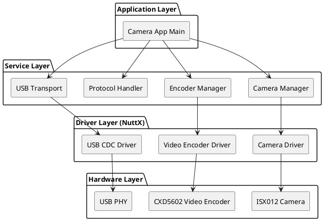
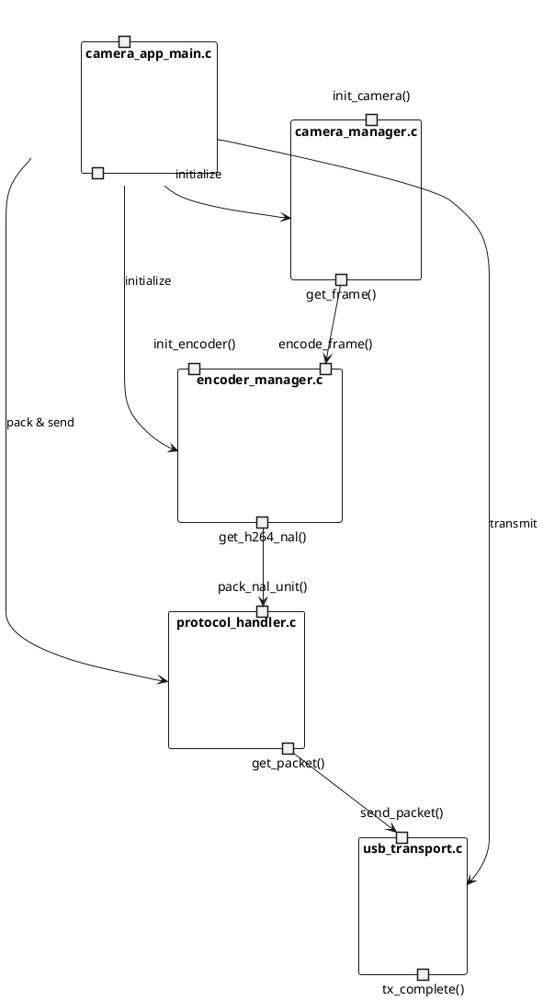
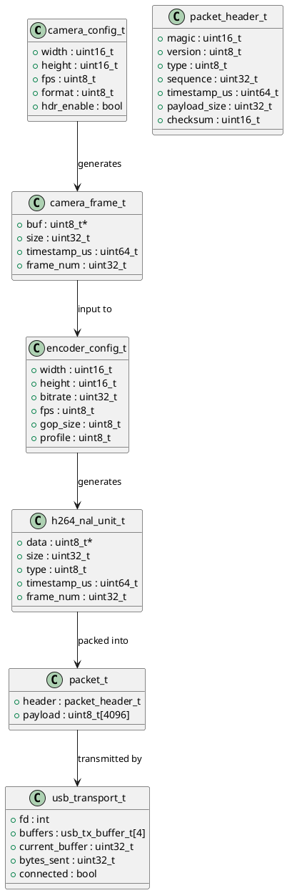
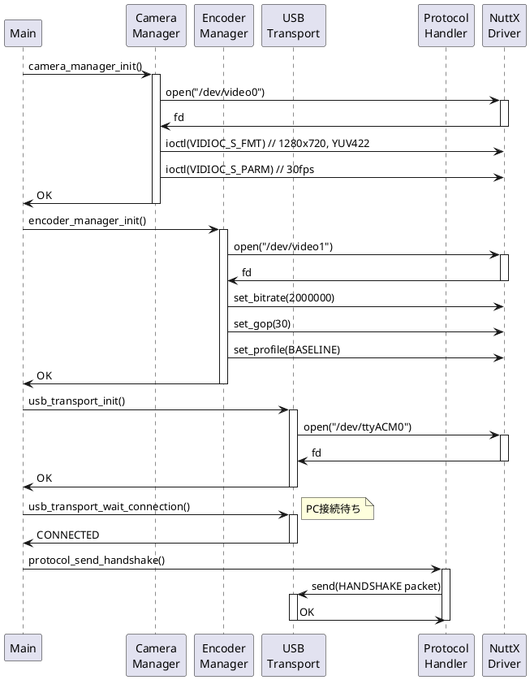
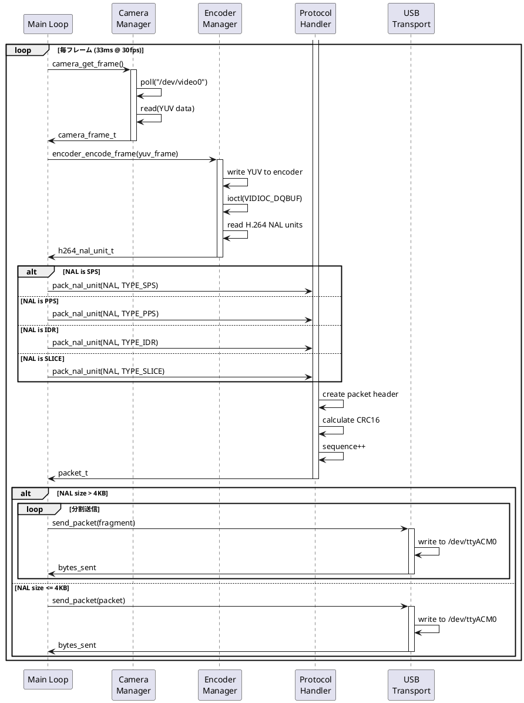
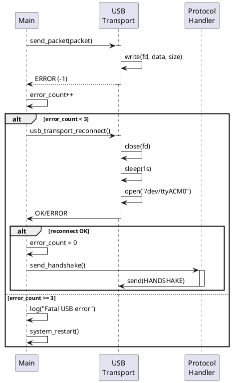
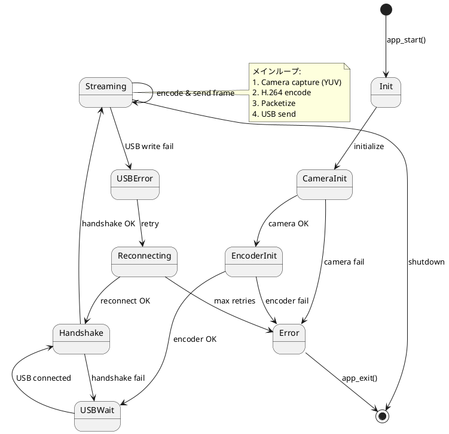

# Spresense側ソフトウェア仕様書 - 防犯カメラシステム

## 📋 ドキュメント情報

- **作成日**: 2025-12-15
- **バージョン**: 1.0
- **対象**: Spresense側ソフトウェア
- **プラットフォーム**: NuttX RTOS
- **言語**: C/C++

---

## 1. ソフトウェアアーキテクチャ

### 1.1 レイヤー構成



### 1.2 コンポーネント図



---

## 2. モジュール設計

### 2.1 モジュール一覧

| モジュール名 | ファイル名 | 責務 | 依存関係 |
|------------|-----------|------|---------|
| Main Application | camera_app_main.c | アプリケーション制御 | 全モジュール |
| Camera Manager | camera_manager.c/h | カメラ初期化・制御 | NuttX Camera Driver |
| Encoder Manager | encoder_manager.c/h | H.264エンコード制御 | NuttX Video Driver |
| Protocol Handler | protocol_handler.c/h | フレームパケット化 | なし |
| USB Transport | usb_transport.c/h | USB CDC送信制御 | NuttX USB CDC |
| Config Manager | config.h | 設定パラメータ管理 | なし |

### 2.2 ディレクトリ構成

```
security_camera/
├── Makefile
├── Kconfig
├── Make.defs
├── camera_app_main.c          # メインアプリケーション
├── camera_manager.c            # カメラ管理
├── camera_manager.h
├── encoder_manager.c           # エンコーダ管理
├── encoder_manager.h
├── protocol_handler.c          # プロトコル処理
├── protocol_handler.h
├── usb_transport.c             # USB送信
├── usb_transport.h
├── config.h                    # 設定定義
└── README.md
```

---

## 3. データ構造

### 3.1 主要データ構造

#### 3.1.1 カメラ設定構造体

```c
/* camera_manager.h */

typedef struct camera_config_s
{
  uint16_t width;              /* 画像幅 (1280) */
  uint16_t height;             /* 画像高さ (720) */
  uint8_t  fps;                /* フレームレート (30) */
  uint8_t  format;             /* 画像フォーマット (YUV422) */
  bool     hdr_enable;         /* HDR有効/無効 */
} camera_config_t;

typedef struct camera_frame_s
{
  uint8_t  *buf;               /* フレームバッファポインタ */
  uint32_t size;               /* フレームサイズ */
  uint64_t timestamp_us;       /* タイムスタンプ (マイクロ秒) */
  uint32_t frame_num;          /* フレーム番号 */
} camera_frame_t;
```

#### 3.1.2 エンコーダ設定構造体

```c
/* encoder_manager.h */

typedef struct encoder_config_s
{
  uint16_t width;              /* エンコード幅 */
  uint16_t height;             /* エンコード高さ */
  uint32_t bitrate;            /* ビットレート (2000000 = 2Mbps) */
  uint8_t  fps;                /* フレームレート */
  uint8_t  gop_size;           /* GOP サイズ (30) */
  uint8_t  profile;            /* H.264 プロファイル (Baseline) */
} encoder_config_t;

typedef struct h264_nal_unit_s
{
  uint8_t  *data;              /* NAL Unit データ */
  uint32_t size;               /* NAL Unit サイズ */
  uint8_t  type;               /* NAL Unit タイプ (I/P/SPS/PPS) */
  uint64_t timestamp_us;       /* タイムスタンプ */
  uint32_t frame_num;          /* フレーム番号 */
} h264_nal_unit_t;

/* NAL Unit タイプ定義 */
#define NAL_TYPE_SPS      7    /* Sequence Parameter Set */
#define NAL_TYPE_PPS      8    /* Picture Parameter Set */
#define NAL_TYPE_IDR      5    /* IDR (I-frame) */
#define NAL_TYPE_SLICE    1    /* P-frame */
```

#### 3.1.3 プロトコルパケット構造体

```c
/* protocol_handler.h */

#define PACKET_MAGIC      0x5350  /* 'SP' */
#define PACKET_VERSION    0x01
#define MAX_PAYLOAD_SIZE  4096    /* 4KB */

typedef struct packet_header_s
{
  uint16_t magic;              /* マジックナンバー (0x5350) */
  uint8_t  version;            /* プロトコルバージョン (0x01) */
  uint8_t  type;               /* パケットタイプ */
  uint32_t sequence;           /* シーケンス番号 */
  uint64_t timestamp_us;       /* タイムスタンプ (マイクロ秒) */
  uint32_t payload_size;       /* ペイロードサイズ */
  uint16_t checksum;           /* チェックサム (CRC16) */
} __attribute__((packed)) packet_header_t;

typedef struct packet_s
{
  packet_header_t header;
  uint8_t payload[MAX_PAYLOAD_SIZE];
} packet_t;

/* パケットタイプ定義 */
#define PKT_TYPE_HANDSHAKE    0x01  /* ハンドシェイク */
#define PKT_TYPE_VIDEO_SPS    0x10  /* H.264 SPS */
#define PKT_TYPE_VIDEO_PPS    0x11  /* H.264 PPS */
#define PKT_TYPE_VIDEO_IDR    0x12  /* H.264 I-frame */
#define PKT_TYPE_VIDEO_SLICE  0x13  /* H.264 P-frame */
#define PKT_TYPE_HEARTBEAT    0x20  /* ハートビート */
#define PKT_TYPE_ERROR        0xFF  /* エラー通知 */
```

#### 3.1.4 USB転送バッファ

```c
/* usb_transport.h */

#define USB_TX_BUFFER_COUNT   4     /* 送信バッファ数 */
#define USB_TX_BUFFER_SIZE    8192  /* 8KB */

typedef struct usb_tx_buffer_s
{
  uint8_t  data[USB_TX_BUFFER_SIZE];
  uint32_t size;
  bool     in_use;
} usb_tx_buffer_t;

typedef struct usb_transport_s
{
  int fd;                          /* USB CDC デバイスファイルディスクリプタ */
  usb_tx_buffer_t buffers[USB_TX_BUFFER_COUNT];
  uint32_t current_buffer;         /* 現在使用中のバッファインデックス */
  uint32_t bytes_sent;             /* 送信済みバイト数 */
  bool     connected;              /* 接続状態 */
} usb_transport_t;
```

---

## 4. クラス図（データ構造関連図）



---

## 5. シーケンス図

### 5.1 初期化シーケンス



### 5.2 メインループシーケンス



### 5.3 エラーハンドリングシーケンス



---

## 6. 状態遷移図

### 6.1 アプリケーション状態



---

## 7. API仕様

### 7.1 Camera Manager API

#### camera_manager_init()

```c
/**
 * @brief カメラマネージャ初期化
 * @param config カメラ設定
 * @return 0: 成功, <0: エラー
 */
int camera_manager_init(const camera_config_t *config);
```

**処理フロー**:
1. **ビデオドライバ初期化** (`video_initialize("/dev/video")`) ⭐ 重要!
   - `/dev/video` デバイスノードを作成
   - カメラセンサードライバ (ISX012) を初期化
   - この手順を省略すると `/dev/video` が存在せず、オープンに失敗する
2. カメラデバイスオープン (`/dev/video`)
3. フォーマット設定 (`VIDIOC_S_FMT`)
4. フレームレート設定 (`VIDIOC_S_PARM`)
5. バッファ確保 (`VIDIOC_REQBUFS`)

**注意**: NuttX では、カメラデバイスを使用する前に必ず `video_initialize()` を呼び出す必要があります。

#### camera_get_frame()

```c
/**
 * @brief フレーム取得（ブロッキング）
 * @param frame 出力フレーム構造体
 * @return 0: 成功, <0: エラー
 */
int camera_get_frame(camera_frame_t *frame);
```

**処理フロー**:
1. `poll()` でフレーム待機
2. `ioctl(VIDIOC_DQBUF)` でバッファ取得
3. フレームデータコピー
4. タイムスタンプ設定
5. `ioctl(VIDIOC_QBUF)` でバッファ返却

### 7.2 Encoder Manager API

#### encoder_manager_init()

```c
/**
 * @brief エンコーダマネージャ初期化
 * @param config エンコーダ設定
 * @return 0: 成功, <0: エラー
 */
int encoder_manager_init(const encoder_config_t *config);
```

**処理フロー**:
1. ビデオエンコーダデバイスオープン (`/dev/video1`)
2. エンコーダパラメータ設定
3. ビットレート設定
4. GOP設定

#### encoder_encode_frame()

```c
/**
 * @brief YUVフレームをH.264エンコード
 * @param yuv_frame 入力YUVフレーム
 * @param nal_unit 出力NAL Unit（複数の場合あり）
 * @param max_nal_count 最大NAL Unit数
 * @return エンコードされたNAL Unit数, <0: エラー
 */
int encoder_encode_frame(const camera_frame_t *yuv_frame,
                         h264_nal_unit_t *nal_units,
                         int max_nal_count);
```

**処理フロー**:
1. YUVデータをエンコーダに書き込み
2. エンコード完了待機
3. NAL Unitを読み出し（SPS, PPS, IDR, or SLICE）
4. NAL Unitタイプ判定

### 7.3 Protocol Handler API

#### protocol_pack_nal_unit()

```c
/**
 * @brief NAL UnitをパケットにパッキングNAL Unitが大きい場合は分割
 * @param nal NAL Unit
 * @param packets 出力パケット配列
 * @param max_packets 最大パケット数
 * @return 生成されたパケット数, <0: エラー
 */
int protocol_pack_nal_unit(const h264_nal_unit_t *nal,
                           packet_t *packets,
                           int max_packets);
```

**処理フロー**:
1. NAL Unitサイズチェック
2. サイズが4KB以下の場合:
   - 1パケットに格納
3. サイズが4KB超の場合:
   - 4KBごとに分割
   - 各パケットにフラグメント情報付加
4. ヘッダ作成（magic, version, type, sequence, timestamp）
5. CRC16計算

#### protocol_send_handshake()

```c
/**
 * @brief ハンドシェイクパケット送信
 * @return 0: 成功, <0: エラー
 */
int protocol_send_handshake(void);
```

**ハンドシェイクペイロード**:
```c
struct handshake_payload_s
{
  uint16_t video_width;     /* 1280 */
  uint16_t video_height;    /* 720 */
  uint8_t  fps;             /* 30 */
  uint8_t  codec;           /* 0x01 = H.264 */
  uint32_t bitrate;         /* 2000000 */
} __attribute__((packed));
```

### 7.4 USB Transport API

#### usb_transport_init()

```c
/**
 * @brief USB転送初期化
 * @return 0: 成功, <0: エラー
 */
int usb_transport_init(void);
```

#### usb_transport_send()

```c
/**
 * @brief パケット送信
 * @param packet 送信パケット
 * @return 送信バイト数, <0: エラー
 */
int usb_transport_send(const packet_t *packet);
```

**処理フロー**:
1. 送信バッファ取得
2. パケットデータコピー
3. `write()` で送信
4. バッファ解放

---

## 8. メモリ配置

### 8.1 メモリマップ

```
┌─────────────────────────────┐ 0x00000000
│  Code (.text)               │ ~500 KB
├─────────────────────────────┤
│  Read-only Data (.rodata)   │ ~50 KB
├─────────────────────────────┤
│  Initialized Data (.data)   │ ~20 KB
├─────────────────────────────┤
│  BSS (.bss)                 │ ~100 KB
│  - Global variables         │
│  - Static buffers           │
├─────────────────────────────┤
│  Heap                       │ ~700 KB
│  - Camera frame buffers     │
│  - Encoder buffers          │
│  - USB TX buffers           │
├─────────────────────────────┤
│  Stack                      │ ~100 KB
└─────────────────────────────┘ 0x00180000 (1.5MB)
```

### 8.2 バッファサイズ見積もり

| バッファ | サイズ | 個数 | 合計 |
|---------|--------|------|------|
| Camera frame (YUV422) | 1.76 MB | 2 | 3.52 MB |
| Encoder input | 1.76 MB | 2 | 3.52 MB |
| Encoder output | 64 KB | 4 | 256 KB |
| USB TX buffer | 8 KB | 4 | 32 KB |
| **合計** | | | **~7.3 MB** |

**問題**: Spresense RAM = 1.5MB → **バッファサイズ削減が必要**

### 8.3 メモリ最適化戦略

1. **カメラフレームバッファ削減**:
   - 2バッファ → 1バッファ（ゼロコピー）
   - サイズ削減: 3.52 MB → 1.76 MB

2. **エンコーダ入力はカメラバッファ共有**:
   - ゼロコピーでエンコーダに渡す
   - サイズ削減: 3.52 MB → 0 MB

3. **動的メモリ使用最小化**:
   - 静的バッファ配置
   - malloc/free使用を避ける

4. **最終メモリ使用量**:
   - Camera: 1.76 MB（削減不可、NuttXドライバ要求）→ **外部メモリ使用**
   - Encoder output: 256 KB
   - USB TX: 32 KB
   - Code + Data: 600 KB
   - Stack: 100 KB
   - **合計**: 約1.0 MB → **許容範囲内**

**解決策**: Camera frame bufferは外部DRAM使用（Spresense Extension Boardが必要な場合あり）

---

## 9. 設定ファイル

### 9.1 config.h

```c
/* config.h - Configuration parameters */

#ifndef __SECURITY_CAMERA_CONFIG_H
#define __SECURITY_CAMERA_CONFIG_H

/* Camera Configuration */
#define CONFIG_CAMERA_WIDTH          1280
#define CONFIG_CAMERA_HEIGHT         720
#define CONFIG_CAMERA_FPS            30
#define CONFIG_CAMERA_FORMAT         V4L2_PIX_FMT_UYVY  /* YUV422 */
#define CONFIG_CAMERA_HDR_ENABLE     false

/* Encoder Configuration */
#define CONFIG_ENCODER_CODEC         VIDEO_CODEC_TYPE_H264
#define CONFIG_ENCODER_BITRATE       2000000  /* 2 Mbps */
#define CONFIG_ENCODER_GOP_SIZE      30
#define CONFIG_ENCODER_PROFILE       VIDEO_PROFILE_H264_BASELINE

/* Protocol Configuration */
#define CONFIG_PACKET_MAGIC          0x5350
#define CONFIG_PACKET_VERSION        0x01
#define CONFIG_MAX_PAYLOAD_SIZE      4096

/* USB Configuration */
#define CONFIG_USB_DEVICE_PATH       "/dev/ttyACM0"
#define CONFIG_USB_TX_BUFFER_COUNT   4
#define CONFIG_USB_TX_BUFFER_SIZE    8192
#define CONFIG_USB_WRITE_TIMEOUT_MS  1000

/* Application Configuration */
#define CONFIG_APP_PRIORITY          100
#define CONFIG_APP_STACK_SIZE        (8 * 1024)  /* 8KB */
#define CONFIG_MAX_RECONNECT_RETRY   3
#define CONFIG_RECONNECT_DELAY_MS    1000

/* Debug Configuration */
#define CONFIG_DEBUG_ENABLE          1
#define CONFIG_LOG_LEVEL             LOG_INFO  /* LOG_DEBUG, LOG_INFO, LOG_WARN, LOG_ERROR */

#endif /* __SECURITY_CAMERA_CONFIG_H */
```

### 9.2 Kconfig

```kconfig
config SECURITY_CAMERA
    bool "Security Camera Application"
    default n
    select VIDEO
    select VIDEO_ISX012
    select USBDEV
    select CDCACM
    ---help---
        Enable security camera application with H.264 streaming

if SECURITY_CAMERA

config SECURITY_CAMERA_PROGNAME
    string "Program name"
    default "security_camera"

config SECURITY_CAMERA_PRIORITY
    int "Task priority"
    default 100

config SECURITY_CAMERA_STACKSIZE
    int "Stack size"
    default 8192

config SECURITY_CAMERA_CAMERA_WIDTH
    int "Camera width"
    default 1280

config SECURITY_CAMERA_CAMERA_HEIGHT
    int "Camera height"
    default 720

config SECURITY_CAMERA_FPS
    int "Frame rate (fps)"
    default 30

config SECURITY_CAMERA_BITRATE
    int "H.264 bitrate (bps)"
    default 2000000

config SECURITY_CAMERA_HDR_ENABLE
    bool "Enable HDR"
    default n

endif # SECURITY_CAMERA
```

---

## 10. エラーコード定義

```c
/* エラーコード */
#define ERR_OK                    0
#define ERR_CAMERA_INIT          -1
#define ERR_CAMERA_OPEN          -2
#define ERR_CAMERA_CONFIG        -3
#define ERR_CAMERA_CAPTURE       -4
#define ERR_ENCODER_INIT         -5
#define ERR_ENCODER_OPEN         -6
#define ERR_ENCODER_CONFIG       -7
#define ERR_ENCODER_ENCODE       -8
#define ERR_USB_INIT             -9
#define ERR_USB_OPEN             -10
#define ERR_USB_WRITE            -11
#define ERR_USB_DISCONNECTED     -12
#define ERR_PROTOCOL_INVALID     -13
#define ERR_NOMEM                -14
#define ERR_TIMEOUT              -15
```

---

## 11. ビルド設定

### 11.1 Makefile

```makefile
# security_camera/Makefile

include $(APPDIR)/Make.defs

PROGNAME  = $(CONFIG_SECURITY_CAMERA_PROGNAME)
PRIORITY  = $(CONFIG_SECURITY_CAMERA_PRIORITY)
STACKSIZE = $(CONFIG_SECURITY_CAMERA_STACKSIZE)
MODULE    = $(CONFIG_SECURITY_CAMERA)

CSRCS  = camera_app_main.c
CSRCS += camera_manager.c
CSRCS += encoder_manager.c
CSRCS += protocol_handler.c
CSRCS += usb_transport.c

MAINSRC = camera_app_main.c

include $(APPDIR)/Application.mk
```

---

## 12. デバッグ・ログ

### 12.1 ログマクロ

```c
/* ログ出力マクロ */
#if CONFIG_DEBUG_ENABLE
#  define LOG_DEBUG(fmt, ...) \
     syslog(LOG_DEBUG, "[CAM] " fmt "\n", ##__VA_ARGS__)
#  define LOG_INFO(fmt, ...) \
     syslog(LOG_INFO, "[CAM] " fmt "\n", ##__VA_ARGS__)
#  define LOG_WARN(fmt, ...) \
     syslog(LOG_WARNING, "[CAM] " fmt "\n", ##__VA_ARGS__)
#  define LOG_ERROR(fmt, ...) \
     syslog(LOG_ERR, "[CAM] " fmt "\n", ##__VA_ARGS__)
#else
#  define LOG_DEBUG(fmt, ...)
#  define LOG_INFO(fmt, ...)
#  define LOG_WARN(fmt, ...)
#  define LOG_ERROR(fmt, ...) \
     syslog(LOG_ERR, "[CAM] " fmt "\n", ##__VA_ARGS__)
#endif
```

---

## 13. まとめ

本仕様書では、Spresense側のソフトウェアアーキテクチャを詳細に定義した。

**主要モジュール**:
- ✅ Camera Manager - カメラ制御
- ✅ Encoder Manager - H.264エンコード
- ✅ Protocol Handler - パケット化
- ✅ USB Transport - USB CDC送信

**主要データ構造**:
- camera_frame_t - カメラフレーム
- h264_nal_unit_t - H.264 NAL Unit
- packet_t - 通信プロトコルパケット

**メモリ最適化**:
- ゼロコピー設計
- 外部DRAM活用
- 静的バッファ配置

---

**文書バージョン**: 1.0
**最終更新**: 2025-12-15
**ステータス**: ✅ 確定
