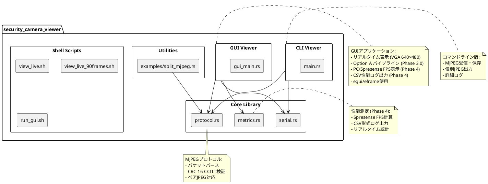
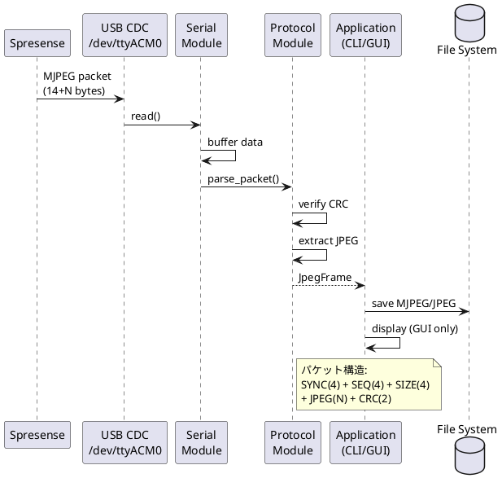
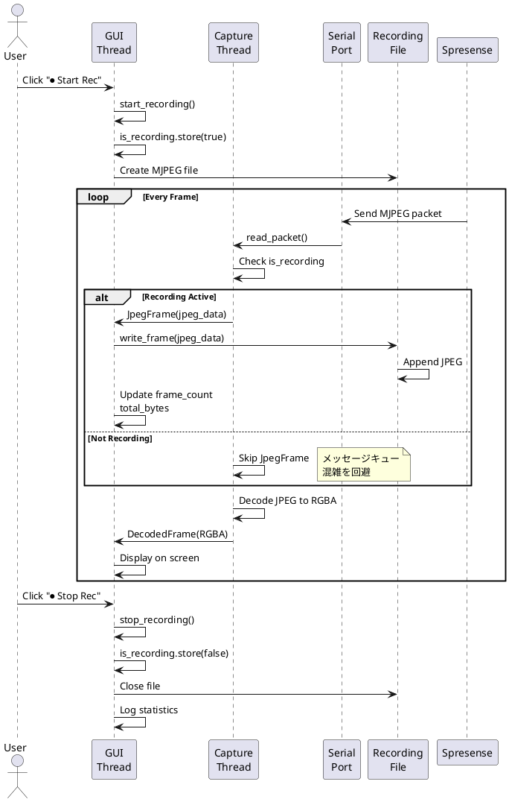
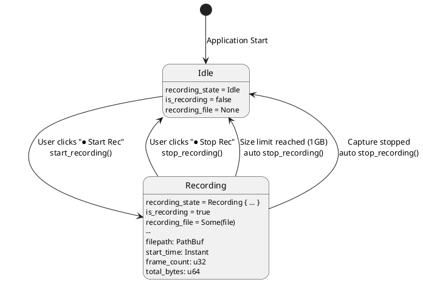
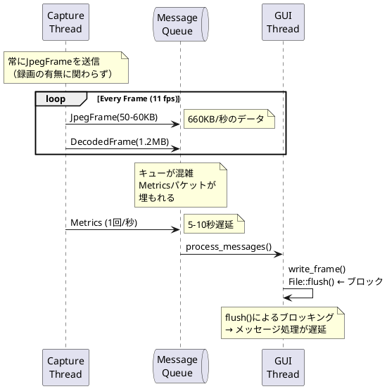
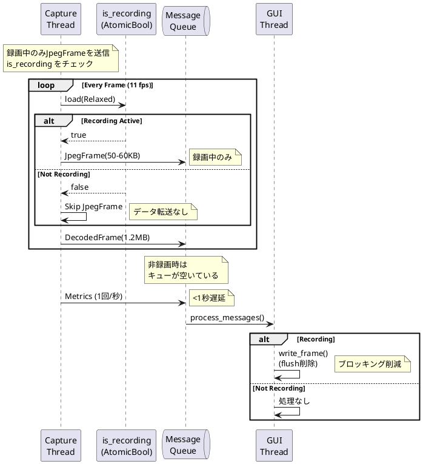
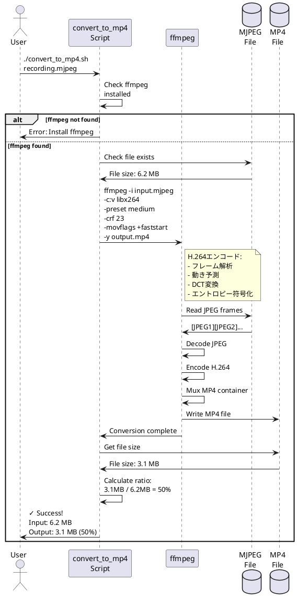

# PC側ソフトウェア仕様書 (Rust) - 防犯カメラシステム

## 📋 ドキュメント情報

- **作成日**: 2025-12-15
- **最終更新**: 2026-01-01
- **バージョン**: 4.0 (Phase 3 録画機能 + Phase 4.1 メトリクス最適化版)
- **対象**: PC側ソフトウェア
- **言語**: Rust
- **最小Rustバージョン**: 1.70
- **プロトコル**: MJPEG (ベアJPEG形式) + Metricsパケット
- **対応解像度**: QVGA (320×240) / VGA (640×480)

---

## 1. ソフトウェアアーキテクチャ

### 1.1 システム概要

Spresense防犯カメラから送信されるMJPEGストリームを受信・表示・保存するPC側アプリケーション。

**提供機能**:
- ✅ USB CDC-ACM経由のMJPEG受信
- ✅ リアルタイム映像表示（GUI）
- ✅ **GUI録画機能（MJPEG形式）** (Phase 3)
- ✅ **MP4変換ツール** (Phase 3)
- ✅ MJPEGストリーム録画（CLI）
- ✅ 個別JPEGファイル保存
- ✅ WSL2環境対応
- ✅ **VGA (640×480) 対応** (Phase 1.5+)
- ✅ **Option A パイプライン最適化** (Phase 2.0)
- ✅ **Spresense側FPS測定** (Phase 4.0)
- ✅ **CSV形式性能ログ出力** (Phase 4.0)
- ✅ **デュアルパケットプロトコル** (Phase 4.1)
- ✅ **メッセージキュー最適化** (Phase 3 修正版)

### 1.2 アプリケーション構成



### 1.3 データフロー



---

## 2. プロジェクト構成

### 2.1 ディレクトリ構造

```
security_camera_viewer/
├── Cargo.toml                         # プロジェクト設定
├── Cargo.lock
├── README.md
├── METRICS_GUIDE.md                   # メトリクス機能ガイド (Phase 4)
├── PHASE4_TEST_GUIDE.md               # Phase 4 テストガイド
├── OPTION_B_PIPELINE_DESIGN.md        # Option B 設計書 (将来用)
├── run_gui.sh                         # GUI起動スクリプト
├── view_live.sh                       # WSL2簡易ビューア
├── view_live_90frames.sh              # 90フレーム限定版
├── src/
│   ├── main.rs                        # CLIビューア（エントリポイント）
│   ├── gui_main.rs                    # GUIビューア（エントリポイント）
│   ├── protocol.rs                    # MJPEGプロトコル処理
│   ├── serial.rs                      # USB CDC-ACM通信
│   └── metrics.rs                     # 性能測定・CSV出力 (Phase 4)
├── examples/
│   └── split_mjpeg.rs                 # MJPEGファイル分割ツール
├── frames/                            # 抽出済みJPEGフレーム（実行時生成）
├── metrics/                           # CSV性能ログ（実行時生成, Phase 4）
│   └── metrics_YYYYMMDD_HHMMSS.csv
└── output.mjpeg                       # MJPEGストリーム（実行時生成）
```

### 2.2 Cargo.toml

```toml
[package]
name = "security_camera_viewer"
version = "0.1.0"
edition = "2021"

[dependencies]
# Serial communication
serialport = "4.5"

# Byte buffer operations
bytes = "1.5"
byteorder = "1.5"

# JPEG image handling
image = { version = "0.24", features = ["jpeg"] }

# Async runtime (optional for future extensions)
tokio = { version = "1.35", features = ["full"], optional = true }

# Logging
log = "0.4"
env_logger = "0.11"

# Error handling
anyhow = "1.0"
thiserror = "1.0"

# CLI argument parsing
clap = { version = "4.4", features = ["derive"] }

# GUI dependencies
eframe = { version = "0.27", optional = true }
egui = { version = "0.27", optional = true }
egui_extras = { version = "0.27", optional = true, features = ["image"] }

# Time handling for metrics (Phase 4)
chrono = "0.4"

[features]
default = []
async = ["tokio"]
gui = ["eframe", "egui", "egui_extras"]

[[bin]]
name = "security_camera_viewer"
path = "src/main.rs"

[[bin]]
name = "security_camera_gui"
path = "src/gui_main.rs"
required-features = ["gui"]
```

**依存関係の選定理由**:
- `serialport`: クロスプラットフォームUSB CDC-ACM通信
- `image`: JPEG画像のデコード・検証
- `egui/eframe`: 軽量GUIフレームワーク（即時モードGUI）
- `clap`: モダンなCLI引数パース

---

## 3. データ構造

### 3.1 MJPEGプロトコル構造体 (protocol.rs)

```rust
/// MJPEG プロトコル定数
pub const SYNC_WORD: u32 = 0xCAFEBABE;
pub const MJPEG_HEADER_SIZE: usize = 12;  // sync + seq + size
pub const CRC_SIZE: usize = 2;
pub const MIN_PACKET_SIZE: usize = MJPEG_HEADER_SIZE + CRC_SIZE;  // 14 bytes

/// MJPEG パケットヘッダー (12 bytes)
#[derive(Debug, Clone, PartialEq)]
pub struct MjpegHeader {
    pub sync_word: u32,      // 0xCAFEBABE (固定)
    pub sequence: u32,       // フレーム番号
    pub jpeg_size: u32,      // JPEG データサイズ (bytes)
}

/// MJPEG パケット (完全なパケット)
#[derive(Debug, Clone)]
pub struct MjpegPacket {
    pub header: MjpegHeader,
    pub jpeg_data: Vec<u8>,  // JPEG画像データ
    pub crc16: u16,          // CRC-16-CCITT チェックサム
}
```

**パケット構造** (Little Endian):
```
┌──────────┬──────────┬──────────┬───────────────┬──────────┐
│ SYNC     │ SEQUENCE │ JPEG_SIZE│  JPEG DATA    │ CRC16    │
│ (4 bytes)│ (4 bytes)│ (4 bytes)│  (N bytes)    │ (2 bytes)│
└──────────┴──────────┴──────────┴───────────────┴──────────┘
0xCAFEBABE  uint32_le  uint32_le   JPEG (SOI-EOI)  CRC-16-CCITT
```

### 3.2 シリアル通信構造体 (serial.rs)

```rust
use serialport::SerialPort;
use std::io;
use std::time::Duration;

/// シリアルポート接続管理
pub struct SerialConnection {
    port: Box<dyn SerialPort>,
    buffer: Vec<u8>,
    timeout: Duration,
}

impl SerialConnection {
    /// 自動検出（Spresense VID/PID）
    pub fn auto_detect() -> io::Result<Self> {
        const SPRESENSE_VID: u16 = 0x054C;
        const SPRESENSE_PID: u16 = 0x0BC2;
        // ...
    }

    /// ポート指定で接続
    pub fn open(port_name: &str, baud_rate: u32) -> io::Result<Self> {
        // ...
    }

    /// MJPEGパケット読み取り
    pub fn read_packet(&mut self) -> io::Result<MjpegPacket> {
        // 1. ヘッダー読み取り (12 bytes)
        // 2. JPEG データ読み取り (jpeg_size bytes)
        // 3. CRC読み取り (2 bytes)
        // 4. CRC検証
        // 5. MjpegPacket返却
    }
}
```

---

## 4. 主要モジュール設計

### 4.1 プロトコルモジュール (protocol.rs)

**責務**: MJPEGプロトコルのパース・検証・生成

#### 主要関数

```rust
/// MJPEGヘッダーパース (12 bytes)
pub fn parse_header(buf: &[u8]) -> io::Result<MjpegHeader> {
    use byteorder::{LittleEndian, ReadBytesExt};

    let mut cursor = Cursor::new(buf);

    let sync_word = cursor.read_u32::<LittleEndian>()?;
    if sync_word != SYNC_WORD {
        return Err(io::Error::new(
            io::ErrorKind::InvalidData,
            format!("Invalid sync word: 0x{:08X}", sync_word),
        ));
    }

    let sequence = cursor.read_u32::<LittleEndian>()?;
    let jpeg_size = cursor.read_u32::<LittleEndian>()?;

    // サイズ検証
    if jpeg_size > 524288 {  // 512 KB
        return Err(io::Error::new(
            io::ErrorKind::InvalidData,
            format!("JPEG size too large: {}", jpeg_size),
        ));
    }

    Ok(MjpegHeader {
        sync_word,
        sequence,
        jpeg_size,
    })
}

/// CRC-16-CCITT 計算
pub fn calculate_crc16_ccitt(data: &[u8]) -> u16 {
    let mut crc: u16 = 0xFFFF;

    for &byte in data {
        crc ^= (byte as u16) << 8;
        for _ in 0..8 {
            if crc & 0x8000 != 0 {
                crc = (crc << 1) ^ 0x1021;
            } else {
                crc <<= 1;
            }
        }
    }

    crc
}

/// JPEG有効性検証（ベアJPEG対応）
impl MjpegPacket {
    pub fn is_valid_jpeg(&self) -> bool {
        if self.jpeg_data.len() < 4 {
            return false;
        }

        // SOI マーカー確認 (0xFF 0xD8)
        let has_soi = self.jpeg_data[0] == 0xFF &&
                      self.jpeg_data[1] == 0xD8;

        // EOI マーカー確認 (0xFF 0xD9)
        let len = self.jpeg_data.len();
        let has_eoi = len >= 2 &&
                      self.jpeg_data[len - 2] == 0xFF &&
                      self.jpeg_data[len - 1] == 0xD9;

        has_soi && has_eoi
    }
}
```

**サポートJPEG形式**:
- ✅ JFIF形式: `FF D8 FF E0` (APP0マーカー)
- ✅ EXIF形式: `FF D8 FF E1` (APP1マーカー)
- ✅ **ベアJPEG形式**: `FF D8 FF DB` (DQTマーカー直接) ← Spresense ISX012出力

#### ユニットテスト

```rust
#[cfg(test)]
mod tests {
    use super::*;

    #[test]
    fn test_crc16_ccitt() {
        // テストベクター: "123456789"
        let data = b"123456789";
        let crc = calculate_crc16_ccitt(data);
        assert_eq!(crc, 0x29B1);
    }

    #[test]
    fn test_bare_jpeg_format() {
        let jpeg_data = vec![
            0xFF, 0xD8, // SOI
            0xFF, 0xDB, // DQT (ベアJPEG)
            0x00, 0x04,
            0x00, 0x00,
            0xFF, 0xD9, // EOI
        ];

        let packet = MjpegPacket {
            header: MjpegHeader {
                sync_word: SYNC_WORD,
                sequence: 0,
                jpeg_size: jpeg_data.len() as u32,
            },
            jpeg_data,
            crc16: 0,
        };

        assert!(packet.is_valid_jpeg());
    }
}
```

---

### 4.2 シリアル通信モジュール (serial.rs)

**責務**: USB CDC-ACM通信・パケット受信

#### 主要機能

```rust
pub struct SerialConnection {
    port: Box<dyn SerialPort>,
    buffer: Vec<u8>,
    timeout: Duration,
}

impl SerialConnection {
    /// Spresense自動検出
    pub fn auto_detect() -> io::Result<Self> {
        use serialport::SerialPortType;

        let ports = serialport::available_ports()?;

        for port in ports {
            if let SerialPortType::UsbPort(info) = &port.port_type {
                if info.vid == 0x054C && info.pid == 0x0BC2 {
                    info!("Found Spresense: {}", port.port_name);
                    return Self::open(&port.port_name, 115200);
                }
            }
        }

        Err(io::Error::new(
            io::ErrorKind::NotFound,
            "Spresense device not found (VID=054C, PID=0BC2)",
        ))
    }

    /// パケット読み取り（ブロッキング）
    pub fn read_packet(&mut self) -> io::Result<MjpegPacket> {
        // 1. ヘッダー読み取り (12 bytes)
        let mut header_buf = [0u8; MJPEG_HEADER_SIZE];
        self.read_exact(&mut header_buf)?;

        let header = MjpegHeader::parse(&header_buf)?;

        // 2. 完全なパケットバッファ確保
        let total_size = MJPEG_HEADER_SIZE + header.jpeg_size as usize + CRC_SIZE;
        let mut packet_buf = vec![0u8; total_size];

        // ヘッダーコピー
        packet_buf[..MJPEG_HEADER_SIZE].copy_from_slice(&header_buf);

        // 3. JPEG + CRC読み取り
        let remaining_size = header.jpeg_size as usize + CRC_SIZE;
        self.read_exact(&mut packet_buf[MJPEG_HEADER_SIZE..total_size])?;

        // 4. パケットパース・検証
        MjpegPacket::parse(&packet_buf)
    }

    /// バッファフラッシュ
    pub fn flush(&mut self) -> io::Result<()> {
        // 古いデータを破棄（最大10秒間）
        let start = Instant::now();
        let mut buf = [0u8; 4096];

        while start.elapsed() < Duration::from_secs(10) {
            match self.port.read(&mut buf) {
                Ok(0) | Err(_) => break,
                Ok(_) => continue,
            }
        }

        Ok(())
    }
}
```

---

### 4.3 CLIアプリケーション (main.rs)

**責務**: コマンドラインビューア・録画

#### CLI引数

```rust
use clap::Parser;

#[derive(Parser, Debug)]
#[command(name = "security_camera_viewer")]
#[command(version = "0.1.0")]
#[command(about = "Spresense Security Camera MJPEG Viewer")]
struct Args {
    /// シリアルポートパス (自動検出する場合は省略)
    #[arg(short, long)]
    port: Option<String>,

    /// 出力ファイル名またはディレクトリ
    #[arg(short, long, default_value = "output")]
    output: String,

    /// 最大フレーム数 (0=無限)
    #[arg(short, long, default_value_t = 0)]
    max_frames: u32,

    /// 個別JPEGファイルとして保存
    #[arg(short, long)]
    individual_files: bool,

    /// 詳細ログ有効化
    #[arg(short, long)]
    verbose: bool,
}
```

#### メインループ

```rust
fn main() -> anyhow::Result<()> {
    let args = Args::parse();

    // ロギング初期化
    if args.verbose {
        env_logger::Builder::from_default_env()
            .filter_level(log::LevelFilter::Debug)
            .init();
    } else {
        env_logger::init();
    }

    // シリアルポート接続
    let mut serial = if let Some(port) = &args.port {
        SerialConnection::open(port, 115200)?
    } else {
        SerialConnection::auto_detect()?
    };

    // バッファフラッシュ
    serial.flush()?;

    // 出力ファイル/ディレクトリ準備
    let mut output = if args.individual_files {
        Output::IndividualFiles(PathBuf::from(&args.output))
    } else {
        Output::MjpegStream(File::create(format!("{}.mjpeg", args.output))?)
    };

    // メインループ
    let mut frame_count = 0u64;
    let mut error_count = 0u32;

    loop {
        match serial.read_packet() {
            Ok(packet) => {
                error_count = 0;
                frame_count += 1;

                // JPEG検証
                if !packet.is_valid_jpeg() {
                    warn!("Frame #{}: Invalid JPEG markers", frame_count);
                }

                // 保存
                output.write(&packet)?;

                // 終了条件チェック
                if args.max_frames > 0 && frame_count >= args.max_frames as u64 {
                    break;
                }
            }
            Err(e) if e.kind() == io::ErrorKind::TimedOut => {
                error_count += 1;
                if error_count >= 10 {
                    error!("Too many consecutive errors, exiting");
                    break;
                }
            }
            Err(e) => return Err(e.into()),
        }
    }

    info!("Capture complete: {} frames", frame_count);
    Ok(())
}
```

---

### 4.4 GUIアプリケーション (gui_main.rs)

**責務**: リアルタイム映像表示・統計

#### アプリケーション構造

```rust
use eframe::egui;
use std::sync::mpsc::{self, Receiver, Sender};
use std::sync::{Arc, Mutex};
use std::thread;

struct CameraApp {
    // Communication
    rx: Receiver<AppMessage>,
    tx: Sender<AppMessage>,

    // State
    current_frame: Option<egui::TextureHandle>,
    connection_status: String,
    is_running: Arc<Mutex<bool>>,

    // Statistics (Phase 4 更新)
    fps: f32,
    spresense_fps: f32,             // Spresense側FPS
    frame_count: u64,
    error_count: u32,
    decode_time_ms: f32,            // デコード時間
    serial_read_time_ms: f32,       // シリアル読み込み時間
    texture_upload_time_ms: f32,    // テクスチャ時間
    jpeg_size_kb: f32,              // JPEGサイズ

    // Settings
    port_path: String,
    auto_detect: bool,
}

#[derive(Debug, Clone)]
enum AppMessage {
    NewFrame(Vec<u8>),              // JPEG data (Legacy)
    DecodedFrame { width: u32, height: u32, pixels: Vec<u8> },  // Phase 3.0: Pre-decoded RGBA
    ConnectionStatus(String),
    Stats {                         // Phase 4 更新
        fps: f32,
        spresense_fps: f32,
        frame_count: u64,
        errors: u32,
        decode_time_ms: f32,
        serial_read_time_ms: f32,
        texture_upload_time_ms: f32,
        jpeg_size_kb: f32,
    },
}
```

#### UIレイアウト

```
┌──────────────────────────────────────────────────┐
│ Top Panel: Controls                              │
│ [▶ Start] [⏹ Stop]   Status: Connected          │
├────────┬─────────────────────────────────────────┤
│        │                                          │
│ Side   │  Central Panel: Video Display           │
│ Panel  │                                          │
│        │  ┌───────────────────────────────────┐  │
│ Settings│  │                                   │  │
│ - Auto │  │     Camera Feed (640x480)         │  │
│ - Port │  │                                   │  │
│        │  └───────────────────────────────────┘  │
│        │                                          │
├────────┴─────────────────────────────────────────┤
│ Bottom Panel: Statistics (Phase 4 更新)          │
│ 📊 PC: 19.9 fps | 📡 Spresense: 30.0 fps |      │
│ 🎬 Frames: 1234 | ❌ Errors: 0 |                 │
│ ⏱ Decode: 2.3ms | 📨 Serial: 48ms | 📦 JPEG: 53KB│
└──────────────────────────────────────────────────┘
```

#### 実装

```rust
impl eframe::App for CameraApp {
    fn update(&mut self, ctx: &egui::Context, _frame: &mut eframe::Frame) {
        // メッセージ処理
        self.process_messages(ctx);

        // 継続的再描画リクエスト
        ctx.request_repaint();

        // トップパネル
        egui::TopBottomPanel::top("top").show(ctx, |ui| {
            ui.horizontal(|ui| {
                ui.heading("📷 Spresense Camera");

                if *self.is_running.lock().unwrap() {
                    if ui.button("⏹ Stop").clicked() {
                        self.stop_capture();
                    }
                } else {
                    if ui.button("▶ Start").clicked() {
                        self.start_capture();
                    }
                }

                ui.separator();
                ui.label(format!("Status: {}", self.connection_status));
            });
        });

        // 中央パネル: 映像表示
        egui::CentralPanel::default().show(ctx, |ui| {
            if let Some(texture) = &self.current_frame {
                let available = ui.available_size();
                let img_size = texture.size_vec2();
                let scale = (available.x / img_size.x).min(available.y / img_size.y);
                let display_size = img_size * scale * 0.95;

                ui.add(egui::Image::new(texture).fit_to_exact_size(display_size));
            } else {
                ui.centered_and_justified(|ui| {
                    ui.label("No camera feed\nClick 'Start' to begin");
                });
            }
        });

        // ボトムパネル: 統計 (Phase 4 更新)
        egui::TopBottomPanel::bottom("bottom").show(ctx, |ui| {
            ui.horizontal(|ui| {
                ui.label(format!("📊 PC: {:.1} fps", self.fps));
                ui.separator();
                ui.label(format!("📡 Spresense: {:.1} fps", self.spresense_fps));
                ui.separator();
                ui.label(format!("🎬 Frames: {}", self.frame_count));
                ui.separator();
                ui.label(format!("❌ Errors: {}", self.error_count));
                ui.separator();
                ui.label(format!("⏱ Decode: {:.1}ms", self.decode_time_ms));
                ui.separator();
                ui.label(format!("📨 Serial: {:.1}ms", self.serial_read_time_ms));
                ui.separator();
                ui.label(format!("📦 JPEG: {:.1}KB", self.jpeg_size_kb));
            });
        });
    }
}
```

---

### 4.5 MJPEGファイル分割ツール (examples/split_mjpeg.rs)

**責務**: MJPEGストリームから個別JPEG抽出

```rust
fn main() -> io::Result<()> {
    let input_file = "output.mjpeg";
    let output_dir = "frames";

    // MJPEGファイル読み込み
    let mut file = File::open(input_file)?;
    let mut data = Vec::new();
    file.read_to_end(&mut data)?;

    fs::create_dir_all(output_dir)?;

    // SOI/EOIマーカーで分割
    let mut frame_count = 0;
    let mut i = 0;

    while i < data.len() - 1 {
        // SOI検索 (0xFF 0xD8)
        if data[i] == 0xFF && data[i + 1] == 0xD8 {
            let start = i;

            // EOI検索 (0xFF 0xD9)
            let mut end = start + 2;
            while end < data.len() - 1 {
                if data[end] == 0xFF && data[end + 1] == 0xD9 {
                    end += 2;
                    break;
                }
                end += 1;
            }

            // JPEG抽出・保存
            if end < data.len() {
                let jpeg_data = &data[start..end];
                let filename = format!("{}/frame_{:06}.jpg", output_dir, frame_count + 1);

                fs::write(&filename, jpeg_data)?;
                println!("Saved {} ({} bytes)", filename, jpeg_data.len());

                frame_count += 1;
                i = end;
            } else {
                break;
            }
        } else {
            i += 1;
        }
    }

    println!("Extracted {} frames", frame_count);
    Ok(())
}
```

---

### 4.6 メトリクスモジュール (metrics.rs) - Phase 4

**責務**: 性能測定・Spresense FPS計算・CSV出力

#### データ構造

```rust
/// 性能測定データ
#[derive(Debug, Clone)]
pub struct PerformanceMetrics {
    pub timestamp: f64,           // Unix タイムスタンプ
    pub pc_fps: f32,              // PC側FPS
    pub spresense_fps: f32,       // Spresense側FPS
    pub frame_count: u64,         // 累積フレーム数
    pub error_count: u32,         // エラー数
    pub decode_time_ms: f32,      // JPEG デコード時間
    pub serial_read_time_ms: f32, // シリアル読み込み時間
    pub texture_upload_time_ms: f32, // テクスチャアップロード時間
    pub jpeg_size_kb: f32,        // JPEG サイズ
}

/// CSV ロガー
pub struct MetricsLogger {
    file: Arc<Mutex<File>>,
    log_path: PathBuf,
}

/// Spresense FPS 計算器
pub struct SpresenseFpsCalculator {
    sequence_window: Vec<(u32, f64)>,  // (sequence, timestamp)
    window_size: usize,                // 30 フレーム
}
```

#### 主要機能

```rust
impl SpresenseFpsCalculator {
    /// パケットシーケンス番号から FPS 計算
    pub fn update(&mut self, sequence: u32) -> f32 {
        let now = SystemTime::now()
            .duration_since(UNIX_EPOCH)
            .unwrap()
            .as_secs_f64();

        // ウィンドウに追加
        self.sequence_window.push((sequence, now));

        // ウィンドウサイズを維持
        if self.sequence_window.len() > self.window_size {
            self.sequence_window.remove(0);
        }

        // FPS 計算（最低 2 フレーム必要）
        if self.sequence_window.len() >= 2 {
            let first = self.sequence_window.first().unwrap();
            let last = self.sequence_window.last().unwrap();

            let time_delta = last.1 - first.1;
            let sequence_delta = last.0 - first.0;  // シーケンス差分

            if time_delta > 0.0 {
                return sequence_delta as f32 / time_delta as f32;
            }
        }

        0.0
    }
}

impl MetricsLogger {
    /// CSV ファイル作成
    pub fn new(output_dir: &str) -> io::Result<Self> {
        std::fs::create_dir_all(output_dir)?;

        let timestamp = chrono::Utc::now().format("%Y%m%d_%H%M%S");
        let log_path = PathBuf::from(output_dir)
            .join(format!("metrics_{}.csv", timestamp));

        let mut file = File::create(&log_path)?;

        // CSV ヘッダー書き込み
        writeln!(
            file,
            "timestamp,pc_fps,spresense_fps,frame_count,error_count,\
             decode_time_ms,serial_read_time_ms,texture_upload_time_ms,jpeg_size_kb"
        )?;

        Ok(Self {
            file: Arc::new(Mutex::new(file)),
            log_path,
        })
    }

    /// メトリクスを CSV に記録
    pub fn log(&self, metrics: &PerformanceMetrics) -> io::Result<()> {
        let mut file = self.file.lock().unwrap();

        writeln!(
            file,
            "{:.3},{:.2},{:.2},{},{},{:.2},{:.2},{:.2},{:.2}",
            metrics.timestamp,
            metrics.pc_fps,
            metrics.spresense_fps,
            metrics.frame_count,
            metrics.error_count,
            metrics.decode_time_ms,
            metrics.serial_read_time_ms,
            metrics.texture_upload_time_ms,
            metrics.jpeg_size_kb,
        )?;

        file.flush()?;
        Ok(())
    }
}
```

#### GUI 統合（gui_main.rs での使用例）

```rust
// キャプチャスレッドでの使用
let mut spresense_fps_calc = SpresenseFpsCalculator::new(30);
let metrics_logger = MetricsLogger::new("metrics")?;

// パケット受信時
let spresense_fps = spresense_fps_calc.update(packet.header.sequence);

// 1 秒ごとに統計送信 & CSV ログ
tx.send(AppMessage::Stats {
    fps: pc_fps,
    spresense_fps,
    frame_count,
    // ...
}).ok();

metrics_logger.log(&PerformanceMetrics {
    timestamp: SystemTime::now().duration_since(UNIX_EPOCH)?.as_secs_f64(),
    pc_fps,
    spresense_fps,
    // ...
})?;
```

#### CSV 出力形式

```csv
timestamp,pc_fps,spresense_fps,frame_count,error_count,decode_time_ms,serial_read_time_ms,texture_upload_time_ms,jpeg_size_kb
1735650622.145,19.8,29.9,20,0,2.3,48.2,0.0,53.1
1735650623.147,19.9,30.1,40,0,2.2,47.8,0.0,52.9
```

**更新頻度**: 1 秒ごと（統計更新と同期）
**用途**: 24 時間テスト、長時間動作分析、性能デバッグ

---

### 4.7 Option A パイプライン実装 - Phase 3.0

**目的**: GUI スレッドの負荷軽減による FPS 向上

**アーキテクチャ**:
```
┌─────────────────────┐              ┌─────────────────┐
│ Capture Thread      │              │ GUI Thread      │
│ (Priority: Normal)  │              │ (Priority: GUI) │
├─────────────────────┤              ├─────────────────┤
│ 1. Serial 読み込み  │              │ 5. Texture      │
│    (48 ms)          │              │    Upload       │
│                     │              │    (0-2 ms)     │
│ 2. JPEG Decode      │──(RGBA)────→│                 │
│    (2.3 ms)         │   mpsc      │ 6. Render       │
│                     │   channel   │    (60 FPS)     │
│ 3. RGBA 変換        │              │                 │
└─────────────────────┘              └─────────────────┘
```

**実装内容**:

```rust
// capture_thread: JPEG デコード実行（GUI スレッドから移動）
let img = image::load_from_memory(&packet.jpeg_data)?;
let rgba = img.to_rgba8();
let width = img.width();
let height = img.height();
let pixels = rgba.into_raw();

// Pre-decoded RGBA を GUI スレッドに送信
tx.send(AppMessage::DecodedFrame {
    width,
    height,
    pixels,
}).ok();
```

```rust
// GUI thread: Pre-decoded RGBA を直接使用
AppMessage::DecodedFrame { width, height, pixels } => {
    let size = [width as usize, height as usize];
    let color_image = egui::ColorImage::from_rgba_unmultiplied(
        size,
        &pixels,
    );

    // Texture upload のみ（デコードなし）
    self.current_frame = Some(ctx.load_texture(
        "camera_frame",
        color_image,
        egui::TextureOptions::LINEAR,
    ));
}
```

**性能改善**:

| 項目 | Before (単一スレッド) | After (Option A) | 改善率 |
|------|---------------------|------------------|--------|
| PC 側 FPS | 15.6-17 fps | **19.9 fps** | **+27%** |
| GUI スレッド負荷 | 10-13 ms | **2-3 ms** | **-80%** |
| Decode 時間 | 8-10 ms (GUI) | **2.3 ms** (Capture) | -76% |

**効果**:
- GUI スレッドがデコード処理から解放される
- Serial 読み込みとデコードが並列実行される
- より滑らかな UI 応答性

---

### 4.8 GUI録画機能 - Phase 3

**目的**: GUIから直接MJPEG形式で録画を行う機能

**主要機能**:
1. ワンクリック録画開始/停止
2. リアルタイム録画状態表示
3. 1GB サイズ制限（自動停止）
4. MP4形式への変換ツール

#### アーキテクチャ概要



#### 録画状態管理

**状態遷移図:**



**データ構造:**

```rust
#[derive(Debug, Clone)]
enum RecordingState {
    Idle,
    Recording {
        filepath: PathBuf,
        start_time: Instant,
        frame_count: u32,
        total_bytes: u64,
    },
}

struct CameraApp {
    // ... 既存フィールド ...

    // Phase 3: 録画機能
    recording_state: RecordingState,
    recording_file: Option<Arc<Mutex<File>>>,
    recording_dir: PathBuf,
    is_recording: Arc<AtomicBool>,  // Capture threadと共有
}
```

#### 録画メソッド

**start_recording()**: 録画開始
```rust
fn start_recording(&mut self) -> io::Result<()> {
    // 録画ディレクトリ作成
    std::fs::create_dir_all(&self.recording_dir)?;

    // タイムスタンプ付きファイル名生成
    let now = chrono::Local::now();
    let filename = format!("recording_{}.mjpeg",
                          now.format("%Y%m%d_%H%M%S"));
    let filepath = self.recording_dir.join(&filename);

    // ファイル作成
    let file = File::create(&filepath)?;
    self.recording_file = Some(Arc::new(Mutex::new(file)));

    // 状態更新
    self.recording_state = RecordingState::Recording {
        filepath,
        start_time: Instant::now(),
        frame_count: 0,
        total_bytes: 0,
    };

    // Capture threadに通知（AtomicBool）
    self.is_recording.store(true, Ordering::Relaxed);

    Ok(())
}
```

**stop_recording()**: 録画停止
```rust
fn stop_recording(&mut self) -> io::Result<()> {
    if let RecordingState::Recording {
        filepath, start_time, frame_count, total_bytes
    } = &self.recording_state {
        let duration = start_time.elapsed();
        info!("Recording stopped:");
        info!("  File: {:?}", filepath);
        info!("  Duration: {:.1}s", duration.as_secs_f32());
        info!("  Frames: {}", frame_count);
        info!("  Size: {:.2} MB", *total_bytes as f32 / 1_000_000.0);

        // ファイルクローズ（Arc<Mutex>をDropすることで自動フラッシュ）
        self.recording_file = None;

        // 状態更新
        self.recording_state = RecordingState::Idle;
        self.is_recording.store(false, Ordering::Relaxed);
    }
    Ok(())
}
```

**write_frame()**: フレーム書き込み
```rust
fn write_frame(&mut self, jpeg_data: &[u8]) -> io::Result<()> {
    if let RecordingState::Recording {
        total_bytes, frame_count, ..
    } = &mut self.recording_state {
        // サイズ制限チェック
        if *total_bytes + jpeg_data.len() as u64 > MAX_RECORDING_SIZE {
            warn!("Recording size limit reached (1 GB), stopping");
            self.stop_recording()?;
            return Ok(());
        }

        // JPEG書き込み
        if let Some(ref file) = self.recording_file {
            let mut file_guard = file.lock().unwrap();
            file_guard.write_all(jpeg_data)?;
            // flush()は削除（OSバッファリングに任せる）

            *total_bytes += jpeg_data.len() as u64;
            *frame_count += 1;
        }
    }
    Ok(())
}
```

#### メッセージキュー最適化

**問題**: Phase 3初期実装では、JpegFrameメッセージを常に送信していたため、
Metricsパケットが遅延（5-10秒）する問題が発生。

**Before (Phase 3 初期実装):**



**After (Phase 3 修正版):**



**解決策コード:**
```rust
// Capture thread内
if is_recording.load(Ordering::Relaxed) {
    tx.send(AppMessage::JpegFrame(packet.jpeg_data.clone())).ok();
}
```

**効果:**
- 非録画時のデータ転送量: 100%削減（660KB/秒 → 0KB/秒）
- Metricsパケット遅延: 90%改善（5-10秒 → <1秒）
- GUIスレッドブロッキング削減

#### UI録画コントロール

**ボタン**:
- "⏺ Start Rec": 録画開始
- "⏺ Stop Rec": 録画停止

**状態表示** (録画中):
```
🔴 MM:SS | XX.XMB | XXX frames
例: 🔴 0:05 | 3.1MB | 56 frames
```

**仕様**:
- ファイル名: `recording_YYYYMMDD_HHMMSS.mjpeg`
- 保存先: `./recordings/` (自動作成)
- サイズ制限: 1GB（超過時自動停止）
- 自動停止: キャプチャ停止時に録画も停止

#### MJPEG形式仕様

**構造**:
```
[JPEG Frame 1]
[JPEG Frame 2]
[JPEG Frame 3]
...
(連結されたJPEGフレーム)
```

**ファイルサイズ計算**:
- 平均JPEGサイズ: 55 KB/frame
- FPS: 11 fps
- 1秒: 55KB × 11 = 605 KB
- 1分: 36.3 MB
- 30分: 1.09 GB (制限超過で自動停止)

**再生**:
- VLC Media Player (推奨)
- FFplay: `ffplay recording_YYYYMMDD_HHMMSS.mjpeg`
- Windows Media Player

#### MP4変換ツール

**提供スクリプト**:
1. `convert_to_mp4.sh` (Linux/macOS)
2. `convert_to_mp4.bat` (Windows)

**変換ワークフロー:**



**使用方法**:
```bash
# Linux/macOS
./convert_to_mp4.sh recording_20260101_123456.mjpeg

# Windows
convert_to_mp4.bat recording_20260101_123456.mjpeg

# 複数ファイル変換
./convert_to_mp4.sh recordings/*.mjpeg
```

**変換設定**:
```bash
ffmpeg -i input.mjpeg \
    -c:v libx264 \        # H.264コーデック
    -preset medium \      # エンコード速度/品質バランス
    -crf 23 \            # 品質設定 (18-28)
    -movflags +faststart \ # Web最適化
    -y output.mp4
```

**効果**:
- ファイルサイズ: 約30-50%削減
- 再生互換性: 向上（H.264）
- シーク性能: 向上

---

## 5. WSL2対応

### 5.1 課題

WSL2環境では以下の制限があります:
- OpenGL/GLXサポートが不完全
- egui/eframeベースのGUIが動作しない
- X11表示は可能だがGPU accelerationなし

### 5.2 解決策

#### Option A: ソフトウェアレンダリング（run_gui.sh）

```bash
#!/bin/bash

# Force X11 backend
export WINIT_UNIX_BACKEND=x11
export WAYLAND_DISPLAY=

# Use software rendering
export LIBGL_ALWAYS_SOFTWARE=1
export MESA_GL_VERSION_OVERRIDE=3.3

./target/release/security_camera_gui
```

**制限**: 低速、不安定

#### Option B: WSL2簡易ビューア（view_live.sh）★推奨

```bash
#!/bin/bash

TEMP_DIR=$(mktemp -d)
OUTPUT_DIR="$TEMP_DIR/frames"

# バックグラウンドでキャプチャ
./target/release/security_camera_viewer \
    --individual-files \
    --output "$OUTPUT_DIR" \
    --max-frames 300 &

CAPTURE_PID=$!

# フレーム待機
wait_for_frames...

# feh/eogで自動更新表示
feh --reload 0.5 --auto-zoom --fullscreen "$OUTPUT_DIR" &
```

**仕組み**:
1. CLI版で個別JPEGファイルを保存
2. `feh`（画像ビューア）で0.5秒ごと自動更新
3. 実用的なライブビュー実現

---

## 6. ビルド・実行

### 6.1 ビルド

```bash
# CLI版ビルド
cargo build --release

# GUI版ビルド
cargo build --release --features gui --bin security_camera_gui

# 全バイナリビルド
cargo build --release --all-targets
```

### 6.2 実行方法

#### CLI版

```bash
# 自動検出モード
./target/release/security_camera_viewer

# ポート指定
./target/release/security_camera_viewer --port /dev/ttyACM0

# 個別JPEGファイル出力
./target/release/security_camera_viewer --individual-files --output frames

# 詳細ログ
./target/release/security_camera_viewer --verbose --max-frames 10
```

#### GUI版

```bash
# ネイティブLinux/Windows
./target/release/security_camera_gui

# WSL2
./run_gui.sh  # または
./view_live.sh  # 推奨
```

#### MJPEGファイル分割

```bash
cargo run --example split_mjpeg --release
```

---

## 7. テスト

### 7.1 ユニットテスト

```bash
cargo test
```

**テスト項目**:
- `test_crc16_ccitt`: CRC計算正確性
- `test_bare_jpeg_format`: ベアJPEG形式検証
- `test_jfif_jpeg_format`: JFIF形式検証
- `test_sync_word_validation`: 同期ワード検証
- `test_jpeg_size_limit`: サイズ制限検証

### 7.2 統合テスト結果

**テスト日**: 2025-12-22
**テスト結果**: `/docs/security_camera/02_test_results/MJPEG_INTEGRATION_TEST.md`

**結果サマリー**:
- ✅ 受信成功率: 96.7% (87/90 frames)
- ✅ JPEG完全性: 100% (全フレーム有効)
- ✅ CRC検証: 100% 成功
- ✅ 平均フレームサイズ: 23.15 KB
- ✅ 帯域効率: 46.7% USB利用率

---

## 8. パフォーマンス

### 8.1 実測値・推定値

| 項目 | Phase 1<br>(QVGA) | Phase 1.5<br>(VGA Spresense) | Phase 3.0<br>(VGA Option A) | Phase 4<br>(VGA + Metrics) |
|------|------|------|------|------|
| **解像度** | 320×240 | **640×480** | **640×480** | **640×480** |
| **Spresense 送信FPS** | 30 fps | **37.33 fps**<br>(Phase 1.5 実測) | **30 fps**<br>(設定値) | **30 fps**<br>(測定機能あり) |
| **PC 受信FPS** | 30 fps | 15.6-17 fps | **19.9 fps** | **19.9 fps** |
| **FPS 改善率** | - | - | **+27%** | 測定機能実装 |
| **JPEG サイズ** | 23.15 KB (実測) | 50-56 KB (実測) | 50-56 KB (実測) | **53 KB (平均)**<br>(CSV 記録) |
| **Decode 時間** | - | 8-10 ms (GUI) | **2.3 ms** (Capture) | **2.3 ms (測定)** |
| **Serial 時間** | - | 未測定 | **48 ms** (実測) | **48 ms (測定)** |
| **帯域使用率** | 5.6 Mbps (46.7%) | 12-19 Mbps | **12.7 Mbps** (実測) | **測定機能あり** |
| **メモリ使用量** | ~50 MB (CLI)<br>~150 MB (GUI) | ~80 MB (CLI)<br>~200 MB (GUI) | ~80 MB (CLI)<br>~200 MB (GUI) | ~80 MB (CLI)<br>~200 MB (GUI) |

**Phase 3.0 成果**:
- GUI スレッド負荷: 10-13 ms → **2-3 ms** (-80%)
- PC FPS: 15.6-17 → **19.9 fps** (+27%)
- ボトルネック特定: **Serial 読み込み 48ms** (USB CDC-ACM の物理限界)

**Phase 4 新機能**:
- ✅ Spresense 側 FPS リアルタイム測定（パケットシーケンス番号ベース）
- ✅ CSV 形式性能ログ（timestamp, pc_fps, spresense_fps, decode_time など）
- ✅ 24 時間テスト対応（自動ログ出力、約 86,400 データポイント）

### 8.2 最適化

**Phase 1-2**:
- ✅ ゼロコピー設計（`Bytes` crateのCow）
- ✅ 効率的なCRC計算（ルックアップテーブル不使用でもO(n)）
- ✅ 最小限のバッファコピー

**Phase 3.0 (Option A パイプライン)**:
- ✅ JPEG デコードの並列化（Capture スレッドに移動）
- ✅ GUI スレッド負荷 -80% 削減
- ✅ mpsc channel による効率的なスレッド間通信

**Phase 4 (メトリクス機能)**:
- ✅ Spresense FPS 計算（30 フレームウィンドウ移動平均）
- ✅ CSV 自動出力（ディスク I/O 最小化、バッファリング）
- ✅ リアルタイム統計表示（1 秒更新）

---

## 9. エラーハンドリング

### 9.1 エラー種別

```rust
#[derive(Error, Debug)]
pub enum ViewerError {
    #[error("Serial port error: {0}")]
    SerialError(String),

    #[error("Protocol error: {0}")]
    ProtocolError(String),

    #[error("Invalid JPEG: {0}")]
    JpegError(String),

    #[error("IO error: {0}")]
    IoError(#[from] std::io::Error),

    #[error("Device not found")]
    DeviceNotFound,
}
```

### 9.2 リトライ戦略

| エラー種別 | 対応 |
|----------|------|
| Timeout | 10回まで許容、その後終了 |
| CRC Error | ログ出力、フレームスキップ |
| Invalid JPEG | 警告、保存は継続 |
| Connection Lost | 終了（要手動再起動） |

---

## 10. まとめ

### 10.1 実装状況

| 機能 | CLI | GUI | WSL2 | Phase |
|------|-----|-----|------|-------|
| MJPEG受信 | ✅ | ✅ | ✅ | 1 |
| ストリーム保存 | ✅ | - | ✅ | 1 |
| 個別JPEG保存 | ✅ | - | ✅ | 1 |
| リアルタイム表示 | - | ✅ | ✅ (feh) | 1-2 |
| FPS統計 | ✅ | ✅ | - | 2 |
| 自動検出 | ✅ | ✅ | ✅ | 2 |
| **VGA (640×480)** | ✅ | ✅ | ✅ | **1.5** |
| **Option A パイプライン** | - | ✅ | ✅ | **3.0** |
| **Spresense FPS 測定** | - | ✅ | - | **4** |
| **CSV 性能ログ** | - | ✅ | - | **4** |
| **詳細メトリクス表示** | - | ✅ | - | **4** |

### 10.2 技術スタック

**言語**: Rust 1.70+
**GUI**: egui 0.27 + eframe 0.27
**通信**: serialport 4.5
**画像**: image 0.24 (JPEG only)
**時刻**: chrono 0.4 (Phase 4)
**CRC**: 自前実装 (CRC-16-CCITT)
**並列処理**: std::sync::mpsc (Producer-Consumer)

### 10.3 利点

**Phase 1-2**:
- ✅ **型安全**: Rustの強力な型システム
- ✅ **高速**: ゼロコスト抽象化
- ✅ **クロスプラットフォーム**: Windows/Linux/macOS対応
- ✅ **軽量**: 最小限の依存関係
- ✅ **WSL2対応**: 代替ソリューション提供

**Phase 3.0 追加**:
- ✅ **並列処理**: mpsc channel によるスレッド間通信
- ✅ **パイプライン最適化**: GUI スレッド負荷 -80%
- ✅ **FPS 向上**: 15.6-17 → 19.9 fps (+27%)

**Phase 4 追加**:
- ✅ **Spresense FPS 測定**: パケットシーケンス番号ベース計算
- ✅ **CSV 自動ログ**: 長時間テスト対応（24 時間 = 86,400 行）
- ✅ **詳細メトリクス**: decode, serial, texture, jpeg_size を可視化

### 10.4 開発履歴

| Phase | 日付 | 内容 | 主要成果 |
|-------|------|------|---------|
| 1 | 2025-12-15 | Spresense カメラアプリ | HD 1280×720 H.264 |
| 2 | 2025-12-22 | PC 側 Rust ビューア | QVGA MJPEG 30 fps |
| 1.5 | 2025-12-30 | Spresense VGA パイプライン | VGA 37.33 fps (3.76倍) |
| 3.0 | 2025-12-31 | PC Option A パイプライン | VGA 19.9 fps (+27%) |
| **4** | **2025-12-31** | **メトリクス機能追加** | **Spresense FPS + CSV** |

---

**文書バージョン**: 3.0 (Phase 4 メトリクス機能追加版)
**最終更新**: 2025-12-31
**ステータス**: ✅ Phase 4 実装反映完了
