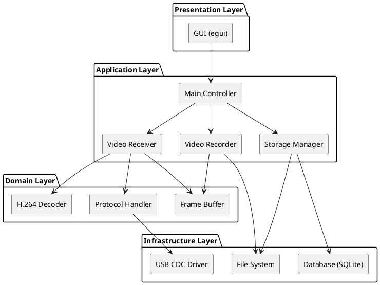
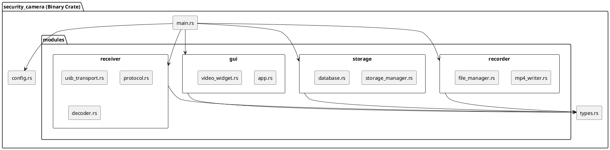

# PC側ソフトウェア仕様書 (Rust) - 防犯カメラシステム

## 📋 ドキュメント情報

- **作成日**: 2025-12-15
- **バージョン**: 1.0
- **対象**: PC側ソフトウェア
- **言語**: Rust
- **最小Rustバージョン**: 1.70

---

## 1. ソフトウェアアーキテクチャ

### 1.1 レイヤー構成



### 1.2 モジュール構成図



---

## 2. プロジェクト構成

### 2.1 ディレクトリ構造

```
security_camera/
├── Cargo.toml
├── Cargo.lock
├── README.md
├── config.toml                    # 設定ファイル
├── src/
│   ├── main.rs                   # エントリポイント
│   ├── config.rs                 # 設定管理
│   ├── types.rs                  # 共通型定義
│   ├── error.rs                  # エラー型定義
│   ├── receiver/
│   │   ├── mod.rs
│   │   ├── usb_transport.rs      # USB CDC通信
│   │   ├── protocol.rs           # プロトコル処理
│   │   └── decoder.rs            # H.264デコーダ
│   ├── recorder/
│   │   ├── mod.rs
│   │   ├── mp4_writer.rs         # MP4書き込み
│   │   └── file_manager.rs       # ファイル管理
│   ├── storage/
│   │   ├── mod.rs
│   │   ├── storage_manager.rs    # ストレージ管理
│   │   └── database.rs           # メタデータDB
│   └── gui/
│       ├── mod.rs
│       ├── app.rs                # GUIアプリケーション
│       └── video_widget.rs       # 映像表示ウィジェット
├── tests/
│   ├── integration_test.rs
│   └── protocol_test.rs
└── examples/
    └── simple_viewer.rs
```

### 2.2 Cargo.toml

```toml
[package]
name = "security_camera"
version = "1.0.0"
edition = "2021"
rust-version = "1.70"

[dependencies]
# Async runtime
tokio = { version = "1.35", features = ["full"] }
tokio-serial = "5.4"

# USB CDC / Serial
serialport = "4.3"

# H.264 decoding
ffmpeg-next = "6.1"
# Alternative: openh264 = "0.5"

# MP4 muxing
mp4 = "0.14"

# GUI
egui = "0.24"
eframe = { version = "0.24", default-features = false, features = ["glow"] }
egui_extras = { version = "0.24", features = ["image"] }

# Image processing
image = "0.24"

# Database
rusqlite = { version = "0.30", features = ["bundled"] }

# Configuration
serde = { version = "1.0", features = ["derive"] }
toml = "0.8"

# Logging
tracing = "0.1"
tracing-subscriber = { version = "0.3", features = ["env-filter"] }

# Error handling
anyhow = "1.0"
thiserror = "1.0"

# Time
chrono = "0.4"

# CRC
crc = "3.0"

# Byte parsing
nom = "7.1"
bytes = "1.5"

[dev-dependencies]
mockall = "0.12"

[profile.release]
opt-level = 3
lto = true
codegen-units = 1
strip = true
```

---

## 3. データ構造

### 3.1 共通型定義 (types.rs)

```rust
// src/types.rs

use bytes::Bytes;
use std::time::SystemTime;

/// 映像フレーム
#[derive(Debug, Clone)]
pub struct VideoFrame {
    pub data: Vec<u8>,           // RGB24 data
    pub width: u32,
    pub height: u32,
    pub timestamp: SystemTime,
    pub frame_number: u32,
}

/// H.264 NAL Unit
#[derive(Debug, Clone)]
pub enum NalUnitType {
    Sps,                         // Sequence Parameter Set
    Pps,                         // Picture Parameter Set
    Idr,                         // IDR frame (I-frame)
    Slice,                       // P-frame
}

#[derive(Debug, Clone)]
pub struct NalUnit {
    pub nal_type: NalUnitType,
    pub data: Bytes,
    pub timestamp: SystemTime,
    pub frame_number: u32,
}

/// プロトコルパケット
#[derive(Debug, Clone)]
pub struct Packet {
    pub magic: u16,              // 0x5350
    pub version: u8,             // 0x01
    pub packet_type: PacketType,
    pub sequence: u32,
    pub timestamp_us: u64,
    pub payload: Bytes,
    pub checksum: u16,
}

#[derive(Debug, Clone, Copy, PartialEq, Eq)]
pub enum PacketType {
    Handshake = 0x01,
    VideoSps = 0x10,
    VideoPps = 0x11,
    VideoIdr = 0x12,
    VideoSlice = 0x13,
    Heartbeat = 0x20,
    Error = 0xFF,
}

/// ハンドシェイク情報
#[derive(Debug, Clone)]
pub struct HandshakeInfo {
    pub video_width: u16,
    pub video_height: u16,
    pub fps: u8,
    pub codec: u8,               // 0x01 = H.264
    pub bitrate: u32,
}

/// 録画ファイル情報
#[derive(Debug, Clone)]
pub struct RecordingFile {
    pub id: i64,
    pub filename: String,
    pub start_time: SystemTime,
    pub end_time: Option<SystemTime>,
    pub file_size: u64,
    pub frame_count: u32,
}

/// システム状態
#[derive(Debug, Clone, Copy, PartialEq, Eq)]
pub enum SystemState {
    Stopped,
    Initializing,
    Connected,
    Streaming,
    Recording,
    Error,
}
```

### 3.2 エラー型定義 (error.rs)

```rust
// src/error.rs

use thiserror::Error;

#[derive(Error, Debug)]
pub enum CameraError {
    #[error("USB connection error: {0}")]
    UsbError(String),

    #[error("Protocol error: {0}")]
    ProtocolError(String),

    #[error("Decoder error: {0}")]
    DecoderError(String),

    #[error("Recorder error: {0}")]
    RecorderError(String),

    #[error("Storage error: {0}")]
    StorageError(String),

    #[error("Configuration error: {0}")]
    ConfigError(String),

    #[error("IO error: {0}")]
    IoError(#[from] std::io::Error),

    #[error("Database error: {0}")]
    DbError(#[from] rusqlite::Error),

    #[error("Timeout")]
    Timeout,
}

pub type Result<T> = std::result::Result<T, CameraError>;
```

---

## 4. 主要モジュール設計

### 4.1 USB Transport (usb_transport.rs)

```rust
// src/receiver/usb_transport.rs

use crate::types::Packet;
use crate::error::Result;
use tokio::sync::mpsc;
use tokio_serial::SerialPortBuilderExt;
use bytes::BytesMut;

pub struct UsbTransport {
    port_name: String,
    serial_port: Option<tokio_serial::SerialStream>,
    packet_tx: mpsc::Sender<Packet>,
    buffer: BytesMut,
}

impl UsbTransport {
    pub fn new(port_name: String, packet_tx: mpsc::Sender<Packet>) -> Self {
        Self {
            port_name,
            serial_port: None,
            packet_tx,
            buffer: BytesMut::with_capacity(8192),
        }
    }

    /// USB CDC接続
    pub async fn connect(&mut self) -> Result<()> {
        let port = tokio_serial::new(&self.port_name, 115200)
            .open_native_async()
            .map_err(|e| CameraError::UsbError(e.to_string()))?;

        self.serial_port = Some(port);
        Ok(())
    }

    /// パケット受信ループ
    pub async fn receive_loop(&mut self) -> Result<()> {
        use tokio::io::AsyncReadExt;

        let port = self.serial_port.as_mut()
            .ok_or_else(|| CameraError::UsbError("Not connected".to_string()))?;

        let mut read_buf = vec![0u8; 4096];

        loop {
            let n = port.read(&mut read_buf).await?;
            if n == 0 {
                return Err(CameraError::UsbError("Connection closed".to_string()));
            }

            self.buffer.extend_from_slice(&read_buf[..n]);

            // パケット抽出
            while let Some(packet) = self.try_parse_packet()? {
                self.packet_tx.send(packet).await
                    .map_err(|_| CameraError::UsbError("Channel closed".to_string()))?;
            }
        }
    }

    /// バッファからパケットをパース
    fn try_parse_packet(&mut self) -> Result<Option<Packet>> {
        use crate::receiver::protocol::parse_packet;

        if self.buffer.len() < 20 {  // Minimum header size
            return Ok(None);
        }

        match parse_packet(&self.buffer) {
            Ok((remaining, packet)) => {
                let consumed = self.buffer.len() - remaining.len();
                self.buffer.advance(consumed);
                Ok(Some(packet))
            }
            Err(nom::Err::Incomplete(_)) => Ok(None),
            Err(e) => Err(CameraError::ProtocolError(format!("{:?}", e))),
        }
    }
}
```

### 4.2 Protocol Handler (protocol.rs)

```rust
// src/receiver/protocol.rs

use crate::types::{Packet, PacketType, HandshakeInfo};
use crate::error::{Result, CameraError};
use nom::{
    IResult,
    number::complete::{le_u8, le_u16, le_u32, le_u64},
    bytes::complete::take,
};
use bytes::Bytes;

/// パケットパース
pub fn parse_packet(input: &[u8]) -> IResult<&[u8], Packet> {
    let (input, magic) = le_u16(input)?;

    if magic != 0x5350 {
        return Err(nom::Err::Error(nom::error::Error::new(
            input,
            nom::error::ErrorKind::Tag,
        )));
    }

    let (input, version) = le_u8(input)?;
    let (input, pkt_type) = le_u8(input)?;
    let (input, sequence) = le_u32(input)?;
    let (input, timestamp_us) = le_u64(input)?;
    let (input, payload_size) = le_u32(input)?;
    let (input, checksum) = le_u16(input)?;

    let (input, payload_data) = take(payload_size)(input)?;

    // CRC16検証
    let calculated_crc = calculate_crc16(payload_data);
    if calculated_crc != checksum {
        return Err(nom::Err::Error(nom::error::Error::new(
            input,
            nom::error::ErrorKind::Verify,
        )));
    }

    let packet_type = PacketType::from_u8(pkt_type)
        .ok_or_else(|| nom::Err::Error(nom::error::Error::new(
            input,
            nom::error::ErrorKind::Alt,
        )))?;

    let packet = Packet {
        magic,
        version,
        packet_type,
        sequence,
        timestamp_us,
        payload: Bytes::copy_from_slice(payload_data),
        checksum,
    };

    Ok((input, packet))
}

/// CRC16計算
fn calculate_crc16(data: &[u8]) -> u16 {
    use crc::{Crc, CRC_16_IBM_SDLC};
    const CRC16: Crc<u16> = Crc::<u16>::new(&CRC_16_IBM_SDLC);
    CRC16.checksum(data)
}

impl PacketType {
    pub fn from_u8(value: u8) -> Option<Self> {
        match value {
            0x01 => Some(PacketType::Handshake),
            0x10 => Some(PacketType::VideoSps),
            0x11 => Some(PacketType::VideoPps),
            0x12 => Some(PacketType::VideoIdr),
            0x13 => Some(PacketType::VideoSlice),
            0x20 => Some(PacketType::Heartbeat),
            0xFF => Some(PacketType::Error),
            _ => None,
        }
    }
}

/// ハンドシェイク情報パース
pub fn parse_handshake(payload: &[u8]) -> Result<HandshakeInfo> {
    if payload.len() < 9 {
        return Err(CameraError::ProtocolError("Invalid handshake size".to_string()));
    }

    Ok(HandshakeInfo {
        video_width: u16::from_le_bytes([payload[0], payload[1]]),
        video_height: u16::from_le_bytes([payload[2], payload[3]]),
        fps: payload[4],
        codec: payload[5],
        bitrate: u32::from_le_bytes([payload[6], payload[7], payload[8], payload[9]]),
    })
}
```

### 4.3 H.264 Decoder (decoder.rs)

```rust
// src/receiver/decoder.rs

use crate::types::{NalUnit, VideoFrame};
use crate::error::{Result, CameraError};
use ffmpeg_next as ffmpeg;
use std::sync::Arc;
use tokio::sync::Mutex;

pub struct H264Decoder {
    decoder: Arc<Mutex<ffmpeg::decoder::Video>>,
    width: u32,
    height: u32,
}

impl H264Decoder {
    pub fn new(width: u32, height: u32) -> Result<Self> {
        ffmpeg::init()
            .map_err(|e| CameraError::DecoderError(e.to_string()))?;

        let decoder = ffmpeg::decoder::find(ffmpeg::codec::Id::H264)
            .ok_or_else(|| CameraError::DecoderError("H.264 decoder not found".to_string()))?
            .video()
            .map_err(|e| CameraError::DecoderError(e.to_string()))?;

        Ok(Self {
            decoder: Arc::new(Mutex::new(decoder)),
            width,
            height,
        })
    }

    /// NAL UnitをデコードしてRGBフレーム生成
    pub async fn decode(&self, nal: &NalUnit) -> Result<Option<VideoFrame>> {
        let mut decoder = self.decoder.lock().await;

        let mut packet = ffmpeg::Packet::copy(&nal.data);
        decoder.send_packet(&packet)
            .map_err(|e| CameraError::DecoderError(e.to_string()))?;

        let mut frame = ffmpeg::frame::Video::empty();
        match decoder.receive_frame(&mut frame) {
            Ok(_) => {
                // YUV → RGB変換
                let rgb_data = self.yuv_to_rgb(&frame)?;

                Ok(Some(VideoFrame {
                    data: rgb_data,
                    width: self.width,
                    height: self.height,
                    timestamp: nal.timestamp,
                    frame_number: nal.frame_number,
                }))
            }
            Err(ffmpeg::Error::Eof) => Ok(None),
            Err(ffmpeg::Error::Other { errno: -11 }) => Ok(None),  // EAGAIN
            Err(e) => Err(CameraError::DecoderError(e.to_string())),
        }
    }

    /// YUV → RGB変換
    fn yuv_to_rgb(&self, frame: &ffmpeg::frame::Video) -> Result<Vec<u8>> {
        // SwScaleを使用してYUV → RGB24変換
        let mut scaler = ffmpeg::software::scaling::Context::get(
            frame.format(),
            frame.width(),
            frame.height(),
            ffmpeg::format::Pixel::RGB24,
            frame.width(),
            frame.height(),
            ffmpeg::software::scaling::Flags::BILINEAR,
        ).map_err(|e| CameraError::DecoderError(e.to_string()))?;

        let mut rgb_frame = ffmpeg::frame::Video::empty();
        scaler.run(frame, &mut rgb_frame)
            .map_err(|e| CameraError::DecoderError(e.to_string()))?;

        let data = rgb_frame.data(0).to_vec();
        Ok(data)
    }
}
```

### 4.4 MP4 Writer (mp4_writer.rs)

```rust
// src/recorder/mp4_writer.rs

use crate::types::{NalUnit, RecordingFile};
use crate::error::{Result, CameraError};
use std::path::PathBuf;
use std::fs::File;
use std::io::Write;
use chrono::{DateTime, Local};

pub struct Mp4Writer {
    output_dir: PathBuf,
    current_file: Option<File>,
    current_filename: Option<String>,
    start_time: Option<DateTime<Local>>,
    frame_count: u32,
    split_interval_sec: u64,
}

impl Mp4Writer {
    pub fn new(output_dir: PathBuf, split_interval_sec: u64) -> Self {
        Self {
            output_dir,
            current_file: None,
            current_filename: None,
            start_time: None,
            frame_count: 0,
            split_interval_sec,
        }
    }

    /// 録画開始
    pub fn start_recording(&mut self) -> Result<()> {
        let now = Local::now();
        let filename = format!("video_{}.mp4", now.format("%Y%m%d_%H%M%S"));
        let filepath = self.output_dir.join(&filename);

        let file = File::create(&filepath)
            .map_err(|e| CameraError::RecorderError(e.to_string()))?;

        self.current_file = Some(file);
        self.current_filename = Some(filename);
        self.start_time = Some(now);
        self.frame_count = 0;

        tracing::info!("Recording started: {}", filepath.display());
        Ok(())
    }

    /// H.264フレーム書き込み
    pub fn write_nal_unit(&mut self, nal: &NalUnit) -> Result<()> {
        if let Some(file) = &mut self.current_file {
            // NAL Unitを書き込み（MP4コンテナ形式）
            // 実際の実装では mp4 クレートを使用
            file.write_all(&nal.data)
                .map_err(|e| CameraError::RecorderError(e.to_string()))?;

            self.frame_count += 1;

            // ファイル分割チェック
            if let Some(start) = self.start_time {
                let elapsed = (Local::now() - start).num_seconds() as u64;
                if elapsed >= self.split_interval_sec {
                    self.stop_recording()?;
                    self.start_recording()?;
                }
            }

            Ok(())
        } else {
            Err(CameraError::RecorderError("No active recording".to_string()))
        }
    }

    /// 録画停止
    pub fn stop_recording(&mut self) -> Result<RecordingFile> {
        if let Some(mut file) = self.current_file.take() {
            file.flush()
                .map_err(|e| CameraError::RecorderError(e.to_string()))?;

            let filename = self.current_filename.take()
                .ok_or_else(|| CameraError::RecorderError("No filename".to_string()))?;

            let filepath = self.output_dir.join(&filename);
            let file_size = std::fs::metadata(&filepath)?.len();

            let recording = RecordingFile {
                id: 0,  // DBに登録時に設定
                filename,
                start_time: self.start_time.unwrap().into(),
                end_time: Some(Local::now().into()),
                file_size,
                frame_count: self.frame_count,
            };

            tracing::info!("Recording stopped: {} frames, {} bytes",
                         self.frame_count, file_size);

            self.start_time = None;
            self.frame_count = 0;

            Ok(recording)
        } else {
            Err(CameraError::RecorderError("No active recording".to_string()))
        }
    }
}
```

### 4.5 Storage Manager (storage_manager.rs)

```rust
// src/storage/storage_manager.rs

use crate::types::RecordingFile;
use crate::error::Result;
use rusqlite::{Connection, params};
use std::path::PathBuf;
use chrono::{Duration, Utc};

pub struct StorageManager {
    db: Connection,
    output_dir: PathBuf,
    retention_days: i64,
}

impl StorageManager {
    pub fn new(db_path: PathBuf, output_dir: PathBuf, retention_days: i64) -> Result<Self> {
        let db = Connection::open(&db_path)?;

        // テーブル作成
        db.execute(
            "CREATE TABLE IF NOT EXISTS recordings (
                id INTEGER PRIMARY KEY AUTOINCREMENT,
                filename TEXT NOT NULL,
                start_time INTEGER NOT NULL,
                end_time INTEGER,
                file_size INTEGER NOT NULL,
                frame_count INTEGER NOT NULL
            )",
            [],
        )?;

        Ok(Self {
            db,
            output_dir,
            retention_days,
        })
    }

    /// 録画ファイルを登録
    pub fn register_file(&self, mut recording: RecordingFile) -> Result<i64> {
        let start_ts = recording.start_time.duration_since(std::time::UNIX_EPOCH)
            .unwrap().as_secs() as i64;
        let end_ts = recording.end_time
            .map(|t| t.duration_since(std::time::UNIX_EPOCH).unwrap().as_secs() as i64);

        self.db.execute(
            "INSERT INTO recordings (filename, start_time, end_time, file_size, frame_count)
             VALUES (?1, ?2, ?3, ?4, ?5)",
            params![
                recording.filename,
                start_ts,
                end_ts,
                recording.file_size,
                recording.frame_count,
            ],
        )?;

        Ok(self.db.last_insert_rowid())
    }

    /// 古いファイルを削除（7日以上前）
    pub fn cleanup_old_files(&self) -> Result<u32> {
        let cutoff = Utc::now() - Duration::days(self.retention_days);
        let cutoff_ts = cutoff.timestamp();

        // 削除対象ファイルを取得
        let mut stmt = self.db.prepare(
            "SELECT id, filename FROM recordings WHERE start_time < ?1"
        )?;

        let files: Vec<(i64, String)> = stmt.query_map([cutoff_ts], |row| {
            Ok((row.get(0)?, row.get(1)?))
        })?.collect::<std::result::Result<Vec<_>, _>>()?;

        let mut deleted_count = 0;

        for (id, filename) in files {
            let filepath = self.output_dir.join(&filename);

            // ファイル削除
            if std::fs::remove_file(&filepath).is_ok() {
                // DB削除
                self.db.execute("DELETE FROM recordings WHERE id = ?1", [id])?;
                deleted_count += 1;
                tracing::info!("Deleted old recording: {}", filename);
            }
        }

        Ok(deleted_count)
    }

    /// 全録画ファイル取得
    pub fn list_all_recordings(&self) -> Result<Vec<RecordingFile>> {
        let mut stmt = self.db.prepare(
            "SELECT id, filename, start_time, end_time, file_size, frame_count
             FROM recordings ORDER BY start_time DESC"
        )?;

        let recordings = stmt.query_map([], |row| {
            Ok(RecordingFile {
                id: row.get(0)?,
                filename: row.get(1)?,
                start_time: std::time::UNIX_EPOCH + std::time::Duration::from_secs(row.get::<_, i64>(2)? as u64),
                end_time: row.get::<_, Option<i64>>(3)?
                    .map(|ts| std::time::UNIX_EPOCH + std::time::Duration::from_secs(ts as u64)),
                file_size: row.get(4)?,
                frame_count: row.get(5)?,
            })
        })?.collect::<std::result::Result<Vec<_>, _>>()?;

        Ok(recordings)
    }
}
```

---

## 5. メインアプリケーション (main.rs)

```rust
// src/main.rs

use anyhow::Result;
use tokio::sync::mpsc;
use tracing_subscriber;

mod config;
mod types;
mod error;
mod receiver;
mod recorder;
mod storage;
mod gui;

use config::Config;
use types::{Packet, SystemState};

#[tokio::main]
async fn main() -> Result<()> {
    // ログ初期化
    tracing_subscriber::fmt::init();

    // 設定読み込み
    let config = Config::load("config.toml")?;

    tracing::info!("Security Camera System starting...");
    tracing::info!("USB Port: {}", config.connection.port);
    tracing::info!("Output Dir: {}", config.recorder.output_dir);

    // チャネル作成
    let (packet_tx, packet_rx) = mpsc::channel::<Packet>(100);
    let (frame_tx, frame_rx) = mpsc::channel::<types::VideoFrame>(30);

    // USB Transport起動
    let mut usb = receiver::UsbTransport::new(
        config.connection.port.clone(),
        packet_tx,
    );

    tokio::spawn(async move {
        loop {
            if let Err(e) = usb.connect().await {
                tracing::error!("USB connection failed: {}", e);
                tokio::time::sleep(tokio::time::Duration::from_secs(5)).await;
                continue;
            }

            tracing::info!("USB connected");

            if let Err(e) = usb.receive_loop().await {
                tracing::error!("USB receive error: {}", e);
            }

            tokio::time::sleep(tokio::time::Duration::from_secs(1)).await;
        }
    });

    // Receiver + Decoder起動
    tokio::spawn(async move {
        receiver::run_receiver(packet_rx, frame_tx, config.clone()).await
    });

    // Recorder起動
    tokio::spawn(async move {
        recorder::run_recorder(frame_rx, config.clone()).await
    });

    // GUI起動（メインスレッド）
    gui::run_gui(config)?;

    Ok(())
}
```

---

## 6. GUI設計 (gui/app.rs)

```rust
// src/gui/app.rs

use crate::types::{VideoFrame, SystemState};
use crate::config::Config;
use egui::{ColorImage, TextureHandle};
use std::sync::Arc;
use tokio::sync::Mutex;

pub struct CameraApp {
    config: Config,
    state: SystemState,
    current_frame: Option<VideoFrame>,
    texture: Option<TextureHandle>,
    fps_counter: FpsCounter,
    recording_info: RecordingInfo,
}

impl CameraApp {
    pub fn new(config: Config) -> Self {
        Self {
            config,
            state: SystemState::Initializing,
            current_frame: None,
            texture: None,
            fps_counter: FpsCounter::new(),
            recording_info: RecordingInfo::default(),
        }
    }

    pub fn update_frame(&mut self, frame: VideoFrame) {
        self.current_frame = Some(frame);
        self.fps_counter.tick();
    }
}

impl eframe::App for CameraApp {
    fn update(&mut self, ctx: &egui::Context, _frame: &mut eframe::Frame) {
        egui::CentralPanel::default().show(ctx, |ui| {
            ui.heading("Security Camera System");

            // ステータス表示
            ui.horizontal(|ui| {
                ui.label("Status:");
                ui.colored_label(
                    match self.state {
                        SystemState::Recording => egui::Color32::GREEN,
                        SystemState::Error => egui::Color32::RED,
                        _ => egui::Color32::YELLOW,
                    },
                    format!("{:?}", self.state),
                );

                ui.separator();
                ui.label(format!("FPS: {:.1}", self.fps_counter.fps()));
            });

            ui.separator();

            // 映像表示
            if let Some(frame) = &self.current_frame {
                let color_image = ColorImage::from_rgb(
                    [frame.width as usize, frame.height as usize],
                    &frame.data,
                );

                let texture = ui.ctx().load_texture(
                    "video_frame",
                    color_image,
                    Default::default(),
                );

                ui.image(&texture, texture.size_vec2());
            } else {
                ui.label("Waiting for video...");
            }

            // 録画情報
            ui.separator();
            ui.horizontal(|ui| {
                ui.label("Recording:");
                if self.state == SystemState::Recording {
                    ui.colored_label(egui::Color32::RED, "● REC");
                    ui.label(format!("File: {}", self.recording_info.current_file));
                    ui.label(format!("Duration: {}", self.recording_info.duration()));
                }
            });
        });

        // 定期的に再描画
        ctx.request_repaint();
    }
}

struct FpsCounter {
    frame_times: Vec<std::time::Instant>,
}

impl FpsCounter {
    fn new() -> Self {
        Self { frame_times: Vec::new() }
    }

    fn tick(&mut self) {
        let now = std::time::Instant::now();
        self.frame_times.push(now);

        // 直近1秒分のみ保持
        self.frame_times.retain(|t| now.duration_since(*t).as_secs_f32() < 1.0);
    }

    fn fps(&self) -> f32 {
        self.frame_times.len() as f32
    }
}

#[derive(Default)]
struct RecordingInfo {
    current_file: String,
    start_time: Option<std::time::Instant>,
}

impl RecordingInfo {
    fn duration(&self) -> String {
        if let Some(start) = self.start_time {
            let elapsed = start.elapsed().as_secs();
            format!("{:02}:{:02}:{:02}", elapsed / 3600, (elapsed % 3600) / 60, elapsed % 60)
        } else {
            "00:00:00".to_string()
        }
    }
}
```

---

## 7. ビルド・デプロイ

### 7.1 ビルド

```bash
# デバッグビルド
cargo build

# リリースビルド（最適化）
cargo build --release

# 実行
./target/release/security_camera
```

### 7.2 クロスコンパイル

```bash
# Windows向け（Linux上で）
cargo build --release --target x86_64-pc-windows-gnu

# ARM向け（Raspberry Pi等）
cargo build --release --target armv7-unknown-linux-gnueabihf
```

---

## 8. テスト

### 8.1 ユニットテスト

```rust
// src/receiver/protocol.rs

#[cfg(test)]
mod tests {
    use super::*;

    #[test]
    fn test_parse_handshake() {
        let payload = vec![
            0x00, 0x05,  // width: 1280
            0xD0, 0x02,  // height: 720
            30,          // fps
            0x01,        // codec: H.264
            0x00, 0x27, 0x8D, 0x00,  // bitrate: 2000000 (Little Endian: 0x001E8480)
        ];

        let info = parse_handshake(&payload).unwrap();
        assert_eq!(info.video_width, 1280);
        assert_eq!(info.video_height, 720);
        assert_eq!(info.fps, 30);
        assert_eq!(info.codec, 0x01);
    }

    #[test]
    fn test_packet_type_conversion() {
        assert_eq!(PacketType::from_u8(0x10), Some(PacketType::VideoSps));
        assert_eq!(PacketType::from_u8(0x12), Some(PacketType::VideoIdr));
        assert_eq!(PacketType::from_u8(0xFF), Some(PacketType::Error));
        assert_eq!(PacketType::from_u8(0x99), None);
    }
}
```

---

## 9. まとめ

本仕様書では、PC側のRustソフトウェアアーキテクチャを詳細に定義した。

**主要モジュール**:
- ✅ USB Transport - USB CDC通信（Tokio async）
- ✅ Protocol Handler - パケットパース（nom）
- ✅ H.264 Decoder - 映像デコード（ffmpeg-next）
- ✅ MP4 Writer - MP4ファイル作成
- ✅ Storage Manager - ストレージ・DB管理（SQLite）
- ✅ GUI - リアルタイム表示（egui）

**使用クレート**:
- tokio: 非同期ランタイム
- tokio-serial: USB CDC通信
- ffmpeg-next: H.264デコード
- egui: GUI
- rusqlite: データベース

---

**文書バージョン**: 1.0
**最終更新**: 2025-12-15
**ステータス**: ✅ 確定
