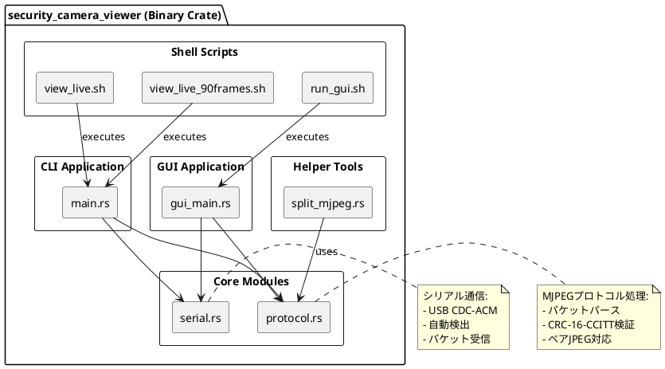

# Phase 1.5 実装・仕様書更新計画

**作成日**: 2025-12-22
**対象バージョン**: Phase 1.5 (安定性向上)

---

## 📊 現状分析

### ✅ 完成済み（Phase 1）
| 項目 | Spresense側 | PC Rust側 | 仕様書 |
|------|-----------|----------|-------|
| MJPEGプロトコル実装 | ✅ | ✅ | ✅ Spresense仕様書更新済み |
| CRC-16-CCITT検証 | ✅ | ✅ | ✅ |
| USB CDC通信 | ✅ | ✅ | ✅ |
| ベアJPEG対応 | ✅ | ✅ | ✅ テスト結果文書化 |
| CLIビューア | N/A | ✅ | ⚠️ PC仕様書未更新 |
| GUIビューア | N/A | ✅ | ⚠️ PC仕様書未更新 |
| WSL2簡易ビューア | N/A | ✅ | ⚠️ PC仕様書未更新 |

### ⚠️ 更新が必要な仕様書

#### 1. Spresense側仕様書 (05_SOFTWARE_SPEC_SPRESENSE.md)
- **現在のバージョン**: 2.0 (2025-12-21更新)
- **内容**: ✅ MJPEG実装を正確に反映
- **Phase 1.5更新箇所**:
  1. 連続送信モード対応（90フレーム制限の削除）
  2. フレームドロップ対策の追記
  3. エラーハンドリング強化の追記

#### 2. PC Rust側仕様書 (06_SOFTWARE_SPEC_PC_RUST.md)
- **現在のバージョン**: 2.0 (2025-12-21更新)
- **内容**: ❌ **H.264実装のまま！実装と乖離**
- **Phase 1.5更新箇所**:
  1. ✅ **アーキテクチャ全面書き直し**（H.264 → MJPEG）
  2. ✅ **実装済み構成の反映**（CLI/GUI/WSL2ビューア）
  3. 依存クレートの更新（ffmpeg削除、image/egui追加）
  4. モジュール構成の更新

---

## 🎯 Phase 1.5 実装項目

### 優先度: 最高

#### 0. VGA解像度アップグレード ⭐ **NEW**
**対象**: Spresense側 + PC Rust側

**変更内容**:
- **解像度**: QVGA (320×240) → **VGA (640×480)**
- **バッファサイズ**: 64 KB → **128 KB**
- **メモリ使用量**: 474 KB → **794 KB** (51.7%使用率)

**Spresense側変更箇所**:
```c
// camera_manager.c
#define CAMERA_BUFFER_NUM  2 → 3  // Triple buffering

// config.h
#define CONFIG_CAMERA_WIDTH   320 → 640
#define CONFIG_CAMERA_HEIGHT  240 → 480
#define CONFIG_MJPEG_MAX_JPEG_SIZE  65536 → 131072  // 64KB → 128KB
```

**PC Rust側変更箇所**:
- パケットバッファサイズ調整（自動対応）
- GUI表示サイズ更新

**理由**:
- 将来のHD対応への布石
- より実用的な画質
- メモリは十分余裕あり（51.7%使用率）

**仕様書更新**: Spresense仕様書 § 8.2, § 9.1, PC Rust仕様書 § 8.1

---

### 優先度: 高

#### 1. 連続送信モード実装
**対象**: Spresense側 `security_camera` アプリケーション

**現状**:
```c
// apps/examples/security_camera/security_camera_main.c (推測)
for (int i = 0; i < 90; i++) {
    // フレーム送信
}
```

**変更後**:
```c
// Option A: 無限ループ
while (1) {
    // フレーム送信
    // 停止コマンド受信時のみbreak
}

// Option B: 設定可能
int max_frames = CONFIG_MAX_FRAMES;  // 0 = 無限
for (int i = 0; max_frames == 0 || i < max_frames; i++) {
    // フレーム送信
}
```

**影響箇所**:
- `camera_app_main.c`: メインループ
- `config.h`: `CONFIG_MAX_FRAMES` 定義追加
- `Kconfig`: `SECURITY_CAMERA_MAX_FRAMES` 設定追加

**仕様書更新**: Spresense仕様書 § 5.2, § 9.1

---

#### 2. フレームドロップ対策
**対象**: Spresense側 `camera_manager.c`

**現状の問題**:
- テスト結果: 3.3%のフレームドロップ率 (3/90フレーム)
- 原因: カメラから無効なフレーム取得

**対策**:
```c
// camera_manager.c

int camera_get_jpeg_frame(jpeg_frame_t *frame) {
    int retry_count = 0;
    const int max_retries = 3;

    while (retry_count < max_retries) {
        ret = ioctl(cam_fd, VIDIOC_DQBUF, &buf);
        if (ret < 0) {
            LOG_WARN("DQBUF failed, retry %d/%d", retry_count + 1, max_retries);
            retry_count++;
            continue;
        }

        // JPEGサイズ検証
        if (buf.bytesused == 0 || buf.bytesused > MAX_JPEG_SIZE) {
            LOG_WARN("Invalid JPEG size: %d bytes, skipping", buf.bytesused);
            ioctl(cam_fd, VIDIOC_QBUF, &buf);  // バッファ返却
            retry_count++;
            continue;
        }

        // 成功
        break;
    }

    if (retry_count >= max_retries) {
        return ERR_CAMERA_CAPTURE;
    }

    // フレームコピー
    // ...
}
```

**仕様書更新**: Spresense仕様書 § 7.1

---

#### 3. JPEGパディング処理改善
**対象**: Spresense側 `mjpeg_protocol.c`

**現状の問題**:
- EOIマーカー (FF D9) 後にFFパディングが追加される
- PC側でfalse negativeエラー発生

**対策 Option A: Spresense側でトリミング**
```c
// mjpeg_protocol.c

int mjpeg_create_packet(const jpeg_frame_t *jpeg_frame,
                        uint8_t *packet_buffer,
                        size_t buffer_size)
{
    // JPEGデータの実際の終端を検索
    uint32_t actual_jpeg_size = jpeg_frame->size;

    // EOIマーカー (0xFF 0xD9) を検索
    for (int i = actual_jpeg_size - 2; i >= 0; i--) {
        if (jpeg_frame->buf[i] == 0xFF && jpeg_frame->buf[i + 1] == 0xD9) {
            actual_jpeg_size = i + 2;  // EOI含む
            break;
        }
    }

    // パケット作成
    header.jpeg_size = actual_jpeg_size;  // パディング除外
    // ...
}
```

**対策 Option B: PC側で許容**（既に実装済み）
- PC側のvalidationはEOI検索ベースで実装済み
- ただし、不要なパディングは送信しない方が効率的

**仕様書更新**: Spresense仕様書 § 7.2, テスト結果文書 § 5.3

---

### 優先度: 中

#### 4. エラーハンドリング強化
**対象**: Spresense側全般

**追加機能**:
1. **CRC不一致時の統計情報**
   ```c
   // mjpeg_protocol.c
   static uint32_t crc_error_count = 0;

   void mjpeg_log_stats(void) {
       LOG_INFO("MJPEG Stats: CRC errors=%u", crc_error_count);
   }
   ```

2. **USB切断検出と自動再接続**
   ```c
   // usb_transport.c
   int usb_transport_send(const uint8_t *data, size_t size) {
       ssize_t written = write(usb_fd, data, size);

       if (written < 0) {
           if (errno == EPIPE || errno == ENOTCONN) {
               LOG_WARN("USB disconnected, attempting reconnect...");
               return usb_transport_reconnect();
           }
       }
       // ...
   }
   ```

**仕様書更新**: Spresense仕様書 § 5.3, § 7.3

---

#### 5. パフォーマンス最適化
**対象**: Spresense側全般

**最適化項目**:
1. **DMA転送の活用** (V4L2ドライバ側)
2. **バッファサイズ調整** (テスト結果に基づく)
   ```c
   // config.h
   #define CONFIG_CAMERA_BUFFER_COUNT  3  // 2 → 3に増加
   #define CONFIG_USB_TX_BUFFER_SIZE   32768  // 8KB → 32KB
   ```

**仕様書更新**: Spresense仕様書 § 8.3

---

## 📝 仕様書更新作業リスト

### Spresense側仕様書 (05_SOFTWARE_SPEC_SPRESENSE.md)

| セクション | 更新内容 | 優先度 |
|-----------|---------|--------|
| § 5.2 メインループシーケンス | 連続送信モード対応 | 高 |
| § 6.1 状態遷移図 | 無限ループ状態追加 | 高 |
| § 7.1 Camera Manager API | リトライロジック追記 | 高 |
| § 7.2 MJPEG Protocol API | パディングトリミング追記 | 高 |
| § 7.3 USB Transport API | 再接続機能追記 | 中 |
| § 8.3 メモリ最適化戦略 | バッファサイズ調整反映 | 中 |
| § 9.1 config.h | CONFIG_MAX_FRAMES追加 | 高 |
| § 9.2 Kconfig | SECURITY_CAMERA_MAX_FRAMES追加 | 高 |
| § 10 エラーコード定義 | 新規エラーコード追加 | 中 |

### PC Rust側仕様書 (06_SOFTWARE_SPEC_PC_RUST.md)

| セクション | 更新内容 | 優先度 |
|-----------|---------|--------|
| § 1 アーキテクチャ | **全面書き直し** (H.264 → MJPEG) | 最高 |
| § 2 プロジェクト構成 | 実装構成に合わせる | 最高 |
| § 2.2 Cargo.toml | ffmpeg削除、依存更新 | 最高 |
| § 3 データ構造 | MJPEGPacket構造体に更新 | 最高 |
| § 4 主要モジュール設計 | protocol.rs, serial.rs, gui_main.rs | 最高 |
| § 5 メインアプリケーション | CLIビューア実装反映 | 最高 |
| § 6 GUI設計 | eframe/egui実装反映 | 最高 |
| **新規** § 7 WSL2対応 | view_live.sh等の追記 | 高 |
| § 8 テスト | ユニットテスト実績反映 | 中 |

---

## 🔄 コンポーネント図更新

### 現在の実装を反映したコンポーネント図

#### PC Rust側 - 実際の構成



---

## 📅 実装スケジュール

### Week 1: 最優先項目（今週）

| 項目 | 工数 | 担当 |
|------|------|------|
| 1. Spresense: 連続送信モード実装 | 30分 | 開発者 |
| 2. Spresense: config.h/Kconfig更新 | 15分 | 開発者 |
| 3. PC Rust: 仕様書全面書き直し | 2時間 | Claude/開発者 |
| 4. 動作確認テスト | 30分 | 開発者 |

### Week 2: 安定性向上

| 項目 | 工数 | 担当 |
|------|------|------|
| 5. Spresense: フレームドロップ対策 | 1時間 | 開発者 |
| 6. Spresense: JPEGパディング処理改善 | 30分 | 開発者 |
| 7. 長時間動作テスト (24時間) | 1日 | 開発者 |
| 8. Spresense仕様書更新 | 1時間 | Claude/開発者 |

### Week 3: エラーハンドリング・最適化

| 項目 | 工数 | 担当 |
|------|------|------|
| 9. エラーハンドリング強化 | 2時間 | 開発者 |
| 10. パフォーマンス最適化 | 2時間 | 開発者 |
| 11. 統合テスト | 1時間 | 開発者 |
| 12. 最終ドキュメント更新 | 1時間 | Claude/開発者 |

**合計工数**: 約12時間

---

## ✅ Phase 1.5 完了基準

### 機能要件
- ✅ **VGA (640×480) 安定動作確認**
- ✅ 連続送信モード動作確認 (1時間以上)
- ✅ フレームドロップ率 < 1%
- ✅ JPEGパディング問題解消
- ✅ 24時間連続動作確認
- ✅ **USB帯域幅実測** (VGAでの実帯域確認)

### 品質要件
- ✅ CRC検証 100%成功
- ✅ メモリリーク無し
- ✅ CPU使用率 < 50%

### ドキュメント要件
- ✅ Spresense仕様書 v2.1 更新完了
- ✅ PC Rust仕様書 v2.1 更新完了
- ✅ テスト結果文書更新
- ✅ README.md更新

---

## 🚀 Phase 2 計画（Phase 1.5 完了後）

### Phase 2-A: 解像度拡張機能

#### 1. 動的解像度切り替え機能
**PC → Spresense コマンドプロトコル追加**

**コマンドパケット**:
```
[SYNC_CMD:4][CMD_TYPE:2][PARAM_1:4][PARAM_2:4][CRC16:2]
Total: 16 bytes
```

**実装項目**:
- `command_handler.c/h` (Spresense側)
- `src/command.rs` (PC Rust側)
- `camera_set_resolution()` API

#### 2. HD (1280×720) 対応
**メモリ要件**:
- バッファサイズ: 256 KB × 3 = 768 KB
- 合計メモリ: ~1,114 KB (72.5%使用率)
- 残余: 422 KB → 問題なし

**比較テスト**:
- VGA vs HD 画質比較
- VGA vs HD 帯域幅測定（USB 2.0制約確認）
- 最終解像度決定

### Phase 2-B: 拡張機能
- WiFi対応（Spresense拡張ボード）
- 録画機能強化（PC側）
- 動き検出（オプション）

---

## 📊 優先順位まとめ

| Phase | 項目 | 優先度 | 状態 |
|-------|------|--------|------|
| **Phase 1.5** | VGA対応 | 最高 | 📝 計画中 |
| **Phase 1.5** | 連続送信モード | 高 | 📝 計画中 |
| **Phase 1.5** | フレームドロップ対策 | 高 | 📝 計画中 |
| **Phase 1.5** | JPEGパディング除去 | 高 | 📝 計画中 |
| **Phase 2-A** | 解像度切り替え | 中 | ⏳ 延期 |
| **Phase 2-A** | HD対応・比較テスト | 中 | ⏳ 延期 |
| **Phase 2-B** | WiFi対応 | 低 | ⏳ 延期 |

---

**作成者**: Claude Code Agent
**承認**: Pending
**次回レビュー**: Phase 1.5実装完了後
