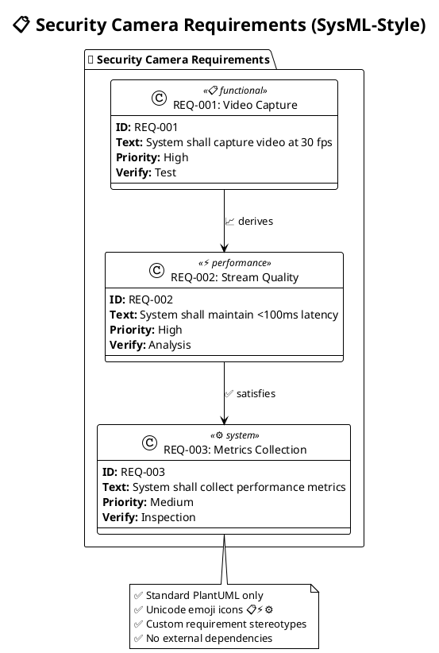
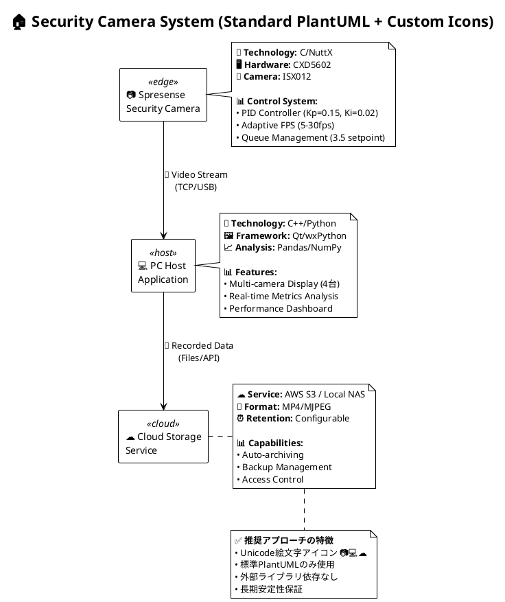
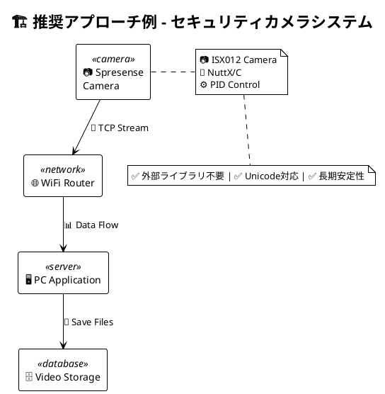

# モデリングライブラリ・ツール参考資料

## PlantUML 外部ライブラリ（今回使用：C4-PlantUML）

### 🏗️ **アーキテクチャ図ライブラリ**

1. **C4-PlantUML** (今回使用)
   ```
   !include https://raw.githubusercontent.com/plantuml-stdlib/C4-PlantUML/master/C4_Context.puml
   ```
   - C4モデル（Context/Container/Component/Code）
   - システムアーキテクチャの階層表現

2. **AWS Architecture**
   ```
   !include <awslib/AWSCommon>
   !include <awslib/Compute/all>
   !include <awslib/Storage/all>
   ```
   - AWSサービスアイコン・図
   - クラウドアーキテクチャ

3. **Azure Architecture**
   ```
   !include <azure/AzureCommon>
   !include <azure/Compute/AzureVirtualMachine>
   ```
   - Azureサービス図

4. **Kubernetes**
   ```
   !include <k8s/OSS/all>
   ```
   - Kubernetesクラスター図

### 🎨 **アイコン・スタイリングライブラリ**

5. **Font Awesome**
   ```
   !include <font-awesome-5/database>
   !include <font-awesome-5/server>
   ```
   - 汎用アイコンセット

6. **Material Icons**
   ```
   !include <material/folder>
   !include <material/computer>
   ```
   - Google Material Designアイコン

7. **Office Icons**
   ```
   !include <office/Servers/application_server>
   !include <office/Databases/database>
   ```
   - Microsoft Office風アイコン

### 🔧 **技術特化ライブラリ**

8. **Network Diagrams** (標準rectangle推奨)
   ```plantuml
   @startuml
   rectangle "Server" <<server>>
   rectangle "Router" <<network>>
   rectangle "Client" <<computer>>
   @enduml
   ```
   - ネットワーク機器・接続図 (tupadr3ライブラリは不安定のため標準記法推奨)

9. **Elastic Stack** (標準rectangle推奨)
   ```plantuml
   @startuml
   rectangle "Elasticsearch" <<database>>
   rectangle "Logstash" <<processor>>
   rectangle "Kibana" <<dashboard>>
   @enduml
   ```
   - Elasticsearch, Kibana等 (外部ライブラリは不安定のため標準記法推奨)

## SysML専用ツール

### 🔬 **本格SysMLツール**

1. **Eclipse Papyrus**
   - オープンソース、UML/SysML完全対応
   - Requirements, Structure, Behavior, Parametrics図
   - モデルベース開発（MBSE）対応

2. **MagicDraw/Cameo Systems Modeler**
   - 商用、SysML業界標準
   - 航空宇宙・自動車業界で使用
   - 要求トレーサビリティ、シミュレーション

3. **Enterprise Architect**
   - 商用、UML/SysMLサポート
   - コード生成・リバースエンジニアリング
   - 要求管理統合

### 🆓 **軽量SysMLツール**

4. **PlantUML SysML-Style Extension** (Class図による実現)
   ```plantuml
   @startuml
   !theme plain

   package "System" <<system>> {
     class "Sensor" <<(S,#87CEEB) block>> {
       .. Values ..
       temperature : Real

       .. Operations ..
       + read_temperature() : Real
       + calibrate()
     }
   }
   @enduml
   ```
   注意: PlantUMLには現在ネイティブSysML対応がないため、Class図でSysML風記法を実現

## UML専用ツール

### 💼 **商用UMLツール**

1. **Visual Paradigm**
   - UML/SysML/BPMN対応
   - コード生成、データベース設計
   - アジャイル開発統合

2. **IBM Rational Software Architect**
   - エンタープライズ向け
   - 大規模システム設計

3. **StarUML**
   - 軽量、手頃な価格
   - UML 2.x完全対応

### 🌐 **Web/クラウドUMLツール**

4. **Lucidchart**
   - ブラウザベース
   - コラボレーション機能
   - UML/フローチャート

5. **draw.io (diagrams.net)**
   - 無料、ブラウザ/デスクトップ
   - UMLテンプレート豊富

6. **Creately**
   - オンラインコラボレーション
   - UML/ER図対応

## アーキテクチャ図特化ツール

### 🏛️ **アーキテクチャ専用**

1. **Structurizr**
   - C4モデル専用ツール（C4-PlantUMLの元）
   - DSLベースモデリング
   - 「Architecture as Code」

2. **Archimate Tool**
   - エンタープライズアーキテクチャ
   - TOGAF準拠

3. **OmniGraffle** (Mac)
   - 直感的図作成
   - 豊富なステンシル

### ☁️ **クラウド統合ツール**

4. **AWS Architecture Center**
   - AWS専用図ツール
   - 自動リソース検出

5. **Azure Architecture Center**
   - Azure専用図ツール

## 実装例：SysML Requirements図



## おすすめ選択指針

### 🎯 **用途別推奨**

1. **システムアーキテクチャ**: PlantUML + C4-PlantUML
2. **要求工学**: Eclipse Papyrus, MagicDraw
3. **コラボレーション**: draw.io, Lucidchart
4. **クラウド**: AWS/Azure専用ツール + PlantUML
5. **組み込み**: SysML対応ツール（MagicDraw, Papyrus）

### 💡 **PlantUML最大活用**



## 主要ライブラリの入手先

### GitHub Repositories
- **C4-PlantUML**: https://github.com/plantuml-stdlib/C4-PlantUML
- **PlantUML Standard Library**: https://github.com/plantuml/plantuml-stdlib
- **Font Awesome Icons**: https://github.com/tupadr3/plantuml-icon-font-sprites
- **AWS Icons**: https://github.com/awslabs/aws-icons-for-plantuml
- **Azure Icons**: https://github.com/RicardoNiepel/Azure-PlantUML

### 使用方法
1. **オンライン形式** (推奨):
   ```
   !include https://raw.githubusercontent.com/plantuml-stdlib/C4-PlantUML/master/C4_Context.puml
   ```

2. **Standard Library形式** (非推奨):
   ```
   ' 以下は不安定でエラーの原因
   ' !include <tupadr3/font-awesome/server>

   ' 代わりに標準記法を推奨
   rectangle "Server" <<server>>
   ```

3. **ローカルファイル**:
   ```
   !include /path/to/local/library.puml
   ```

### 推奨アプローチ (PlantUML 1.2026.0対応)

**安全で安定した記法** (Unicode絵文字アイコン):


**避けるべき記法** (エラーの原因):
- `!include <tupadr3/*>` - パスエラー多発
- `!include <elastic/*>` - ライブラリ不安定
- `!include <font-awesome-5/*>` - Fatal parsing error
- `!include <sysml/*>` - 存在しない拡張

PlantUMLは「Architecture as Code」の思想で、バージョン管理と自動化に優れているため、継続的な図の更新が必要なシステム開発に最適です。