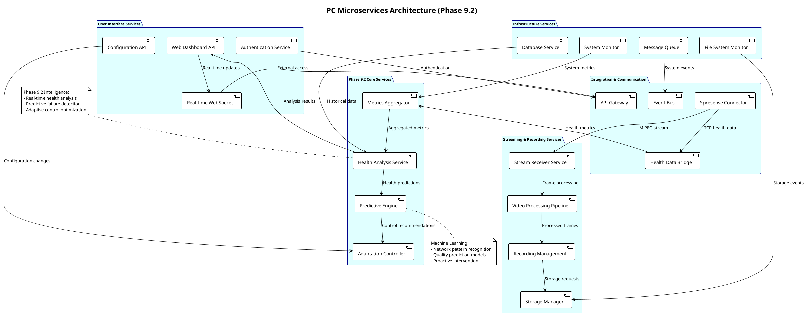
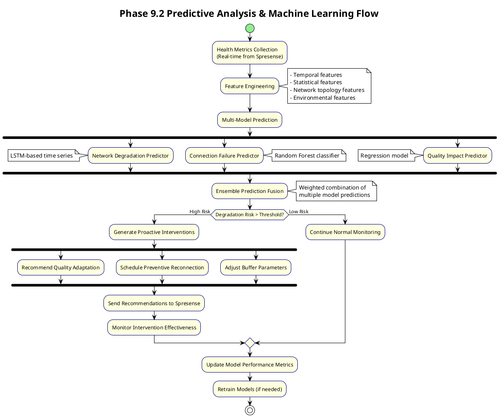
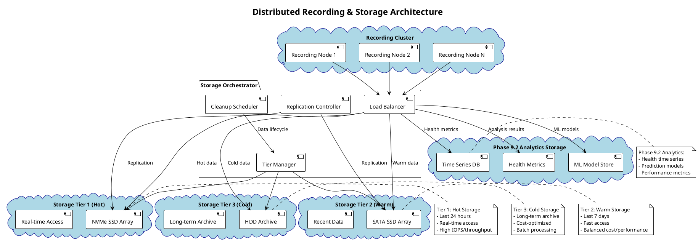
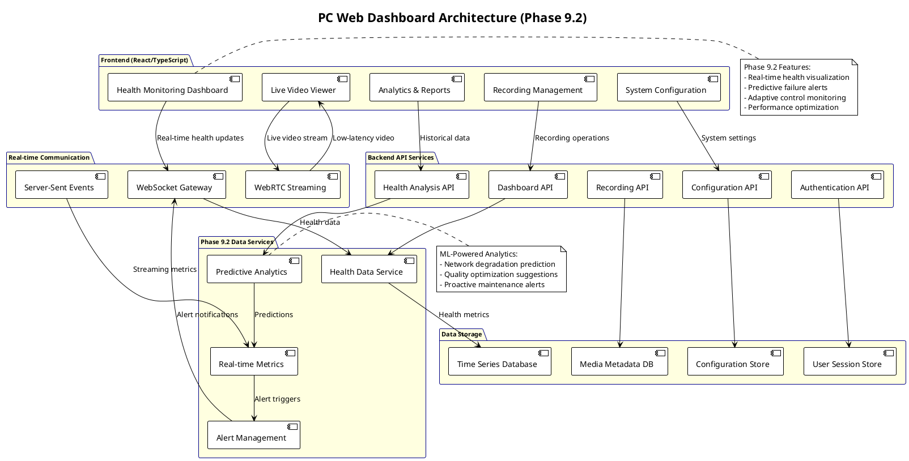

# PC アーキテクチャ仕様

**バージョン**: 3.0 (Phase 9.2 TCP健全性監視統合)
**日付**: 2026-01-23
**対象システム**: PC ホストシステム

## 概要

PC側セキュリティカメラホストシステムのアーキテクチャ。Phase 9.2でTCP健全性監視・分析機能を統合し、Spresenseからの映像ストリーミング受信、録画管理、予測分析、リアルタイム監視ダッシュボードを統合的に提供する高機能ホストプラットフォームを実現する。

## PCハードウェア・OS環境

### システム要件

```plantuml
@startuml pc_hardware_requirements
!theme plain

skinparam component {
    BackgroundColor lightgreen
    BorderColor darkgreen
    FontSize 10
}

title PC System Requirements for Phase 9.2

package "Minimum Hardware Requirements" {
    [CPU: Intel Core i5-8400 / AMD Ryzen 5 2600] as MinCPU
    [Memory: 8GB DDR4-2400] as MinRAM
    [Storage: 256GB SSD] as MinStorage
    [Network: Gigabit Ethernet + WiFi] as MinNetwork
}

package "Recommended Hardware" {
    [CPU: Intel Core i7-10700 / AMD Ryzen 7 3700X] as RecCPU
    [Memory: 16GB DDR4-3200] as RecRAM
    [Storage: 1TB NVMe SSD + 4TB HDD] as RecStorage
    [Network: Gigabit Ethernet + WiFi 6] as RecNetwork
    [GPU: Dedicated GPU (Optional)] as RecGPU
}

package "Operating System Support" {
    [Windows 10/11 (x64)] as Windows
    [Linux (Ubuntu 20.04+ / CentOS 8+)] as Linux
    [macOS 11+ (Intel/Apple Silicon)] as macOS
}

package "Phase 9.2 Specific Requirements" {
    [Real-time Analysis: 4+ cores] as RTAnalysis
    [Health Monitoring: 200MB RAM] as HealthRAM
    [Video Recording: 10MB/s sustained write] as VideoWrite
    [Dashboard: Hardware-accelerated graphics] as Dashboard
}

MinCPU --> RecCPU : Upgrade path
MinRAM --> RecRAM : Performance improvement
MinStorage --> RecStorage : Capacity expansion

RTAnalysis --> RecCPU
HealthRAM --> RecRAM
VideoWrite --> RecStorage
Dashboard --> RecGPU

note right of RTAnalysis
  Phase 9.2 Requirements:
  - Real-time health analysis
  - Predictive modeling
  - Concurrent recording
end note

@enduml
```



### ハードウェア性能仕様

```c
// pc_hardware_spec.h - PC環境仕様・最適化
typedef struct {
    // CPU要件
    uint32_t min_cpu_cores;              // 4コア以上
    uint32_t min_cpu_frequency_mhz;      // 2.9GHz以上
    bool supports_avx2;                  // AVX2命令対応
    bool supports_hardware_aes;          // AES-NI対応

    // メモリ要件
    uint64_t min_system_ram_mb;          // 8GB最小
    uint64_t recommended_ram_mb;         // 16GB推奨
    uint64_t phase92_reserved_mb;        // 200MB Phase 9.2専用
    uint32_t min_memory_bandwidth_gbps;  // 25.6GB/s以上

    // ストレージ要件
    uint64_t min_system_storage_gb;      // 256GB最小
    uint64_t recommended_video_storage_tb; // 4TB推奨
    uint32_t min_sustained_write_mbps;   // 10MB/s持続書き込み
    uint32_t min_random_iops;            // 10,000 IOPS以上

    // ネットワーク要件
    uint32_t min_network_bandwidth_mbps; // 100Mbps最小
    uint32_t recommended_bandwidth_mbps; // 1Gbps推奨
    bool supports_jumbo_frames;          // 9KB Jumbo Frame対応
    uint32_t max_network_latency_ms;     // 10ms以下

    // Phase 9.2特殊要件
    bool realtime_analysis_capability;   // リアルタイム分析対応
    uint32_t concurrent_stream_support;  // 同時ストリーム数
    bool hardware_video_acceleration;    // ハードウェアエンコーディング
    uint32_t dashboard_refresh_rate_hz;  // ダッシュボード更新頻度

} pc_hardware_requirements_t;

static const pc_hardware_requirements_t optimal_pc_spec = {
    // CPU最適仕様
    .min_cpu_cores = 4,
    .min_cpu_frequency_mhz = 2900,
    .supports_avx2 = true,
    .supports_hardware_aes = true,

    // メモリ最適仕様
    .min_system_ram_mb = 8192,           // 8GB
    .recommended_ram_mb = 16384,         // 16GB
    .phase92_reserved_mb = 200,          // Phase 9.2専用
    .min_memory_bandwidth_gbps = 25,

    // ストレージ最適仕様
    .min_system_storage_gb = 256,
    .recommended_video_storage_tb = 4,
    .min_sustained_write_mbps = 10,
    .min_random_iops = 10000,

    // ネットワーク最適仕様
    .min_network_bandwidth_mbps = 100,
    .recommended_bandwidth_mbps = 1000,
    .supports_jumbo_frames = true,
    .max_network_latency_ms = 10,

    // Phase 9.2最適仕様
    .realtime_analysis_capability = true,
    .concurrent_stream_support = 4,      // 4ストリーム同時
    .hardware_video_acceleration = true,
    .dashboard_refresh_rate_hz = 30,     // 30Hz更新
};
```

## ソフトウェアアーキテクチャ

### マイクロサービス・アーキテクチャ



### 分散システム設計

```c
// pc_distributed_system.h - PC分散システム設計
typedef struct {
    // マイクロサービス管理
    service_registry_t service_registry;
    load_balancer_t load_balancer;
    service_discovery_t discovery;
    health_check_manager_t health_checker;

    // Phase 9.2健全性分析基盤
    struct {
        health_analysis_engine_t *analysis_engine;
        predictive_model_t *prediction_models;
        adaptation_recommender_t *recommender;
        metrics_warehouse_t *metrics_storage;
    } phase92_analytics;

    // ストリーミング・録画基盤
    struct {
        stream_processing_cluster_t *stream_cluster;
        recording_node_pool_t *recording_nodes;
        storage_orchestrator_t *storage_orchestrator;
        transcoding_farm_t *transcoding_farm;
    } media_processing;

    // データ管理基盤
    struct {
        distributed_database_t *health_db;
        time_series_db_t *metrics_db;
        object_storage_t *video_storage;
        cache_cluster_t *cache_layer;
    } data_management;

    // 通信・統合基盤
    struct {
        message_broker_t *event_broker;
        api_gateway_t *api_gateway;
        websocket_manager_t *realtime_comm;
        notification_service_t *alerting;
    } communication;

} pc_distributed_architecture_t;

// マイクロサービス定義
typedef struct {
    const char *service_name;
    service_type_t type;
    uint16_t default_port;
    uint32_t min_instances;
    uint32_t max_instances;
    resource_requirements_t resources;
    dependency_t dependencies[MAX_DEPENDENCIES];
    bool is_phase92_core;               // Phase 9.2コアサービス
} microservice_definition_t;

static const microservice_definition_t pc_services[] = {
    // Phase 9.2コアサービス
    {
        "health-analysis-service",
        SERVICE_TYPE_CORE,
        8080,
        1, 3,
        {.cpu_cores = 2, .memory_mb = 512, .storage_gb = 10},
        {"metrics-aggregator", "predictive-engine"},
        true
    },
    {
        "predictive-engine-service",
        SERVICE_TYPE_ANALYTICS,
        8081,
        1, 2,
        {.cpu_cores = 4, .memory_mb = 1024, .storage_gb = 50},
        {"health-analysis-service", "database-service"},
        true
    },

    // ストリーミング・録画サービス
    {
        "stream-receiver-service",
        SERVICE_TYPE_MEDIA,
        8090,
        1, 4,
        {.cpu_cores = 1, .memory_mb = 256, .storage_gb = 5},
        {"spresense-connector", "recording-manager"},
        false
    },
    {
        "recording-manager-service",
        SERVICE_TYPE_MEDIA,
        8091,
        1, 2,
        {.cpu_cores = 2, .memory_mb = 512, .storage_gb = 100},
        {"storage-manager", "video-processor"},
        false
    },

    // ユーザーインターフェース
    {
        "dashboard-api-service",
        SERVICE_TYPE_API,
        8100,
        1, 3,
        {.cpu_cores = 1, .memory_mb = 256, .storage_gb = 5},
        {"health-analysis-service", "auth-service"},
        false
    },
    {
        "websocket-service",
        SERVICE_TYPE_REALTIME,
        8101,
        1, 2,
        {.cpu_cores = 1, .memory_mb = 128, .storage_gb = 2},
        {"dashboard-api-service", "message-queue"},
        false
    },

    // インフラストラクチャ
    {
        "database-service",
        SERVICE_TYPE_INFRASTRUCTURE,
        5432,
        1, 1,
        {.cpu_cores = 2, .memory_mb = 2048, .storage_gb = 200},
        {},
        false
    },
    {
        "message-queue-service",
        SERVICE_TYPE_INFRASTRUCTURE,
        5672,
        1, 1,
        {.cpu_cores = 1, .memory_mb = 512, .storage_gb = 20},
        {},
        false
    },
};
```

## Phase 9.2 健全性分析アーキテクチャ

### インテリジェント健全性分析エンジン

```c
// phase92_intelligence_engine.h - Phase 9.2インテリジェント分析
typedef struct {
    // リアルタイム健全性分析
    struct {
        real_time_analyzer_t *rt_analyzer;
        health_classifier_t *classifier;
        anomaly_detector_t *anomaly_detector;
        trend_analyzer_t *trend_analyzer;
    } real_time_analysis;

    // 予測分析エンジン
    struct {
        prediction_model_t *network_predictor;
        degradation_predictor_t *degradation_model;
        intervention_scheduler_t *intervention_planner;
        ml_model_manager_t *ml_manager;
    } predictive_analysis;

    // 適応制御推奨エンジン
    struct {
        control_optimizer_t *optimizer;
        recommendation_engine_t *recommender;
        impact_simulator_t *simulator;
        policy_engine_t *policy_manager;
    } adaptive_control;

    // 学習・改善エンジン
    struct {
        pattern_learner_t *pattern_engine;
        feedback_processor_t *feedback_processor;
        model_trainer_t *trainer;
        performance_evaluator_t *evaluator;
    } learning_engine;

    // 統計・レポートエンジン
    struct {
        statistics_calculator_t *stats_calc;
        report_generator_t *report_gen;
        visualization_engine_t *viz_engine;
        alert_manager_t *alert_mgr;
    } reporting_engine;

} phase92_intelligence_engine_t;

// リアルタイム健全性分析
int analyze_real_time_health(phase92_intelligence_engine_t *engine,
                            tcp_health_metrics_t *raw_metrics,
                            health_analysis_result_t *result)
{
    // 1. 基本健全性分類
    tcp_health_level_t basic_level =
        classify_basic_health_level(raw_metrics);

    // 2. 異常検出分析
    anomaly_detection_result_t anomaly_result =
        detect_health_anomalies(engine->real_time_analysis.anomaly_detector,
                               raw_metrics);

    // 3. トレンド分析
    health_trend_t trend_analysis =
        analyze_health_trends(engine->real_time_analysis.trend_analyzer,
                             raw_metrics);

    // 4. 高度分析 (ML-based)
    advanced_health_analysis_t advanced_analysis =
        perform_advanced_analysis(engine, raw_metrics);

    // 5. 総合健全性スコア計算
    float comprehensive_score = calculate_comprehensive_health_score(
        basic_level, anomaly_result, trend_analysis, advanced_analysis);

    // 6. 結果統合
    result->health_level = basic_level;
    result->anomaly_score = anomaly_result.severity_score;
    result->trend_direction = trend_analysis.direction;
    result->comprehensive_score = comprehensive_score;
    result->confidence_level = advanced_analysis.confidence;
    result->recommended_actions = generate_action_recommendations(
        engine->adaptive_control.recommender, result);

    // 7. アラート・通知判定
    if (result->comprehensive_score < HEALTH_CRITICAL_THRESHOLD ||
        anomaly_result.severity_score > ANOMALY_CRITICAL_THRESHOLD) {
        trigger_critical_health_alert(engine->reporting_engine.alert_mgr, result);
    }

    LOG_DEBUG("Real-time health analysis: level=%s, score=%.2f, trend=%s",
             health_level_to_string(result->health_level),
             result->comprehensive_score,
             trend_direction_to_string(result->trend_direction));

    return 0;
}
```

### 予測分析・機械学習



### 機械学習モデル管理

```c
// ml_model_management.h - Phase 9.2機械学習モデル管理
typedef struct {
    // モデル基本情報
    char model_name[64];
    model_type_t type;                  // LSTM, Random Forest, etc.
    char model_version[16];             // バージョン管理
    model_state_t state;                // TRAINING, DEPLOYED, DEPRECATED

    // モデル性能指標
    struct {
        float accuracy;                 // 精度
        float precision;                // 適合率
        float recall;                   // 再現率
        float f1_score;                 // F1スコア
        float mse;                      // 平均二乗誤差 (回帰用)
        uint64_t last_evaluation_time;  // 最終評価時刻
    } performance_metrics;

    // 学習データ統計
    struct {
        uint32_t training_samples;      // 学習サンプル数
        uint32_t validation_samples;    // 検証サンプル数
        uint64_t last_training_time;    // 最終学習時刻
        uint32_t training_iterations;   // 学習イテレーション数
    } training_stats;

    // モデル使用統計
    struct {
        uint64_t prediction_count;      // 予測実行回数
        uint64_t correct_predictions;   // 正解予測数
        float average_prediction_time_ms; // 平均予測時間
        uint64_t last_used_time;        // 最終使用時刻
    } usage_stats;

    // モデル特固有設定
    union {
        lstm_model_config_t lstm_config;
        rf_model_config_t rf_config;
        svm_model_config_t svm_config;
    } model_config;

} ml_model_metadata_t;

// Phase 9.2機械学習モデル群
static const ml_model_metadata_t phase92_ml_models[] = {
    {
        "network_degradation_lstm",
        MODEL_TYPE_LSTM,
        "v2.1",
        MODEL_STATE_DEPLOYED,
        {0.94f, 0.91f, 0.88f, 0.89f, 0.0f, 0},  // 分類性能
        {50000, 10000, 0, 1000},
        {0, 0, 0.0f, 0},
        .model_config.lstm_config = {
            .sequence_length = 100,
            .hidden_units = 64,
            .num_layers = 2,
            .dropout_rate = 0.2f
        }
    },
    {
        "connection_failure_rf",
        MODEL_TYPE_RANDOM_FOREST,
        "v1.3",
        MODEL_STATE_DEPLOYED,
        {0.89f, 0.87f, 0.85f, 0.86f, 0.0f, 0},  // 分類性能
        {30000, 6000, 0, 500},
        {0, 0, 0.0f, 0},
        .model_config.rf_config = {
            .n_estimators = 100,
            .max_depth = 15,
            .min_samples_split = 5,
            .feature_importance_threshold = 0.01f
        }
    },
    {
        "quality_impact_regression",
        MODEL_TYPE_LINEAR_REGRESSION,
        "v1.0",
        MODEL_STATE_DEPLOYED,
        {0.0f, 0.0f, 0.0f, 0.0f, 0.15f, 0},     // 回帰性能 (MSE)
        {25000, 5000, 0, 200},
        {0, 0, 0.0f, 0},
        .model_config.svm_config = {
            .kernel_type = KERNEL_RBF,
            .C = 1.0f,
            .gamma = 0.1f,
            .epsilon = 0.01f
        }
    },
};

// 予測実行・モデル選択
prediction_result_t execute_prediction(const char *model_name,
                                      feature_vector_t *features)
{
    ml_model_metadata_t *model = find_model_by_name(model_name);
    if (!model || model->state != MODEL_STATE_DEPLOYED) {
        LOG_ERROR("Model not found or not deployed: %s", model_name);
        return (prediction_result_t){.success = false};
    }

    uint64_t prediction_start = get_timestamp_us();

    prediction_result_t result;
    switch (model->type) {
        case MODEL_TYPE_LSTM:
            result = execute_lstm_prediction(&model->model_config.lstm_config,
                                           features);
            break;
        case MODEL_TYPE_RANDOM_FOREST:
            result = execute_rf_prediction(&model->model_config.rf_config,
                                         features);
            break;
        case MODEL_TYPE_LINEAR_REGRESSION:
            result = execute_regression_prediction(&model->model_config.svm_config,
                                                 features);
            break;
        default:
            LOG_ERROR("Unsupported model type: %d", model->type);
            return (prediction_result_t){.success = false};
    }

    uint64_t prediction_time = get_timestamp_us() - prediction_start;

    // モデル使用統計更新
    model->usage_stats.prediction_count++;
    float prev_avg = model->usage_stats.average_prediction_time_ms;
    uint64_t count = model->usage_stats.prediction_count;
    model->usage_stats.average_prediction_time_ms =
        (prev_avg * (count - 1) + prediction_time / 1000.0f) / count;
    model->usage_stats.last_used_time = get_timestamp_us();

    LOG_DEBUG("Model prediction: %s, result=%.3f, time=%.2fms",
             model_name, result.value, prediction_time / 1000.0f);

    return result;
}
```

## ストリーミング・録画アーキテクチャ

### 高性能ストリーミング処理パイプライン

```c
// streaming_pipeline.h - PC高性能ストリーミングパイプライン
typedef struct {
    // 受信・デコード段階
    struct {
        tcp_stream_receiver_t *receiver;
        mjpeg_decoder_t *decoder;
        frame_validator_t *validator;
        buffer_pool_t *input_buffer_pool;
    } ingestion_stage;

    // Phase 9.2健全性統合段階
    struct {
        health_data_extractor_t *health_extractor;
        quality_analyzer_t *quality_analyzer;
        adaptation_controller_t *adaptation_ctrl;
        metrics_collector_t *metrics_collector;
    } phase92_stage;

    // 映像処理段階
    struct {
        frame_processor_t *processor;
        format_converter_t *converter;
        quality_enhancer_t *enhancer;     // オプション
        motion_detector_t *motion_detector; // オプション
    } processing_stage;

    // 録画・ストレージ段階
    struct {
        recording_multiplexer_t *mux;
        storage_writer_t *writer;
        compression_engine_t *compressor;
        metadata_manager_t *metadata_mgr;
    } recording_stage;

    // 配信・API段階
    struct {
        live_streamer_t *live_streamer;
        websocket_broadcaster_t *ws_broadcaster;
        rest_api_server_t *api_server;
        thumbnail_generator_t *thumbnail_gen;
    } distribution_stage;

    // 統計・監視
    streaming_pipeline_stats_t stats;
    performance_monitor_t performance;

} streaming_pipeline_t;

// ストリーミングパイプライン実行
int process_streaming_pipeline(streaming_pipeline_t *pipeline,
                              raw_stream_data_t *input_data)
{
    uint64_t pipeline_start = get_timestamp_us();

    // Stage 1: 受信・デコード
    decoded_frame_t decoded_frame;
    int decode_result = decode_mjpeg_frame(pipeline->ingestion_stage.decoder,
                                          input_data, &decoded_frame);
    if (decode_result != 0) {
        pipeline->stats.decode_failures++;
        return -1;
    }

    // Stage 2: Phase 9.2健全性データ抽出・分析
    health_metadata_t health_data;
    extract_health_metadata(pipeline->phase92_stage.health_extractor,
                           input_data, &health_data);

    // 品質分析実行
    quality_analysis_result_t quality_result;
    analyze_frame_quality(pipeline->phase92_stage.quality_analyzer,
                         &decoded_frame, &health_data, &quality_result);

    // 適応制御判定
    if (quality_result.requires_adaptation) {
        send_adaptation_recommendation(pipeline->phase92_stage.adaptation_ctrl,
                                     &quality_result);
    }

    // Stage 3: 映像処理 (並列処理)
    processed_frame_t processed_frame;

    #pragma omp parallel sections
    {
        #pragma omp section
        {
            // フレーム処理
            process_frame(pipeline->processing_stage.processor,
                         &decoded_frame, &processed_frame);
        }
        #pragma omp section
        {
            // モーション検出 (オプション)
            if (pipeline->processing_stage.motion_detector) {
                detect_motion(pipeline->processing_stage.motion_detector,
                             &decoded_frame);
            }
        }
        #pragma omp section
        {
            // サムネイル生成 (オプション)
            if (pipeline->distribution_stage.thumbnail_gen) {
                generate_thumbnail(pipeline->distribution_stage.thumbnail_gen,
                                 &decoded_frame);
            }
        }
    }

    // Stage 4: 録画・ストレージ
    if (pipeline->recording_stage.writer->recording_active) {
        recording_frame_t recording_frame = {
            .frame_data = processed_frame.data,
            .frame_size = processed_frame.size,
            .timestamp = decoded_frame.timestamp,
            .health_metadata = health_data,
            .quality_info = quality_result
        };

        write_recording_frame(pipeline->recording_stage.writer,
                            &recording_frame);
    }

    // Stage 5: リアルタイム配信
    if (pipeline->distribution_stage.live_streamer->active_clients > 0) {
        broadcast_live_frame(pipeline->distribution_stage.live_streamer,
                           &processed_frame);
    }

    // WebSocket配信 (ダッシュボード用)
    broadcast_frame_to_websockets(pipeline->distribution_stage.ws_broadcaster,
                                 &processed_frame, &health_data);

    uint64_t pipeline_time = get_timestamp_us() - pipeline_start;

    // 統計更新
    pipeline->stats.frames_processed++;
    pipeline->stats.total_processing_time_us += pipeline_time;
    pipeline->performance.average_frame_time_ms =
        (float)pipeline->stats.total_processing_time_us /
        pipeline->stats.frames_processed / 1000.0f;

    // 性能監視
    if (pipeline_time > PIPELINE_PERFORMANCE_WARNING_THRESHOLD_US) {
        LOG_WARN("Slow pipeline processing: %.2fms (threshold: %.2fms)",
                pipeline_time / 1000.0f,
                PIPELINE_PERFORMANCE_WARNING_THRESHOLD_US / 1000.0f);
        pipeline->stats.performance_warnings++;
    }

    return 0;
}
```

### 分散録画・ストレージ管理



### ストレージ階層化・自動管理

```c
// storage_tiering.h - 階層化ストレージ自動管理
typedef enum {
    STORAGE_TIER_HOT = 0,      // NVMe SSD (24時間)
    STORAGE_TIER_WARM = 1,     // SATA SSD (7日間)
    STORAGE_TIER_COLD = 2,     // HDD (長期保存)
    STORAGE_TIER_ARCHIVE = 3,  // 圧縮アーカイブ
} storage_tier_t;

typedef struct {
    // 階層別設定
    struct {
        char mount_path[256];
        uint64_t total_capacity_gb;
        uint64_t used_capacity_gb;
        uint64_t available_capacity_gb;
        uint32_t max_iops;
        uint32_t max_throughput_mbps;
        uint32_t retention_hours;
    } tiers[4];

    // 階層化ポリシー
    struct {
        float hot_tier_threshold;          // 80% でWARMに移動
        float warm_tier_threshold;         // 85% でCOLDに移動
        uint32_t hot_to_warm_age_hours;    // 24時間でWARMに移動
        uint32_t warm_to_cold_age_hours;   // 168時間(7日)でCOLDに移動
        uint32_t cold_retention_days;      // 90日間保持
    } tiering_policy;

    // Phase 9.2統合設定
    struct {
        bool health_aware_tiering;         // 健全性ベース階層化
        uint32_t important_footage_retention_days; // 重要映像延長保持
        bool predictive_migration;         // 予測的データ移行
        float ml_importance_threshold;     // ML重要度閾値
    } phase92_settings;

    // 階層化統計
    struct {
        uint64_t files_migrated_hot_warm;
        uint64_t files_migrated_warm_cold;
        uint64_t files_archived;
        uint64_t files_deleted;
        uint64_t total_data_migrated_gb;
        float migration_efficiency_percent;
    } tiering_stats;

} storage_tiering_manager_t;

// Phase 9.2: 健全性ベース階層化制御
int phase92_intelligent_tiering(storage_tiering_manager_t *manager,
                               recording_file_metadata_t *file_metadata)
{
    // 1. 健全性データ分析
    health_importance_score_t importance_score =
        analyze_health_importance(file_metadata->health_history);

    // 2. ML-based重要度予測
    ml_importance_prediction_t ml_prediction =
        predict_file_importance(file_metadata);

    // 3. 統合重要度スコア計算
    float combined_importance = calculate_combined_importance(
        importance_score, ml_prediction, file_metadata->motion_activity);

    // 4. 階層化判定
    storage_tier_t recommended_tier;
    uint32_t retention_extension_days = 0;

    if (combined_importance > manager->phase92_settings.ml_importance_threshold) {
        // 重要ファイル: 延長保持
        recommended_tier = determine_tier_by_age_and_space(manager, file_metadata);
        retention_extension_days =
            manager->phase92_settings.important_footage_retention_days;

        LOG_INFO("Important footage detected (score=%.2f): %s, extended retention +%d days",
                combined_importance, file_metadata->filename, retention_extension_days);

    } else {
        // 通常ファイル: 標準階層化
        recommended_tier = determine_standard_tier(manager, file_metadata);
    }

    // 5. 予測的移行判定
    if (manager->phase92_settings.predictive_migration) {
        storage_usage_prediction_t prediction =
            predict_storage_usage(manager, 24); // 24時間先予測

        if (prediction.hot_tier_full_probability > 0.8f) {
            // HOT層満杯予測 → 積極的WARM移行
            if (recommended_tier == STORAGE_TIER_HOT &&
                file_metadata->age_hours > 12) {
                recommended_tier = STORAGE_TIER_WARM;
                LOG_INFO("Predictive migration: HOT→WARM for %s",
                        file_metadata->filename);
            }
        }
    }

    // 6. 移行実行
    if (recommended_tier != file_metadata->current_tier) {
        return execute_tier_migration(manager, file_metadata, recommended_tier);
    }

    return 0;
}

// 自動データライフサイクル管理
int execute_automatic_data_lifecycle(storage_tiering_manager_t *manager)
{
    LOG_INFO("Executing automatic data lifecycle management");

    uint32_t files_processed = 0;
    uint32_t migrations_executed = 0;
    uint32_t deletions_executed = 0;

    // 全ファイルスキャン・分析
    recording_file_iterator_t iterator;
    init_file_iterator(&iterator, manager);

    recording_file_metadata_t file_metadata;
    while (get_next_file(&iterator, &file_metadata)) {
        files_processed++;

        // Age-based移行判定
        bool should_migrate = false;
        storage_tier_t target_tier = file_metadata.current_tier;

        switch (file_metadata.current_tier) {
            case STORAGE_TIER_HOT:
                if (file_metadata.age_hours >= manager->tiering_policy.hot_to_warm_age_hours ||
                    get_tier_usage_percent(manager, STORAGE_TIER_HOT) >
                    manager->tiering_policy.hot_tier_threshold) {
                    target_tier = STORAGE_TIER_WARM;
                    should_migrate = true;
                }
                break;

            case STORAGE_TIER_WARM:
                if (file_metadata.age_hours >= manager->tiering_policy.warm_to_cold_age_hours ||
                    get_tier_usage_percent(manager, STORAGE_TIER_WARM) >
                    manager->tiering_policy.warm_tier_threshold) {
                    target_tier = STORAGE_TIER_COLD;
                    should_migrate = true;
                }
                break;

            case STORAGE_TIER_COLD:
                if (file_metadata.age_hours >=
                    (manager->tiering_policy.cold_retention_days * 24)) {
                    // 削除対象
                    if (file_metadata.importance_score < 0.3f) { // 重要度低
                        delete_recording_file(&file_metadata);
                        deletions_executed++;
                        manager->tiering_stats.files_deleted++;
                    } else {
                        // アーカイブ対象
                        target_tier = STORAGE_TIER_ARCHIVE;
                        should_migrate = true;
                    }
                }
                break;

            case STORAGE_TIER_ARCHIVE:
                // アーカイブ層は削除のみ
                if (file_metadata.age_hours > (365 * 24)) { // 1年超
                    delete_archived_file(&file_metadata);
                    deletions_executed++;
                    manager->tiering_stats.files_deleted++;
                }
                break;
        }

        // Phase 9.2インテリジェント階層化実行
        if (should_migrate) {
            int migration_result = phase92_intelligent_tiering(manager, &file_metadata);
            if (migration_result == 0) {
                migrations_executed++;
            }
        }
    }

    cleanup_file_iterator(&iterator);

    // 統計更新
    manager->tiering_stats.migration_efficiency_percent =
        (float)migrations_executed / files_processed * 100.0f;

    LOG_INFO("Data lifecycle completed: %d files processed, %d migrated, %d deleted",
            files_processed, migrations_executed, deletions_executed);

    return 0;
}
```

## ユーザーインターフェース・ダッシュボード

### リアルタイムWebダッシュボード



### ダッシュボード実装アーキテクチャ

```c
// dashboard_backend.h - PC Webダッシュボードバックエンド
typedef struct {
    // WebSocket接続管理
    struct {
        websocket_connection_t *connections[MAX_WS_CONNECTIONS];
        uint32_t active_connections;
        pthread_mutex_t connections_mutex;
        connection_stats_t stats;
    } websocket_manager;

    // リアルタイムデータ配信
    struct {
        real_time_publisher_t *health_publisher;
        real_time_publisher_t *video_publisher;
        real_time_publisher_t *metrics_publisher;
        real_time_publisher_t *alert_publisher;
    } data_publishers;

    // Phase 9.2ダッシュボード統合
    struct {
        health_dashboard_controller_t *health_controller;
        predictive_dashboard_t *predictive_dashboard;
        adaptation_monitor_t *adaptation_monitor;
        performance_visualizer_t *perf_visualizer;
    } phase92_dashboard;

    // ダッシュボード状態管理
    struct {
        dashboard_state_t current_state;
        user_preferences_t user_preferences;
        alert_configuration_t alert_config;
        visualization_settings_t viz_settings;
    } dashboard_state;

    // 性能・統計
    struct {
        uint64_t total_requests;
        uint64_t total_ws_messages_sent;
        float average_response_time_ms;
        uint32_t concurrent_users;
        dashboard_performance_stats_t perf_stats;
    } dashboard_metrics;

} dashboard_backend_t;

// Phase 9.2: リアルタイム健全性ダッシュボード更新
int update_health_dashboard(dashboard_backend_t *dashboard,
                           health_analysis_result_t *health_result)
{
    // 1. 健全性データの可視化用変換
    dashboard_health_data_t viz_data = {
        .health_level = health_result->health_level,
        .health_score = health_result->comprehensive_score,
        .trend_direction = health_result->trend_direction,
        .anomaly_score = health_result->anomaly_score,
        .confidence_level = health_result->confidence_level,
        .timestamp = get_timestamp_us()
    };

    // 2. 予測データ統合
    if (dashboard->phase92_dashboard.predictive_dashboard) {
        prediction_visualization_t prediction_viz =
            generate_prediction_visualization(
                dashboard->phase92_dashboard.predictive_dashboard,
                health_result);
        viz_data.predictions = prediction_viz;
    }

    // 3. 適応制御状況統合
    if (dashboard->phase92_dashboard.adaptation_monitor) {
        adaptation_status_t adaptation_status =
            get_current_adaptation_status(
                dashboard->phase92_dashboard.adaptation_monitor);
        viz_data.adaptations = adaptation_status;
    }

    // 4. アラート生成判定
    if (health_result->comprehensive_score < HEALTH_CRITICAL_THRESHOLD) {
        dashboard_alert_t alert = {
            .severity = ALERT_SEVERITY_CRITICAL,
            .type = ALERT_TYPE_HEALTH_CRITICAL,
            .message = "TCP健全性クリティカル状態検出",
            .recommended_actions = health_result->recommended_actions,
            .timestamp = viz_data.timestamp
        };
        broadcast_alert_to_dashboard(dashboard, &alert);
    }

    // 5. WebSocket経由でリアルタイム配信
    char json_data[4096];
    serialize_health_data_to_json(&viz_data, json_data, sizeof(json_data));

    int broadcast_result = broadcast_to_websockets(
        &dashboard->websocket_manager,
        "health_update",
        json_data);

    // 6. 統計更新
    dashboard->dashboard_metrics.total_ws_messages_sent++;

    LOG_DEBUG("Health dashboard updated: level=%s, score=%.2f, connections=%d",
             health_level_to_string(health_result->health_level),
             health_result->comprehensive_score,
             dashboard->websocket_manager.active_connections);

    return broadcast_result;
}

// リアルタイムWebSocket配信
int broadcast_to_websockets(websocket_manager_t *ws_mgr,
                          const char *event_type,
                          const char *json_data)
{
    pthread_mutex_lock(&ws_mgr->connections_mutex);

    uint32_t successful_broadcasts = 0;
    uint32_t failed_broadcasts = 0;

    for (uint32_t i = 0; i < MAX_WS_CONNECTIONS; i++) {
        websocket_connection_t *conn = ws_mgr->connections[i];
        if (!conn || conn->state != WS_STATE_CONNECTED) {
            continue;
        }

        // WebSocketフレーム構築
        websocket_frame_t frame = {
            .opcode = WS_OPCODE_TEXT,
            .fin = true,
            .payload_length = strlen(json_data),
            .payload_data = (uint8_t*)json_data
        };

        // メッセージヘッダー付加
        char full_message[8192];
        snprintf(full_message, sizeof(full_message),
                "{\"event\":\"%s\",\"timestamp\":%llu,\"data\":%s}",
                event_type, get_timestamp_us(), json_data);

        frame.payload_data = (uint8_t*)full_message;
        frame.payload_length = strlen(full_message);

        // 送信実行
        int send_result = websocket_send_frame(conn, &frame);
        if (send_result == 0) {
            successful_broadcasts++;
            conn->stats.messages_sent++;
        } else {
            failed_broadcasts++;
            conn->stats.send_failures++;

            // 接続エラー時の自動切断
            if (send_result == -ECONNRESET || send_result == -EPIPE) {
                LOG_WARN("WebSocket connection lost, cleaning up: conn_id=%d",
                        conn->connection_id);
                cleanup_websocket_connection(ws_mgr, i);
            }
        }
    }

    pthread_mutex_unlock(&ws_mgr->connections_mutex);

    // 統計更新
    ws_mgr->stats.total_broadcasts++;
    ws_mgr->stats.successful_broadcasts += successful_broadcasts;
    ws_mgr->stats.failed_broadcasts += failed_broadcasts;

    if (failed_broadcasts > 0) {
        LOG_WARN("WebSocket broadcast: %d success, %d failed",
                successful_broadcasts, failed_broadcasts);
    }

    return (failed_broadcasts == 0) ? 0 : -1;
}
```

### ダッシュボードフロントエンド設計

```javascript
// Phase 9.2 Health Dashboard Frontend (React/TypeScript)

interface Phase92HealthData {
    healthLevel: 'EXCELLENT' | 'GOOD' | 'FAIR' | 'POOR' | 'CRITICAL';
    healthScore: number;           // 0-100
    trendDirection: 'IMPROVING' | 'STABLE' | 'DEGRADING';
    anomalyScore: number;          // 0-1
    confidenceLevel: number;       // 0-1
    timestamp: number;
    predictions?: PredictionVisualization;
    adaptations?: AdaptationStatus;
}

interface PredictionVisualization {
    degradationProbability: number;     // 次24時間の劣化確率
    connectionFailureProbability: number; // 接続失敗確率
    qualityImpactScore: number;         // 品質への影響予測
    recommendedActions: string[];       // 推奨アクション
}

const HealthMonitoringDashboard: React.FC = () => {
    const [healthData, setHealthData] = useState<Phase92HealthData | null>(null);
    const [historicalData, setHistoricalData] = useState<Phase92HealthData[]>([]);
    const [alerts, setAlerts] = useState<DashboardAlert[]>([]);
    const wsRef = useRef<WebSocket | null>(null);

    // WebSocket接続・リアルタイム更新
    useEffect(() => {
        const ws = new WebSocket('ws://localhost:8101/dashboard');
        wsRef.current = ws;

        ws.onmessage = (event) => {
            const message = JSON.parse(event.data);

            switch (message.event) {
                case 'health_update':
                    const newHealthData = message.data as Phase92HealthData;
                    setHealthData(newHealthData);

                    // 履歴データ更新 (最新100件保持)
                    setHistoricalData(prev =>
                        [...prev, newHealthData].slice(-100)
                    );
                    break;

                case 'alert':
                    const alert = message.data as DashboardAlert;
                    setAlerts(prev => [alert, ...prev.slice(0, 19)]); // 最新20件

                    // 重要アラートの通知
                    if (alert.severity === 'CRITICAL') {
                        showNotification(alert.message, 'error');
                    }
                    break;
            }
        };

        return () => ws.close();
    }, []);

    // 健全性レベル表示コンポーネント
    const renderHealthLevel = (level: string, score: number) => {
        const levelColors = {
            'EXCELLENT': '#00ff00',
            'GOOD': '#90ee90',
            'FAIR': '#ffff00',
            'POOR': '#ffa500',
            'CRITICAL': '#ff0000'
        };

        return (
            <div className="health-level-indicator">
                <div
                    className="health-circle"
                    style={{ backgroundColor: levelColors[level] }}
                >
                    {score.toFixed(1)}
                </div>
                <span className="health-level-text">{level}</span>
            </div>
        );
    };

    // 予測分析表示
    const renderPredictiveAnalysis = (predictions: PredictionVisualization) => {
        return (
            <div className="predictive-analysis-panel">
                <h3>🔮 予測分析 (Phase 9.2)</h3>

                <div className="prediction-metrics">
                    <div className="metric">
                        <span>劣化確率 (24h):</span>
                        <span className={`value ${predictions.degradationProbability > 0.7 ? 'warning' : ''}`}>
                            {(predictions.degradationProbability * 100).toFixed(1)}%
                        </span>
                    </div>

                    <div className="metric">
                        <span>接続失敗確率:</span>
                        <span className={`value ${predictions.connectionFailureProbability > 0.5 ? 'warning' : ''}`}>
                            {(predictions.connectionFailureProbability * 100).toFixed(1)}%
                        </span>
                    </div>

                    <div className="metric">
                        <span>品質影響スコア:</span>
                        <span className={`value ${predictions.qualityImpactScore > 0.6 ? 'warning' : ''}`}>
                            {predictions.qualityImpactScore.toFixed(2)}
                        </span>
                    </div>
                </div>

                {predictions.recommendedActions.length > 0 && (
                    <div className="recommended-actions">
                        <h4>💡 推奨アクション:</h4>
                        <ul>
                            {predictions.recommendedActions.map((action, idx) => (
                                <li key={idx}>{action}</li>
                            ))}
                        </ul>
                    </div>
                )}
            </div>
        );
    };

    // トレンド可視化 (Chart.js)
    const renderHealthTrend = () => {
        const chartData = {
            labels: historicalData.map(d =>
                new Date(d.timestamp / 1000).toLocaleTimeString()
            ),
            datasets: [
                {
                    label: '健全性スコア',
                    data: historicalData.map(d => d.healthScore),
                    borderColor: 'rgb(75, 192, 192)',
                    backgroundColor: 'rgba(75, 192, 192, 0.2)',
                    tension: 0.4
                },
                {
                    label: '異常スコア',
                    data: historicalData.map(d => d.anomalyScore * 100),
                    borderColor: 'rgb(255, 99, 132)',
                    backgroundColor: 'rgba(255, 99, 132, 0.2)',
                    tension: 0.4
                }
            ]
        };

        const options = {
            responsive: true,
            plugins: {
                title: {
                    display: true,
                    text: 'TCP健全性トレンド (Phase 9.2)'
                }
            },
            scales: {
                y: {
                    beginAtZero: true,
                    max: 100
                }
            }
        };

        return <Line data={chartData} options={options} />;
    };

    return (
        <div className="health-monitoring-dashboard">
            <div className="dashboard-header">
                <h1>🏥 Phase 9.2 健全性監視ダッシュボード</h1>
                {healthData && (
                    <div className="current-status">
                        {renderHealthLevel(healthData.healthLevel, healthData.healthScore)}
                        <span className="trend-indicator">
                            {healthData.trendDirection === 'IMPROVING' ? '📈' :
                             healthData.trendDirection === 'DEGRADING' ? '📉' : '➡️'}
                            {healthData.trendDirection}
                        </span>
                    </div>
                )}
            </div>

            <div className="dashboard-grid">
                {/* リアルタイム健全性 */}
                <div className="panel current-health">
                    <h2>🔴 現在の健全性</h2>
                    {healthData ? (
                        <>
                            {renderHealthLevel(healthData.healthLevel, healthData.healthScore)}
                            <div className="health-details">
                                <p>異常スコア: {(healthData.anomalyScore * 100).toFixed(1)}%</p>
                                <p>信頼度: {(healthData.confidenceLevel * 100).toFixed(1)}%</p>
                                <p>更新時刻: {new Date(healthData.timestamp / 1000).toLocaleTimeString()}</p>
                            </div>
                        </>
                    ) : (
                        <p>データ取得中...</p>
                    )}
                </div>

                {/* トレンドグラフ */}
                <div className="panel trend-chart">
                    <h2>📊 健全性トレンド</h2>
                    {historicalData.length > 0 ? renderHealthTrend() : <p>データ準備中...</p>}
                </div>

                {/* 予測分析 */}
                {healthData?.predictions && (
                    <div className="panel predictive-analysis">
                        {renderPredictiveAnalysis(healthData.predictions)}
                    </div>
                )}

                {/* アラート履歴 */}
                <div className="panel alerts">
                    <h2>⚠️ アラート履歴</h2>
                    <div className="alert-list">
                        {alerts.map((alert, idx) => (
                            <div key={idx} className={`alert alert-${alert.severity.toLowerCase()}`}>
                                <div className="alert-header">
                                    <span className="alert-severity">{alert.severity}</span>
                                    <span className="alert-time">
                                        {new Date(alert.timestamp / 1000).toLocaleString()}
                                    </span>
                                </div>
                                <div className="alert-message">{alert.message}</div>
                            </div>
                        ))}
                        {alerts.length === 0 && <p>アラートはありません</p>}
                    </div>
                </div>
            </div>
        </div>
    );
};
```

## 統合監視・運用アーキテクチャ

### システム全体監視

```c
// integrated_monitoring.h - PC統合システム監視
typedef struct {
    // システム全体健全性
    struct {
        system_health_status_t overall_status;
        float system_health_score;          // 0-100総合スコア
        uint32_t active_critical_issues;
        uint64_t system_uptime_seconds;
        float service_availability_percent;
    } system_overview;

    // Phase 9.2統合監視
    struct {
        phase92_monitoring_stats_t phase92_stats;
        health_trend_analysis_t trend_analysis;
        predictive_alerts_t predictive_alerts;
        adaptation_effectiveness_t adaptation_effectiveness;
    } phase92_monitoring;

    // サービス監視
    struct {
        service_status_t services[MAX_SERVICES];
        uint32_t active_services;
        uint32_t failed_services;
        service_dependency_map_t dependency_map;
    } service_monitoring;

    // リソース監視
    struct {
        system_resource_usage_t current_usage;
        resource_trend_t trends;
        resource_alerts_t alerts;
        capacity_planning_t capacity_planning;
    } resource_monitoring;

    // ネットワーク監視
    struct {
        network_health_t network_health;
        bandwidth_utilization_t bandwidth_usage;
        connection_stats_t connection_stats;
        latency_monitoring_t latency_monitoring;
    } network_monitoring;

    // 統合アラート・通知
    struct {
        alert_manager_t alert_manager;
        notification_channels_t notification_channels;
        escalation_policies_t escalation_policies;
        alert_correlation_engine_t correlation_engine;
    } alerting_system;

} integrated_monitoring_system_t;

// Phase 9.2統合監視実行
int execute_integrated_monitoring_cycle(integrated_monitoring_system_t *monitoring)
{
    uint64_t cycle_start = get_timestamp_us();

    // 1. システム全体健全性評価
    evaluate_system_health(monitoring);

    // 2. Phase 9.2専用監視
    monitor_phase92_effectiveness(monitoring);

    // 3. サービス監視
    monitor_all_services(monitoring);

    // 4. リソース監視
    monitor_system_resources(monitoring);

    // 5. ネットワーク監視
    monitor_network_health(monitoring);

    // 6. 統合アラート処理
    process_integrated_alerts(monitoring);

    // 7. 予測分析実行
    if (monitoring->phase92_monitoring.predictive_alerts.enabled) {
        execute_predictive_monitoring(monitoring);
    }

    uint64_t cycle_time = get_timestamp_us() - cycle_start;

    LOG_DEBUG("Integrated monitoring cycle completed in %.2f ms",
             cycle_time / 1000.0f);

    // 監視自体の性能チェック
    if (cycle_time > MONITORING_CYCLE_WARNING_THRESHOLD_US) {
        LOG_WARN("Monitoring cycle slow: %.2f ms (threshold: %.2f ms)",
                cycle_time / 1000.0f,
                MONITORING_CYCLE_WARNING_THRESHOLD_US / 1000.0f);
    }

    return 0;
}

// Phase 9.2効果測定
int monitor_phase92_effectiveness(integrated_monitoring_system_t *monitoring)
{
    phase92_effectiveness_metrics_t metrics = {0};

    // 1. ダウンタイム削減効果測定
    uint64_t traditional_downtime_estimate =
        monitoring->phase92_monitoring.phase92_stats.connection_failures * 30000; // 30秒/failure
    uint64_t actual_downtime =
        monitoring->phase92_monitoring.phase92_stats.total_actual_downtime_ms;

    metrics.downtime_reduction_percent =
        ((float)(traditional_downtime_estimate - actual_downtime) /
         traditional_downtime_estimate) * 100.0f;

    // 2. 予防的介入効果測定
    uint32_t preventive_interventions =
        monitoring->phase92_monitoring.phase92_stats.preventive_reconnections;
    uint32_t avoided_failures =
        monitoring->phase92_monitoring.phase92_stats.estimated_failures_avoided;

    metrics.preventive_success_rate =
        (float)avoided_failures / preventive_interventions * 100.0f;

    // 3. 品質維持効果測定
    float baseline_quality_score = 75.0f; // 従来システムベースライン
    float current_quality_score =
        monitoring->system_overview.system_health_score;

    metrics.quality_improvement_percent =
        (current_quality_score - baseline_quality_score) / baseline_quality_score * 100.0f;

    // 4. ROI計算 (投資対効果)
    float operational_cost_savings =
        metrics.downtime_reduction_percent * ESTIMATED_HOURLY_DOWNTIME_COST;
    float maintenance_cost_savings =
        preventive_interventions * ESTIMATED_INTERVENTION_COST;
    float phase92_investment_cost = PHASE92_DEVELOPMENT_COST_AMORTIZED;

    metrics.roi_percent =
        ((operational_cost_savings + maintenance_cost_savings - phase92_investment_cost) /
         phase92_investment_cost) * 100.0f;

    // 5. 結果記録・可視化
    monitoring->phase92_monitoring.adaptation_effectiveness = metrics;

    LOG_INFO("Phase 9.2 Effectiveness: downtime reduction=%.1f%%, "
             "preventive success=%.1f%%, quality improvement=%.1f%%, ROI=%.1f%%",
             metrics.downtime_reduction_percent,
             metrics.preventive_success_rate,
             metrics.quality_improvement_percent,
             metrics.roi_percent);

    return 0;
}
```

## まとめ

Phase 9.2 TCP健全性監視を中核とするPC側アーキテクチャにより、インテリジェント分析・予測・可視化プラットフォームを実現。マイクロサービス設計による高い可用性・拡張性と、機械学習による予測分析により、Spresenseエッジデバイスと連携した次世代セキュリティカメラシステムを提供する。

### 主要アーキテクチャ成果
- **Phase 9.2インテリジェント分析** ⭐ ML-powered予測・最適化
- **マイクロサービス設計** ✅ 高可用性・拡張性
- **リアルタイムダッシュボード** ✅ WebSocket・React統合
- **分散ストレージ管理** ✅ 階層化・自動ライフサイクル
- **統合監視・運用** ✅ ROI測定・効果定量化

**Phase 9.2統合によるPCインテリジェント分析・管理プラットフォームの完全仕様** ✅