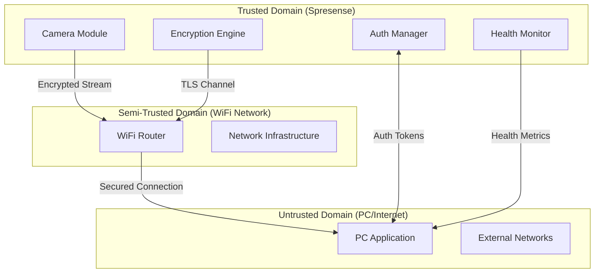
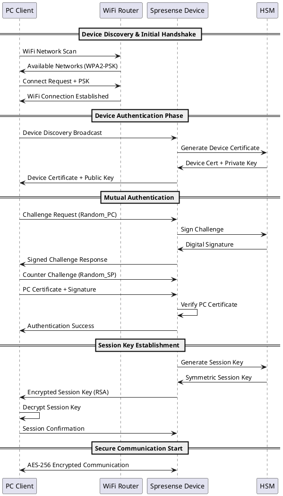

# Phase 9.2 セキュリティアーキテクチャ仕様書

**作成日**: 2026-01-23
**バージョン**: 1.0
**ステータス**: Phase 5 セキュリティ強化
**対象システム**: Spresense HDRカメラ防犯カメラシステム Phase 9.2

---

## 1. セキュリティアーキテクチャ概要

### 1.1 多層防御アーキテクチャ

```
┌─────────────────────────────────────────────────────────────┐
│                    Phase 9.2 Security Layers               │
├─────────────────────────────────────────────────────────────┤
│ L7: Application Security    │ JWT認証・権限制御・監査ログ    │
├─────────────────────────────────────────────────────────────┤
│ L6: Data Security          │ AES暗号化・完全性検証・鍵管理   │
├─────────────────────────────────────────────────────────────┤
│ L5: Session Security       │ TLS 1.3・証明書検証・セッション │
├─────────────────────────────────────────────────────────────┤
│ L4: Transport Security     │ TCP健全性監視・接続検証         │
├─────────────────────────────────────────────────────────────┤
│ L3: Network Security       │ WPA2-PSK・MAC認証・ファイアウォール │
├─────────────────────────────────────────────────────────────┤
│ L2: Device Security        │ セキュアブート・ファームウェア検証 │
├─────────────────────────────────────────────────────────────┤
│ L1: Hardware Security      │ 暗号化チップ・物理保護          │
└─────────────────────────────────────────────────────────────┘
```

### 1.2 信頼境界とセキュリティドメイン



---

## 2. コンポーネント別セキュリティ設計

### 2.1 Spresense セキュリティアーキテクチャ

#### セキュアハードウェア基盤
```c
// ハードウェアセキュリティモジュール (HSM)
typedef struct {
    uint8_t device_unique_key[32];    // デバイス固有鍵 (OTP領域)
    uint8_t root_cert[1024];          // ルート証明書
    uint32_t secure_boot_hash[8];     // セキュアブートハッシュ
    uint8_t hw_random_seed[16];       // ハードウェア乱数シード
} spresense_hsm_t;

// セキュリティコプロセッサ制御
typedef struct {
    bool crypto_engine_enabled;       // 暗号化エンジン有効化
    uint8_t key_slot_usage[8];       // 鍵スロット使用状況
    uint32_t crypto_operations_count; // 暗号操作カウンタ
    uint8_t tamper_detection_status; // 改ざん検知状態
} security_coprocessor_t;
```

#### メモリ保護機能
```c
// Phase 9.2 メモリセキュリティ
typedef enum {
    MEM_REGION_SECURE_CODE = 0,      // セキュアコード領域
    MEM_REGION_SECURE_DATA,          // セキュアデータ領域
    MEM_REGION_CRYPTO_KEYS,          // 暗号鍵領域
    MEM_REGION_USER_DATA,            // ユーザーデータ領域
    MEM_REGION_TEMP_BUFFER          // 一時バッファ領域
} memory_security_region_t;

// メモリ保護設定
typedef struct {
    uint32_t start_address;          // 開始アドレス
    uint32_t size;                   // 領域サイズ
    uint8_t access_permissions;      // アクセス権限 (RWX)
    uint8_t encryption_enabled;      // 暗号化有効
    uint32_t integrity_checksum;     // 完全性チェックサム
} memory_protection_config_t;
```

### 2.2 通信セキュリティレイヤー

#### TLS 1.3 実装アーキテクチャ
```c
// TLS 1.3 セキュリティコンテキスト
typedef struct {
    // ハンドシェイク情報
    uint8_t client_random[32];       // クライアント乱数
    uint8_t server_random[32];       // サーバー乱数
    uint8_t session_id[32];          // セッションID

    // 鍵情報
    uint8_t master_secret[48];       // マスターシークレット
    uint8_t client_write_key[32];    // クライアント書き込み鍵
    uint8_t server_write_key[32];    // サーバー書き込み鍵
    uint8_t client_iv[16];          // クライアントIV
    uint8_t server_iv[16];          // サーバーIV

    // 暗号スイート
    uint16_t cipher_suite;           // TLS_AES_256_GCM_SHA384
    uint8_t compression_method;      // 圧縮方式

    // セッション管理
    uint32_t handshake_timestamp;    // ハンドシェイク時刻
    uint32_t session_timeout;        // セッションタイムアウト
    uint8_t renegotiation_allowed;   // 再ネゴシエーション許可
} tls13_security_context_t;
```

#### 証明書チェーン検証
```c
// 証明書検証アーキテクチャ
typedef struct {
    uint8_t root_ca_cert[2048];      // ルートCA証明書
    uint8_t intermediate_certs[4096]; // 中間証明書チェーン
    uint8_t server_cert[1024];       // サーバー証明書
    uint32_t cert_expiry_dates[16];  // 証明書有効期限
    uint8_t revocation_list[1024];   // 失効リスト (CRL)
} certificate_chain_t;

// 証明書検証状態
typedef enum {
    CERT_STATUS_VALID = 0,
    CERT_STATUS_EXPIRED,
    CERT_STATUS_REVOKED,
    CERT_STATUS_INVALID_SIGNATURE,
    CERT_STATUS_UNTRUSTED_CA,
    CERT_STATUS_HOSTNAME_MISMATCH
} certificate_status_t;
```

### 2.3 データ暗号化アーキテクチャ

#### 暗号化パイプライン
```c
// Phase 9.2 暗号化パイプライン
typedef struct {
    // AES-256-GCM 設定
    uint8_t encryption_key[32];      // 暗号化鍵 (256bit)
    uint8_t authentication_key[32];  // 認証鍵 (256bit)
    uint64_t nonce_counter;         // ナンスカウンター

    // パイプライン状態
    uint32_t bytes_processed;       // 処理済みバイト数
    uint32_t blocks_encrypted;      // 暗号化済みブロック数
    uint32_t authentication_tags;   // 認証タグ数

    // 性能メトリクス
    uint32_t encryption_time_us;    // 暗号化時間 (μs)
    uint32_t throughput_mbps;       // スループット (Mbps)
    uint8_t cpu_usage_percent;      // CPU使用率
} encryption_pipeline_t;
```

#### 鍵管理システム
```c
// 暗号鍵ライフサイクル管理
typedef enum {
    KEY_STATE_GENERATION = 0,       // 鍵生成中
    KEY_STATE_ACTIVE,               // 使用中
    KEY_STATE_ROTATION_PENDING,     // ローテーション待ち
    KEY_STATE_DEPRECATED,           // 非推奨
    KEY_STATE_REVOKED              // 失効済み
} key_lifecycle_state_t;

typedef struct {
    uint8_t key_id;                 // 鍵ID
    key_lifecycle_state_t state;    // 鍵状態
    uint32_t creation_timestamp;    // 作成時刻
    uint32_t expiry_timestamp;      // 有効期限
    uint32_t usage_counter;         // 使用回数
    uint8_t key_material[64];       // 鍵マテリアル
    uint8_t key_hash[32];          // 鍵ハッシュ
} cryptographic_key_t;

// 鍵ローテーション管理
typedef struct {
    uint32_t rotation_interval;     // ローテーション間隔 (時間)
    uint8_t active_key_id;         // 現在の活性鍵ID
    uint8_t next_key_id;           // 次の鍵ID
    uint32_t last_rotation;        // 最終ローテーション時刻
    uint8_t rotation_in_progress;  // ローテーション進行中フラグ
} key_rotation_manager_t;
```

---

## 3. セキュリティプロトコル仕様

### 3.1 認証・認可プロトコル

#### デバイス認証シーケンス


#### JWT認証トークン構造
```c
// Phase 9.2 JWT認証実装
typedef struct {
    // JWT Header
    char algorithm[8];              // "HS256"
    char token_type[8];            // "JWT"

    // JWT Payload
    char subject[32];              // デバイスID
    uint32_t issued_at;            // 発行時刻 (Unix timestamp)
    uint32_t expiration;           // 有効期限
    uint8_t permissions[8];        // 権限ビットマスク
    char issuer[32];              // 発行者識別子

    // JWT Signature
    uint8_t signature[32];         // HMAC-SHA256署名
} jwt_auth_token_t;

// トークン検証結果
typedef enum {
    JWT_VALID = 0,
    JWT_EXPIRED,
    JWT_INVALID_SIGNATURE,
    JWT_MALFORMED,
    JWT_INSUFFICIENT_PERMISSIONS
} jwt_validation_result_t;
```

### 3.2 暗号化通信プロトコル

#### セキュアMJPEGストリーミング
```c
// Phase 9.2 セキュアストリーミングプロトコル
typedef struct __attribute__((packed)) {
    // プロトコルヘッダ
    uint16_t magic;                // 0x534D (SM: Secure MJPEG)
    uint8_t version;               // プロトコルバージョン: 0x02
    uint8_t flags;                 // フラグ (圧縮・暗号化等)

    // セキュリティヘッダ
    uint32_t sequence_number;      // シーケンス番号 (リプレイ攻撃対策)
    uint64_t timestamp_us;         // タイムスタンプ (μs精度)
    uint8_t key_id;               // 暗号鍵ID
    uint8_t cipher_suite;         // 暗号スイート識別子

    // フレームヘッダ
    uint32_t frame_length;        // フレーム長 (暗号化後)
    uint32_t original_length;     // 元フレーム長 (暗号化前)
    uint16_t frame_type;          // フレームタイプ (I/P)
    uint16_t quality_factor;      // JPEG品質係数

    // 暗号化パラメータ
    uint8_t iv[16];              // AES初期化ベクター
    uint8_t auth_tag[16];        // GCM認証タグ

    // 健全性監視データ (Phase 9.2拡張)
    uint32_t tcp_health_rtt_us;   // TCP RTT (μs)
    uint16_t tcp_health_retrans;  // 再送回数
    uint8_t tcp_health_score;     // 健全性スコア (0-100)
    uint8_t security_alert_level; // セキュリティアラートレベル

    // 暗号化ペイロード
    uint8_t encrypted_payload[];  // AES-256-GCM暗号化MJPEGデータ
} secure_mjpeg_packet_t;
```

#### メタデータセキュリティ
```c
// セキュアメタデータ構造
typedef struct __attribute__((packed)) {
    // メタデータヘッダ
    uint16_t metadata_type;       // メタデータタイプ
    uint16_t metadata_length;     // メタデータ長
    uint32_t creation_timestamp;  // 作成時刻

    // セキュリティ情報
    uint8_t integrity_hash[32];   // SHA-256完全性ハッシュ
    uint8_t creator_signature[64]; // 作成者署名

    // カメラパラメータ (暗号化)
    struct {
        uint16_t resolution_width;
        uint16_t resolution_height;
        uint8_t fps;
        uint8_t compression_ratio;
        uint32_t exposure_time;
        uint16_t iso_sensitivity;
    } encrypted_camera_params;

    // 位置情報 (オプション・暗号化)
    struct {
        double latitude;           // 緯度
        double longitude;          // 経度
        uint16_t altitude;         // 高度
        uint8_t privacy_mask;     // プライバシー保護レベル
    } encrypted_location_data;
} secure_metadata_t;
```

---

## 4. セキュリティ監視アーキテクチャ

### 4.1 リアルタイム脅威検知

#### 異常検知エンジン
```c
// Phase 9.2 脅威検知システム
typedef struct {
    // 統計的異常検知
    double baseline_auth_rate;     // ベースライン認証レート
    double current_auth_rate;      // 現在の認証レート
    double deviation_threshold;    // 偏差閾値

    // パターンマッチング
    uint32_t failed_login_window;  // 失敗ログイン監視ウィンドウ
    uint8_t failed_login_threshold; // 失敗回数閾値
    uint32_t source_ip_blacklist[64]; // IP黒リスト

    // 行動分析
    uint32_t normal_session_duration; // 通常セッション時間
    uint32_t unusual_access_patterns; // 異常アクセスパターン数
    uint8_t risk_score;           // リスクスコア (0-100)
} threat_detection_engine_t;

// アラート生成
typedef struct {
    uint32_t alert_id;            // アラートID
    uint8_t severity_level;       // 重要度 (1:Info - 5:Critical)
    uint32_t detection_timestamp; // 検知時刻
    char threat_description[128]; // 脅威詳細
    uint32_t source_ip;          // 送信元IP
    uint8_t confidence_score;     // 信頼度スコア (0-100)
    uint8_t auto_response_taken; // 自動対応実施フラグ
} security_alert_t;
```

#### セキュリティダッシュボード
```c
// セキュリティ監視ダッシュボード
typedef struct {
    // リアルタイム統計
    uint32_t active_connections;   // アクティブ接続数
    uint32_t auth_attempts_1h;     // 1時間の認証試行数
    uint32_t security_events_24h;  // 24時間のセキュリティイベント
    uint8_t overall_threat_level; // 総合脅威レベル

    // パフォーマンス指標
    uint32_t encryption_ops_per_sec; // 暗号化操作/秒
    uint8_t cpu_security_overhead;   // セキュリティCPUオーバーヘッド
    uint32_t memory_secure_usage;    // セキュア領域メモリ使用量

    // 健全性指標 (Phase 9.2)
    uint32_t tcp_health_score;     // TCP健全性スコア
    uint32_t ssl_handshake_time;   // SSL/TLSハンドシェイク時間
    uint8_t certificate_status;   // 証明書状態
} security_dashboard_t;
```

### 4.2 ログ・監査アーキテクチャ

#### セキュリティログ管理
```c
// 構造化セキュリティログ
typedef struct {
    // ログエントリヘッダ
    uint32_t log_entry_id;        // ログエントリID
    uint32_t timestamp;           // タイムスタンプ (Unix)
    uint16_t microseconds;        // マイクロ秒精度
    uint8_t log_level;           // ログレベル (DEBUG-FATAL)
    uint8_t component_id;        // コンポーネント識別子

    // セキュリティ固有情報
    uint8_t event_category;       // イベントカテゴリ
    uint32_t user_session_id;     // ユーザーセッションID
    uint32_t source_ip;          // 送信元IPアドレス
    uint16_t source_port;        // 送信元ポート

    // ログデータ
    char message[256];           // ログメッセージ
    uint8_t binary_data[512];    // バイナリデータ (オプション)

    // 完全性保護
    uint8_t log_hash[32];        // SHA-256ログハッシュ
    uint8_t chain_hash[32];      // チェーンハッシュ (改ざん検知)
} security_log_entry_t;

// ログローテーション・アーカイブ
typedef struct {
    uint32_t max_log_size;        // 最大ログサイズ (bytes)
    uint32_t retention_period;    // 保持期間 (日数)
    uint8_t compression_enabled; // 圧縮有効フラグ
    uint8_t encryption_enabled;  // 暗号化有効フラグ
    char archive_location[128];  // アーカイブ場所
} log_rotation_config_t;
```

---

## 5. インシデント対応アーキテクチャ

### 5.1 自動対応システム

#### 脅威自動緩和
```c
// Phase 9.2 自動セキュリティ対応
typedef struct {
    // 自動対応ポリシー
    uint8_t auto_block_enabled;   // 自動ブロック有効
    uint32_t block_duration_sec;  // ブロック期間 (秒)
    uint8_t escalation_threshold; // エスカレーション閾値

    // 対応アクション
    uint8_t connection_quarantine; // 接続隔離
    uint8_t credential_lockout;    // 認証情報ロックアウト
    uint8_t rate_limiting;        // レート制限強化
    uint8_t admin_notification;   // 管理者通知

    // 復旧手順
    uint32_t auto_recovery_timeout; // 自動復旧タイムアウト
    uint8_t manual_intervention_req; // 手動介入要求
} automated_response_policy_t;

// インシデント記録
typedef struct {
    uint32_t incident_id;         // インシデントID
    uint32_t detection_time;      // 検知時刻
    uint32_t response_time;       // 対応時刻
    uint32_t resolution_time;     // 解決時刻

    char incident_type[64];       // インシデントタイプ
    uint8_t severity_level;       // 重要度
    char description[512];        // 詳細説明
    char response_actions[256];   // 対応アクション
    char lessons_learned[256];    // 学習事項
} incident_record_t;
```

### 5.2 フォレンジック対応

#### デジタル証拠保全
```c
// デジタル証拠保全システム
typedef struct {
    // 証拠チェーン
    uint32_t evidence_id;         // 証拠ID
    uint32_t collection_timestamp; // 収集時刻
    char collector_identity[64];  // 収集者ID
    uint8_t evidence_hash[32];    // 証拠ハッシュ

    // メタデータ
    uint32_t file_size;          // ファイルサイズ
    char file_type[32];          // ファイルタイプ
    char collection_method[64];  // 収集方法
    char storage_location[128];  // 保存場所

    // 完全性検証
    uint8_t digital_signature[64]; // デジタル署名
    char witness_info[128];      // 立会者情報
    uint8_t chain_of_custody[256]; // 管理の連鎖記録
} digital_evidence_t;
```

---

## 6. セキュリティ性能最適化

### 6.1 暗号化性能アーキテクチャ

#### ハードウェアアクセラレーション
```c
// Phase 9.2 暗号化性能最適化
typedef struct {
    // ハードウェアエンジン
    bool aes_hw_acceleration;     // AESハードウェア高速化
    bool sha_hw_acceleration;     // SHAハードウェア高速化
    bool rng_hw_acceleration;     // 乱数生成ハードウェア高速化

    // パフォーマンス指標
    uint32_t encryption_throughput; // 暗号化スループット (MB/s)
    uint32_t decryption_throughput; // 復号化スループット (MB/s)
    uint32_t hash_ops_per_second;   // ハッシュ操作/秒

    // CPU使用率最適化
    uint8_t crypto_cpu_usage;     // 暗号処理CPU使用率
    uint8_t background_cpu_usage; // バックグラウンド処理使用率
    uint32_t crypto_cache_hits;   // 暗号処理キャッシュヒット数
} crypto_performance_t;
```

### 6.2 セキュリティオーバーヘッド最小化

#### 効率的セキュリティプロトコル
```c
// 軽量セキュリティプロトコル実装
typedef struct {
    // プロトコル最適化
    uint8_t header_compression;   // ヘッダー圧縮
    uint8_t bulk_encryption;      // バルク暗号化
    uint8_t session_reuse;        // セッション再利用

    // バッファ最適化
    uint32_t crypto_buffer_size;  // 暗号処理バッファサイズ
    uint8_t zero_copy_enabled;   // ゼロコピー有効
    uint32_t dma_transfer_size;  // DMA転送サイズ

    // 並列処理
    uint8_t parallel_crypto_streams; // 並列暗号ストリーム数
    uint8_t async_operations;    // 非同期操作有効
} security_optimization_t;
```

---

## 7. セキュリティ設定管理

### 7.1 セキュリティポリシー設定

#### 設定階層構造
```yaml
# Phase 9.2 セキュリティ設定階層
SecurityPolicy:
  global_settings:
    security_level: "high"        # low/medium/high/maximum
    compliance_mode: "strict"     # relaxed/standard/strict
    audit_logging: true

  authentication:
    jwt_expiry_hours: 24
    max_failed_attempts: 3
    lockout_duration_minutes: 15
    multi_factor_enabled: true

  encryption:
    algorithm: "AES-256-GCM"
    key_rotation_days: 30
    tls_version: "1.3"
    cipher_suites: ["TLS_AES_256_GCM_SHA384"]

  network:
    allowed_ip_ranges: ["192.168.1.0/24"]
    blocked_countries: ["CN", "RU", "KP"]
    rate_limiting:
      requests_per_minute: 60
      burst_limit: 10

  monitoring:
    real_time_alerts: true
    threat_detection: true
    behavioral_analysis: true
    log_retention_days: 365
```

### 7.2 セキュリティプロファイル

#### 動的セキュリティ適応
```c
// 適応型セキュリティプロファイル
typedef struct {
    // 脅威レベル別設定
    struct {
        uint8_t encryption_strength;  // 暗号強度 (128/256bit)
        uint8_t auth_frequency;      // 認証頻度
        uint8_t logging_verbosity;   // ログ詳細度
        uint32_t session_timeout;    // セッションタイムアウト
    } threat_level_config[5];       // LOW-CRITICAL

    // 環境適応設定
    struct {
        uint8_t mobile_optimized;    // モバイル最適化
        uint8_t low_bandwidth_mode;  // 低帯域モード
        uint8_t battery_conscious;   // バッテリー配慮
        uint8_t performance_priority; // 性能優先
    } environment_adaptation;

    // 現在の適用プロファイル
    uint8_t active_threat_level;    // 現在の脅威レベル
    uint8_t active_environment;     // 現在の環境設定
    uint32_t profile_switch_time;   // プロファイル切替時刻
} adaptive_security_profile_t;
```

---

## 8. セキュリティテスト・検証アーキテクチャ

### 8.1 自動セキュリティテスト

#### 継続的セキュリティ検証
```c
// Phase 9.2 自動セキュリティテストフレームワーク
typedef struct {
    // テストカテゴリ
    bool penetration_tests;       // ペネトレーションテスト
    bool vulnerability_scans;     // 脆弱性スキャン
    bool compliance_checks;       // コンプライアンスチェック
    bool performance_security;    // セキュリティ性能テスト

    // テスト実行制御
    uint32_t test_interval_hours; // テスト実行間隔
    uint8_t test_intensity_level; // テスト強度レベル
    bool production_safe_mode;    // 本番環境安全モード

    // 結果管理
    uint32_t last_test_timestamp; // 最終テスト実行時刻
    uint8_t overall_security_score; // 総合セキュリティスコア
    uint32_t vulnerabilities_found; // 発見脆弱性数
    uint32_t false_positives;     // 偽陽性数
} automated_security_testing_t;
```

---

**Phase 9.2セキュリティアーキテクチャ仕様書 完成**

このアーキテクチャ仕様書は、Phase 9.2システムの包括的なセキュリティ設計を提供し、多層防御アプローチと実装詳細を含んでいます。

**次のステップ**: セキュリティ実装仕様書、セキュリティテスト計画の策定