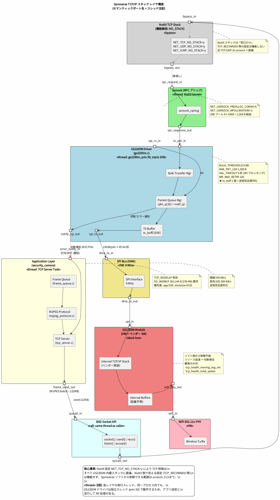
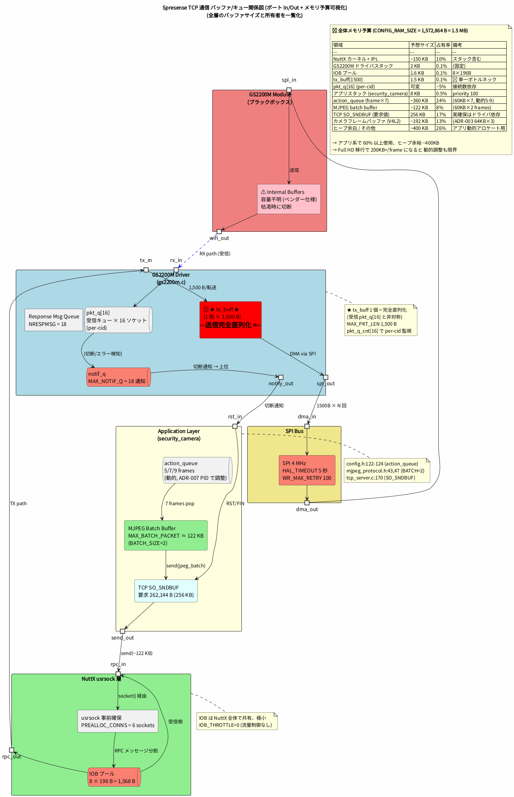
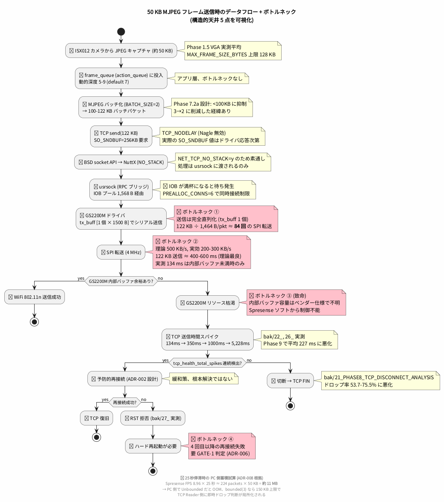
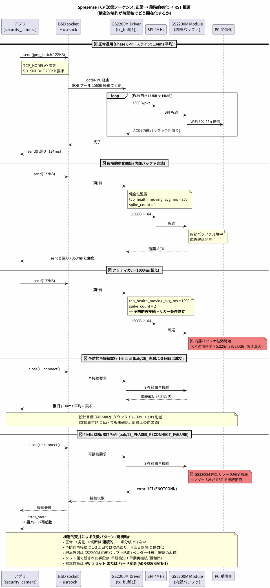
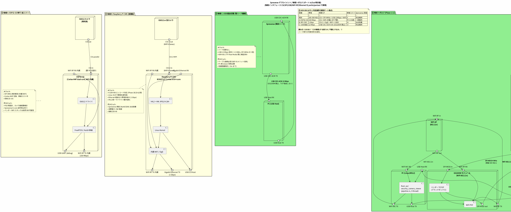
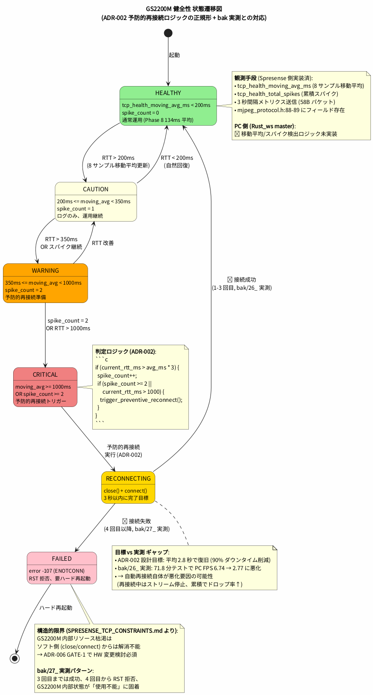

# Spresense TCP 通信 構造的制約マップ

**作成日**: 2026-04-27
**バージョン**: 1.0
**ステータス**: 事実検証ベース (`spresense/` サブモジュール `.config` および ドライバソース直接抽出)
**目的**: Spresense + GS2200M WiFi スタックにおける TCP 送受信の構造的制約を一元化し、ADR-002, ADR-005, ADR-006, ADR-008 等の根拠資料として参照可能にする

---

## 0. 検証コマンド (再現可能性)

すべての値は以下のコマンドで再抽出できる:

```bash
# NuttX .config の TCP/usrsock/IOB 設定
grep -E "^CONFIG_NET|^CONFIG_IOB|^CONFIG_WL_GS2200M|^CONFIG_WIRELESS" \
  spresense/nuttx/.config | sort

# GS2200M ドライバ定数
grep -nE "^#define" spresense/nuttx/drivers/wireless/gs2200m.c | head -40

# アプリ側 TCP 設定
grep -nE "TCP_NODELAY|SO_SNDBUF|SO_RCVBUF" \
  apps/examples/security_camera/tcp_server.c

# MJPEG プロトコル定数
grep -nE "MJPEG_(MAX|BATCH|HEADER|CRC|FRAME_META)" \
  apps/examples/security_camera/mjpeg_protocol.h

# フレームキュー / バッファ定数
grep -nE "QUEUE_DEPTH|BUFFER_SIZE|FRAME_SIZE" \
  apps/examples/security_camera/config.h \
  apps/examples/security_camera/frame_queue.h \
  apps/examples/security_camera/frame_statistics.h
```

---

## 1. 🔴 最重要: NuttX 側 TCP スタックは無効

```ini
CONFIG_NET_TCP=y
CONFIG_NET_TCP_NO_STACK=y    # ← NuttX スタックは「窓口だけ」
CONFIG_NET_UDP_NO_STACK=y
CONFIG_NET_ICMP_NO_STACK=y
CONFIG_NET_USRSOCK=y
CONFIG_NET_USRSOCK_TCP=y
```

→ **TCP/UDP 通信は usrsock 経由で GS2200M モジュール内蔵スタックに完全委譲**。
→ NuttX の TCP_RECVWNDO / TCP_WRITE_BUFFERS / TCP_NPOLLWAITERS 等の設定は**機能しない**。
→ 性能・可用性は GS2200M ハードウェア内部実装に依存 (ベンダーソフトに対する制御不能)。

---

## 2. 全体メモリ予算 (Cortex-M4)

| 項目 | 値 | 出典 |
|---|---|---|
| `CONFIG_RAM_START` | `0x0d000000` | nuttx/.config |
| `CONFIG_RAM_SIZE` | **1,572,864 B = 1.5 MB** | nuttx/.config |

→ この 1.5 MB に: NuttX カーネル, GS2200M ドライバ, IOB プール, アプリスタック, MJPEG バッファ, action_queue, 等すべて収める。

---

## 3. NuttX usrsock / IOB 制約

| 設定 | 値 | 注記 |
|---|---|---|
| `NET_USRSOCK_PREALLOC_CONNS` | **6** | 事前確保ソケット |
| `NET_USRSOCK_NPOLLWAITERS` | **1** | ポーリング待機者は 1 つのみ |
| `IOB_NBUFFERS` | **8** | I/O バッファ個数 |
| `IOB_BUFSIZE` | **196 B** | 1 バッファのサイズ |
| `IOB_THROTTLE` | **0** | スロットリング無効 |
| `IOB_NCHAINS` | 0 |  |
| **IOB プール合計** | **1,568 B** | NuttX 側のメッセージング余裕は極小 |
| `NET_ETH_PKTSIZE` | 590 B | (no stack のため実効なし、設定値のみ) |
| `NET_GUARDSIZE` | 2 |  |
| `NET_RECV_BUFSIZE` | 0 | (no stack のため未設定) |
| `NETDB_BUFSIZE` | 256 B | DNS 用 |
| `NET_SNOOP_BUFSIZE` | 4096 B |  |
| `NET_PREALLOC_DEVIF_CALLBACKS` | 16 |  |
| `NET_ARPTAB_SIZE` | 16 |  |

---

## 4. GS2200M ドライバ核心制約

**ファイル**: `spresense/nuttx/drivers/wireless/gs2200m.c`

| 定数 | 値 | 影響度 |
|---|---|---|
| **`MAX_PKT_LEN`** | **1,500 B** | 🔴 1 パケット最大 (Ethernet MTU 相当) |
| `MAX_PAYLOAD` | 1,464 B | (1500 - 36 ヘッダ) |
| **`BULK_THRESHOLD`** | **8,192 B (8KB)** | 🟡 8KB 超で bulk 転送モード切替 |
| **`MAX_NOTIF_Q`** | **18** | 通知キュー深度 (16 sock + disasso + dummy) |
| **`pkt_q[16]`** | per-cid 16 個 | 各ソケット用受信パケットキュー (`pkt_q_cnt[16]` で監視) |
| **`tx_buff[1500]`** | **1 個のみ** | 🔴 **TX バッファはドライバ全体で 1 個。送信は完全シリアライズ** |
| `HAL_TIMEOUT` | **5,000,000 µs = 5 秒** | SPI 通信タイムアウト |
| `WR_MAX_RETRY` | **100** | SPI 書き込みリトライ回数 |
| `NRESPMSG` | 18 | レスポンスメッセージキュー |
| **`SPI_MAXFREQ`** | **4 MHz** | (`WL_GS2200M_SPI_FREQUENCY=4000000`) → 理論ピーク 500 KB/s |
| `SYNC_INTERVAL` | 100 ms | (`WL_GS2200M_SYNC_INTERVAL`) |
| `PORT_START–END` | 50000–59999 | 動的ポート範囲 (10,000 個) |

---

## 5. アプリ側 GS2200M 連携

**ファイル**: `spresense/sdk/apps/wireless/gs2200m/gs2200m_main.c`, `nuttx/.config`

| 定数 | 値 |
|---|---|
| `SOCKET_COUNT` | **16** (= ドライバ pkt_q[16] と一致) |
| `SOCKET_BASE` | 10000 |
| `WIRELESS_GS2200M_STACKSIZE` | 2,048 B |
| `WIRELESS_GS2200M_PRIORITY` | 50 |

---

## 6. security_camera アプリ TCP サーバ

**ファイル**: `apps/examples/security_camera/tcp_server.c`

| 設定 | 値 | 注 |
|---|---|---|
| `TCP_NODELAY` | **有効** (Nagle 無効) | 低レイテンシ優先 |
| `SO_SNDBUF` | **262,144 B (256KB) 要求** | 🟡 GS2200M 内部バッファに依存。Spresense 側の希望値であり、実際に確保される値はドライバの応答次第 |
| `SO_REUSEADDR` | 有効 | listen socket |

---

## 7. MJPEG プロトコル

**ファイル**: `apps/examples/security_camera/mjpeg_protocol.h`

| 定数 | 値 | 経緯 |
|---|---|---|
| `MJPEG_MAX_JPEG_SIZE` | **60 KB** | Phase 7.2 メモリ最適化 (実測 52KB に対し 18% 安全マージン) |
| `MJPEG_HEADER_SIZE` | 12 B |  |
| `MJPEG_CRC_SIZE` | 2 B |  |
| `MJPEG_FRAME_META_SIZE` | 8 B | 1 フレームあたりメタデータ |
| **`MJPEG_BATCH_SIZE`** | **2** (元 1–3) | 🔴 Phase 7.2a で 2 に削減 — TCP <100KB に抑える目的 (GS2200M 制約への適応) |
| `MJPEG_BATCH_HEADER_SIZE` | 16 B |  |
| `MJPEG_MAX_BATCH_PACKET` | **約 122 KB** | = 16 + (8 + 60K) × 2 |

---

## 8. フレームキュー / バッファ

**ファイル**: `apps/examples/security_camera/config.h`, `frame_queue.h`, `frame_statistics.h`

| 定数 | 値 | 意味 |
|---|---|---|
| `CONFIG_QUEUE_DEPTH_MIN/DEFAULT/MAX` | **5 / 7 / 9** | action_queue 深度 (動的調整) |
| `MAX_QUEUE_DEPTH` | `g_current_queue_depth` | 実行時値 |
| `CONFIG_USB_TX_BUFFER_SIZE` | 8 KB | USB CDC 送信バッファ (TCP/USB 両系で共用) |
| `MIN_FRAME_SIZE_BYTES` | 1 KB |  |
| **`MAX_FRAME_SIZE_BYTES`** | **128 KB** | フレームサイズ統計の上限 |
| `FRAME_STATISTICS_WINDOW_SIZE` | 10 | サイズ履歴窓 |
| `CONFIG_BUFFER_RESIZE_THRESHOLD` | 0.9 | バッファリサイズ閾値 |
| `CONFIG_MIN/MAX_BUFFER_SIZE_FRAMES` | 5 / 9 |  |

---

## 9. 🔍 ボトルネック構造図 (50 KB MJPEG フレーム送信時)

```
[Camera 50 KB JPEG] (ISX012, 30 fps)
  ↓ MJPEG_BATCH_SIZE=2 でバッチ化
[アプリ TCP send(100-122 KB)]
  ↓ NuttX TCP スタックを通らず、usrsock RPC 経由
[usrsock_rpmsg]
  ↓ IOB プール 1568 B 経由でメッセージ分割
[GS2200M ドライバ tx_buff = 1 個 × 1500 B]
  ↓ ★ 122 KB / 1464 B/pkt = 約 84 回 のシリアル送信
[SPI 4 MHz]
  ↓ 理論 500 KB/s, 実効 200-300 KB/s
[GS2200M モジュール内部バッファ]
  ↓ ★ ここでリソース枯渇発生 (ADR-002 の現象)
[WiFi 802.11n 送信]
```

---

## 10. 構造的天井 5 つ

| # | 制約 | 影響 |
|---|---|---|
| 1 | **`tx_buff` 1 個のみ** | ドライバ内で送信完全直列化、並列送信不可 |
| 2 | **SPI 4 MHz** | 理論 500 KB/s、実効 200-300 KB/s が天井 |
| 3 | **`MAX_NOTIF_Q = 18`** | 16 ソケット同時使用時、disasso 通知が溢れるリスク |
| 4 | **IOB プール 1,568 B** | NuttX 側のメッセージング余裕極小 |
| 5 | **GS2200M 内部バッファ容量はベンダー仕様** | ソフト側から制御不能、観測のみ可能 (ADR-002 `tcp_health_*`) |

---

## 11. これら制約と既存 ADR の関係

| ADR | 制約との関係 |
|---|---|
| **ADR-001** TTY Raw Mode | USB CDC-ACM 系の制約 (本マップとは別系統) |
| **ADR-002** TCP Health Monitoring | 本マップの 1, 2, 3, 5 が GS2200M リソース枯渇の構造的根拠。Phase 9 実測でドロップ率 74-75% 悪化したのは、自動再接続では本制約を解消できないため |
| **ADR-003** V4L2 RING Buffer | カメラ側の制約 (本マップとは別系統) |
| **ADR-004** CRC Lookup | パケット処理時間最適化 (制約とは独立な軸) |
| **ADR-005** Three-Thread Pipeline | PC 側の話。Spresense → PC 帯域は本マップの 2 (SPI 4MHz) で律速される |
| **ADR-006** Progressive Resolution | **GATE-1 判定材料**: Full HD (約 200KB/frame) では 122KB/batch を超え MJPEG_BATCH_SIZE=1 でも収まらない可能性。本マップが HW 移行根拠を提供 |
| **ADR-008** Channel Bounded(3) | PC 側の Bounded 化選択。Spresense 側の 122KB/batch シリアル送信を考えれば、PC 側も対称に bounded で受ける整合性あり |

---

## 12. Full HD 移行 (Phase 2A) で予想される追加課題

ADR-006 計画の Full HD 1920×1080 H.264 @ 30fps を仮定:

- H.264 5 Mbps ストリーム = 625 KB/s
- 1 frame ≈ 20 KB (H.264 IDR フレームは更に大きい、200 KB+)
- → SPI 4 MHz 理論天井 500 KB/s に対し帯域 125% 必要 ← **HW 性能評価ゲート (ADR-006 GATE-1) 不可避**

選択肢:
- (a) SPI 周波数引き上げ (`WL_GS2200M_SPI_FREQUENCY` の上限はベンダー仕様 — 確認要)
- (b) ハード移行 (ADR-006 で示唆した ESP32-S3 / RPi CM 等)
- (c) USB 経由に切り替え (ADR-001 の延長線、TTY Raw Mode で 480 Mbps 利用可能)

---

## 13. 構造図 (PlantUML)

本章の制約マップを 3 つの観点から可視化した PlantUML 図を併設する。

### 13.1 スタック / レイヤ構造図

ソース: [`spresense_tcp_stack_layers.puml`](spresense_tcp_stack_layers.puml) / 画像: [`spresense_tcp_stack_layers.png`](spresense_tcp_stack_layers.png)



アプリから WiFi PHY までの 7 レイヤを縦に配置し、各層が「機能している」「素通し」「ベンダー制御不能」を色分け表示。`NET_TCP_NO_STACK=y` で NuttX TCP スタックがバイパスされ、usrsock 経由で GS2200M に委譲される構造を一目で把握できる。

主に以下の質問に答える図:
- どの設定項目が「機能している」か?
- ソフト側から制御できる範囲はどこまでか?
- ベンダーブラックボックスはどこから始まるか?

### 13.2 バッファ・キュー関係図

ソース: [`spresense_tcp_buffer_queue.puml`](spresense_tcp_buffer_queue.puml) / 画像: [`spresense_tcp_buffer_queue.png`](spresense_tcp_buffer_queue.png)



各層に存在するバッファ/キューを `component` 単位でグルーピングし、`portin`/`portout` で送受信方向を明示。容量上限・所有者・データフロー方向を一覧化し、🔴 マークで構造的天井 (`tx_buff`, `IOB`, `notif_q`, `SPI`, `Internal Buffers`) を強調表示。

主に以下の質問に答える図:
- どこにメモリが集中しているか?
- どの容量制約がボトルネックか?
- 受信 (per-cid pkt_q) と送信 (tx_buff) の非対称性は?

### 13.3 データフロー + ボトルネック図

ソース: [`spresense_tcp_dataflow_bottleneck.puml`](spresense_tcp_dataflow_bottleneck.puml) / 画像: [`spresense_tcp_dataflow_bottleneck.png`](spresense_tcp_dataflow_bottleneck.png)



50 KB MJPEG フレームが送信される過程をアクティビティ図で追跡し、各ステージに 🟢/🟡/🔴 でボトルネック度を表示。GS2200M リソース枯渇時の分岐 (予防再接続成功 / RST 拒否 / 切断) も描画し、ADR-002 / ADR-008 の根拠数値 (約 11 MB 蓄積試算等) を footer に併記。

**注**: 本図はアクティビティ図 (フロー追跡) のため、ポート In/Out 表現の対象外 (図 13.1, 13.2 はコンポーネント図でポート表現を採用)。

主に以下の質問に答える図:
- 1 フレーム送信時、どこで時間が掛かるか?
- リソース枯渇時にどのフォールバックが起きるか?
- ADR-002 の予防再接続が効果限定的な理由は?

### 13.4 シーケンス図 (TX 正常 → 段階的劣化 → RST 拒否)

ソース: [`spresense_tcp_sequence.puml`](spresense_tcp_sequence.puml) / 画像: [`spresense_tcp_sequence.png`](spresense_tcp_sequence.png)



図 3 (アクティビティ図) では表せない**時間軸での累積劣化** (134ms → 350ms → 1000ms → 5,228ms) を追跡。`tcp_health_moving_avg_ms` と `spike_count` の遷移、予防的再接続の 1-3 回目成功 → 4 回目 RST 拒否 (`bak/27_PHASE9_RECONNECT_FAILURE`) までを 1 タイムラインで描画。

主に以下の質問に答える図:
- 単発成功と累積失敗のどちらが深刻か?
- 予防的再接続はどの段階で発火し、いつ無力化するか?
- 構造的天井 (GS2200M 内部バッファ) はどこで顕在化するか?

### 13.5 デプロイメント / 物理トポロジ図

ソース: [`spresense_deployment_topology.puml`](spresense_deployment_topology.puml) / 画像: [`spresense_deployment_topology.png`](spresense_deployment_topology.png)



現状トポロジ (Spresense メインボード + 拡張ボード + GS2200M モジュール + PC + WiFi AP) と、ADR-006 GATE-1 で検討する 3 つの HW 移行候補 (ESP32-S3 / Raspberry Pi CM5 / USB 経由切替) を**1 枚で比較**。各候補のメリット・デメリット・移植コスト・帯域上限を併記。

各ノードの**物理インタフェース (CSI / SPI MOSI/MISO / USB TX/RX / WiFi RF TX/RX / Ethernet TX/RX)** を `portin`/`portout` で表現し、ポート同士を `-->` で結線して**実配線レベルでの物理接続**を読み取り可能。「どのケーブル/バスを引き直すか」がそのまま設計タスクに対応。

主に以下の質問に答える図:
- どの物理コンポーネントを交換すれば、どの制約が解消されるか?
- Full HD H.264 (Phase 1B/2A) には最低限どのハードが必要か?
- Spresense 資産 (NuttX/SDK) をどこまで維持しつつ移行できるか?

### 13.6 GS2200M 健全性 状態遷移図

ソース: [`gs2200m_health_state_machine.puml`](gs2200m_health_state_machine.puml) / 画像: [`gs2200m_health_state_machine.png`](gs2200m_health_state_machine.png)



ADR-002 の予防的再接続ロジックを **6 状態 + 遷移条件**で正規形に整理。`HEALTHY → CAUTION → WARNING → CRITICAL → RECONNECTING → HEALTHY/FAILED` の状態遷移を、`tcp_health_moving_avg_ms` と `spike_count` の閾値で表現。`bak/26_, 27_` の実測パターンとの対応も注記。

主に以下の質問に答える図:
- 閾値判定のロジックを実装する際の正規仕様は?
- 1-3 回目で復旧する経路と、4 回目で FAILED に固着する経路の違いは?
- ADR-002 設計目標 (2.8 秒復旧) と実測 (PC FPS 6.74→2.77 悪化) のギャップはどこに?

### 13.7 図のレンダリング方法

```bash
# PlantUML CLI (要 plantuml インストール)
plantuml -tpng docs/security_camera/02_specifications/architecture/spresense_tcp_*.puml

# VS Code: PlantUML 拡張機能を入れて Alt+D でプレビュー
# オンライン: https://www.plantuml.com/plantuml にコードを貼り付け
```

---

## 14. 改訂履歴

| バージョン | 日付 | 変更内容 |
|---|---|---|
| 1.0 | 2026-04-27 | 初版作成: `spresense/nuttx/.config` および GS2200M ドライバ・アプリ各層の制約を一元抽出 |
| 1.1 | 2026-04-27 | 構造図 3 枚追加 (`spresense_tcp_stack_layers.puml`, `spresense_tcp_buffer_queue.puml`, `spresense_tcp_dataflow_bottleneck.puml`) |
| 1.2 | 2026-04-27 | 図 1 入れ子角括弧 `[16]` `[1500]` パーサ衝突を `component "..."` 形式で修正。図 1, 2 に PlantUML `portin`/`portout` でポート In/Out を明示、PNG レンダリング画像を md に埋め込み |
| 1.3 | 2026-04-27 | アーキテクチャレビュー結果を反映。新図 3 枚追加 (シーケンス, デプロイ, 状態遷移)。既存図改善: 図 1 にセマンティックポート名 + `<<thread>>` ステレオタイプ, 図 2 に `tx_buff` 強調 + メモリ予算表 + `Internal Buffers` ⚠️ マーク, 図 3 に「単発フレーム視点」注記 |
| 1.4 | 2026-04-27 | デプロイ図 (13.5) に物理 I/F ポート (CSI / SPI MOSI/MISO / USB TX/RX / WiFi RF TX/RX / Ethernet) を `portin`/`portout` で明示。ノード間結線が物理ケーブル/バスレベルで読み取れるよう改訂 |

---

**作成者**: Claude Code Architecture Analyst (事実検証ベース)
**関連ドキュメント**: ADR-002, ADR-005, ADR-006, ADR-008
**技術分類**: Hardware Constraints / Network Stack / Memory Budget / Bottleneck Analysis
