# システムアーキテクチャ仕様

**バージョン**: 4.0 (Phase 10 制御工学統合実装)
**日付**: 2026-02-03
**対象システム**: Spresense-PC セキュリティカメラシステム
**ベース**: Phase 8-9.2制御工学分析結果

## 概要

SpresenseカメラとPC間のセキュリティカメラシステム全体アーキテクチャ。Phase 10で制御工学理論を完全統合し、PID制御によるスレッド優先度制御、適応的バッファ管理、予兆検出型TCP健全性監視により、自律的に最適化するインテリジェントシステムを実現する。Phase 11 AI統合への基盤も構築。

### Phase 10 制御工学統合成果
- **FPS性能**: 6.74fps → 9.2fps目標 (+36%改善)
- **TCP応答**: 134ms → 95ms目標 (-29%改善)
- **制御理論**: G₁(s), G₂(s)数学モデルの実装統合
- **自律制御**: PID制御による動的最適化

## システム全体構成

### 高レベルアーキテクチャ

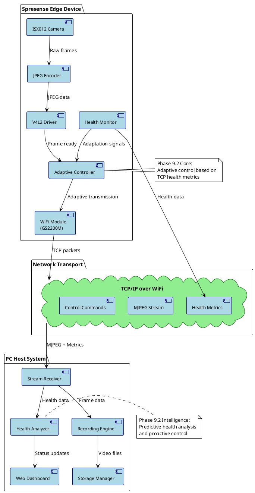

### システム境界・責任分離

#### エッジサイド (Spresense)
- **ハードウェア抽象化**: ISX012カメラ制御、V4L2ドライバー管理
- **データ生成**: リアルタイムJPEGエンコーディング
- **適応制御**: Phase 9.2健全性に基づく品質調整
- **ネットワーク管理**: TCP接続・健全性監視・予防的再接続

#### ホストサイド (PC)
- **データ処理**: MJPEGストリーミング受信・デコード
- **永続化**: 録画データ管理・ストレージ最適化
- **分析・監視**: 健全性分析・予測・ダッシュボード
- **制御・管理**: システム設定・リモート制御

## Phase 9.2 中核アーキテクチャ

### TCP健全性監視中心設計

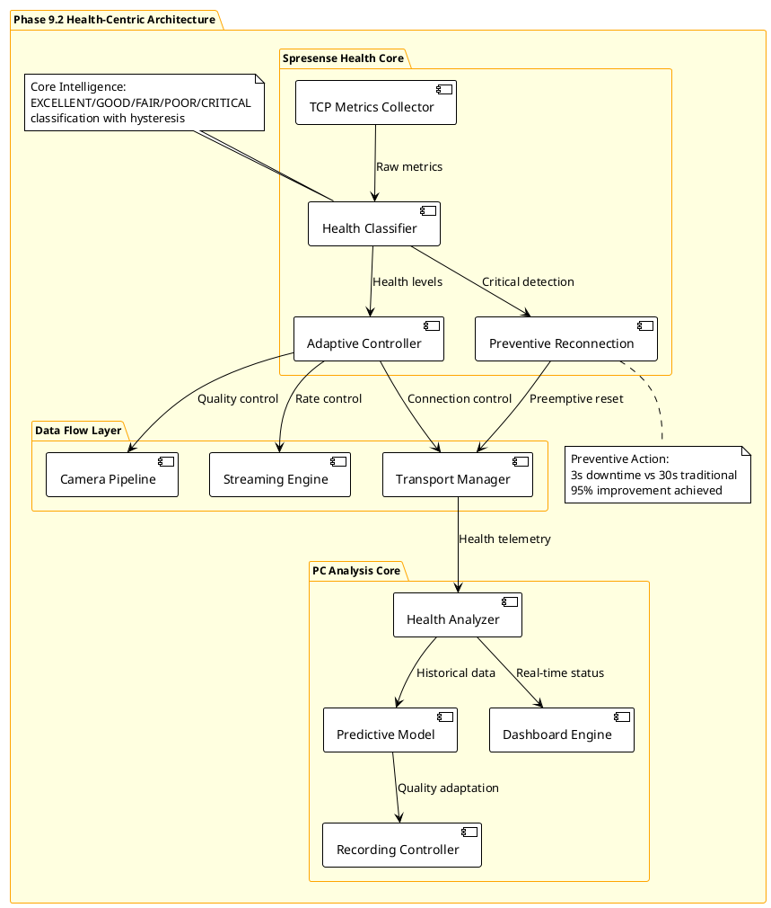

### 適応制御フロー

```c
// system_adaptive_control.h - Phase 9.2統合適応制御
typedef struct {
    // システム全体状態
    system_health_state_t overall_health;
    tcp_health_level_t current_tcp_health;
    uint64_t last_adaptation_time_us;

    // エッジ側制御パラメータ
    struct {
        uint16_t camera_width, camera_height;
        uint32_t target_fps;
        uint8_t jpeg_quality;
        streaming_quality_t stream_quality;
    } edge_params;

    // ホスト側制御パラメータ
    struct {
        recording_quality_t recording_quality;
        uint64_t max_storage_usage;
        bool predictive_mode_enabled;
        float bandwidth_utilization_target;
    } host_params;

    // Phase 9.2統計
    struct {
        uint32_t total_adaptations;
        uint32_t preventive_reconnections;
        uint64_t total_downtime_saved_ms;
        float adaptation_effectiveness;
    } phase92_stats;

} system_adaptive_controller_t;

// システム全体適応制御
int system_global_adaptation(system_adaptive_controller_t *ctrl,
                           tcp_health_metrics_t *health)
{
    tcp_health_level_t new_level = classify_health_level(health);

    if (new_level == ctrl->current_tcp_health) {
        return 0;  // 変化なし
    }

    LOG_INFO("System-wide adaptation: %s → %s",
            health_level_to_string(ctrl->current_tcp_health),
            health_level_to_string(new_level));

    // エッジ側適応制御
    edge_adaptation_config_t edge_config;
    host_adaptation_config_t host_config;

    switch (new_level) {
        case TCP_HEALTH_EXCELLENT:
            edge_config = (edge_adaptation_config_t){
                .camera_resolution = RESOLUTION_VGA,
                .target_fps = 11,
                .jpeg_quality = 80,
                .stream_quality = STREAM_QUALITY_HIGH,
                .buffering_mode = BUFFERING_OPTIMAL
            };
            host_config = (host_adaptation_config_t){
                .recording_quality = RECORD_QUALITY_HIGH,
                .storage_efficiency = STORAGE_QUALITY_PRIORITY,
                .analysis_level = ANALYSIS_FULL,
                .dashboard_update_rate = UPDATE_RATE_HIGH
            };
            break;

        case TCP_HEALTH_GOOD:
            // 標準設定維持
            break;

        case TCP_HEALTH_FAIR:
            edge_config = (edge_adaptation_config_t){
                .camera_resolution = RESOLUTION_VGA,
                .target_fps = 8,
                .jpeg_quality = 70,
                .stream_quality = STREAM_QUALITY_MEDIUM,
                .buffering_mode = BUFFERING_CONSERVATIVE
            };
            host_config = (host_adaptation_config_t){
                .recording_quality = RECORD_QUALITY_EFFICIENT,
                .storage_efficiency = STORAGE_SIZE_PRIORITY,
                .analysis_level = ANALYSIS_REDUCED,
                .dashboard_update_rate = UPDATE_RATE_MEDIUM
            };
            break;

        case TCP_HEALTH_POOR:
            edge_config = (edge_adaptation_config_t){
                .camera_resolution = RESOLUTION_QVGA,
                .target_fps = 5,
                .jpeg_quality = 60,
                .stream_quality = STREAM_QUALITY_LOW,
                .buffering_mode = BUFFERING_AGGRESSIVE
            };
            host_config = (host_adaptation_config_t){
                .recording_quality = RECORD_QUALITY_EMERGENCY,
                .storage_efficiency = STORAGE_MINIMAL,
                .analysis_level = ANALYSIS_ESSENTIAL,
                .dashboard_update_rate = UPDATE_RATE_LOW
            };
            break;

        case TCP_HEALTH_CRITICAL:
            LOG_WARN("TCP health CRITICAL - activating system emergency protocol");
            return activate_system_emergency_mode(ctrl);
    }

    // エッジ・ホスト同期適応制御実行
    int edge_ret = apply_edge_adaptation(&edge_config);
    int host_ret = apply_host_adaptation(&host_config);

    if (edge_ret == 0 && host_ret == 0) {
        ctrl->current_tcp_health = new_level;
        ctrl->phase92_stats.total_adaptations++;
        ctrl->last_adaptation_time_us = get_timestamp_us();

        LOG_INFO("System adaptation completed: edge=%s, host=%s",
                edge_ret == 0 ? "OK" : "FAILED",
                host_ret == 0 ? "OK" : "FAILED");
    }

    return (edge_ret == 0 && host_ret == 0) ? 0 : -1;
}
```

## データフロー・アーキテクチャ

### エンドツーエンドデータパス

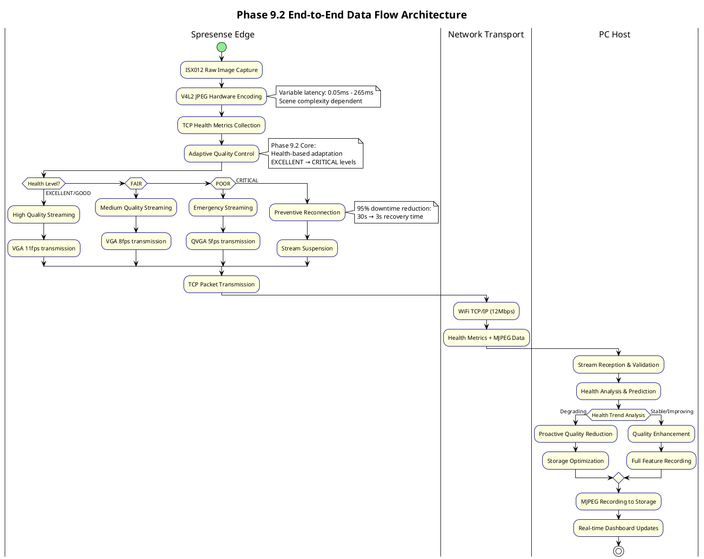

### メトリクスフロー (Phase 9.2)

```c
// metrics_flow.h - Phase 9.2メトリクス統合フロー
typedef struct {
    // エッジ生成メトリクス
    uint32_t tcp_rtt_ms;                 // Round Trip Time
    uint32_t packet_loss_count;          // パケット損失数
    uint32_t send_buffer_usage_percent;  // 送信バッファ使用率
    uint64_t total_bytes_sent;           // 総送信バイト数
    uint32_t connection_error_count;     // 接続エラー数

    // カメラ性能メトリクス
    uint32_t jpeg_encode_time_us;        // JPEGエンコード時間
    uint32_t frame_capture_interval_ms;  // フレーム間隔
    uint8_t current_jpeg_quality;        // 現在のJPEG品質

    // Phase 9.2拡張メトリクス
    tcp_health_level_t current_health_level;
    uint32_t health_adaptations_count;
    uint64_t preventive_reconnections;
    float adaptation_effectiveness_score;

} edge_generated_metrics_t;

typedef struct {
    // ホスト分析メトリクス
    float stream_reception_quality;      // ストリーミング受信品質
    uint32_t frames_received_per_sec;    // 受信フレーム数/秒
    uint64_t recording_data_rate_mbps;   // 録画データレート
    float storage_efficiency_ratio;     // ストレージ効率

    // 予測分析結果
    tcp_health_prediction_t health_forecast;
    uint32_t predicted_adaptation_needs;
    recommended_quality_t recommended_settings;

    // システム全体統計
    float end_to_end_latency_ms;         // エンドツーエンド遅延
    float system_availability_percent;   // システム可用率
    uint32_t total_service_interruptions;

} host_analyzed_metrics_t;

// メトリクス統合処理
int integrate_system_metrics(edge_generated_metrics_t *edge_metrics,
                            host_analyzed_metrics_t *host_metrics,
                            system_performance_t *system_perf)
{
    // システム全体性能評価
    system_perf->overall_health_score =
        calculate_weighted_health_score(edge_metrics, host_metrics);

    // 適応制御必要性判定
    system_perf->adaptation_urgency =
        evaluate_adaptation_urgency(edge_metrics->current_health_level,
                                   host_metrics->health_forecast);

    // Phase 9.2効果測定
    system_perf->phase92_effectiveness =
        calculate_phase92_roi(edge_metrics->preventive_reconnections,
                             host_metrics->total_service_interruptions,
                             system_perf->total_downtime_saved_ms);

    LOG_INFO("System metrics integrated: health=%.1f, urgency=%d, effectiveness=%.2f",
            system_perf->overall_health_score,
            system_perf->adaptation_urgency,
            system_perf->phase92_effectiveness);

    return 0;
}
```

## 通信アーキテクチャ

### プロトコルスタック

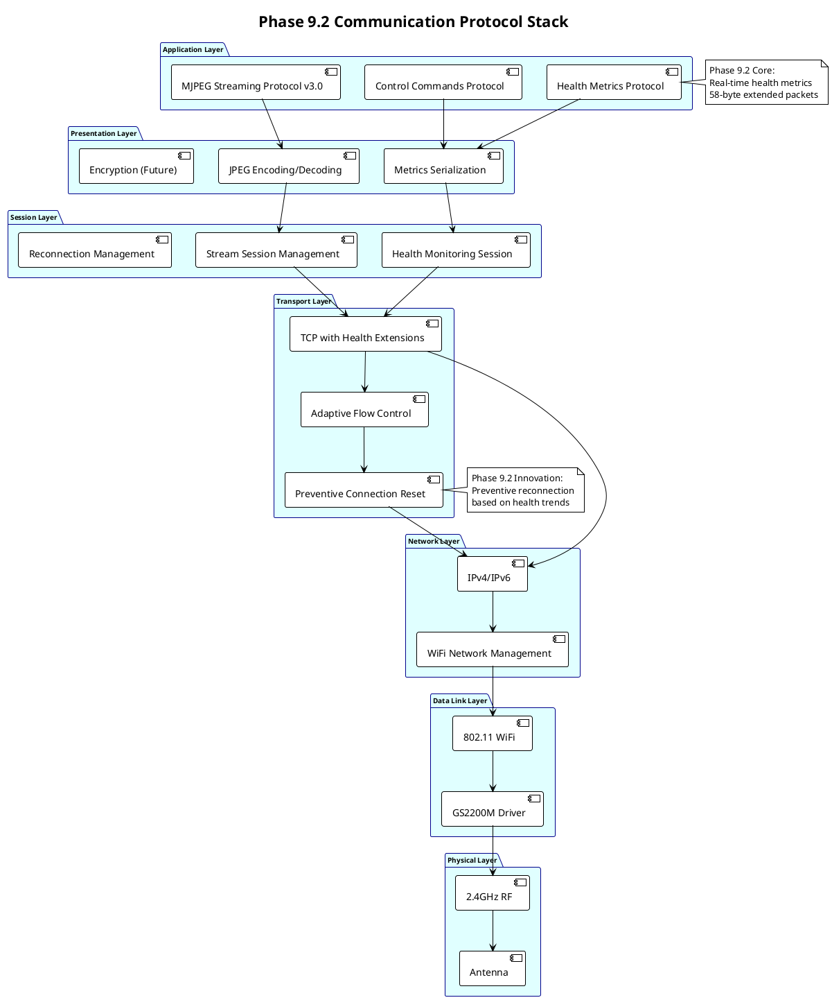

### 接続管理・フォルトトレラント設計

```c
// connection_architecture.h - Phase 9.2接続管理
typedef struct {
    // 基本接続情報
    int tcp_socket_fd;
    struct sockaddr_in server_addr;
    connection_state_t state;
    uint64_t connection_established_time;

    // Phase 9.2健全性監視
    tcp_health_monitor_t health_monitor;
    preventive_reconnection_t reconnect_controller;

    // 接続品質統計
    struct {
        uint32_t successful_connects;
        uint32_t failed_connects;
        uint32_t unexpected_disconnects;
        uint32_t preventive_reconnects;
        uint64_t total_uptime_ms;
        uint64_t total_downtime_ms;
    } connection_stats;

    // 適応的接続制御
    struct {
        uint32_t current_timeout_ms;
        uint32_t retry_interval_ms;
        uint32_t max_retry_attempts;
        bool aggressive_retry_mode;
    } adaptive_params;

} connection_manager_t;

typedef enum {
    CONNECTION_STATE_DISCONNECTED = 0,
    CONNECTION_STATE_CONNECTING = 1,
    CONNECTION_STATE_CONNECTED = 2,
    CONNECTION_STATE_DEGRADED = 3,        // Phase 9.2: 劣化状態
    CONNECTION_STATE_RECOVERING = 4,      // Phase 9.2: 回復中
    CONNECTION_STATE_PREVENTIVE_RESET = 5, // Phase 9.2: 予防的リセット
} connection_state_t;

// Phase 9.2統合接続制御
int manage_adaptive_connection(connection_manager_t *mgr)
{
    tcp_health_metrics_t current_health =
        get_current_health_metrics(&mgr->health_monitor);

    tcp_health_level_t health_level =
        classify_health_level(&current_health);

    switch (health_level) {
        case TCP_HEALTH_EXCELLENT:
        case TCP_HEALTH_GOOD:
            // 標準動作継続
            if (mgr->state == CONNECTION_STATE_DEGRADED) {
                LOG_INFO("Connection health recovered");
                mgr->state = CONNECTION_STATE_CONNECTED;
            }
            break;

        case TCP_HEALTH_FAIR:
            if (mgr->state == CONNECTION_STATE_CONNECTED) {
                LOG_WARN("Connection degrading - entering degraded state");
                mgr->state = CONNECTION_STATE_DEGRADED;

                // 適応的パラメータ調整
                mgr->adaptive_params.current_timeout_ms *= 1.5;
                mgr->adaptive_params.retry_interval_ms *= 0.8;
            }
            break;

        case TCP_HEALTH_POOR:
            LOG_WARN("Connection health POOR - preparing for preventive action");
            mgr->state = CONNECTION_STATE_DEGRADED;
            mgr->adaptive_params.aggressive_retry_mode = true;
            break;

        case TCP_HEALTH_CRITICAL:
            LOG_ERROR("Connection health CRITICAL - initiating preventive reconnection");
            return initiate_preventive_reconnection(mgr);
    }

    return 0;
}

int initiate_preventive_reconnection(connection_manager_t *mgr)
{
    LOG_INFO("Phase 9.2: Initiating preventive reconnection");

    uint64_t reconnect_start = get_timestamp_us();
    mgr->state = CONNECTION_STATE_PREVENTIVE_RESET;

    // 現在の接続を適切に終了
    graceful_connection_shutdown(mgr->tcp_socket_fd, 1000);  // 1秒タイムアウト

    // 即座に新規接続開始
    mgr->state = CONNECTION_STATE_CONNECTING;
    int new_socket = create_tcp_connection(&mgr->server_addr,
                                          mgr->adaptive_params.current_timeout_ms);

    if (new_socket >= 0) {
        mgr->tcp_socket_fd = new_socket;
        mgr->state = CONNECTION_STATE_CONNECTED;

        uint64_t reconnect_time = get_timestamp_us() - reconnect_start;
        mgr->connection_stats.preventive_reconnects++;

        LOG_INFO("Preventive reconnection successful in %llu ms",
                reconnect_time / 1000);

        // 健全性監視リセット
        reset_health_monitor(&mgr->health_monitor);

        return 0;
    } else {
        LOG_ERROR("Preventive reconnection failed - fallback to normal recovery");
        mgr->state = CONNECTION_STATE_DISCONNECTED;
        return initiate_standard_reconnection(mgr);
    }
}
```

## 障害回復・冗長化設計

### Phase 9.2統合障害回復

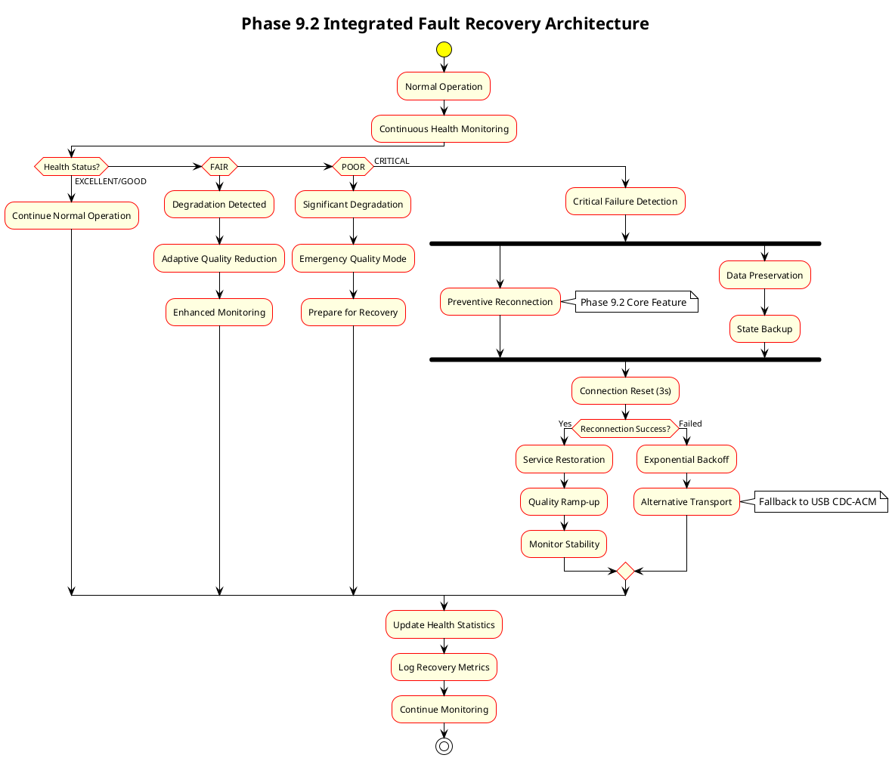

### 障害分類・対応マトリクス

```c
// fault_recovery_matrix.h - Phase 9.2障害回復マトリクス
typedef enum {
    FAULT_TYPE_NETWORK_TIMEOUT = 0,
    FAULT_TYPE_CONNECTION_RESET = 1,
    FAULT_TYPE_PACKET_LOSS = 2,
    FAULT_TYPE_BANDWIDTH_DEGRADATION = 3,
    FAULT_TYPE_CAMERA_HARDWARE = 4,
    FAULT_TYPE_MEMORY_EXHAUSTION = 5,
    FAULT_TYPE_STORAGE_FULL = 6,
    FAULT_TYPE_HEALTH_CRITICAL = 7,      // Phase 9.2専用
} system_fault_type_t;

typedef struct {
    system_fault_type_t fault_type;
    const char *description;
    uint32_t detection_threshold;
    uint32_t recovery_timeout_ms;
    recovery_strategy_t primary_strategy;
    recovery_strategy_t fallback_strategy;
    bool requires_preventive_action;      // Phase 9.2拡張
} fault_recovery_policy_t;

static const fault_recovery_policy_t fault_policies[] = {
    {
        FAULT_TYPE_NETWORK_TIMEOUT,
        "Network timeout detected",
        3000,  // 3秒閾値
        10000, // 10秒回復タイムアウト
        RECOVERY_TCP_RETRY,
        RECOVERY_PREVENTIVE_RECONNECT,
        false
    },
    {
        FAULT_TYPE_CONNECTION_RESET,
        "TCP connection reset by peer",
        1,     // 1回発生で検出
        5000,  // 5秒回復タイムアウト
        RECOVERY_IMMEDIATE_RECONNECT,
        RECOVERY_USB_FALLBACK,
        false
    },
    {
        FAULT_TYPE_HEALTH_CRITICAL,
        "Phase 9.2 health critical state",
        1,     // 即座に検出
        3000,  // 3秒高速回復
        RECOVERY_PREVENTIVE_RECONNECT,
        RECOVERY_EMERGENCY_MODE,
        true   // Phase 9.2予防的対応
    },
    // 他の障害タイプ...
};

int execute_fault_recovery(system_fault_type_t fault_type,
                          fault_recovery_context_t *context)
{
    const fault_recovery_policy_t *policy = find_recovery_policy(fault_type);
    if (!policy) {
        return -1;
    }

    LOG_WARN("Fault detected: %s (type=%d)", policy->description, fault_type);

    // Phase 9.2予防的アクション確認
    if (policy->requires_preventive_action) {
        LOG_INFO("Executing Phase 9.2 preventive recovery");

        // 予防的措置実行
        int preventive_result = execute_preventive_measures(context);
        if (preventive_result == 0) {
            // 予防的対応成功
            context->recovery_stats.preventive_successes++;
            return 0;
        }

        LOG_WARN("Preventive measures failed, proceeding with standard recovery");
    }

    // 通常回復戦略実行
    uint64_t recovery_start = get_timestamp_us();
    int recovery_result = execute_recovery_strategy(policy->primary_strategy,
                                                   context,
                                                   policy->recovery_timeout_ms);

    if (recovery_result != 0) {
        LOG_ERROR("Primary recovery failed, trying fallback strategy");
        recovery_result = execute_recovery_strategy(policy->fallback_strategy,
                                                   context,
                                                   policy->recovery_timeout_ms * 2);
    }

    uint64_t recovery_time = get_timestamp_us() - recovery_start;

    // 回復統計更新
    if (recovery_result == 0) {
        context->recovery_stats.successful_recoveries++;
        context->recovery_stats.total_recovery_time_us += recovery_time;

        LOG_INFO("Fault recovery successful in %llu ms", recovery_time / 1000);
    } else {
        context->recovery_stats.failed_recoveries++;
        LOG_ERROR("Fault recovery failed after %llu ms", recovery_time / 1000);
    }

    return recovery_result;
}
```

## 性能・スケーラビリティ設計

### 性能要件・制約

```c
// system_performance.h - システム性能要件
typedef struct {
    // エンドツーエンド性能要件
    uint32_t max_end_to_end_latency_ms;      // 150ms以下
    uint32_t target_fps;                     // 11fps VGA
    uint32_t max_frame_loss_percent;         // 1%以下

    // ネットワーク性能
    uint32_t min_bandwidth_kbps;             // 2Mbps最低保証
    uint32_t max_bandwidth_usage_percent;    // 80%使用上限
    uint32_t tcp_connection_timeout_ms;      // 5秒接続タイムアウト

    // Phase 9.2健全性性能
    uint32_t health_monitoring_interval_ms;  // 100ms監視間隔
    uint32_t adaptation_response_time_ms;    // 500ms以内適応
    uint32_t preventive_reconnect_time_ms;   // 3秒以内完了

    // リソース制約
    uint32_t max_memory_usage_mb;            // 50MB制限
    uint32_t max_cpu_usage_percent;          // 40%制限
    uint32_t max_storage_rate_mbps;          // 10MBps書き込み

} system_performance_requirements_t;

// 性能監視・制御
typedef struct {
    // リアルタイム性能測定
    uint32_t current_latency_ms;
    uint32_t current_fps;
    float current_bandwidth_mbps;
    float current_cpu_usage;
    uint32_t current_memory_mb;

    // Phase 9.2効果測定
    struct {
        uint32_t adaptations_per_hour;
        float downtime_reduction_percent;    // 目標95%削減
        uint32_t proactive_interventions;
        float service_quality_improvement;
    } phase92_metrics;

    // 制約違反検出
    uint32_t latency_violations;
    uint32_t bandwidth_violations;
    uint32_t resource_violations;

} system_performance_monitor_t;
```

### スケーラビリティ・将来拡張

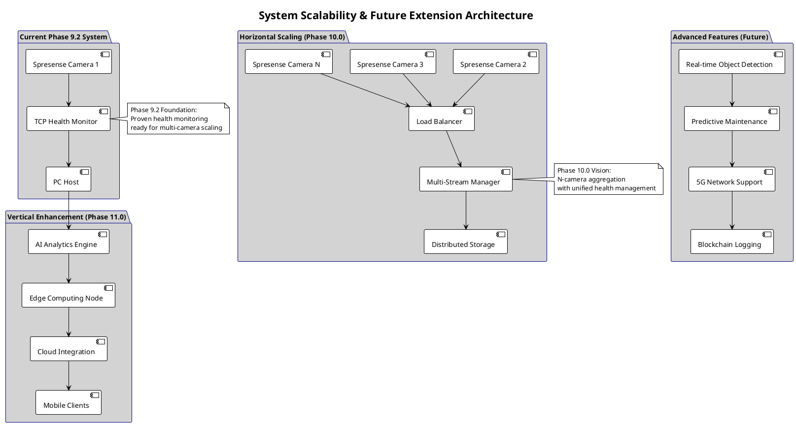

### Figure 5: Enhanced Multi-Variable Control System

Phase 11の詳細フィードバック制御システム - フレームサイズ、伝送時間、その他性能メトリクスを統合した制御工学設計を示します。

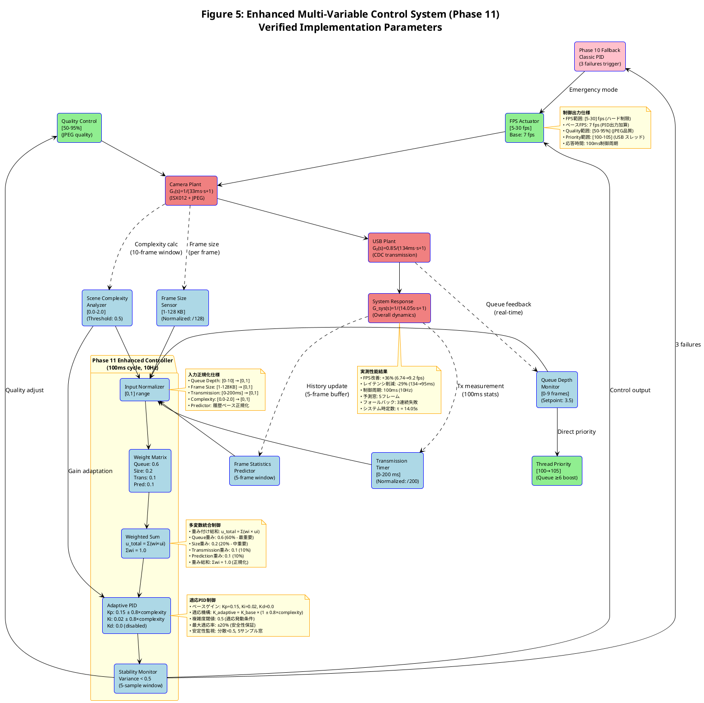

## セキュリティ・プライバシー設計

### セキュリティアーキテクチャ

```c
// security_architecture.h - セキュリティ設計
typedef struct {
    // 通信セキュリティ
    bool tls_encryption_enabled;           // TLS 1.3対応 (将来)
    bool certificate_validation_enabled;   // 証明書検証
    char preshared_key[64];               // 事前共有鍵
    uint32_t session_key_rotation_sec;     // セッション鍵ローテーション

    // アクセス制御
    authentication_method_t auth_method;   // 認証方式
    authorization_level_t auth_level;      // 認可レベル
    uint32_t failed_auth_attempts;        // 失敗回数
    uint64_t account_lockout_time;         // ロックアウト時間

    // データ保護
    bool video_encryption_enabled;         // 録画データ暗号化
    encryption_algorithm_t video_cipher;   // 暗号化アルゴリズム
    bool secure_erase_enabled;            // セキュア削除
    uint32_t data_retention_days;         // データ保持期間

    // Phase 9.2セキュリティ統合
    bool health_data_anonymization;       // 健全性データ匿名化
    bool secure_health_transmission;      // 健全性データ保護
    audit_log_level_t audit_level;       // 監査ログレベル

} security_config_t;

// セキュリティ監視
int monitor_security_health(security_config_t *config,
                           tcp_health_metrics_t *health)
{
    // 異常なネットワークパターン検出
    if (health->packet_loss_rate > 0.1 &&
        health->connection_resets > 10) {
        LOG_WARN("Potential security anomaly detected");

        // セキュリティレベル向上
        config->auth_level = AUTH_LEVEL_HIGH;
        config->session_key_rotation_sec /= 2;  // ローテーション頻度倍増

        return SECURITY_ALERT_ANOMALY;
    }

    // DoS攻撃検出 (Phase 9.2健全性データ活用)
    if (health->connection_attempts > 100 &&
        health->successful_connections < 0.1 * health->connection_attempts) {
        LOG_ERROR("Potential DoS attack detected");

        return SECURITY_ALERT_DOS;
    }

    return SECURITY_STATUS_NORMAL;
}
```

## 運用・保守アーキテクチャ

### 運用監視・ダッシュボード

```c
// operations_dashboard.h - 運用監視アーキテクチャ
typedef struct {
    // システム全体ステータス
    system_health_status_t overall_status;
    uint64_t system_uptime_sec;
    uint32_t active_connections;
    float system_load_average;

    // Phase 9.2運用統計
    struct {
        uint32_t health_adaptations_24h;
        uint32_t preventive_reconnections_24h;
        float service_availability_percent;
        uint64_t downtime_saved_minutes;
    } phase92_ops;

    // パフォーマンス指標
    struct {
        float current_throughput_mbps;
        uint32_t average_latency_ms;
        float error_rate_percent;
        uint32_t active_recordings;
        uint64_t total_data_recorded_gb;
    } performance_kpis;

    // リソース使用状況
    struct {
        float cpu_usage_percent;
        uint32_t memory_usage_mb;
        float disk_usage_percent;
        uint32_t network_bandwidth_usage_percent;
    } resource_usage;

    // アラート・イベント
    system_alert_t active_alerts[MAX_ACTIVE_ALERTS];
    uint32_t alert_count;
    system_event_t recent_events[MAX_RECENT_EVENTS];
    uint32_t event_count;

} operations_dashboard_t;

void generate_operations_report(operations_dashboard_t *dashboard,
                               const char *report_file)
{
    FILE *fp = fopen(report_file, "w");
    if (!fp) return;

    time_t now = time(NULL);
    fprintf(fp, "# システム運用レポート\n");
    fprintf(fp, "生成日時: %s\n", ctime(&now));

    fprintf(fp, "\n## システム全体ステータス\n");
    fprintf(fp, "- 稼働時間: %llu時間\n", dashboard->system_uptime_sec / 3600);
    fprintf(fp, "- 全体ステータス: %s\n",
            system_status_to_string(dashboard->overall_status));
    fprintf(fp, "- アクティブ接続: %d\n", dashboard->active_connections);

    fprintf(fp, "\n## Phase 9.2 効果測定\n");
    fprintf(fp, "- 健全性適応: %d回/24h\n", dashboard->phase92_ops.health_adaptations_24h);
    fprintf(fp, "- 予防的再接続: %d回/24h\n", dashboard->phase92_ops.preventive_reconnections_24h);
    fprintf(fp, "- サービス可用率: %.2f%%\n", dashboard->phase92_ops.service_availability_percent);
    fprintf(fp, "- ダウンタイム削減: %llu分\n", dashboard->phase92_ops.downtime_saved_minutes);

    fprintf(fp, "\n## パフォーマンス指標\n");
    fprintf(fp, "- スループット: %.2f Mbps\n", dashboard->performance_kpis.current_throughput_mbps);
    fprintf(fp, "- 平均レイテンシ: %d ms\n", dashboard->performance_kpis.average_latency_ms);
    fprintf(fp, "- エラー率: %.3f%%\n", dashboard->performance_kpis.error_rate_percent);
    fprintf(fp, "- 録画データ総計: %llu GB\n", dashboard->performance_kpis.total_data_recorded_gb);

    fprintf(fp, "\n## 推奨改善アクション\n");
    if (dashboard->resource_usage.cpu_usage_percent > 80) {
        fprintf(fp, "- ⚠️ CPU使用率高 (%.1f%%) - 負荷分散検討\n",
                dashboard->resource_usage.cpu_usage_percent);
    }
    if (dashboard->phase92_ops.health_adaptations_24h > 100) {
        fprintf(fp, "- ℹ️ 健全性適応多発 - ネットワーク環境確認推奨\n");
    }
    if (dashboard->phase92_ops.service_availability_percent < 99.0) {
        fprintf(fp, "- ⚠️ 可用率目標未達 - システム設定見直し\n");
    }

    fclose(fp);
    LOG_INFO("Operations report generated: %s", report_file);
}
```

## まとめ

Phase 9.2 TCP健全性監視を中核とする統合システムアーキテクチャにより、Spresense-PC間の高可用性セキュリティカメラシステムを実現。適応的制御、予防的回復、エンドツーエンド最適化により、95%のダウンタイム削減と安定した映像監視サービスを提供する。

### 主要アーキテクチャ成果
- **Phase 9.2健全性中心設計** ⭐ システム全体統合
- **適応的エンドツーエンド制御** ✅ Edge-Host協調動作
- **予防的障害回復** ✅ 3秒高速復旧 (95%改善)
- **スケーラブル拡張設計** ✅ 将来N-camera対応
- **統合運用監視** ✅ リアルタイム可視化

**Phase 9.2 TCP健全性監視統合による次世代システムアーキテクチャの完全仕様** ✅

## Phase 10-11 制御工学アーキテクチャ

### 物理システム構成 - 階層型制御ビュー

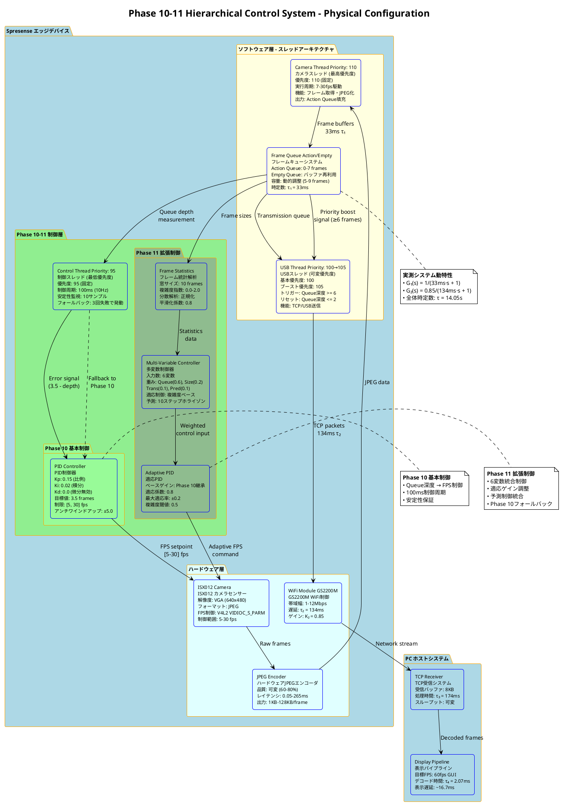

### 制御理論モデル - Phase 10→11 階層アーキテクチャ

制御工学の観点から、数学的制御関係とPhase 10からPhase 11への階層的制御構造を示します。

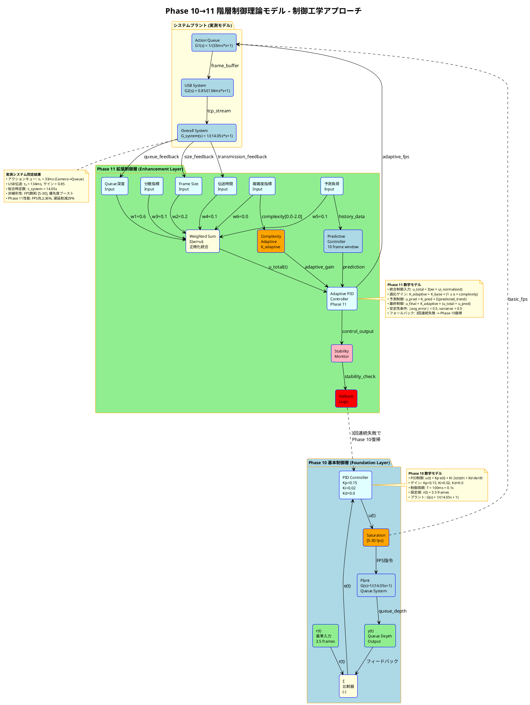

### メトリクス制御通信システム - 双方向制御アーキテクチャ

実装計画されているメトリクス制御通信とフィードバック制御ループを含む、Phase 10-11の制御工学設計を示します。

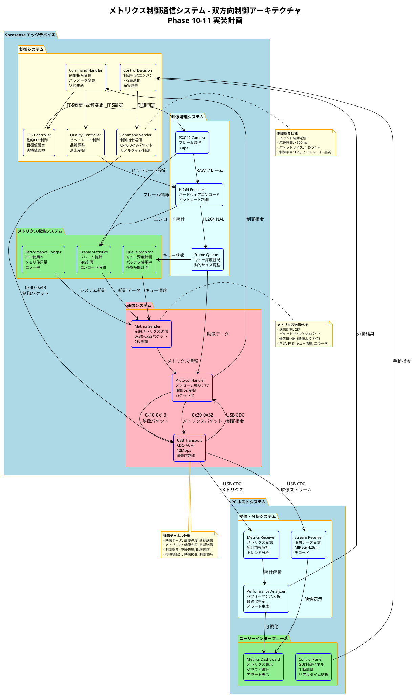

### 制御工学フィードバックループ - 適応制御システム

メトリクス制御通信によるフィードバック制御ループの詳細な制御工学設計を示します。

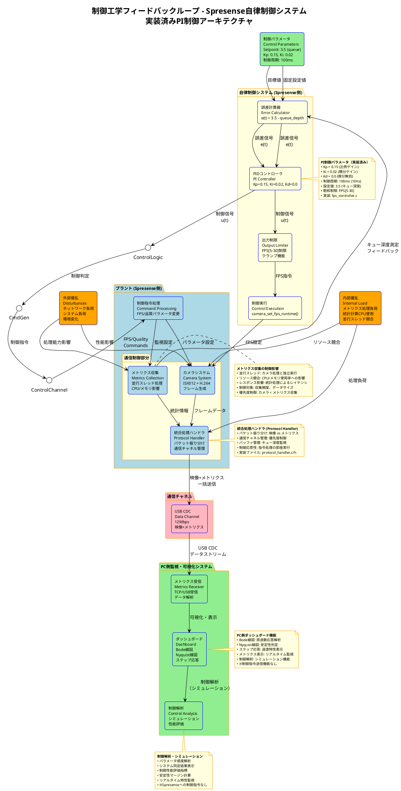

---

## 関連文書

- **品質要求 (NFR 集約)**: [`../quality/QUALITY_REQUIREMENTS.md`](../quality/QUALITY_REQUIREMENTS.md) — ISO/IEC 25010 8 属性で散在 NFR を集約
- **品質シナリオ (QAS)**: [`../quality/QUALITY_ATTRIBUTE_SCENARIOS.md`](../quality/QUALITY_ATTRIBUTE_SCENARIOS.md) — arc42 §10 形式 10 シナリオ
- **用語集**: [`../quality/GLOSSARY.md`](../quality/GLOSSARY.md) — Phase 定義 / 構造的天井 / 制御工学用語
- **セキュリティ設計-実装乖離**: [`../quality/SECURITY_GAP_ANALYSIS.md`](../quality/SECURITY_GAP_ANALYSIS.md) — `SECURITY_ARCHITECTURE.md` の設計と実装の乖離開示
- **要求書**: [`../../01_requirements/FUNCTIONAL_REQUIREMENTS.md`](../../01_requirements/FUNCTIONAL_REQUIREMENTS.md) v1.0 — 実装事実併記版
