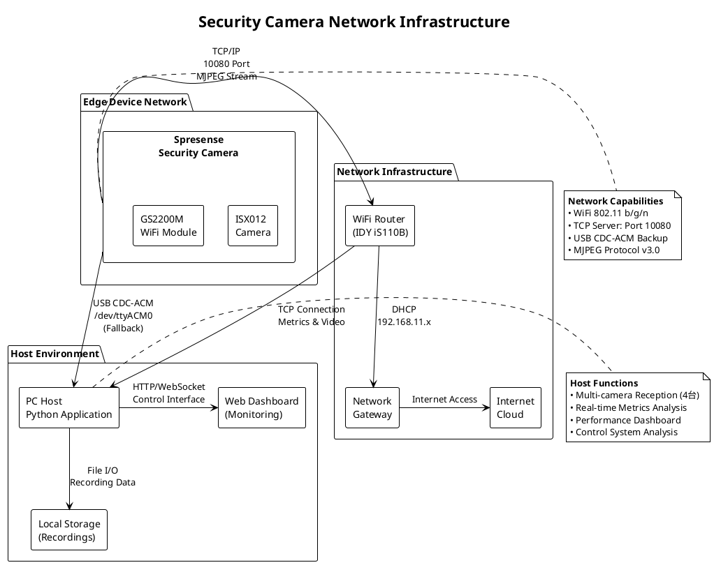
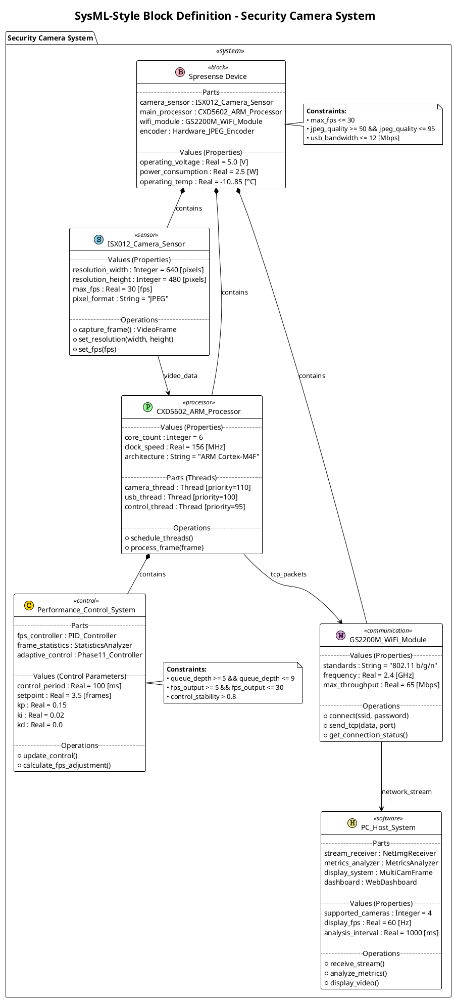
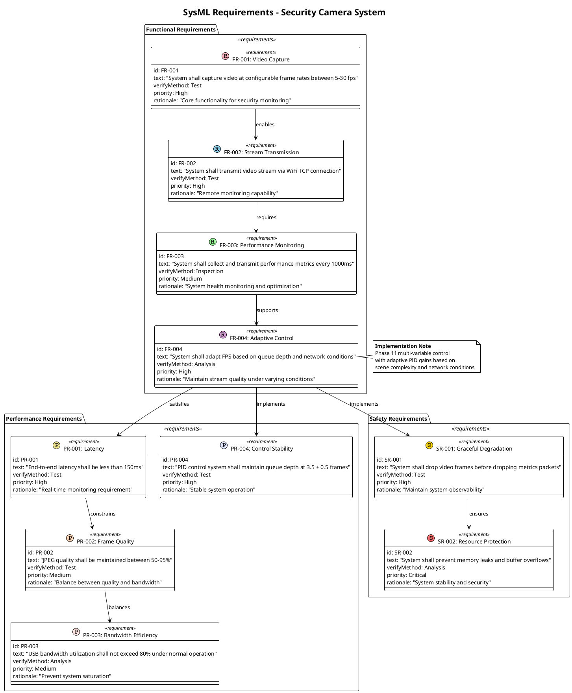
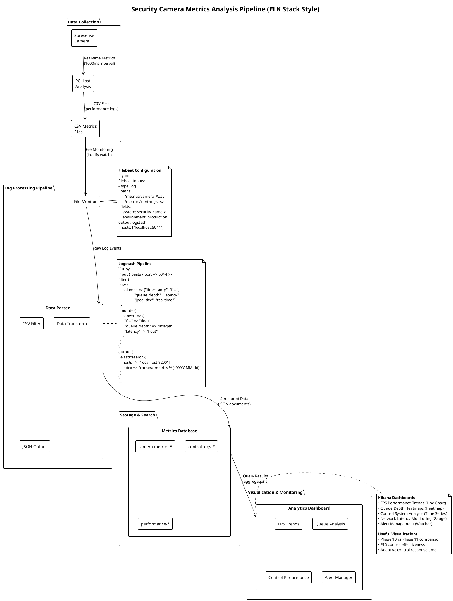
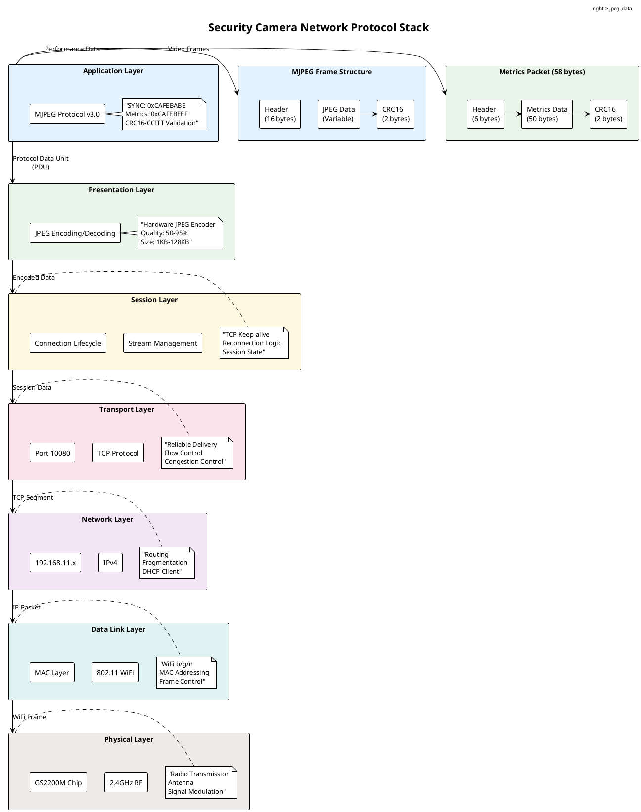

# 技術特化ライブラリ使用例 - セキュリティカメラシステム

## ネットワーク図（Font Awesome 5使用）

### Network Infrastructure Diagram

## SysML-Style Block Definition Diagram (Class Diagram with SysML Stereotypes)

### System Architecture using SysML-Style Notation

## SysML Requirements Diagram

### System Requirements with Traceability

## SysML-Style Internal Block Diagram (Component Diagram)

### Thread Architecture & Data Flow

```plantuml
@startuml sysml_internal_block
!theme plain

title SysML-Style Internal Block - Spresense Thread Architecture

component "Spresense_Security_Camera" {

  ' Thread Components
  component "Camera_Thread" as camera_thread <<(T,#FFB6C1) Thread[priority=110]>> {
    portin frame_out
    portout control_in
  }

  component "USB_Thread" as usb_thread <<(T,#87CEEB) Thread[priority=100]>> {
    portin data_in
    portout usb_out
    portin priority_control
  }

  component "Control_Thread" as control_thread <<(T,#98FB98) Thread[priority=95]>> {
    portin metrics_in
    portout control_out
  }

  ' Queue Systems
  component "Action_Queue" as action_queue <<(Q,#DDA0DD) Queue[size=5..9]>> {
    portin push_port
    portout pull_port
    portout depth_monitor
  }

  component "Empty_Queue" as empty_queue <<(Q,#F0E68C) Queue>> {
    portin recycle_port
    portout allocate_port
  }

  ' Control Systems
  component "FPS_Controller" as fps_controller <<(C,#FFD700) Controller>> {
    portin error_in
    portout fps_out
  }

  component "Metrics_Collector" as metrics_collector <<(M,#FFDAB9) Collector>> {
    portin stats_in
    portout metrics_out
  }
}

' Internal Connections
camera_thread.frame_out --> action_queue.push_port : "JPEG_Frames"
action_queue.pull_port --> usb_thread.data_in : "Frame_Buffers"
usb_thread.usb_out --> empty_queue.recycle_port : "Empty_Buffers"
empty_queue.allocate_port --> camera_thread : "Buffer_Allocation"

action_queue.depth_monitor --> control_thread.metrics_in : "Queue_Depth"
control_thread.control_out --> fps_controller.error_in : "Control_Signal"
fps_controller.fps_out --> camera_thread.control_in : "FPS_Command"

camera_thread --> metrics_collector.stats_in : "Frame_Stats"
usb_thread --> metrics_collector.stats_in : "Transmission_Stats"
metrics_collector.metrics_out --> action_queue.push_port : "Metrics_Packet"

' Priority Control (Dynamic)
action_queue.depth_monitor --> usb_thread.priority_control : "Priority_Boost[>=6_frames]"

note top of camera_thread
  **Highest Priority**
  Ensures frame capture
  from V4L2 driver

  **Control Parameters:**
  • kp = 0.15
  • ki = 0.02
  • setpoint = 3.5
  • period = 100 [ms]
end note

note top of usb_thread
  **Medium Priority**
  Can boost to 105 when
  queue depth >= 6
end note

note top of control_thread
  **Lowest Priority**
  Background control
  100ms cycle
end note

@enduml
```

## Elastic Stack Architecture (ログ解析システム例)

### Security Camera Metrics Analysis Pipeline

## Network Protocol Stack Diagram

### Detailed Protocol Analysis

これらの図は、技術特化ライブラリの具体的な使用例として、ネットワークインフラ、SysMLシステム設計、要求工学、ログ解析パイプライン、プロトコルスタック等の様々な視点からセキュリティカメラシステムを表現しています。