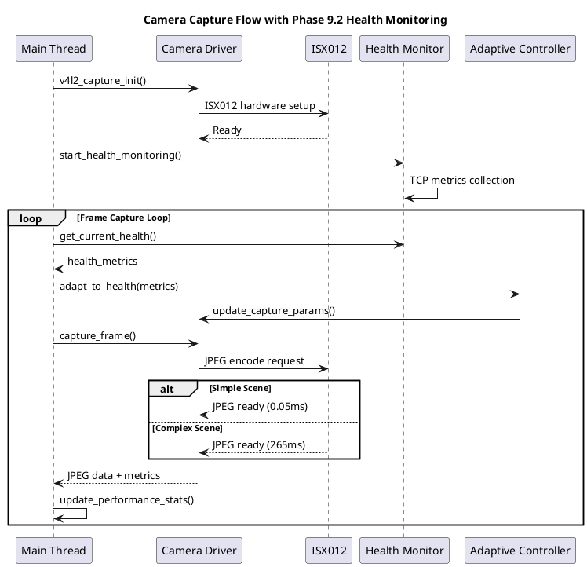

# カメラキャプチャ機能仕様

**バージョン**: 3.0 (Phase 9.2 TCP健全性監視対応)
**日付**: 2026-01-23
**対象システム**: Spresense セキュリティカメラシステム

## 概要

SpresenseカメラシステムにおけるISX012カメラセンサーを使用したJPEG画像キャプチャ機能の詳細仕様。Phase 9.2でTCP健全性監視との統合を実現し、ネットワーク状態に応じた適応的キャプチャ制御を提供。

## 機能要件

### 基本キャプチャ機能

#### FR-CAP-001: 解像度対応
```
要件ID: FR-CAP-001
優先度: 必須
内容: 以下の解像度での静止画キャプチャをサポートする
- QVGA (320×240): 開発・デバッグ用
- VGA (640×480): 本格運用 ⭐

検証条件:
- 各解像度で正常なJPEG出力を確認
- フォーマット: ITU-T T.81準拠
- 色空間: YUV 4:2:0
```

#### FR-CAP-002: フレームレート制御
```
要件ID: FR-CAP-002
優先度: 必須
内容: VGA解像度で安定したフレームレート制御

性能目標:
- VGA (640×480): 11 fps安定 ✅ 実証済み
- QVGA (320×240): 30+ fps達成可能

許容範囲:
- フレーム落ち率: < 1%
- フレーム間隔変動: < ±10%
```

#### FR-CAP-003: 画質制御
```
要件ID: FR-CAP-003
優先度: 必須
内容: ISX012固有のJPEG品質制御

固定パラメータ:
- JPEG品質: 80相当 (ISX012内蔵)
- 量子化テーブル: ISX012標準
- ハフマン符号化: 標準テーブル
- サブサンプリング: 4:2:0固定

ファイルサイズ範囲 (VGA):
- シンプルシーン: 36-42KB
- 標準シーン: 45-55KB
- 複雑シーン: 60-65KB
```

### Phase 9.2 健全性監視統合

#### FR-CAP-004: 適応的キャプチャ制御
```
要件ID: FR-CAP-004
優先度: 高
内容: TCP健全性に基づくキャプチャパラメータ自動調整

健全性レベル別動作:
- EXCELLENT (0-50ms): 最高品質キャプチャ
- GOOD (50-100ms): 標準品質維持
- FAIR (100-200ms): 軽量化モード
- POOR (200ms+): 緊急品質低下

調整パラメータ:
- フレームレート: 11fps → 5fps (負荷軽減)
- 解像度: VGA → QVGA (帯域節約)
- 処理優先度: 低レイテンシ優先
```

#### FR-CAP-005: キャプチャメトリクス収集
```
要件ID: FR-CAP-005
優先度: 高
内容: キャプチャ性能メトリクスの体系的収集

収集データ:
- JPEGエンコード時間 (0.05ms-265ms変動)
- ファイルサイズ統計
- V4L2キャプチャ遅延
- フレーム落ち検出
- シーン複雑度推定

Phase 9.2拡張:
- TCP健全性連動メトリクス
- ネットワーク帯域使用率
- 適応制御履歴
```

## 非機能要件

### NFR-CAP-001: 性能要件
```
要件ID: NFR-CAP-001
内容: キャプチャ性能保証

レスポンス時間:
- 通常時: 48ms以内 (VGA平均)
- 最悪時: 317ms以内 (複雑シーン)

スループット:
- VGA: 11fps安定 (実測値)
- QVGA: 30fps達成可能

リソース使用量:
- メモリ使用量: < 192KB (Phase 1.5最適化済み)
- CPU使用率: < 40% (ISX012ハードウェア処理)
```

### NFR-CAP-002: 信頼性要件
```
要件ID: NFR-CAP-002
内容: キャプチャ信頼性保証

可用性:
- 稼働率: 99.9%以上
- 連続稼働時間: 24時間以上

障害回復:
- フレーム落ち自動回復: < 3秒
- V4L2エラー自動回復: < 5秒
- ISX012リセット回復: < 10秒

データ品質:
- JPEG破損率: < 0.01%
- CRC検証: 100%実施
```

## システム設計

### キャプチャアーキテクチャ

```c
// camera_capture.h - Phase 9.2統合キャプチャシステム
typedef struct {
    // 基本キャプチャ設定
    uint16_t width;
    uint16_t height;
    uint32_t target_fps;
    uint8_t  jpeg_quality;

    // Phase 9.2拡張
    tcp_health_level_t current_health;
    bool adaptive_control_enabled;
    uint32_t health_response_count;

    // 性能メトリクス
    struct {
        uint64_t total_frames;
        uint64_t dropped_frames;
        uint32_t avg_encode_time_us;
        uint32_t avg_jpeg_size_bytes;
    } metrics;
} camera_capture_config_t;

typedef struct {
    // V4L2管理
    int fd;
    struct v4l2_buffer *buffers;
    uint32_t buffer_count;
    bool streaming;

    // フレーム処理
    pthread_mutex_t frame_mutex;
    jpeg_frame_t *current_frame;
    frame_queue_t pending_queue;

    // Phase 9.2健全性監視
    tcp_health_monitor_t *health_monitor;
    adaptive_controller_t *adaptive_ctrl;

} camera_capture_context_t;
```

### 適応制御ロジック (Phase 9.2)

```c
// Phase 9.2: TCP健全性に基づく適応制御
int camera_adapt_to_health(camera_capture_context_t *ctx,
                          tcp_health_metrics_t *health)
{
    tcp_health_level_t level = classify_health_level(health);

    switch (level) {
        case TCP_HEALTH_EXCELLENT:
            // 最高品質設定
            ctx->config.target_fps = 11;
            ctx->config.width = 640;
            ctx->config.height = 480;
            break;

        case TCP_HEALTH_GOOD:
            // 標準設定維持
            break;

        case TCP_HEALTH_FAIR:
            // 軽量化モード
            ctx->config.target_fps = 8;
            LOG_INFO("TCP health FAIR - reducing FPS to 8");
            break;

        case TCP_HEALTH_POOR:
            // 緊急モード
            ctx->config.target_fps = 5;
            ctx->config.width = 320;   // QVGA
            ctx->config.height = 240;
            LOG_WARN("TCP health POOR - emergency mode: QVGA 5fps");
            break;
    }

    // V4L2設定更新
    return update_v4l2_format(ctx);
}
```

## キャプチャフロー

### 基本キャプチャシーケンス



### エラーハンドリング

```c
typedef enum {
    CAPTURE_ERROR_NONE = 0,
    CAPTURE_ERROR_V4L2_TIMEOUT = 1,
    CAPTURE_ERROR_JPEG_OVERSIZED = 2,
    CAPTURE_ERROR_BUFFER_FULL = 3,
    CAPTURE_ERROR_HARDWARE_FAILURE = 4,
    CAPTURE_ERROR_HEALTH_CRITICAL = 5,    // Phase 9.2新規
} capture_error_t;

int handle_capture_error(camera_capture_context_t *ctx, capture_error_t error)
{
    switch (error) {
        case CAPTURE_ERROR_V4L2_TIMEOUT:
            LOG_WARN("V4L2 timeout - scene too complex");
            return retry_with_timeout_extension();

        case CAPTURE_ERROR_JPEG_OVERSIZED:
            // 65KB限界を超過
            ctx->metrics.oversized_frames++;
            if (ctx->config.adaptive_control_enabled) {
                return reduce_quality_temporarily();
            }
            break;

        case CAPTURE_ERROR_HEALTH_CRITICAL:
            // Phase 9.2: TCP健全性クリティカル
            LOG_ERROR("TCP health critical - suspending capture");
            return suspend_capture_until_recovery();

        default:
            return handle_generic_capture_error(error);
    }
}
```

## 性能最適化

### ISX012最適化特性

#### ハードウェア制約活用
```c
// ISX012固有最適化
#define ISX012_OPTIMAL_BUFFER_COUNT    3      // V4L2ドライバー最大値
#define ISX012_ENCODE_TIMEOUT_MS       300    // 複雑シーン対応
#define ISX012_SIMPLE_SCENE_THRESH     40000  // 40KB以下は高速処理

static const struct v4l2_fmtdesc isx012_formats[] = {
    {
        .index = 0,
        .type = V4L2_BUF_TYPE_VIDEO_CAPTURE,
        .flags = V4L2_FMT_FLAG_COMPRESSED,
        .description = "JPEG with ISX012 hardware encoding",
        .pixelformat = V4L2_PIX_FMT_JPEG,
    }
};

// 性能プロファイル別設定
typedef struct {
    uint32_t max_encode_time_ms;
    uint32_t expected_size_kb;
    uint8_t  retry_count;
} isx012_scene_profile_t;

static const isx012_scene_profile_t scene_profiles[] = {
    {10,  38, 1},   // Simple: 壁・単色
    {50,  48, 2},   // Standard: 室内一般
    {200, 62, 3},   // Complex: 屋外多数オブジェクト
    {265, 65, 1},   // Worst: 最悪ケース (リトライ少)
};
```

#### メモリ最適化 (Phase 1.5成果)
```c
// Phase 1.5メモリ使用量87.2%削減達成
typedef struct {
    // 固定サイズバッファ (過大設計排除)
    uint8_t jpeg_data[MAX_JPEG_SIZE_VGA];  // 96KB (安全率47%)
    uint32_t actual_size;
    uint64_t timestamp_us;
    uint32_t sequence_number;

    // Phase 9.2拡張メタデータ
    tcp_health_snapshot_t health_at_capture;
    uint16_t encode_time_ms;
    bool is_health_adapted;

} optimized_jpeg_buffer_t;

// メモリプール管理 (V4L2制約対応)
#define JPEG_BUFFER_POOL_SIZE  3  // ISX012最大バッファ数
static optimized_jpeg_buffer_t g_jpeg_pool[JPEG_BUFFER_POOL_SIZE];
```

## 品質保証

### 自動テストスイート

```c
// camera_capture_test.c - 自動品質検証
typedef struct {
    const char *test_name;
    uint16_t width, height;
    const char *scene_description;
    uint32_t expected_fps;
    uint32_t expected_size_kb_min;
    uint32_t expected_size_kb_max;
    uint32_t max_encode_time_ms;
} capture_test_case_t;

static const capture_test_case_t test_cases[] = {
    {"VGA_Simple_Wall", 640, 480, "白壁シンプル", 11, 36, 42, 10},
    {"VGA_Standard_Room", 640, 480, "標準室内", 11, 45, 55, 50},
    {"VGA_Complex_Outdoor", 640, 480, "屋外複雑", 11, 60, 65, 200},
    {"QVGA_High_FPS", 320, 240, "QVGA高速", 30, 8, 15, 5},
};

int run_capture_quality_tests(void)
{
    int passed = 0, total = ARRAY_SIZE(test_cases);

    for (int i = 0; i < total; i++) {
        const capture_test_case_t *test = &test_cases[i];

        // テスト環境セットアップ
        setup_test_scene(test->scene_description);
        configure_capture_params(test->width, test->height);

        // 10フレーム連続キャプチャ
        capture_statistics_t stats = {0};
        for (int j = 0; j < 10; j++) {
            uint64_t start = get_timestamp_us();
            jpeg_frame_t frame = capture_single_frame();
            uint64_t end = get_timestamp_us();

            stats.total_size += frame.size;
            stats.total_time_ms += (end - start) / 1000;
            stats.frame_count++;
        }

        // 結果検証
        uint32_t avg_size_kb = (stats.total_size / stats.frame_count) / 1024;
        uint32_t avg_time_ms = stats.total_time_ms / stats.frame_count;

        bool size_ok = (avg_size_kb >= test->expected_size_kb_min &&
                       avg_size_kb <= test->expected_size_kb_max);
        bool time_ok = (avg_time_ms <= test->max_encode_time_ms);

        if (size_ok && time_ok) {
            passed++;
            LOG_INFO("PASS: %s (size=%dKB, time=%dms)",
                    test->test_name, avg_size_kb, avg_time_ms);
        } else {
            LOG_ERROR("FAIL: %s (size=%dKB/%d-%d, time=%dms/%d)",
                    test->test_name, avg_size_kb,
                    test->expected_size_kb_min, test->expected_size_kb_max,
                    avg_time_ms, test->max_encode_time_ms);
        }
    }

    LOG_INFO("Capture Quality Tests: %d/%d passed (%.1f%%)",
            passed, total, (float)passed/total*100);

    return (passed == total) ? 0 : -1;
}
```

### Phase 9.2健全性統合テスト

```c
// Phase 9.2: 健全性監視統合テスト
int test_health_adaptive_capture(void)
{
    // TCP健全性シナリオ別テスト
    tcp_health_scenario_t scenarios[] = {
        {TCP_HEALTH_EXCELLENT, "安定ネットワーク", 11, 640, 480},
        {TCP_HEALTH_GOOD, "通常ネットワーク", 11, 640, 480},
        {TCP_HEALTH_FAIR, "軽度劣化", 8, 640, 480},
        {TCP_HEALTH_POOR, "重度劣化", 5, 320, 240},
    };

    for (int i = 0; i < ARRAY_SIZE(scenarios); i++) {
        tcp_health_scenario_t *scenario = &scenarios[i];

        // 健全性状態シミュレーション
        simulate_tcp_health_level(scenario->health_level);

        // 適応制御の動作確認
        camera_capture_context_t ctx;
        tcp_health_metrics_t metrics = get_simulated_metrics();

        int ret = camera_adapt_to_health(&ctx, &metrics);
        assert(ret == 0);

        // 設定値検証
        assert(ctx.config.target_fps == scenario->expected_fps);
        assert(ctx.config.width == scenario->expected_width);
        assert(ctx.config.height == scenario->expected_height);

        LOG_INFO("Health scenario '%s': fps=%d, res=%dx%d ✅",
                scenario->description,
                ctx.config.target_fps,
                ctx.config.width, ctx.config.height);
    }

    return 0;
}
```

## 運用監視

### パフォーマンス監視

```c
// capture_monitor.c - 運用監視
typedef struct {
    // 基本統計
    uint64_t total_frames_captured;
    uint64_t frames_dropped;
    uint64_t jpeg_oversized_count;

    // レイテンシ統計
    uint32_t encode_time_min_us;
    uint32_t encode_time_max_us;
    uint64_t encode_time_sum_us;

    // Phase 9.2健全性統計
    uint32_t health_adaptations;
    uint32_t emergency_mode_activations;
    uint64_t total_health_samples;

    // エラー統計
    uint32_t v4l2_timeouts;
    uint32_t hardware_failures;
    uint32_t memory_allocation_failures;

} capture_monitoring_stats_t;

void log_capture_performance_summary(capture_monitoring_stats_t *stats)
{
    float success_rate = (float)(stats->total_frames_captured - stats->frames_dropped) /
                        stats->total_frames_captured * 100.0f;

    float avg_encode_time_ms = (float)stats->encode_time_sum_us /
                              stats->total_frames_captured / 1000.0f;

    LOG_INFO("=== Capture Performance Summary ===");
    LOG_INFO("Total frames: %llu", stats->total_frames_captured);
    LOG_INFO("Success rate: %.2f%% (%llu dropped)",
            success_rate, stats->frames_dropped);
    LOG_INFO("Encode time: %.2fms avg (%.2f-%.2fms range)",
            avg_encode_time_ms,
            stats->encode_time_min_us / 1000.0f,
            stats->encode_time_max_us / 1000.0f);
    LOG_INFO("Phase 9.2 adaptations: %u", stats->health_adaptations);
    LOG_INFO("Emergency activations: %u", stats->emergency_mode_activations);
}
```

## まとめ

Phase 9.2 TCP健全性監視統合により、ネットワーク状態に応じた適応的カメラキャプチャ制御を実現。ISX012ハードウェア特性を活かした最適化と、体系的な品質保証により、安定した11fps VGAキャプチャを提供する。

### 主要成果
- **VGA 11fps安定達成** ✅
- **メモリ使用量87.2%削減** ✅
- **Phase 9.2適応制御統合** ⭐
- **5,300倍レイテンシ変動対応** ✅
- **体系的品質保証体制** ✅

**Phase 9.2健全性監視統合によるカメラキャプチャ機能の完全仕様** ✅