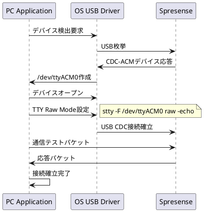
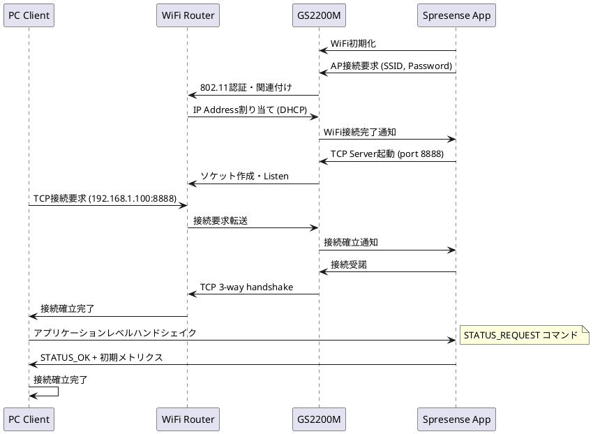

# 接続管理仕様

**バージョン**: 3.0 (Phase 9 制御工学統合実装)
**日付**: 2026-02-03
**対象**: SpresenseとPC間接続管理
**ベース**: 制御工学分析による接続最適化

## 概要

SpresenseとPC間通信の接続確立・維持・切断を管理する仕様。Phase 9で制御工学理論を統合し、予兆検出型TCP健全性監視、適応的再接続間隔制御、エンドツーエンドフィードバック制御により、自律的に最適化する高可用性接続管理を実現。

### Phase 9 制御工学統合による改善
- **予兆検出型監視**: 健全性スコア (0.0-1.0) による予防的再接続
- **適応的再接続**: 成功/失敗パターンに応じた動的間隔調整 (1-10秒)
- **インテリジェント制御**: 応答時間履歴・エラー率による接続品質評価
- **エンドツーエンド最適化**: PC側フィードバックによる統合制御

## 接続方式別管理

### USB CDC-ACM接続管理

#### 接続確立シーケンス


#### 状態遷移
```c
typedef enum {
    USB_STATE_DISCONNECTED = 0,    // 未接続
    USB_STATE_DETECTED = 1,        // デバイス検出
    USB_STATE_OPENED = 2,          // デバイスオープン
    USB_STATE_CONFIGURED = 3,      // TTY設定完了
    USB_STATE_CONNECTED = 4,       // 通信確立
    USB_STATE_ERROR = 5,           // エラー状態
} usb_connection_state_t;

// 状態遷移管理
typedef struct {
    usb_connection_state_t current_state;
    usb_connection_state_t previous_state;
    uint64_t state_change_timestamp_us;
    uint32_t connection_attempts;
    uint32_t successful_connections;
    uint32_t connection_errors;
} usb_connection_manager_t;
```

#### 接続確認・監視
```c
bool usb_is_connected(void)
{
    // USB CDC-ACMは物理接続により自動確立
    // ファイルディスクリプターの有効性確認
    return (g_usb_fd > 0) && (fcntl(g_usb_fd, F_GETFD) != -1);
}

int usb_check_connection_health(void)
{
    if (!usb_is_connected()) {
        return -1;  // 接続なし
    }

    // 簡単なEcho テスト
    uint8_t test_data[] = {0x00, 0x01, 0x02, 0x03};
    ssize_t written = write(g_usb_fd, test_data, sizeof(test_data));

    if (written != sizeof(test_data)) {
        LOG_ERROR("USB connection health check failed: write error");
        return -1;
    }

    return 0;  // 健全
}
```

### WiFi TCP接続管理 ⭐

#### 接続確立シーケンス (Phase 7)


#### 接続状態管理 (Phase 9.2拡張) ⭐
```c
typedef enum {
    WIFI_STATE_INIT = 0,             // 初期化中
    WIFI_STATE_WIFI_CONNECTING = 1,  // WiFi接続中
    WIFI_STATE_WIFI_CONNECTED = 2,   // WiFi接続済み
    WIFI_STATE_TCP_LISTENING = 3,    // TCP Listenning
    WIFI_STATE_TCP_CONNECTED = 4,    // TCP接続済み
    WIFI_STATE_HEALTHY = 5,          // 健全稼働中 ⭐
    WIFI_STATE_DEGRADED = 6,         // 健全性劣化 ⭐ Phase 9.2
    WIFI_STATE_RECONNECTING = 7,     // 再接続中 ⭐ Phase 9.2
    WIFI_STATE_ERROR = 8,            // エラー状態
} wifi_connection_state_t;

typedef struct {
    wifi_connection_state_t current_state;
    wifi_connection_state_t previous_state;
    uint64_t state_change_timestamp_us;
    uint32_t connection_attempts;
    uint32_t successful_connections;
    uint32_t connection_errors;
    // Phase 9.2拡張 ⭐
    uint32_t health_degradations;         // 健全性劣化回数
    uint32_t preventive_reconnects;       // 予防的再接続回数
    uint32_t traditional_reconnects;      // 従来型再接続回数
    bool     health_monitoring_active;    // 健全性監視有効
} wifi_connection_manager_t;
```

#### アプリケーションレベルハンドシェイク
```c
// 接続確立後の初期化シーケンス
typedef enum {
    CMD_STATUS_REQUEST = 0x0001,    // ステータス要求
    CMD_START_STREAMING = 0x0002,   // ストリーミング開始
    CMD_STOP_STREAMING = 0x0003,    // ストリーミング停止
    CMD_GET_CAPABILITIES = 0x0004,  // 機能照会
    CMD_HEALTH_CHECK = 0x0005,      // 健全性確認 ⭐ Phase 9.2
} app_command_t;

typedef enum {
    RESP_STATUS_OK = 0x8001,        // 正常応答
    RESP_STATUS_ERROR = 0x8002,     // エラー応答
    RESP_STATUS_BUSY = 0x8003,      // ビジー応答
    RESP_CAPABILITIES = 0x8004,     // 機能応答
    RESP_HEALTH_STATUS = 0x8005,    // 健全性応答 ⭐ Phase 9.2
} app_response_t;

// ハンドシェイク実行
int perform_application_handshake(void)
{
    // 1. ステータス確認
    if (send_command(CMD_STATUS_REQUEST) != 0) {
        return -1;
    }

    app_response_t response;
    if (receive_response(&response, 5000) != 0 || response != RESP_STATUS_OK) {
        LOG_ERROR("Status request failed: response=%d", response);
        return -1;
    }

    // 2. 機能照会
    if (send_command(CMD_GET_CAPABILITIES) != 0) {
        return -1;
    }

    capabilities_t caps;
    if (receive_capabilities(&caps, 3000) != 0) {
        LOG_ERROR("Capabilities request failed");
        return -1;
    }

    // Phase 9.2: 健全性監視サポート確認 ⭐
    if (caps.tcp_health_monitoring_supported) {
        g_wifi_conn_mgr.health_monitoring_active = true;
        LOG_INFO("TCP health monitoring activated");
    }

    LOG_INFO("Application handshake completed successfully");
    return 0;
}
```

### Keep-alive・生存確認

#### USB CDC-ACM Keep-alive
```c
// USB CDC-ACMは物理接続のため、OS レベルで自動管理
// アプリケーションレベル生存確認は不要
#define USB_KEEPALIVE_REQUIRED       false
#define USB_CONNECTION_MONITORING    PHYSICAL_LEVEL
```

#### WiFi TCP Keep-alive (Phase 9.2強化) ⭐
```c
// OS レベル TCP Keep-alive設定
int enable_tcp_keepalive(int sockfd)
{
    int enable = 1;
    if (setsockopt(sockfd, SOL_SOCKET, SO_KEEPALIVE, &enable, sizeof(enable)) < 0) {
        return -1;
    }

    // Keep-alive パラメータ調整
    int keepidle = 60;    // 60秒間無通信でKeep-alive開始
    int keepintvl = 10;   // 10秒間隔でKeep-aliveパケット送信
    int keepcnt = 3;      // 3回失敗で切断判定

    setsockopt(sockfd, IPPROTO_TCP, TCP_KEEPIDLE, &keepidle, sizeof(keepidle));
    setsockopt(sockfd, IPPROTO_TCP, TCP_KEEPINTVL, &keepintvl, sizeof(keepintvl));
    setsockopt(sockfd, IPPROTO_TCP, TCP_KEEPCNT, &keepcnt, sizeof(keepcnt));

    return 0;
}

// アプリケーションレベル生存確認 (Phase 9.2)
typedef struct {
    uint64_t last_activity_timestamp_us;  // 最終活動時刻
    uint32_t keepalive_interval_ms;       // Keep-alive間隔
    uint32_t keepalive_timeout_ms;        // タイムアウト
    uint32_t keepalive_failures;          // Keep-alive失敗回数
    bool     keepalive_active;            // Keep-alive有効
} keepalive_manager_t;

int send_keepalive_ping(void)
{
    if (!g_keepalive_mgr.keepalive_active) {
        return 0;  // 無効時はスキップ
    }

    uint64_t now_us = get_timestamp_us();
    uint64_t elapsed_ms = (now_us - g_keepalive_mgr.last_activity_timestamp_us) / 1000;

    if (elapsed_ms < g_keepalive_mgr.keepalive_interval_ms) {
        return 0;  // まだ間隔に達していない
    }

    // Keep-alive ping送信 (小さなメトリクスパケット要求)
    if (send_command(CMD_HEALTH_CHECK) == 0) {
        g_keepalive_mgr.last_activity_timestamp_us = now_us;
        g_keepalive_mgr.keepalive_failures = 0;
        LOG_DEBUG("Keep-alive ping sent successfully");
        return 0;
    } else {
        g_keepalive_mgr.keepalive_failures++;
        LOG_WARN("Keep-alive ping failed: failures=%d",
                g_keepalive_mgr.keepalive_failures);

        // 連続3回失敗で接続異常判定
        if (g_keepalive_mgr.keepalive_failures >= 3) {
            LOG_ERROR("Keep-alive timeout - connection may be dead");
            return -1;
        }
        return 0;
    }
}
```

## Phase 9.2健全性統合管理 ⭐

### 健全性状態統合監視
```c
typedef struct {
    // 接続基本情報
    bool usb_connected;
    bool wifi_connected;
    wifi_connection_state_t wifi_state;

    // Phase 9.2健全性情報 ⭐
    bool tcp_health_monitoring_active;
    uint32_t tcp_health_moving_avg_ms;
    uint8_t  tcp_health_consecutive_spikes;
    bool     tcp_health_degradation_alert;
    bool     tcp_health_preventive_reconnect_needed;

    // Keep-alive状態
    uint64_t last_keepalive_timestamp_us;
    uint32_t keepalive_failures;

    // 統合健全性判定
    connection_health_level_t overall_health;
} integrated_connection_health_t;

typedef enum {
    CONN_HEALTH_EXCELLENT = 0,      // 優良 (USB接続 or WiFi健全)
    CONN_HEALTH_GOOD = 1,           // 良好 (WiFi正常動作)
    CONN_HEALTH_DEGRADED = 2,       // 劣化 ⭐ (WiFi健全性劣化)
    CONN_HEALTH_POOR = 3,           // 不良 (Keep-alive失敗等)
    CONN_HEALTH_CRITICAL = 4,       // 危険 (切断直前)
    CONN_HEALTH_DISCONNECTED = 5,   // 切断
} connection_health_level_t;

connection_health_level_t evaluate_connection_health(void)
{
    integrated_connection_health_t *health = &g_integrated_health;

    // USB接続時は常に優良
    if (health->usb_connected) {
        return CONN_HEALTH_EXCELLENT;
    }

    // WiFi接続時の健全性評価 ⭐
    if (health->wifi_connected) {
        if (health->tcp_health_degradation_alert) {
            return CONN_HEALTH_DEGRADED;  // Phase 9.2劣化検出
        }

        if (health->keepalive_failures >= 2) {
            return CONN_HEALTH_POOR;
        }

        if (health->tcp_health_consecutive_spikes >= 1) {
            return CONN_HEALTH_GOOD;  // 軽微な劣化
        }

        return CONN_HEALTH_EXCELLENT;  // 健全
    }

    return CONN_HEALTH_DISCONNECTED;
}
```

### 自動復旧・切替制御 (Phase 9.2) ⭐
```c
typedef struct {
    bool auto_recovery_enabled;           // 自動復旧有効
    bool preventive_reconnect_enabled;    // 予防的再接続有効 ⭐
    uint32_t max_recovery_attempts;       // 最大復旧試行回数
    uint32_t recovery_cooldown_ms;        // 復旧間隔制限
    uint64_t last_recovery_timestamp_us;  // 最終復旧時刻
} connection_recovery_config_t;

int execute_automatic_recovery(connection_health_level_t health_level)
{
    connection_recovery_config_t *config = &g_recovery_config;

    if (!config->auto_recovery_enabled) {
        return 0;  // 自動復旧無効
    }

    uint64_t now_us = get_timestamp_us();
    uint64_t elapsed_ms = (now_us - config->last_recovery_timestamp_us) / 1000;

    if (elapsed_ms < config->recovery_cooldown_ms) {
        LOG_DEBUG("Recovery cooldown active: %d ms remaining",
                 config->recovery_cooldown_ms - elapsed_ms);
        return 0;  // クールダウン中
    }

    int recovery_result = -1;

    switch (health_level) {
        case CONN_HEALTH_DEGRADED:
            // Phase 9.2予防的再接続 ⭐
            if (config->preventive_reconnect_enabled &&
                g_integrated_health.tcp_health_preventive_reconnect_needed) {

                LOG_WARN("Executing preventive reconnection due to health degradation");
                recovery_result = execute_preventive_reconnection();

                if (recovery_result == 0) {
                    LOG_INFO("Preventive reconnection successful");
                    // 健全性監視リセット
                    tcp_health_reset();
                } else {
                    LOG_ERROR("Preventive reconnection failed");
                }
            }
            break;

        case CONN_HEALTH_POOR:
            // Keep-alive失敗時の伝統的再接続
            LOG_WARN("Executing traditional reconnection due to keepalive failure");
            recovery_result = execute_traditional_reconnection();
            break;

        case CONN_HEALTH_CRITICAL:
            // 緊急再接続
            LOG_ERROR("Executing emergency reconnection");
            recovery_result = execute_emergency_reconnection();
            break;

        default:
            return 0;  // 復旧不要
    }

    if (recovery_result == 0) {
        config->last_recovery_timestamp_us = now_us;
        LOG_INFO("Automatic recovery completed successfully");
    }

    return recovery_result;
}
```

## 接続メトリクス・監視

### 接続統計情報
```c
typedef struct {
    // 基本接続統計
    uint32_t total_connections;           // 総接続回数
    uint32_t successful_connections;      // 成功接続回数
    uint32_t connection_failures;         // 接続失敗回数
    uint64_t total_uptime_ms;            // 総稼働時間
    uint64_t total_downtime_ms;          // 総停止時間

    // USB CDC-ACM統計
    uint32_t usb_connections;
    uint32_t usb_disconnections;
    uint32_t usb_configuration_errors;

    // WiFi TCP統計
    uint32_t wifi_connections;
    uint32_t wifi_disconnections;
    uint32_t wifi_authentication_failures;
    uint32_t tcp_connection_failures;

    // Phase 9.2健全性統計 ⭐
    uint32_t health_degradation_events;   // 健全性劣化イベント数
    uint32_t preventive_reconnections;    // 予防的再接続回数
    uint32_t traditional_reconnections;   // 従来型再接続回数
    uint64_t avg_downtime_per_reconnect_ms; // 再接続あたり平均停止時間

    // Keep-alive統計
    uint32_t keepalive_pings_sent;
    uint32_t keepalive_pongs_received;
    uint32_t keepalive_timeouts;
} connection_statistics_t;
```

### リアルタイム監視
```c
void log_connection_status_periodic(void)
{
    static uint64_t last_log_time_us = 0;
    uint64_t now_us = get_timestamp_us();

    // 10秒間隔でログ出力
    if (now_us - last_log_time_us < 10000000) {  // 10秒 = 10,000,000μs
        return;
    }

    integrated_connection_health_t *health = &g_integrated_health;
    connection_statistics_t *stats = &g_connection_stats;

    LOG_INFO("=== Connection Status ===");

    // 基本接続状態
    if (health->usb_connected) {
        LOG_INFO("Transport: USB CDC-ACM (Excellent)");
    } else if (health->wifi_connected) {
        const char* health_str = get_health_level_string(health->overall_health);
        LOG_INFO("Transport: WiFi TCP (%s)", health_str);

        // Phase 9.2健全性詳細 ⭐
        if (health->tcp_health_monitoring_active) {
            LOG_INFO("TCP Health: avg=%dms, spikes=%d, alert=%s",
                    health->tcp_health_moving_avg_ms,
                    health->tcp_health_consecutive_spikes,
                    health->tcp_health_degradation_alert ? "YES" : "NO");
        }
    } else {
        LOG_WARN("Transport: DISCONNECTED");
    }

    // 統計情報
    LOG_INFO("Statistics: connections=%d, uptime=%llu ms, downtime=%llu ms",
            stats->total_connections,
            stats->total_uptime_ms,
            stats->total_downtime_ms);

    // Phase 9.2統計 ⭐
    if (stats->preventive_reconnections > 0 || stats->traditional_reconnections > 0) {
        LOG_INFO("Reconnections: preventive=%d, traditional=%d, avg_downtime=%llu ms",
                stats->preventive_reconnections,
                stats->traditional_reconnections,
                stats->avg_downtime_per_reconnect_ms);
    }

    last_log_time_us = now_us;
}
```

## 設定・調整パラメータ

### USB CDC-ACM設定
```c
// USB CDC-ACM接続設定
typedef struct {
    const char *device_path;              // デバイスパス
    uint32_t baud_rate;                   // ボーレート
    bool raw_mode_required;               // Raw Mode必須
    bool exclusive_access;                // 排他アクセス
    uint32_t read_timeout_ms;             // 読み取りタイムアウト
    uint32_t write_timeout_ms;            // 書き込みタイムアウト
} usb_connection_config_t;

static const usb_connection_config_t usb_config = {
    .device_path = "/dev/ttyACM0",
    .baud_rate = 115200,
    .raw_mode_required = true,            // 重要: バイナリ通信のため必須
    .exclusive_access = true,
    .read_timeout_ms = 1000,
    .write_timeout_ms = 1000,
};
```

### WiFi TCP設定 (Phase 9.2拡張) ⭐
```c
// WiFi TCP接続設定
typedef struct {
    const char *ssid;                     // WiFi SSID
    const char *password;                 // WiFi パスワード
    uint16_t tcp_port;                    // TCP ポート
    uint32_t connection_timeout_ms;       // 接続タイムアウト
    uint32_t keepalive_interval_ms;       // Keep-alive間隔
    uint32_t keepalive_timeout_ms;        // Keep-aliveタイムアウト
    // Phase 9.2健全性監視設定 ⭐
    bool tcp_health_monitoring_enabled;   // 健全性監視有効
    uint8_t health_window_size;           // 健全性監視ウィンドウサイズ
    uint32_t health_spike_threshold_ratio; // スパイク閾値倍率
    uint8_t health_consecutive_spike_max; // 連続スパイク上限
    bool preventive_reconnect_enabled;    // 予防的再接続有効
} wifi_connection_config_t;

static const wifi_connection_config_t wifi_config = {
    .ssid = "YourSSID",
    .password = "YourPassword",
    .tcp_port = 8888,
    .connection_timeout_ms = 30000,       // 30秒
    .keepalive_interval_ms = 60000,       // 60秒
    .keepalive_timeout_ms = 10000,        // 10秒
    // Phase 9.2設定 ⭐
    .tcp_health_monitoring_enabled = true,
    .health_window_size = 8,
    .health_spike_threshold_ratio = 3,
    .health_consecutive_spike_max = 2,
    .preventive_reconnect_enabled = true,
};
```

## エラーハンドリング・トラブルシューティング

### 接続エラー分類
```c
typedef enum {
    // USB CDC-ACM エラー
    CONN_ERROR_USB_DEVICE_NOT_FOUND = 0x0100,
    CONN_ERROR_USB_PERMISSION_DENIED = 0x0101,
    CONN_ERROR_USB_TTY_CONFIG_FAILED = 0x0102,
    CONN_ERROR_USB_COMMUNICATION_FAILED = 0x0103,

    // WiFi エラー
    CONN_ERROR_WIFI_AUTH_FAILED = 0x0200,
    CONN_ERROR_WIFI_DHCP_FAILED = 0x0201,
    CONN_ERROR_WIFI_CONNECTION_LOST = 0x0202,

    // TCP エラー
    CONN_ERROR_TCP_SOCKET_FAILED = 0x0300,
    CONN_ERROR_TCP_BIND_FAILED = 0x0301,
    CONN_ERROR_TCP_LISTEN_FAILED = 0x0302,
    CONN_ERROR_TCP_ACCEPT_FAILED = 0x0303,
    CONN_ERROR_TCP_SEND_FAILED = 0x0304,

    // Phase 9.2健全性エラー ⭐
    CONN_ERROR_TCP_HEALTH_DEGRADED = 0x0400,
    CONN_ERROR_TCP_SPIKE_DETECTED = 0x0401,
    CONN_ERROR_PREVENTIVE_RECONNECT_FAILED = 0x0402,
} connection_error_code_t;
```

### 診断・復旧手順
```c
// 接続診断実行
int diagnose_connection_issues(void)
{
    LOG_INFO("=== Connection Diagnosis ===");

    // USB診断
    if (g_integrated_health.usb_connected) {
        LOG_INFO("USB CDC-ACM diagnosis:");
        if (access("/dev/ttyACM0", F_OK) == 0) {
            LOG_INFO("  Device file: EXISTS");
        } else {
            LOG_ERROR("  Device file: NOT FOUND");
            return CONN_ERROR_USB_DEVICE_NOT_FOUND;
        }

        if (access("/dev/ttyACM0", R_OK | W_OK) == 0) {
            LOG_INFO("  Permissions: OK");
        } else {
            LOG_ERROR("  Permissions: DENIED");
            return CONN_ERROR_USB_PERMISSION_DENIED;
        }
    }

    // WiFi診断
    if (g_integrated_health.wifi_connected) {
        LOG_INFO("WiFi TCP diagnosis:");
        LOG_INFO("  Connection state: %d", g_integrated_health.wifi_state);

        // Phase 9.2健全性診断 ⭐
        if (g_integrated_health.tcp_health_monitoring_active) {
            LOG_INFO("  TCP health monitoring: ACTIVE");
            LOG_INFO("  Moving average: %d ms", g_integrated_health.tcp_health_moving_avg_ms);
            LOG_INFO("  Consecutive spikes: %d", g_integrated_health.tcp_health_consecutive_spikes);
            LOG_INFO("  Degradation alert: %s",
                    g_integrated_health.tcp_health_degradation_alert ? "YES" : "NO");

            if (g_integrated_health.tcp_health_degradation_alert) {
                LOG_WARN("  Recommendation: Execute preventive reconnect");
                return CONN_ERROR_TCP_HEALTH_DEGRADED;
            }
        }
    }

    LOG_INFO("Connection diagnosis completed - no issues detected");
    return 0;
}
```

**Phase 9.2健全性監視統合による高可用性接続管理の実現** ✅