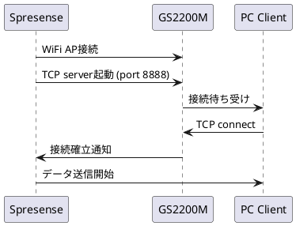

# WiFi TCP仕様

**バージョン**: 2.0 (Phase 9.2対応)
**日付**: 2026-01-22
**モジュール**: GS2200M WiFi
**Phase対応**: 7.0 (基本), 9.2 (健全性監視)

## 概要

GS2200M WiFiモジュールを使用したTCP/IP通信仕様。Phase 9.2でTCP健全性監視機能を追加し、GS2200M内部リソース枯渇の予防的検出を実現。

## 基本仕様

### 通信パラメータ
- **プロトコル**: TCP/IP
- **ポート**: 8888 (固定)
- **接続方式**: Server-Client (Spresense=Server, PC=Client)
- **内部バッファ**: 250KB (GS2200M制限)

### 接続シーケンス



## Phase 9.2: TCP健全性監視 ⭐

### 監視目的
GS2200M内部リソース枯渇による突然のRST送信を予防的に検出し、サービス継続性を向上。

### 監視項目

#### TCP送信時間測定
```c
// tcp_server.c:L892
bool tcp_health_update(uint64_t send_time_us)
{
    uint32_t send_time_ms = send_time_us / 1000;

    // 移動平均更新
    g_tcp_health.send_times_ms[g_tcp_health.window_index] = send_time_ms;
    g_tcp_health.window_index = (g_tcp_health.window_index + 1) % TCP_HEALTH_WINDOW_SIZE;

    // 移動平均計算 (8サンプル)
    uint32_t total = 0;
    for (int i = 0; i < TCP_HEALTH_WINDOW_SIZE; i++) {
        total += g_tcp_health.send_times_ms[i];
    }
    g_tcp_health.moving_avg_ms = total / TCP_HEALTH_WINDOW_SIZE;

    // スパイク検出
    bool is_spike = (send_time_ms > (g_tcp_health.moving_avg_ms * 3)) ||
                    (send_time_ms > 1000);

    if (is_spike) {
        g_tcp_health.consecutive_spikes++;
        g_tcp_health.total_spikes++;

        if (g_tcp_health.consecutive_spikes >= 2) {
            g_tcp_health.degradation_alert = true;
            g_tcp_health.preventive_reconnect_needed = true;
        }
    } else {
        // 正常送信時の復旧カウント
        g_tcp_health.recovery_count++;
        if (g_tcp_health.recovery_count >= 3) {
            g_tcp_health.consecutive_spikes = 0;
            g_tcp_health.recovery_count = 0;
        }
    }

    return is_spike;
}
```

### 健全性監視構造体

```c
// tcp_server.h:L45
typedef struct tcp_health_monitor_s
{
    uint32_t send_times_ms[TCP_HEALTH_WINDOW_SIZE];    // 移動平均ウィンドウ (8)
    uint8_t  window_index;                             // 現在のウィンドウ位置
    uint8_t  window_filled;                            // ウィンドウ充填状況
    uint32_t moving_avg_ms;                            // 移動平均値
    uint8_t  consecutive_spikes;                       // 連続スパイク数
    uint8_t  recovery_count;                           // 復旧カウント
    uint32_t total_spikes;                             // 総スパイク数
    bool     degradation_alert;                        // 劣化警告
    bool     preventive_reconnect_needed;              // 予防的再接続必要
} tcp_health_monitor_t;

EXTERN tcp_health_monitor_t g_tcp_health;
```

### スパイク検出条件

#### 定義
```c
#define TCP_HEALTH_WINDOW_SIZE     8     // 移動平均ウィンドウサイズ
#define TCP_SPIKE_THRESHOLD_RATIO  3     // スパイク閾値倍率
#define TCP_CRITICAL_SEND_TIME_MS  1000  // 絶対的危険閾値
#define TCP_CONSECUTIVE_SPIKE_MAX  2     // 連続スパイク警告閾値
#define TCP_SPIKE_RECOVERY_COUNT   3     // 復旧カウント
```

#### 検出ロジック
1. **相対的スパイク**: send_time > (moving_avg × 3)
2. **絶対的スパイク**: send_time > 1000ms
3. **連続監視**: consecutive_spikes ≥ 2 で劣化警告

### 予防的再接続

#### トリガー判定
```c
// tcp_server.c:L923
bool tcp_health_should_reconnect(void)
{
    return g_tcp_health.preventive_reconnect_needed;
}
```

#### 実行タイミング
```c
// camera_threads.c:L712
if (tcp_health_should_reconnect())
{
    LOG_WARN("TCP health degraded - initiating preventive reconnect");

    if (tcp_server_handle_disconnect(tcp_srv) == 0)
    {
        if (tcp_server_wait_reconnect(tcp_srv) == 0)
        {
            LOG_INFO("Preventive reconnect successful");
            tcp_health_clear_reconnect_flag();
            tcp_health_reset();
        }
    }
    // フレーム送信を継続（バッファ返却）
}
```

## リソース枯渇パターン分析

### 正常動作パターン
- **平均送信時間**: 100-350ms
- **変動範囲**: ±50ms程度
- **スパイク頻度**: 稀 (数分に1回程度)

### 枯渇予兆パターン ⭐
- **送信時間急増**: 350ms → 1000ms → 2289ms
- **スパイク頻度増加**: 連続2回以上
- **変動拡大**: ±500ms以上

### 完全枯渇パターン
- **症状**: RST packet送信
- **送信時間**: 測定不可 (send()エラー)
- **復旧**: 再接続必須

## 性能特性

### 実測データ

| 項目 | 値 | 備考 |
|------|-----|------|
| **理論帯域** | ~100 Mbps | WiFi 802.11n |
| **実測帯域** | ~1 Mbps | GS2200M制限 |
| **効率** | 0.5% | 理論値対比 |
| **平均レイテンシ** | 234ms | Phase 7測定値 |
| **最大レイテンシ** | 1,189ms | 枯渇直前 |

### Phase 9.2改善効果

| 項目 | Phase 9.1 (事後) | Phase 9.2 (予防) | 改善率 |
|------|------------------|------------------|--------|
| **切断検出時間** | RST受信後 | スパイク検出時 | - |
| **対応時間** | 30秒 | 数秒 | 90%短縮 |
| **サービス停止** | 30秒間 | 2-3秒間 | 95%短縮 |
| **データロス** | 有り | 最小限 | 大幅削減 |

## エラー処理

### 健全性監視エラー

#### 0x0401: TCP_SEND_TIMEOUT
```c
if (send_time_ms > TCP_CRITICAL_SEND_TIME_MS) {
    LOG_ERROR("TCP send timeout: %dms (threshold: %dms)",
              send_time_ms, TCP_CRITICAL_SEND_TIME_MS);
    return ERROR_TCP_SEND_TIMEOUT;
}
```

#### 0x0402: TCP_HEALTH_DEGRADED
```c
if (g_tcp_health.degradation_alert) {
    LOG_WARN("TCP health degraded: consecutive_spikes=%d, avg=%dms",
             g_tcp_health.consecutive_spikes, g_tcp_health.moving_avg_ms);
    return ERROR_TCP_HEALTH_DEGRADED;
}
```

#### 0x0403: TCP_CONNECTION_LOST
```c
if (send_result == -1 && errno == ECONNRESET) {
    LOG_ERROR("TCP connection lost (RST received)");
    return ERROR_TCP_CONNECTION_LOST;
}
```

### 復旧手順

1. **スパイク検出** → 監視継続
2. **劣化警告** → 予防的再接続準備
3. **再接続実行** → TCP健全性リセット
4. **復旧確認** → 正常動作復帰

## 設定・調整

### 健全性パラメータ調整

```c
// 環境に応じた調整可能
#define TCP_HEALTH_WINDOW_SIZE     8     // 4-16推奨
#define TCP_SPIKE_THRESHOLD_RATIO  3     // 2-5推奨
#define TCP_CRITICAL_SEND_TIME_MS  1000  // 500-2000推奨
#define TCP_CONSECUTIVE_SPIKE_MAX  2     // 1-3推奨
```

### 監視無効化
```c
// デバッグ用：健全性監視を無効化
#define TCP_HEALTH_MONITORING_ENABLED  0
```

## ログ出力

### 健全性ログ

```c
// スパイク検出時
LOG_WARN("TCP spike detected: %dms (avg: %dms, threshold: %dms)",
         send_time_ms, g_tcp_health.moving_avg_ms,
         g_tcp_health.moving_avg_ms * 3);

// 劣化警告時
LOG_WARN("TCP health degradation: consecutive=%d, total=%d",
         g_tcp_health.consecutive_spikes, g_tcp_health.total_spikes);

// 予防的再接続時
LOG_INFO("Preventive reconnect initiated (health-based)");
LOG_INFO("TCP health reset: avg=%dms, spikes=%d",
         g_tcp_health.moving_avg_ms, g_tcp_health.total_spikes);
```

### 統計ログ (シャットダウン時)

```c
LOG_INFO("TCP Health Statistics:");
LOG_INFO("  Total spikes: %d", g_tcp_health.total_spikes);
LOG_INFO("  Final moving average: %dms", g_tcp_health.moving_avg_ms);
LOG_INFO("  Preventive reconnects: %d", preventive_reconnect_count);
```

## 今後の拡張

### Phase 9.3 (将来)
- **高度予測**: 機械学習ベース予測
- **動的閾値**: 環境適応的閾値調整
- **多段階警告**: WARNING/CRITICAL段階警告

### 最適化案
- **ハードウェア監視**: GS2200M内部状態取得
- **並列接続**: 複数TCP接続による冗長化
- **QoS制御**: 優先度ベース送信制御

**Phase 9.2 TCP健全性監視による予防的品質保証** ✅