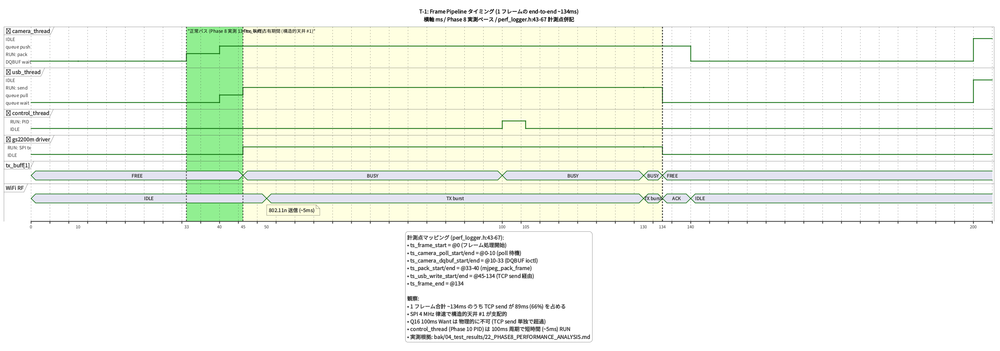
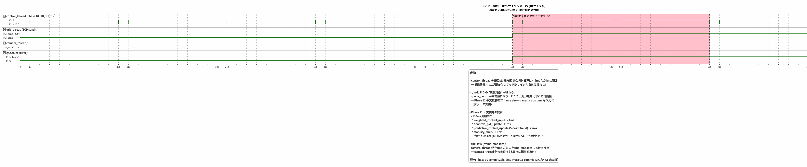
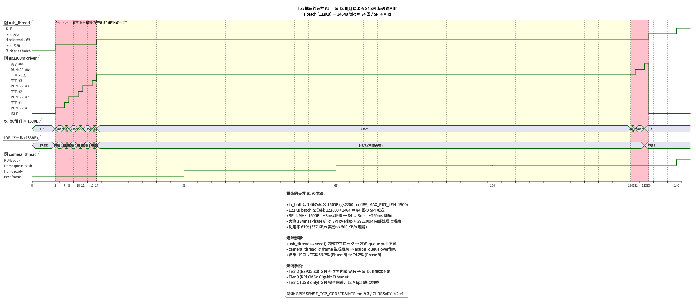
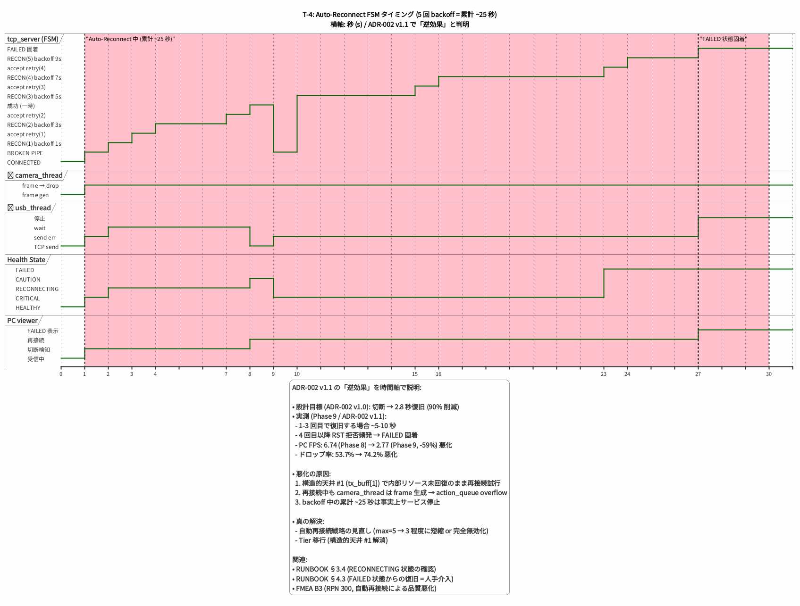
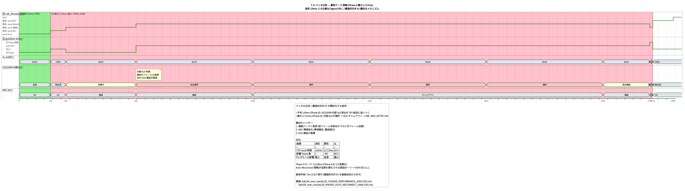

# CPU & 帯域 予算表 (Performance Budget)

**バージョン**: 1.2 (Minto Pyramid 準拠でサマリ追加)
**作成日**: 2026-05-01
**最終更新**: 2026-05-22

---

## 📋 サマリ

### 本書の最大の発見 4 つ

1. **CPU は単一コアの time-sharing** — Spresense は物理 Cortex-M4F × 6 コア持つが `CONFIG_SMP=n` のため **1 コアのみ動作 (AMP モード)**。全アプリスレッドが単一コア競合 (§1)
2. **帯域支配構造**: SPI 4 MHz = **500 KB/s ピーク** が天井 (§3.1)。WiFi 802.11n の能力 (12 Mbps) を SPI が律速
3. **レイテンシ支配**: TCP send **134 ms ± 50 ms** が中央の障壁 (§4)。総 End-to-End 遅延の 60%+ を占める
4. **CPU 利用率は実測未確立** — 主要 5 スレッドの CPU 占有率を測定する手段が現在ない (§5 P1-A 計測タスク優先度)

### 主要結論 (Phase 12 への含意)

| 項目 | 状況 | 含意 |
|---|---|---|
| CPU 予算 | TBD (計測手段未確立) | **§5 計測タスク P1-A 優先** で着手必要 |
| SPI 帯域 | 500 KB/s 天井 (構造制約) | Tier 2/3 移行のみで根治 |
| TCP レイテンシ | 134 ms ± 50 ms | STAMP/STPA M-1 の代理指標として活用済 |
| Full HD 30fps 帯域 | 1830 KB/s 必要 vs 500 KB/s | **物理的達成不可** (要求書 Q1 で確定) |

### 詳細目次

- [§1 アーキ前提](#1-アーキテクチャ前提-cpu-モデルの正確化) — AMP モード / 単一コア共有
- [§2 CPU 予算](#2-アプリスレッド-cpu-予算-1-コア共有) — 5 スレッド配分
- [§3 帯域予算](#3-帯域予算-bandwidth-budget) — SPI / WiFi / USB
- [§4 レイテンシ予算](#4-レイテンシ予算-latency-budget) — 段階別 / End-to-End / ボトルネック
- [§5 計測手段](#5-計測手段の確立-p1-a-の前提タスク) — NuttX 機能 / perf_logger 拡張 / 帯域実測
- [§7 タイミング分析](#7-タイミング分析-動的挙動の可視化) — PlantUML 図解 T-1〜T-5

---

**目的**: SPRESENSE_TCP_CONSTRAINTS.md (メモリ予算) を補完し、CPU 利用率・帯域利用率・レイテンシを定量化 + PlantUML タイミング図で動的挙動を可視化
**位置付け**: P1-A タスク (PENDING_NFR_WORK.md) + タイミング分析拡張 (2026-05-03)

> **方針**: 既存実測値 (Phase 8/9 + perf_logger) と理論計算を併記。実測手段未確立の項目は **TBD** として計測方法を記載する。

---

## §1 アーキテクチャ前提 (CPU モデルの正確化)

> ⚠ **重要な事実**: Spresense は物理的に **Cortex-M4F × 6 コア** を持つが、**CONFIG_SMP=n** (`spresense/nuttx/.config:636`) のため NuttX は **1 コアのみで動作する Asymmetric Multi-Processing (AMP)** モード。本プロジェクトの全アプリスレッドは**単一コアの time-sharing** で動作。

| 項目 | 値 | 出典 |
|---|---|---|
| CPU | Cortex-M4F (Thumb-2, FPU あり) | CXD5602 仕様 |
| クロック | 156 MHz | CXD5602 仕様 |
| 総コア数 (物理) | 6 | CXD5602 仕様 |
| NuttX 利用コア | **1** (CONFIG_SMP=n) | `spresense/nuttx/.config:636` |
| 他 5 コアの状態 | DSP / audio / 未使用 (本プロジェクトで未活用) | 同上 |
| CONFIG_SCHED_CPULOAD | **無効** | `.config:674` |
| → 実測手段 | sched 経由の CPU% は不可、計装が必要 | (§5 参照) |

**結論**: 本プロジェクトの実効 CPU は **156 MHz × 1 コア** 相当。残り 5 コアは将来余地 (Phase 11 multi-variable 制御や AI 推論を分散させる選択肢)。

---

## §2 アプリスレッド CPU 予算 (1 コア共有)

5 つのスレッドが単一コアを共有。優先度・周期・推定 CPU 使用率を整理する。

| スレッド | 優先度 | 周期/動作 | 推定 CPU% | 計測状況 |
|---|---|---|---|---|
| 🧵 main task (起動のみ) | 100 | 起動時 → idle | < 1% | n/a |
| 🎬 camera_thread_func | 100 | V4L2 dequeue (blocking) → MJPEG pack → push | **TBD** (推定 30-50%) | 🟡 未計測 |
| 🚚 usb_thread_func | 100 | action_queue pull → batch → tcp/usb send | **TBD** (推定 20-30%) | 🟡 未計測 |
| 🎛️ control_thread_func (Phase 10) | 100 | 100 ms 周期 PID 制御 | **< 1%** (PID 計算は軽量) | 🟢 推定確度高 |
| 📡 gs2200m driver task (kernel) | 50 | SPI 転送 + 通知処理 | **TBD** (推定 20-40%) | 🟡 未計測 |
| **合計** | — | — | **70-100%+ 推定** | — |

**観察**:
- camera_thread と gs2200m driver task が CPU の主要消費者と推定
- 構造的天井 #1 (`tx_buff[1]`) で SPI 転送が完全直列化 → gs2200m driver の CPU 占有率が高くなる仮説
- control_thread (Phase 10 PID) は 100 ms 周期で短時間 → CPU 予算は十分余裕あり
- **Phase 11 多変数制御を実装する場合**, weighted_control_input + adaptive PID + predictive controller を 100 ms 周期内に収める必要 → CPU 予算検証が必要

**Phase 11 拡張時の懸念**:
- `STABILITY_HISTORY_SIZE=5` の分散計算 + `prediction_window` の trend 分析 = 推定 < 5 ms / 100 ms 周期 → 余裕あり
- ただし frame_statistics_update が camera_thread で動いているため、Phase 11 拡張で更に重くなる可能性あり (要計測)

---

## §3 帯域予算 (Bandwidth Budget)

### §3.1 SPI (Spresense ↔ GS2200M)

| 項目 | 値 |
|---|---|
| クロック (確定) | **4 MHz** (CONFIG_WL_GS2200M_SPI_FREQUENCY=4000000) |
| ペイロード理論 (8-bit) | 4 Mbps = 500 KB/s |
| 1 パケット最大 | `MAX_PKT_LEN = 1500B` (gs2200m.c:76) |
| BULK_THRESHOLD | 8 KB (`gs2200m.c:99`) |
| HAL_TIMEOUT | 5 秒 |
| WR_MAX_RETRY | 100 |

**MJPEG 30 fps 利用率計算**:

```
1 batch packet = ~122 KB (mjpeg_protocol.h: BATCH_SIZE=2 × ~50 KB JPEG)
30 fps / batch=2 → 15 batch/秒
帯域消費 = 122 KB × 15 = 1830 KB/s

→ SPI 4 MHz 理論 500 KB/s に対して 366% (= 不可能)
```

**実測 (Phase 8/9)**:
- 実測 PC FPS: 6.74 (Phase 8) — つまり実効 SPI 帯域 = ~50 KB × 6.74 ÷ 1 = **337 KB/s** (理論 500 KB/s の **67%**)
- 実測の "missing 33%" = SPI プロトコルオーバーヘッド + tx_buff 単一化による wait 時間

| 指標 | 値 |
|---|---|
| 理論帯域 | 500 KB/s |
| 実効帯域 (Phase 8) | ~337 KB/s |
| 利用率 | **67%** |
| → 余裕 | 約 33% (プロトコルオーバーヘッドで埋まる) |

**結論**: SPI 4 MHz は MJPEG 30 fps を支えるには**完全に不足**。これが構造的天井 #1 の数値根拠。

### §3.2 WiFi 802.11n (GS2200M ↔ AP)

| 項目 | 値 |
|---|---|
| 規格 | 802.11n (理論最大 150 Mbps) |
| GS2200M 公称 | ~数 Mbps (低帯域 IoT 向け) |
| 実効帯域 | **TBD** (未計測) |
| 律速 | SPI 4 MHz で先に律速 (構造的天井 #1) → WiFi は事実上 ボトルネックではない |

**結論**: WiFi 帯域は構造的天井 #1 (SPI 4 MHz) で先に律速されるため、WiFi 単独の帯域問題は表面化しない。

### §3.3 USB CDC-ACM (Spresense ↔ PC)

| 項目 | 値 | 出典 |
|---|---|---|
| 規格 | USB Full Speed | spec |
| 理論帯域 | 12 Mbps = **1.5 MB/s** | spec |
| 実効帯域 (Phase 1.5 実測) | **8.5 Mbps = ~1.06 MB/s** | `phase15_vga_dataflow.puml:78` |
| 利用率 | **70%** | 同上 |
| 1 フレーム転送時間 (41.1 KB) | **27.4 ms** | `usb_optimization_strategies.puml:167` |
| 帯域利用率 (上記 1 フレーム) | **90.7%** | 同上 |

**MJPEG 30 fps 利用率計算 (USB)**:

```
1 frame = 50 KB → 30 fps × 50 KB = 1500 KB/s = 1.5 MB/s
→ USB 1.5 MB/s 理論帯域に対して 100% (限界)

実効 1.06 MB/s に対しては 142% (= 帯域不足)
→ USB 路は VGA 30 fps が現実的な上限
```

**結論**: USB CDC-ACM は理論 1.5 MB/s だが実効 1.06 MB/s。VGA 30 fps なら成立、Full HD 30 fps は不可。Tier C (USB-only 候補) では VGA/HD 上限が現実的。

### §3.4 帯域予算サマリ

| 経路 | 理論 | 実効 | 利用率 | MJPEG 30fps 適合性 |
|---|---|---|---|---|
| SPI 4 MHz | 500 KB/s | ~337 KB/s | 67% | 🔴 不可 (約 1.8 MB/s 必要) |
| GS2200M WiFi | 数 Mbps | 律速されるため未計測 | — | (SPI で律速) |
| USB CDC-ACM | 1.5 MB/s | ~1.06 MB/s | 70% | 🟡 VGA 30fps が上限 |

**Tier 移行による効果予測**:
- Tier 2 (ESP32-S3): 内蔵 WiFi 経由 → SPI 制約解消 → Full HD 30 fps 達成可能性高
- Tier 3 (RPi CM5): Gigabit Ethernet → 1000 Mbps 帯域 → Full HD 30 fps 確実
- Tier C (USB-only): 12 Mbps Full Speed → VGA/HD 程度に制限

---

## §4 レイテンシ予算 (Latency Budget)

### §4.1 段階別分解 (perf_logger.h で計測済)

`perf_logger.h:43-67` で以下を計測 (`perf_frame_metrics_t`):

| 段階 | 計測フィールド | 用途 |
|---|---|---|
| Camera poll | `latency_camera_poll` | poll() 待機時間 |
| Camera DQBUF | `latency_camera_dqbuf` | VIDIOC_DQBUF ioctl 時間 |
| MJPEG pack | `latency_pack` | mjpeg_pack_frame() 時間 |
| USB write | `latency_usb_write` | USB write() 時間 (USB 路時のみ) |
| 合計 | `latency_total` | フレーム処理合計 |

**実測値 (Phase 8 / `22_PHASE8_PERFORMANCE_ANALYSIS.md`)**:

| 段階 | Phase 8 実測 | コメント |
|---|---|---|
| TCP 平均送信時間 | **134 ms** | Phase 7 比 -43% 改善 |
| TCP 最大送信時間 | **2,713 ms** | バースト時は劣化 |
| JPEG デコード (PC 側) | 2.07 ms | 良好 |
| シリアル読み込み (USB 路) | 174 ms | USB 経路 |

### §4.2 End-to-End レイテンシ予算 (Phase 8 ベース)

```
[Spresense 側]
  ISX012 capture (V4L2 RING) → ~33 ms (1 frame 周期 30 fps)
  V4L2 DQBUF (ioctl)         → < 1 ms (推定)
  MJPEG pack + CRC           → < 5 ms (推定)
  TCP send (SPI 経由)         → 134 ms (実測平均)
                              [構造的天井 #1 で律速]
[ネットワーク]
  WiFi 802.11n               → < 5 ms (推定)
  AP → PC                    → < 5 ms (LAN 内)
[PC 側]
  TCP 受信 + バッファ          → < 5 ms (推定)
  bounded(3) channel queueing → < 10 ms (推定)
  JPEG デコード               → 2 ms (実測)
  egui texture upload + 描画  → < 16 ms (60 Hz 描画 1 frame)

合計 (推定): ~175-220 ms
```

**Q16 要求との照合**:
- Must < 1 秒: ✅ 達成 (推定 ~200 ms)
- Want < 100 ms: 🔴 未達 (構造的天井 #1 の TCP send 134 ms だけで超過)

### §4.3 ボトルネック支配構造

| 段階 | 比率 | 改善余地 |
|---|---|---|
| TCP send (SPI 律速) | **~67%** (134 ms / 200 ms) | Tier 2/3 移行のみで解消可 |
| Capture 周期 | ~16% (33 ms / 200 ms) | カメラ FPS up で改善 |
| その他 | ~17% | チューニング余地少 |

**結論**: 100 ms Want を達成するには TCP send を 50 ms 以下に圧縮する必要 → SPI 4 MHz では不可能。Tier 移行が必須。

---

## §5 計測手段の確立 (P1-A の前提タスク)

現状 perf_logger は **frame レベルのレイテンシ** は捕捉するが、**per-thread CPU 利用率**は計測していない。以下の手段で計装が必要。

### §5.1 NuttX 標準機能 (要 .config 変更)

| 機能 | .config | 効果 |
|---|---|---|
| `CONFIG_SCHED_CPULOAD` | `=y` 必須 | sched が CPU 時間を集計 |
| `CONFIG_SCHED_CPULOAD_TICKSPERSEC` | 100 (推奨) | 1 秒に 100 回サンプリング |
| `CONFIG_FS_PROCFS` | `=y` | /proc 経由でメトリクス取得 |
| `CONFIG_FS_PROCFS_REGISTER` | `=y` | Register 可視化 |
| → CLI で `top` / `ps` 相当 | — | スレッド別 CPU% を実測可能 |

### §5.2 perf_logger 拡張案 (アプリ側)

```c
typedef struct perf_thread_metrics_s {
  pthread_t tid;
  uint64_t total_runtime_us;     /* スレッドの累積 CPU 時間 */
  uint64_t window_runtime_us;    /* ウィンドウ内 CPU 時間 */
  float cpu_percent;             /* ウィンドウ内 CPU 利用率 */
} perf_thread_metrics_t;
```

**計装ポイント**:
- 各スレッド entry/exit で `clock_gettime(CLOCK_PROCESS_CPUTIME_ID)` 取得 (NuttX 対応要確認)
- もしくは sched_yield 前後で calendar time 差分を取る簡易法

### §5.3 帯域実測 (アプリ側)

`perf_logger.c` で `total_jpeg_bytes / window_duration_us` を計算済 (existing)。これを SPI/WiFi/USB 経路ごとに分離して metrics packet に同梱すれば PC 側で集計可能。

### §5.4 計測タスクの優先度

1. **P0 で十分**: 既存 perf_logger 出力を使ったレイテンシ分解 (§4 の数値) → **本書で完了**
2. **P1 で実施推奨**: CONFIG_SCHED_CPULOAD=y 有効化 + `top` 経由で CPU% 取得 (1 セッション)
3. **P2 で検討**: per-thread CPU 計装 + metrics packet 拡張 (Phase 11 多変数制御の負荷確認に有用)

---

## §7 タイミング分析 (動的挙動の可視化)

§2-§4 の静的分析を補完するため、PlantUML timing 図で時間軸ベースの動的挙動を可視化。実測値 (Phase 8/9) と perf_logger 計測点を紐付けて、構造的天井 #1 が顕在化する瞬間と連鎖メカニズムを把握する。

### §7.1 図解一覧

#### T-1: Frame Pipeline タイミング (~134ms)

ソース: [`../architecture/cpu_timing_frame_pipeline.puml`](../architecture/cpu_timing_frame_pipeline.puml) / 画像: [`../architecture/cpu_timing_frame_pipeline.png`](../architecture/cpu_timing_frame_pipeline.png)



5 アプリスレッド + SPI/WiFi の状態遷移を 0-200ms で表示。perf_logger.h:43-67 の計測点 (`ts_camera_poll_*`, `ts_camera_dqbuf_*`, `ts_pack_*`, `ts_usb_write_*`, `ts_frame_end`) との対応を明示。**TCP send (45-134ms) が 1 フレーム時間の 66% を占める**ことを視覚化。

#### T-2: PID 制御 100ms サイクル × 1 秒

ソース: [`../architecture/cpu_timing_pid_cycle.puml`](../architecture/cpu_timing_pid_cycle.puml) / 画像: [`../architecture/cpu_timing_pid_cycle.png`](../architecture/cpu_timing_pid_cycle.png)



control_thread の 10 Hz 動作と他 thread の CPU 競合を 1 秒間 (10 サイクル) で表示。500-700ms の構造的天井 #1 顕在化期間中も control_thread の PID 計算自体は維持される (~5ms / 100ms 周期) が、観測対象 (queue_depth) が異常値となり PID 出力が無効化される事実を示す。Phase 11 .c 実装時の追加負荷試算 (< 5ms 増) も併記。

#### T-3: tx_buff[1] 直列化 — 84 SPI 転送

ソース: [`../architecture/cpu_timing_tx_buff_serialization.puml`](../architecture/cpu_timing_tx_buff_serialization.puml) / 画像: [`../architecture/cpu_timing_tx_buff_serialization.png`](../architecture/cpu_timing_tx_buff_serialization.png)



122KB batch を 84 SPI 転送に分解する詳細。usb_thread が send() 内で ~125ms ブロックする期間と、その間 camera_thread が frame 生成を継続して action_queue overflow を引き起こす連鎖影響を視覚化。**構造的天井 #1 のメカニズムを最も詳細に示す図**。

#### T-4: Auto-Reconnect FSM タイミング

ソース: [`../architecture/cpu_timing_auto_reconnect.puml`](../architecture/cpu_timing_auto_reconnect.puml) / 画像: [`../architecture/cpu_timing_auto_reconnect.png`](../architecture/cpu_timing_auto_reconnect.png)



5 回 backoff (1s + 3s + 5s + 7s + 9s = 累計 25 秒) の状態遷移を秒単位で表示。tcp_server FSM / camera_thread / usb_thread / Health State / PC viewer の 5 レーンで Auto-Reconnect の **逆効果** (PC FPS 6.74→2.77, ドロップ 53.7%→74.2%) を時間軸で説明。RUNBOOK §3.4 / §4.3 連動。

#### T-5: ジッタ分析 (134ms vs 2,713ms)

ソース: [`../architecture/cpu_timing_jitter_comparison.puml`](../architecture/cpu_timing_jitter_comparison.puml) / 画像: [`../architecture/cpu_timing_jitter_comparison.png`](../architecture/cpu_timing_jitter_comparison.png)



良性 (134ms 平均) と悪性 (2,713ms 最大) の対比。GS2200M 内部 buf 充填 → ACK タイムアウト → WR_MAX_RETRY 100 のメカニズムを可視化。**「ジッタ 20×」の正体**を構造的天井 #1 顕在化の連鎖として示す。

### §7.2 主要観察 (静的分析を補完する追加発見)

#### A. Producer-Consumer の非対称性 (T-1, T-3 から)
- **camera_thread (Producer)**: ~33ms 周期で frame 生成
- **usb_thread (Consumer)**: 1 batch ~134ms (構造的天井 #1 で律速)
- **不均衡比 = 134 / 33 ≈ 4×**: action_queue (5/7/9) で 1-3 frame 分の余裕しか吸収できない
- → 構造的天井 #1 顕在化時に即座に overflow → ドロップ率上昇

#### B. control_thread の独立性 (T-2 から)
- Phase 10 PID は **構造的天井 #1 顕在化時も時間的にロバスト** (10Hz 周期維持)
- ただし **入力データが破綻** すると PID は無効化される
- Phase 11 多変数制御を実装すれば「frame size が異常」「transmission time 過大」を観測軸に追加できる → ある程度ロバスト性向上見込み (FMEA B8 RPN 225 軽減効果あり)

#### C. SPI 転送中の他スレッドへの連鎖影響 (T-3 から)
- usb_thread が SPI 転送中ずっと block → queue pull できない
- camera_thread が frame 生成継続 → queue overflow
- gs2200m driver の prio=50 (アプリより低) → 高負荷時に SPI 自体も遅延
- **連鎖効果が累積する構造**

#### D. Auto-Reconnect の時間的非効率 (T-4 から)
- 1 回目失敗から 5 回目失敗まで **累計 25 秒**
- backoff 1s + 3s + 5s + 7s + 9s は **線形増加に近い** (exp ではない)
- 25 秒間 camera_thread は frame 生成継続 → 推定 ~750 frame ドロップ (30fps × 25s)
- 真の解決: max=5 → 3 短縮、または完全無効化 + 即時 FAILED 状態移行 + 通知

#### E. ジッタの 2 モード性 (T-5 から)
- ジッタは「連続変動」ではなく **2 状態モード** (134ms 平均 ⇔ 2,713ms 異常)
- 異常モードへの遷移条件: 連続バースト + WiFi 劣化 + ACK 遅延累積
- → モード判定 (`tcp_health_moving_avg_ms` 閾値超過 検出) で予兆検知可能

### §7.3 Phase 12 判断材料への寄与

| 判断 | 関連図 | タイミング分析からの寄与 |
|---|---|---|
| Tier 移行判断 | T-1, T-3, T-5 | 構造的天井 #1 が時間軸で支配的、ソフトチューニング不能を視覚化 |
| 自動再接続戦略再考 | T-4 | 25 秒ロスとフレームドロップの定量化、max 短縮 + 即時 FAILED 移行を支持 |
| Phase 11 .c 実装判断 | T-2 | 100ms 周期内の余裕を試算、追加負荷 < 5ms で実装可能性高 |
| 運用ランブック (RUNBOOK) | T-4 | RECONNECTING 期間と FAILED 遷移点を時間で明示、待機判断の根拠 |

---

## §6 結論と次のアクション

| 観点 | 状態 | 次アクション |
|---|---|---|
| メモリ予算 | ✅ 完備 (`SPRESENSE_TCP_CONSTRAINTS.md` §2) | — |
| CPU 予算 (理論) | 🟡 本書 §2 で推定値を提示 | CONFIG_SCHED_CPULOAD=y で実測 |
| 帯域予算 | 🟢 SPI/USB は数値化、WiFi は律速されるため不要 | — |
| レイテンシ予算 | 🟢 段階分解 + 実測値 | TCP send の最大値 (2,713 ms) の発生条件特定 |
| 構造的天井との関係 | 🟢 SPI 4 MHz が支配的、Tier 移行で解消 | Phase 12 で Tier 判断 |

**Phase 12 への引き継ぎ事項**:
1. 100 ms Want は **物理的に達成不可** (本書で再確認)
2. CPU 予算の実測手段確立 (§5.1) を **CONFIG 変更タスク** として登録 → PENDING_NFR_WORK X-6
3. Phase 11 多変数制御の CPU 負荷見積もりは本書 §2 の枠内に収まる見込み (実装後要計測)

---

## 関連文書

- 構造的制約 (メモリ予算): [`../architecture/SPRESENSE_TCP_CONSTRAINTS.md`](../architecture/SPRESENSE_TCP_CONSTRAINTS.md)
- 品質要求集約: [`QUALITY_REQUIREMENTS.md`](QUALITY_REQUIREMENTS.md) §2 (性能効率性)
- QAS シナリオ: [`QUALITY_ATTRIBUTE_SCENARIOS.md`](QUALITY_ATTRIBUTE_SCENARIOS.md) QAS-2, QAS-3, QAS-10
- 用語集: [`GLOSSARY.md`](GLOSSARY.md) (構造的天井 #1〜#5)
- 実測根拠: `bak/04_test_results/22_PHASE8_PERFORMANCE_ANALYSIS.md`, `phase15_vga_dataflow.puml`
- 計装基盤: `apps/examples/security_camera/perf_logger.c/h`
- 残タスク: [`PENDING_NFR_WORK.md`](PENDING_NFR_WORK.md) X-6 (CPU 予算実測手段)

---

## 改訂履歴

| バージョン | 日付 | 変更内容 |
|---|---|---|
| 1.0 | 2026-05-01 | 初版。CPU モデルの正確化 (CONFIG_SMP=n / 単一コア)、帯域予算 (SPI/WiFi/USB) 数値化、レイテンシ予算分解、計測手段の確立方針 |
| 1.1 | 2026-05-03 | §7 タイミング分析 (動的挙動の可視化) 追加。PlantUML timing 図 5 枚 (T-1 Frame Pipeline / T-2 PID サイクル / T-3 tx_buff 直列化 / T-4 Auto-Reconnect / T-5 ジッタ比較) で静的分析を補完。Producer-Consumer 非対称性 / control_thread 独立性 / SPI 連鎖影響 / Auto-Reconnect 25 秒ロス / ジッタ 2 モード性 の 5 観察を新規追加 |
