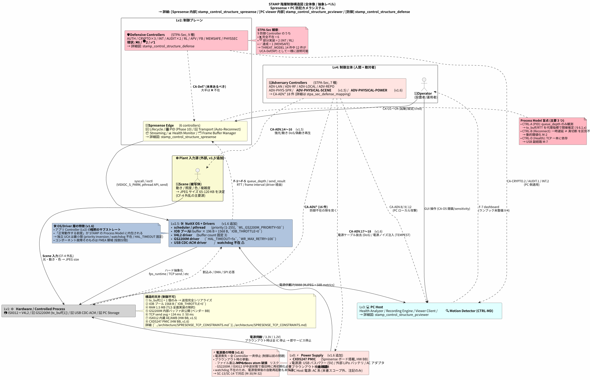
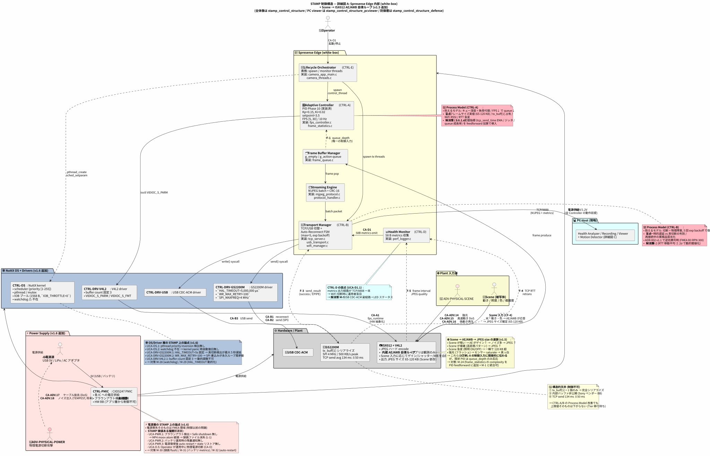
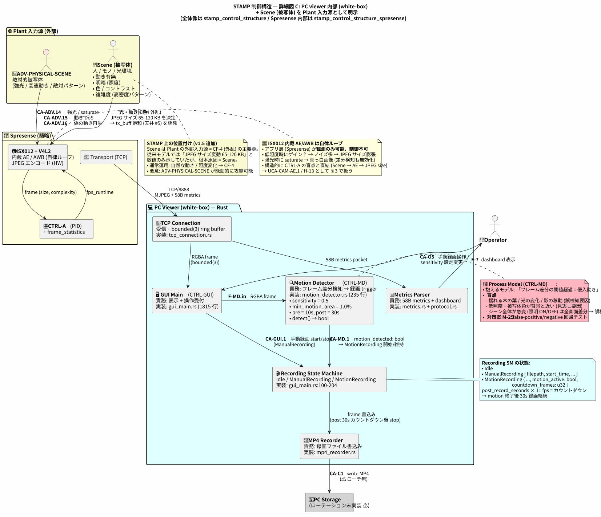
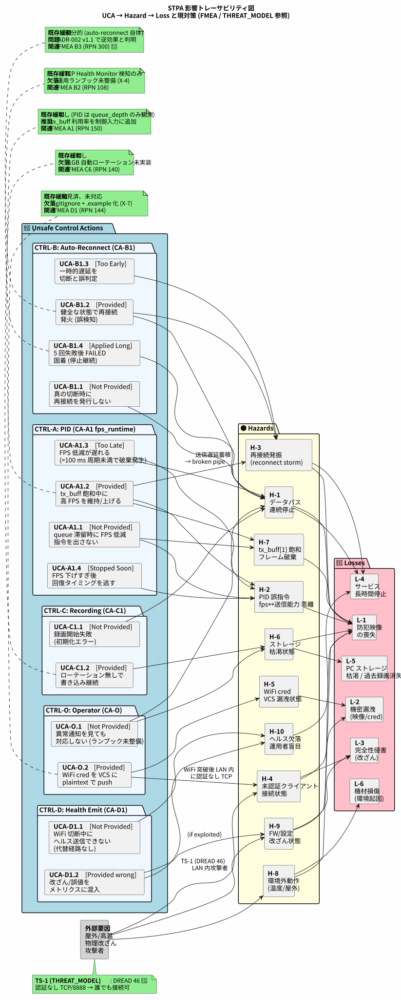
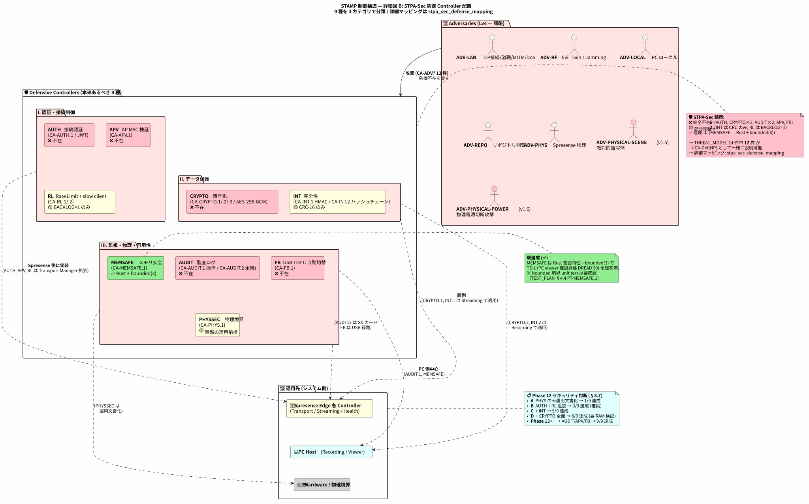
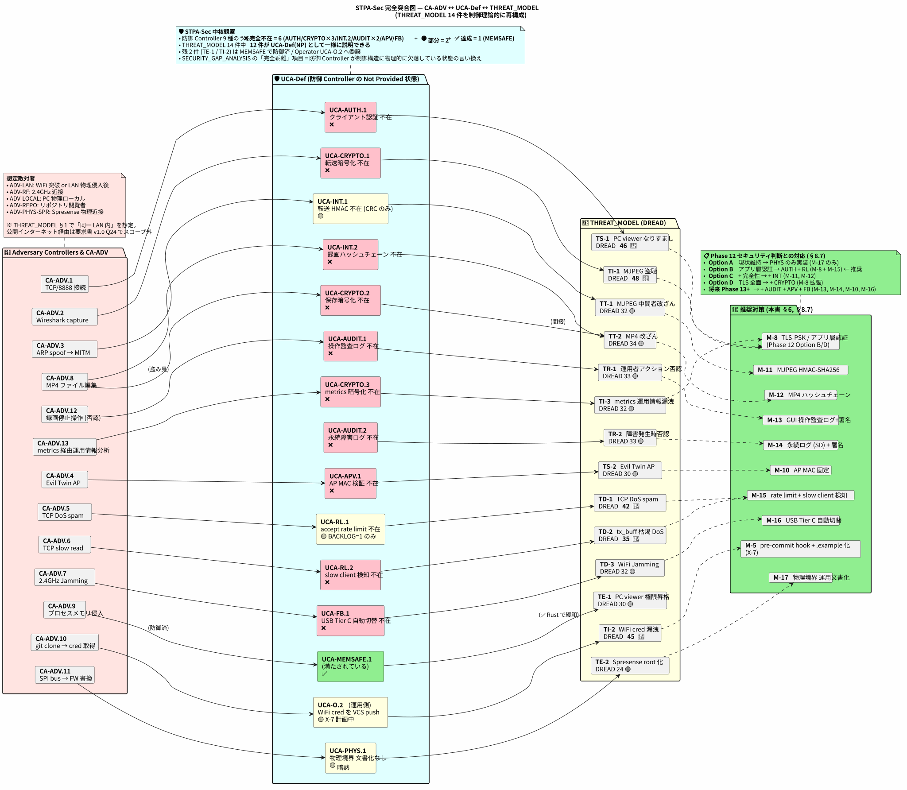

# STAMP / STPA Analysis (System-Theoretic Process Analysis)

**バージョン**: 1.8 (Minto Pyramid 準拠でエグゼクティブサマリを冒頭に追加)
**作成日**: 2026-05-19 (最終更新: 2026-05-22)
**準拠**: Leveson, *Engineering a Safer World* (2011) / *STPA Handbook* (2018, Leveson & Thomas) / Young & Leveson, "Inside Risks: An Integrated Approach to Safety and Security Based on Systems Theory" (2014, CACM)

---

## 📋 エグゼクティブサマリ

### 本書の最大の発見 3 つ

1. **PID 単一入力の構造的限界** — Phase 10 PID は `queue_depth` のみを観測。Scene 急変・`tx_buff` 飽和・WiFi RTT 急変を **遡及的にしか検出できない**。代理指標 (`tcp_send_time` EMA / send ジッタ / queue 成長率 / frame complexity) で間接推定する M-1 + M-24 が現実解 (§6.1.x)
2. **防御 Controller の体系的欠落 (STPA-Sec)** — 9 種の防御 Controller のうち **6 種が完全不在** (AUTH / CRYPTO×3 / AUDIT×2 / APV / FB の大半)、2 種が部分実装、1 種のみ達成 (MEMSAFE)。THREAT_MODEL 14 件中 **12 件が UCA-Def(NP) として一様に説明可能** (§8)
3. **電源 Safe shutdown の欠如** — ブラウンアウト時に書込み中の MP4 が moov atom 欠落で再生不能になる構造的リスク。FMEA / THREAT_MODEL ともに未収録の新規論点 (v1.6 §3.7.10, S-12)

### 分析スコープ (v1.7.1 時点)

| 指標 | 数値 |
|---|---|
| UCA (Unsafe Control Action) | **67 件** |
| Hazard | 16 件 (H-1〜H-16) |
| System Safety Constraint | 15 件 (SC-1〜SC-15) |
| 推奨対策 M-* | M-1〜M-33 (工数/担当/Phase 付き) |
| 図 | 6 枚 (全体像 + Spresense 詳細 + PC viewer 詳細 + 防御 + 影響トレース + Sec マッピング) |
| 既存文書突合 | FMEA 28 件 + THREAT_MODEL 14 件 = **100% カバー** (保守性 3 件・未使用 1 件除く) |

### Phase 12 推奨アクション

| Phase | 期間 | 工数 | 緩和される UCA | 備考 |
|---|---|---|---|---|
| **12.1 即着手** | 1-2 週間 | **11 人日** | 12 UCA (高 ROI) | M-3 / M-5 / M-6 / M-17 / M-20 / M-25 / M-27 / M-33 |
| 12.2 | 4-6 週間 | 12 人日 | 副経路系 7 UCA | M-7 / M-18〜22 / M-31 |
| 12.3 | 4-8 週間 | 55-65 人日 | 制御 + Sec + OS/PWR 中核 | M-1 / M-2 / M-8 / M-10 / M-11 / M-15 / M-23 / M-24 / M-28〜30 / M-32 |
| 13+ | 別計画 | 36 人日 | HW/構造変更要 5 UCA | M-4 / M-9 / M-12〜14 / M-16 / M-26 |
| **総工数** | — | **約 110-120 人日** | (統合圧縮込みで 104-114) | §6.8 詳細 |

### 5 文書間の役割分担 (§10.8)

| 領域 | 担当文書 | 本書との関係 |
|---|---|---|
| コンポーネント故障 | [FMEA.md](FMEA.md) | 故障モード自体は FMEA、**制御連鎖と防御不在** のみ本書で UCA 化 |
| 攻撃者意図 | [THREAT_MODEL.md](THREAT_MODEL.md) | 14 件全件を §8.6 で UCA-Def にマッピング |
| 設計-実装乖離 | [SECURITY_GAP_ANALYSIS.md](SECURITY_GAP_ANALYSIS.md) | §8.4 で対応関係明示 |
| **制御パラメータ・相互作用** | **本書** | HAL_TIMEOUT, IOB_THROTTLE, sensitivity 等 |
| テスト実装 | [STAMP_STPA_TEST_PLAN.md](STAMP_STPA_TEST_PLAN.md) | 本書 UCA を TC/PT に展開 |

→ 本書単独で全てを扱う意図はない。**STAMP は「制御相互作用の問題」、FMEA は「コンポーネント故障」、THREAT_MODEL は「攻撃者意図」** という役割分担。

### 詳細目次

- [§0 入力資料](#0-入力資料-ベースとした構造図仕様) — どのアーキ図/仕様を参照したか
- [§1 STPA Step 1](#1-stpa-step-1--purpose--losses--hazards--constraints) — 損失 / Hazard / SC
- [§2 STPA Step 2](#2-stpa-step-2--制御構造のモデル化) — 制御構造図 (全体 / Spresense / PC viewer)
- [§3 STPA Step 3](#3-stpa-step-3--unsafe-control-actions-uca-マトリクス) — UCA 67 件
- [§4 STPA Step 4](#4-stpa-step-4--loss-scenarios-causal-factors) — 損失シナリオ S-1〜S-14
- [§5 影響分析](#5-影響分析-impact-analysis) — UCA × Hazard × Loss
- [§6 推奨対策](#6-推奨対策-新規--既存補強) — M-1〜M-33 (工数/担当/Phase)
- [§7 STAMP/STPA 追加知見](#7-stampstpa-が既存分析に追加した知見)
- [§8 STPA-Sec 拡張](#8-stpa-sec-拡張--敵対的環境下の安全分析) — 防御 Controller / 敵対者
- [§9 既存論点完全突合](#9-既存論点との完全突合-fmea--threat_model)
- [§10 残課題](#10-残課題--次フェーズ) — Phase 12 着手前の前提検証含む

---

**目的**: `02_specifications/architecture/` の構造図・仕様をベースに、本システムの **制御構造起点** の安全分析を実施する。FMEA (故障モード起点) / THREAT_MODEL (攻撃者起点) を完全に取り込み、コンポーネント間相互作用・不適切な制御アクションに起因する損失を体系的に抽出する。

<details>
<summary>📜 改訂履歴 (v1.1 〜 v1.8) — クリックで展開</summary>

> **v1.1 改訂内容**:
> - 純粋 STPA 漏れ 8 件 (FMEA A2/B4/B5/B6/B7/C1/C3/C4) を §3.7 として UCA 化
> - **STPA-Sec 拡張** (§8) を追加し、敵対者を Lv4 Controller として明示。THREAT_MODEL 14 件を UCA-Defense にマップ
> - 既存論点完全突合表 (§9) を追加。FMEA 28 + THREAT_MODEL 14 を 100% カバー (保守性 3 件と未使用 1 件除く)
> - 推奨対策を M-1〜M-9 から **M-1〜M-22** に拡張
>
> **v1.2 改訂内容** (4 視点レビュー反映):
> - **テスト計画を別ファイル** [`STAMP_STPA_TEST_PLAN.md`](STAMP_STPA_TEST_PLAN.md) として分離。UCA 再現手順 / SC 測定 metrics / リグレッションテスト / カバレッジ KPI を網羅
> - **§6 対策表に工数 (人日) / 担当 / Phase / 既存タスク / 採用条件 (KPI) 列を追加**。Phase 12 判断材料として実用化
> - **§6.1.x で M-1 の代理指標設計を明示** — `tx_buff` 観測不可制約と多変数化制御入力の矛盾を `tcp_send_time` EMA / ジッタ / queue 成長率で解消
> - **§6.8 全体ロードマップ** — Phase 別工数集計 (12.1=6 人日, 12.2=9 人日, 12.3=33-43 人日, 13+=31 人日)
>
> **v1.3 改訂内容**:
> - PlantUML 図 3 枚を **SVG 化してインライン埋め込み** (§2.1 / §5.1 / §8.8)。GitHub / VS Code Markdown プレビュー双方で表示可能
> - SVG 再生成手順を付録 B に追記
>
> **v1.4 改訂内容** (図の可読性改善):
> - 制御構造図 `stamp_control_structure.puml` を **抽象化** (4229 × 1791 → 1917 × 951)。全体像のみを示す
> - 詳細を 2 つの図に **分割**: §2.4 [`stamp_control_structure_spresense.svg`](stamp_control_structure_spresense.svg) (Spresense 内部 / 1706 × 1487) + §8.4 [`stamp_control_structure_defense.svg`](stamp_control_structure_defense.svg) (防御 Controllers / 2501 × 1485)
> - 3 段階の参照: 全体 (§2.1) → Spresense 詳細 (§2.4) / 防御詳細 (§8.4) → 完全マッピング (§8.8)
>
> **v1.5 改訂内容** (Scene / Motion / AE をモデルに統合 — レビュー指摘対応):
> - **Scene (被写体) を Plant 入力源として明示** — JPEG サイズ変動 (65-120 KB) の根本原因として CF-4 主要源化
> - **CTRL-MD (Motion Detector) を PC viewer 内 Controller として追加** — `motion_detector.rs` (235 行) を制御構造に組み込み (CA-MD.1 / RecordingState 連動)
> - **CTRL-CAM-AE/AWB (ISX012 内蔵) を「観測可能・制御不可」Controller として明記** — Tier 1 限界を構造的に示す
> - **新規詳細図 C** [`stamp_control_structure_pcviewer.svg`](stamp_control_structure_pcviewer.svg) (1653 × 1424) を §2.5 に追加
> - 新規 Hazard H-11/H-12/H-13 + SC-11/SC-12
> - 新規 UCA: UCA-A1.5 / UCA-MD.1〜4 / UCA-CAM-AE.1〜3 / UCA-SCENE.1, .2 (計 10 件)
> - 新規敵対者 **ADV-PHYSICAL-SCENE** + CA-ADV.14〜16 (強光 / Scene DoS / 偽動き再生)
> - 新規対策 M-24 (Scene complexity feedforward) / M-25 (motion FP/FN 回帰テスト) / M-26 (AE Safe Range セルフテスト) / M-27 (sensitivity ランブック)
> - 総 UCA 数 v1.1=44 → **v1.5=54 件**、総工数 v1.5 推定 89-99 人日
>
> **v1.7.1 改訂内容** (既存資料調査による実数値化と訂正):
> - **§10.9 前提検証を実調査で更新** — 5 項目中 3 件が ✅ 確定 (NuttX WATCHDOG, frame complexity, bounded(3) 実装) / 1 件部分確定 (CRC 破棄実装済) / 1 件未確定 (PMIC)。当初 3.5 人日 → **0.5-1.5 人日に圧縮**
> - **UCA-VIEW.1 評価訂正** (§3.7.3 + §3.8 マトリクス): NP 🔴 → SL (部分実装) 🟡 — `protocol.rs:107-115` で CRC 破棄は実装済、運用者通知のみ未実装と判明
> - **M-24 工数訂正** (§6.5b): 3 人日 → 1-2 人日 — `frame_statistics.c` に complexity 計算が既存と判明
> - **CTRL-PMIC 注記補足** (§3.7.10): ブラウンアウト検出確認手段 (データシート / SDK API grep / `boardctl`) を明示
> - **総工数 -4 人日** (§6.8): 114-124 人日 → **約 110-120 人日** (統合圧縮込みで 104-114 人日)
> - **方法論的示唆**: 「未確認」と書く前に既存資料を grep するだけで工数見積もり精度を大幅向上できる (§10.9.2)
>
> **v1.7 改訂内容** (残課題セクションを最新化):
> - §10 残課題を v1.5 / v1.6 の追加内容を反映して 8 サブセクション (10.1〜10.9) に再構成
> - **§10.4 v1.5 追加分** (Scene/Motion/AE)、**§10.5 v1.6 追加分** (OS/Driver/電源)、**§10.6 構造的天井 8 件と Tier 移行**、**§10.8 5 文書間の役割分担**、**§10.9 実装着手前の前提検証 3.5 人日** を新設
> - 統合可能な対策 (M-1+M-24, M-2+M-29, M-7+M-21+M-31) を明示し工数圧縮の余地を示した
>
> **v1.6 改訂内容** (OS/Driver 層 + 電源層をモデルに統合 — レビュー指摘対応):
> - **Lv2.5 として NuttX OS + Drivers を制御構造に追加** — scheduler / pthread / IOB / V4L2 / GS2200M / USB / watchdog 不在を明示
> - **Lv0 として電源層 (CXD5247 PMIC + 電源源) を追加** — 全 Controller の暗黙のサブストレートを明示
> - 新規 Hazard H-14 (電源喪失) / H-15 (MP4 ファイル破損) / H-16 (OS 異常) + SC-13/SC-14/SC-15
> - 新規 UCA: UCA-OS.1〜OS.3 / UCA-DRV-GS2200M.1〜.2 / UCA-DRV-V4L2.1 / UCA-DRV-USB.1 / UCA-PWR.1〜PWR.4 / UCA-O.5 / UCA-POWER-DEF.1, .2 (計 13 件)
> - 新規敵対者 **ADV-PHYSICAL-POWER** (7 番目) + CA-ADV.17 (電源ケーブル抜去) / CA-ADV.18 (電源ノイズ注入 / TEMPEST)
> - 新規対策 M-28 (watchdog) / M-29 (HAL_TIMEOUT 動的化) / M-30 (ブラウンアウト検出 + Safe shutdown) / M-31 (バッテリ metrics) / M-32 (電源復帰 auto-restart) / M-33 (電源運用ランブック)
> - 総 UCA 数 v1.5=54 → **v1.6=67 件**、総工数 v1.6 推定 114-124 人日 (+25 人日が電源+OS 投資)
> - **手法論的注意**: OS/Driver の独立 Controller 化は STAMP の本来スコープから一部はみ出る (FMEA 領域との重複)。本書では **「制御パラメータの不適切な選択」(HAL_TIMEOUT 等) のみ UCA 化** し、コンポーネント故障そのものは FMEA 側で扱う役割分担を明示 (§3.7.9, §3.7.10 注記参照)

> **位置付け (既存品質文書との関係)**:
> | 視点 | 文書 | 起点 |
> |---|---|---|
> | コンポーネント故障 | [`FMEA.md`](FMEA.md) | failure mode |
> | 攻撃者の意図 | [`THREAT_MODEL.md`](THREAT_MODEL.md) | adversary |
> | 設計-実装乖離 | [`SECURITY_GAP_ANALYSIS.md`](SECURITY_GAP_ANALYSIS.md) | gap |
> | **制御構造・相互作用** | **本書** | **unsafe control action** |
>
> STAMP の前提: アクシデントは「故障」だけでなく「正常動作しているコンポーネント同士の不適切な相互作用」からも発生する。本書はこの第三の視点を提供する。

</details>

---

## §0 入力資料 (ベースとした構造図・仕様)

| 区分 | ファイル | 抽出した情報 |
|---|---|---|
| L1 コンポーネント | [`architecture/spresense_main_board_l1_buildingblocks.puml`](../architecture/spresense_main_board_l1_buildingblocks.puml) | 7 ブロック + interface |
| L2.C 制御詳細 | [`architecture/spresense_main_board_l2c_control.puml`](../architecture/spresense_main_board_l2c_control.puml) | PID Phase 10 実装 + Phase 11 撤回 |
| 全体構造 | [`architecture/SYSTEM_ARCHITECTURE.md`](../architecture/SYSTEM_ARCHITECTURE.md) | 適応制御フロー + データフロー |
| エッジ詳細 | [`architecture/SPRESENSE_ARCHITECTURE.md`](../architecture/SPRESENSE_ARCHITECTURE.md) | HW 制約 + ソフト層構成 |
| 通信制約 | [`architecture/SPRESENSE_TCP_CONSTRAINTS.md`](../architecture/SPRESENSE_TCP_CONSTRAINTS.md) | tx_buff[1], IOB プール, 134 ms |
| セキュリティ (設計提案) | [`architecture/SECURITY_ARCHITECTURE.md`](../architecture/SECURITY_ARCHITECTURE.md) | TLS/JWT 設計 (未実装) |
| 失敗モード参照 | [`FMEA.md`](FMEA.md) | 28 件の RPN |
| 脅威参照 | [`THREAT_MODEL.md`](THREAT_MODEL.md) | STRIDE/DREAD 16 件 |

---

## §1 STPA Step 1 — Purpose / Losses / Hazards / Constraints

### 1.1 Stakeholders と価値

- **設置者/運用者** (家庭/小規模事務所): 防犯映像が常時取得・録画されていることを期待
- **対象空間の関係者**: 映像の機密性とプライバシーが保護されていることを期待
- **証拠採用時の第三者** (将来): 録画の完全性・タイムスタンプの真正性を期待

### 1.2 Losses (L)

| ID | 損失 | 主要利害 |
|---|---|---|
| **L-1** | 防犯目的に必要な映像の喪失 (リアルタイム表示・録画) | 運用 |
| **L-2** | 映像 / WiFi 資格情報 / 設定の機密漏洩 | プライバシー・資産 |
| **L-3** | 改ざんされた映像/メトリクスが正規データとして採用される (完全性侵害) | 証拠性 |
| **L-4** | サービス長時間停止 (人手介入が必要な状態の継続) | 運用 |
| **L-5** | PC ストレージ枯渇による過去録画消失 | 証拠性 |
| **L-6** | 物理機材損傷 (環境起因 — 屋外/高温/結露) | 資産 |
| **L-7** | 監査証跡の欠落により責任追跡が不能 (Repudiation Loss, v1.1 追加 — STPA-Sec) | 証拠性・運用 |

### 1.3 Hazards (H)

> Hazard = システムが特定の環境条件下で損失を引き起こす可能性のあるシステム状態。

| ID | ハザード (システム状態) | 関連 Loss |
|---|---|---|
| **H-1** | カメラ→PC データパスが連続的に停止している | L-1, L-4 |
| **H-2** | 適応制御 (PID) が誤った制御指令を出し、フレーム生成と送信能力が乖離している | L-1 |
| **H-3** | 自動再接続が連続発火しており、復旧サイクル中に新たな切断が発生 (発振) | L-1, L-4 |
| **H-4** | TCP/8888 へ未認証クライアントが接続している | L-2 |
| **H-5** | WiFi 資格情報がリポジトリに plaintext で含まれている | L-2 |
| **H-6** | PC ストレージが上限に到達し、書き込み停止 or 古い録画を上書きする | L-1, L-5 |
| **H-7** | GS2200M `tx_buff[1]` が連続飽和し、フレーム破棄が継続している | L-1 |
| **H-8** | 動作環境が仕様外 (温度/屋外/結露) で機材が誤動作している | L-1, L-6 |
| **H-9** | FW / 設定が改ざんされた状態で稼働している | L-1, L-3 |
| **H-10** | ヘルスメトリクスが届かず、運用者が異常を検知できない | L-4 |
| **H-11** | シーン入力起因で JPEG サイズが想定上限 (120 KB) を超え連続発生する状態 (v1.5 追加) | L-1 |
| **H-12** | motion_detector が誤検知 (false positive) で過剰録画している状態 (v1.5 追加) | L-1, L-5 |
| **H-13** | motion_detector が見逃し (false negative) で必要録画が記録されない状態 (v1.5 追加) | L-1, L-3 |
| **H-14** | 電源喪失 / ブラウンアウト / 電圧変動でシステムが停止 or HW 誤動作する状態 (v1.6 追加) | L-1, L-4, L-5 |
| **H-15** | 突然断時に書込み中の MP4 ファイルが破損し、moov atom 欠落で再生不能になる状態 (v1.6 追加) | L-1, L-3, L-5 |
| **H-16** | OS/Driver の異常 (kernel panic / pthread deadlock / SPI HAL_TIMEOUT 中) で観測されないままサービス低下する状態 (v1.6 追加) | L-1, L-4 |

### 1.4 System-Level Safety Constraints (SC)

> 各 Hazard を逆向きに「あってはならない状態にしないための制約」として定式化。

| ID | 安全制約 | 対応 H |
|---|---|---|
| **SC-1** | データパス停止は ≤ 3 秒で自動回復するか、ヘルスメトリクスで運用者に通知する | H-1 |
| **SC-2** | 適応制御は構造的天井 (134 ms TCP send / tx_buff[1]) を超える品質目標を選択しない | H-2 |
| **SC-3** | 自動再接続は単位時間 (≤ 60 s) で 5 回までに制限し、超過は FAILED 通知へ昇格 | H-3 |
| **SC-4** | TCP/8888 への接続は認証/許可済みデバイスに限定する (Phase 12 セキュリティ判断) | H-4 |
| **SC-5** | WiFi 資格情報は VCS に plaintext で保存しない (`.example` + `.gitignore`) | H-5 |
| **SC-6** | PC ストレージは容量上限を運用前に決め、ローテーションで枯渇を防ぐ | H-6 |
| **SC-7** | `tx_buff` 飽和を検知したら自動で品質パラメータを下げる | H-7 |
| **SC-8** | 仕様外環境が検知されたら警告 + Safe Mode に遷移する | H-8 |
| **SC-9** | FW/設定はブート時に完全性検証 (or 署名検証) を行う (将来) | H-9 |
| **SC-10** | ヘルスメトリクス連続欠落時は副経路 (LED/USB/PC側ローカル監視) で運用者に通知する | H-10 |
| **SC-11** | Scene 起因の JPEG サイズ膨張時 (>120 KB 連続) は fps/quality を自動低減 (v1.5) | H-11 |
| **SC-12** | motion_detector の誤検知率を回帰テストで継続検証 (v1.5) | H-12, H-13 |
| **SC-13** | 電源喪失検知時に Safe shutdown (録画 flush + moov atom 確定 + クリーン断) を 100 ms 以内に完了 (v1.6) | H-14, H-15 |
| **SC-14** | 電源復帰後 5 秒以内に自動再起動 + state リストア + LED で復旧状態を通知 (v1.6) | H-14 |
| **SC-15** | OS 異常 (panic / deadlock) を watchdog で検知し、再起動 + 異常 metrics を発火 (v1.6) | H-16 |

---

## §2 STPA Step 2 — 制御構造のモデル化

### 2.1 階層制御構造図 (全体像 — 抽象レベル)

[](stamp_control_structure.svg)

> 📐 **全体像 (2521 × 1628 px, v1.6)** — クリックで原寸。各 Lv の制御主体・制御アクション (CA) ・フィードバック (F) の概要のみ + Scene/ADV-PHYSICAL-SCENE/ADV-PHYSICAL-POWER + **Lv2.5 OS/Driver 層 + Lv0 電源層**。詳細図は §2.4 (Spresense) / §2.5 (PC viewer) / §8.4 (防御)。
> ソース: [`stamp_control_structure.puml`](stamp_control_structure.puml)

レイヤ構成:

```
Lv4: 👤 Operator
        ↓ CA-O*
Lv3: 💻 PC Host (Health Analyzer / Recording Engine / Viewer Client)
        ↕ TCP/8888 (MJPEG + 58B metrics + control)
Lv2: 🔧 Spresense controllers
       - 🧵 Lifecycle Orchestrator (CTRL-E)
       - 🎛️ Adaptive Controller / PID (CTRL-A)
       - 🚚 Transport Manager / Auto-Reconnect (CTRL-B)
       - 📦 Streaming Engine
       - 📊 Health Monitor (CTRL-D)
       - 🗂️ Frame Buffer Manager
        ↓ CA-A*/B*/D*  ↑ F-1〜F-5
Lv1: ⚙️ Hardware Controlled Process
       - 📷 ISX012 + V4L2
       - 📡 GS2200M (tx_buff[1])  ← 構造的天井
       - 🔌 USB CDC-ACM
       - 💾 PC Storage
```

### 2.2 主要制御アクション (CA) とフィードバック (F)

| ID | Control Action | 主体 (Controller) | 対象 (Process) | 実装 |
|---|---|---|---|---|
| **CA-A1** | `fps_runtime` 設定 (V4L2) | CTRL-A | ISX012 | `fps_controller.c` |
| **CA-B1** | TCP reconnect 開始 | CTRL-B | GS2200M | `tcp_server.c` |
| **CA-B2** | TCP send 要求 | CTRL-B | GS2200M | `tcp_server.c` |
| **CA-B3** | USB send 要求 | CTRL-B | USB CDC-ACM | `usb_transport.c` |
| **CA-C1** | MP4 書き込み / ローテーション | PC Recording Engine | PC Storage | `mp4_recorder.rs` ⚠ ローテ未実装 |
| **CA-D1** | 58 B metrics 送信 | CTRL-D | (PC Health) | `perf_logger.c` |
| **CA-E1** | thread spawn / kill | CTRL-E | NuttX scheduler | `camera_app_main.c` |
| **CA-O1** | システム起動/停止 | Operator | CTRL-E | コマンド |
| **CA-O2** | 設定変更 (品質/閾値) | Operator | system | rebuild |
| **CA-O3** | WiFi 資格情報設定 | Operator | `wifi_config.h` | source edit |

| ID | Feedback | 観測者 | 観測元 |
|---|---|---|---|
| **F-1** | `queue_depth` (frame_queue) | CTRL-A (PID) | FBM (唯一の制御入力) |
| **F-2** | frame produce notify | FBM | ISX012 |
| **F-3** | `send_result` (success/EPIPE) | CTRL-B | GS2200M |
| **F-4** | TCP RTT / retrans | CTRL-D | GS2200M |
| **F-5** | frame interval / JPEG quality | CTRL-D | ISX012 |
| **F-6** | disk write result | PC Recording | PC Storage (⚠ 容量フィードバック欠落) |
| **F-7** | dashboard 表示 | Operator | PC Health Analyzer (⚠ 運用ランブック未整備 X-4) |

### 2.3 各 Controller の Process Model (内部信念)

STPA で重要なのは **「コントローラが世界をどうモデル化しているか」**。モデルが現実と乖離した瞬間に UCA が生まれる。

| Controller | 抱えているモデル | 抱えていない情報 (盲点) | 盲点解消の現実解 (v1.2-1.5) |
|---|---|---|---|
| **CTRL-A (PID)** | キュー深度 = 負荷代理指標 / FPS↓ で queue↓ | フレームサイズ実値 (65-120 KB の幅, **根本原因 = Scene**) / `tx_buff[1]` 占有 / WiFi RSSI / RTT 急変 / **Scene 急変による瞬間負荷スパイク** | **代理指標** で間接推定 (§6.1.x): `tcp_send_time` EMA / send 完了ジッタ / queue 成長率 + **Scene complexity を feedforward に追加 (M-24)** |
| **CTRL-B (Auto-Reconnect)** | 切断 = 物理障害, 5 回 exp backoff で復旧 | 一時的遅延 vs 真切断の判別 / 再接続中の累積品質劣化 (ADR-002 v1.1 で逆効果判明) | M-2: RTT 移動平均 ± 2σ で「正常変動帯」を学習し、帯内のジッタを切断と誤判定しない |
| **CTRL-C (Recording)** | 書き込み = 常に成功 | ストレージ残量 / 書き込みエラー継続 / ローテーション必要性 | M-3 + M-4: `df` 残量を Recording Engine の入力に追加 (新規 F-6) |
| **CTRL-D (Health Monitor)** | metrics 送信 = TCP 路で常に届く | 切断中の代替経路欠如 | M-7: USB CDC-ACM + LED の副経路を CA-D1b として追加 |
| **CTRL-MD (Motion Detector)** (v1.5 追加) | フレーム差分閾値超過 = 侵入動き | 揺れる木の葉/光の変化/影 (誤検知) / 低照度や被写体色が背景と近い (見逃し) / 全画面急変 (照明 ON/OFF) | M-25: false-positive/negative 回帰テスト + sensitivity 自動調整候補 |
| **CTRL-CAM-AE/AWB (ISX012 内蔵)** (v1.5 追加) | Scene の輝度・色温度に応じて自律的にゲイン/シャッター/WB 調整 | アプリ層は **観測のみ可能、制御不可** (ハード BB) / 強光時 saturate / 低照度時 過剰ゲインでノイズ | M-26: 起動時セルフテスト + Safe Range 検証 (本書スコープ外、将来 Tier 移行時) |
| **Operator** | dashboard を見れば異常が分かる | 運用ランブック未整備 → 異常を見ても対応方法不明 (X-4) / sensitivity 設定変更の判断材料無し (v1.5) / **電源運用 (バッテリ寿命 / UPS 必要性) の判断材料無し (v1.6)** | M-6: ランブック整備 + M-31 バッテリ metrics |
| **CTRL-OS (NuttX kernel)** (v1.6 追加) | アプリ Controller の暗黙のサブストレート / 正常動作前提 | watchdog 不在 / pthread priority inversion 検出無し / IOB プール枯渇のフロー制御無し | M-28 (watchdog 導入) — アプリ層から異常通知可能化 |
| **CTRL-DRV-GS2200M** (v1.6 追加) | SPI 経由のリトライ + タイムアウトで通信信頼性確保 | `HAL_TIMEOUT=5s` 固定 (一時遅延と真切断を区別できない) / `WR_MAX_RETRY=100` で永久ループ風挙動 | M-29 (動的タイムアウト) — M-2 と統合可 |
| **CTRL-DRV-V4L2** (v1.6 追加) | buffer count 固定で安定動作 | buffer 3 固定 → 動的調整不可 (UCA-A1.5 で表面化) | (構造制約、改修困難) |
| **CTRL-PMIC (CXD5247)** (v1.6 追加, v1.7.1 補足) | 各 IC への電圧供給を自律管理 | アプリ層は **観測のみ可能、制御不可** (HW BB) / ブラウンアウト検出機構の有無依然未確認 (**確認手段: ① Sony CXD5247 公式データシート ② Spresense SDK の電源 API (`/dev/voltage*` 等) の有無を `grep` ③ 実機で `boardctl` 経由のクエリ**) | M-30 (Safe shutdown) — データシート確認後、検出機構が無ければ外部 ADC + 分圧抵抗で代替 (+5 人日) |

> **重要 (v1.2 補足)**: 「観測不可な変数を制御入力に追加する」という単純な解は構造的天井 (#5 GS2200M ベンダー BB) と衝突するため、**代理指標による間接推定** が現実的アプローチ。詳細は §6.1.x。これにより M-1 と本節の不整合 (アーキ/開発者レビュー指摘) を解消。

### 2.4 詳細図 A — Spresense Edge 内部 white-box

[](stamp_control_structure_spresense.svg)

> 📐 **Spresense 詳細 (3343 × 2147 px, v1.6)** — 6 Controllers + 全 CA / F-1〜F-5 + 各 Process Model 注記 + 構造的天井 + **OS/Driver 層 (CTRL-OS / CTRL-DRV-*) + 電源層 (CTRL-PMIC)**。
> ソース: [`stamp_control_structure_spresense.puml`](stamp_control_structure_spresense.puml)

§2.1 全体像で集約箱として表示した「🔧 Spresense Edge」「Lv2.5 OS/Driver」「Lv0 電源」を **white-box** で展開した詳細図。実装ファイル名 (`fps_controller.c`, `tcp_server.c` 等) も明示し、開発者が修正対象を特定しやすくしている。

### 2.5 詳細図 C — PC Viewer 内部 + Scene 入力 (v1.5 追加)

[](stamp_control_structure_pcviewer.svg)

> 📐 **PC viewer 詳細 (1653 × 1424 px)** — PC viewer の white-box + **Plant 入力源 Scene** + **CTRL-MD (Motion Detector)** + **Recording State Machine** (Idle / ManualRecording / MotionRecording with countdown_frames)。
> ソース: [`stamp_control_structure_pcviewer.puml`](stamp_control_structure_pcviewer.puml)

v1.5 で **Scene (被写体) を Plant 入力源として明示** し、JPEG サイズ変動 (65-120 KB) の根本原因として制御構造に組み込んだ。**ISX012 内蔵 AE/AWB は自律ループ** (アプリから観測のみ可) として CTRL-CAM-AE/AWB を追加 (§2.3 参照)。**CTRL-MD (motion_detector.rs)** は PC viewer 内の独立 Controller として、フレーム差分から `MotionRecording` 起動の CA-MD.1 を発火する。

### 2.6 詳細図 D — STPA-Sec 防御 Controllers (詳細は §8.4 / 8.5 参照)

防御 Controller の詳細図は §8 (STPA-Sec) に配置している:
- **配置詳細**: §8.4 → [`stamp_control_structure_defense.svg`](stamp_control_structure_defense.svg) (3 カテゴリ × 9 Controllers + 適用先 Spresense/PC/物理 のマッピング)
- **CA-ADV ↔ UCA-Def ↔ THREAT_MODEL の完全マッピング**: §8.8 → [`stpa_sec_defense_mapping.svg`](stpa_sec_defense_mapping.svg)

---

## §3 STPA Step 3 — Unsafe Control Actions (UCA) マトリクス

各 CA を 4 タイプで分析: **NP** Not Provided / **P** Provided incorrectly / **TL** Too Early or Too Late (タイミング) / **SL** Stopped too Soon or Applied too Long (持続時間)。

### 3.1 CTRL-A: Adaptive Controller / PID (CA-A1 `fps_runtime`)

> ⚠ `tx_buff` 占有率は構造的天井 #5 (GS2200M 非公開) のため直接観測不可。本表で「飽和」と書く場合は **代理指標** (`tcp_send_time` EMA ≥ 200 ms, ジッタ σ ≥ 50 ms, queue 成長率 ≥ 0) で推定する状態を指す。詳細は [§6.1.x](#61x-m-1-の代理指標設計-アーキ開発者レビュー指摘の解消)。

| UCA ID | タイプ | 不適切な制御アクション | 結果ハザード |
|---|---|---|---|
| **UCA-A1.1** | NP | キュー滞留時に FPS 低減指令を出さない | H-2, H-7 |
| **UCA-A1.2** | P | `tx_buff` 飽和 (代理指標で検知) 中に高 FPS を維持 or 上げる | H-2, H-7, H-3 |
| **UCA-A1.3** | TL | FPS 低減が遅れる (100 ms 周期内に間に合わない) | H-1, H-2 |
| **UCA-A1.4** | SL | FPS 下げすぎ後の回復タイミングを逃す (低品質固着) | H-2 (→ L-1 弱化) |
| **UCA-A1.5** (v1.5) | NP | Scene 急変 (照明 ON/OFF, 急激な動き) で JPEG が瞬間 120 KB 超に膨張しても特別対応無し (queue_depth に現れる頃には遅い) | **H-11**, H-2, H-7 |

### 3.2 CTRL-B: Transport Manager / Auto-Reconnect FSM (CA-B1 reconnect)

| UCA ID | タイプ | 不適切な制御アクション | 結果ハザード |
|---|---|---|---|
| **UCA-B1.1** | NP | 真の切断時に再接続を発行しない | H-1 |
| **UCA-B1.2** | P | 健全な状態で再接続を発火 (誤検知) | H-3, H-1 |
| **UCA-B1.3** | TL | 一時的遅延を切断と誤判定し即時再接続 | H-3 |
| **UCA-B1.4** | SL | 5 回失敗後 FAILED 固着 = 再接続停止が継続 | H-1 (→ L-4) |

### 3.3 CTRL-B: TCP Send (CA-B2)

| UCA ID | タイプ | 不適切な制御アクション | 結果ハザード |
|---|---|---|---|
| **UCA-B2.1** | NP | フレーム送信を抑止 (ロジック誤りで skip) | H-1 |
| **UCA-B2.2** | P | 過大ペイロード送信で broken pipe 誘発 | H-7, H-1 |

### 3.4 CTRL-C: Recording Engine (CA-C1 write MP4)

| UCA ID | タイプ | 不適切な制御アクション | 結果ハザード |
|---|---|---|---|
| **UCA-C1.1** | NP | 録画開始失敗 (初期化エラー) | H-1 (→ L-1) |
| **UCA-C1.2** | P | ローテーション無しで書き込み継続 | **H-6** (FMEA C6 RPN 140) |
| **UCA-C1.3** | TL | ローテーションが容量到達に間に合わない | H-6 |

### 3.5 CTRL-D: Health Monitor (CA-D1 metrics emit)

| UCA ID | タイプ | 不適切な制御アクション | 結果ハザード |
|---|---|---|---|
| **UCA-D1.1** | NP | WiFi 切断中にヘルス送信できない (副経路なし) | H-10 |
| **UCA-D1.2** | P | 誤値/改ざん値をメトリクスに混入 | H-10, H-9 (悪用時) |
| **UCA-D1.3** | TL | metrics 送信周期遅延 → 異常検知遅れ | H-10 |

### 3.6 Operator (CA-O*)

| UCA ID | タイプ | 不適切な制御アクション | 結果ハザード |
|---|---|---|---|
| **UCA-O.1** | NP | 異常通知を受けても対応しない (ランブック未整備 X-4) | H-1, H-6 |
| **UCA-O.2** | P | WiFi 資格情報を VCS に plaintext で push | **H-5** (FMEA D1 RPN 144) |
| **UCA-O.3** | P | 屋外/高温環境に設置する (Q25) | H-8 |
| **UCA-O.4** | TL | FW/設定更新の確認を怠る | H-9 |

### 3.7 純粋 STPA 補完 UCA (v1.1 追加 — FMEA 漏れ吸収)

> 初版で抜けていた FMEA 8 件 (A2/B4/B5/B6/B7/C1/C3/C4) を、対応する Controller / Process の UCA として明示する。

#### 3.7.1 CTRL-FBM: Frame Buffer Manager (action_queue 管理)

| UCA ID | タイプ | 不適切な制御アクション | 結果ハザード | 関連 |
|---|---|---|---|---|
| **UCA-FBM.1** | P | `action_queue` 満杯時に古いフレーム破棄せず新規受け入れ拒否 (or 黙って上書き) | H-1 | FMEA B4 (RPN 144) |
| **UCA-FBM.2** | NP | 動的深度調整 (5/7/9) を負荷に応じて切替えない | H-1, H-2 | FMEA B4 |

#### 3.7.2 CTRL-STREAM: Streaming Engine (MJPEG batch + CRC)

| UCA ID | タイプ | 不適切な制御アクション | 結果ハザード | 関連 |
|---|---|---|---|---|
| **UCA-STREAM.1** | P | JPEG サイズが `MAX_JPEG_SIZE` (60 KB) を超過した状態で `mjpeg_pack_frame` を強行 → フレーム消失 | H-1 | FMEA B5 (RPN 16) |
| **UCA-STREAM.2** | NP | サイズ超過を検知してもメトリクス/通知を発行しない | H-10 | FMEA B5 |

#### 3.7.3 CTRL-VIEW: PC Viewer Client (受信デコード + 表示)

| UCA ID | タイプ | 不適切な制御アクション | 結果ハザード | 関連 |
|---|---|---|---|---|
| **UCA-VIEW.1** ✏️ v1.7.1 訂正 | SL (部分実装) | CRC-16 不一致時のパケット破棄は **実装済** (`protocol.rs:107-115` で `Err(InvalidData)` 返却)。**ただし運用者通知 (metrics 計上 / 破損率カウンタ) は未実装** → 異常頻発を検知できず長期 SL 状態 | H-9 (改ざん検知の弱化), H-10 (異常無音化) | FMEA B6 (RPN 27) |
| **UCA-VIEW.2** | NP | viewer プロセスクラッシュ後の自動再起動機構がない | H-1, H-10 | FMEA B7 (RPN 42) |
| **UCA-VIEW.3** | SL | `bounded(3)` で frame 破棄が長期継続 (上流回復後もバックプレッシャ続く) | H-1 弱化 | ADR-008 |

#### 3.7.4 CTRL-CAM: Capture Pipeline (ISX012 / V4L2)

| UCA ID | タイプ | 不適切な制御アクション | 結果ハザード | 関連 |
|---|---|---|---|---|
| **UCA-CAM.1** | NP | ISX012 初期化失敗時に ladder cleanup を行わずリソースリーク | H-1 (起動不可) | FMEA C4 (RPN 18) |

#### 3.7.5 CTRL-TX (拡張): WiFi 接続 / USB 切替

| UCA ID | タイプ | 不適切な制御アクション | 結果ハザード | 関連 |
|---|---|---|---|---|
| **UCA-B1.5** | NP | 起動時 WiFi AP 接続失敗をエラーログのみで運用通知に昇格しない | H-1 | FMEA C1 (RPN 80) |
| **UCA-B3.1** | NP | USB 抜去検知後 3 回リトライ枯渇でも TCP 経路に切替えない | H-1 | FMEA C3 (RPN 30) |

#### 3.7.6 PROCESS-MEM: NuttX IOB Plant (構造的天井 #2)

| UCA ID | タイプ | 不適切な制御アクション | 結果ハザード | 関連 |
|---|---|---|---|---|
| **UCA-MEM.1** | (Process 異常) | IOB プール (1568 B) 枯渇時にフロー制御無し (`IOB_THROTTLE=0`) で send 失敗が無音化 | H-1, H-10 | FMEA A2 (RPN 168) |

> ⚠ UCA-MEM.1 は厳密には Controller 起点ではないが、`IOB_THROTTLE=0` という設定 = Controller 設計者の選択結果として捉えれば CF-1 (process model 誤り) の典型例。

#### 3.7.7 CTRL-MD: PC Motion Detector (CA-MD.1 MotionRecording 起動) (v1.5 追加)

| UCA ID | タイプ | 不適切な制御アクション | 結果ハザード | 関連 |
|---|---|---|---|---|
| **UCA-MD.1** | P | 揺れる木の葉 / 光の変化 / 影の移動を動きと誤検知 → 過剰録画 (motion_active = true 継続) | **H-12**, H-6 (ストレージ枯渇加速) | motion_detector.rs (FP) |
| **UCA-MD.2** | NP | 低照度や被写体色が背景と近い場合に動きを見逃し → 必要録画が記録されない | **H-13** (→ L-1, L-3) | motion_detector.rs (FN) |
| **UCA-MD.3** | TL | 検知判定が遅れて post_record_seconds (30s) 期間外に動きが終了 → 重要シーンが切れる | H-13 (弱化) | gui_main.rs:506 |
| **UCA-MD.4** | NP | sensitivity 設定が現場に適合しないまま放置 (運用者が調整方法を知らない) | H-12, H-13 | M-6 ランブックと連動 |

#### 3.7.8 CTRL-CAM-AE/AWB: ISX012 内蔵 (v1.5 追加, 観測可能・制御不可)

| UCA ID | タイプ | 不適切な制御アクション | 結果ハザード | 関連 |
|---|---|---|---|---|
| **UCA-CAM-AE.1** | P (HW BB) | 暗所で過剰ゲイン → ノイズ多 JPEG → サイズ膨張 → UCA-A1.2 / H-11 を誘発 | H-11, H-2 | ISX012 仕様 |
| **UCA-CAM-AE.2** | P (HW BB) | 強光で saturate → 真っ白画像 → CTRL-MD 差分検知が無効化 (見逃し) | H-13 | ISX012 仕様 |
| **UCA-CAM-AE.3** | NP | アプリ層から AE 状態を観測する手段がない (CTRL-A の盲点が拡大) | H-2 | (構造制約) |

> ⚠ UCA-CAM-AE.* は **構造的に制御不可** (ISX012 ベンダー BB)。Tier 1 のままでは緩和策に限界あり (M-26 でセルフテストのみ)。根治には ISP 制御可能な別センサーへの移行 = Tier 2/3 候補。

#### 3.7.9 CTRL-OS / CTRL-DRV: NuttX + ドライバ層 (v1.6 追加)

> **STAMP 上の位置付け**: OS/Driver 層自体は **アプリ Controller の暗黙のサブストレート**。コンポーネント故障そのものは FMEA 領域だが、**「制御フローに直接影響する OS パラメータ」** だけを UCA として抽出する。網羅性は意図しない。

| UCA ID | タイプ | 不適切な制御アクション | 結果ハザード | 関連 |
|---|---|---|---|---|
| **UCA-OS.1** | NP | pthread priority inversion 検出機構が無い (高優先度 control_thread が低優先度 thread にブロックされても気付かない) | H-16, H-2 | NuttX scheduler |
| **UCA-OS.2** | NP | watchdog 不在 → kernel panic 時に自動復旧しない | **H-16**, H-1 | NuttX 設定確認要 |
| **UCA-OS.3** | (Process 異常) | pthread mutex deadlock を検出する手段が無い | H-16 | (一般論) |
| **UCA-DRV-GS2200M.1** | TL | `HAL_TIMEOUT=5,000,000 µs` 固定 → 真切断検出が最大 5 秒遅延 (CTRL-B の Auto-Reconnect FSM の判断遅延に直結) | H-1, H-3 | SPRESENSE_TCP_CONSTRAINTS §4 |
| **UCA-DRV-GS2200M.2** | SL | `WR_MAX_RETRY=100` で SPI 書込みリトライが永久ループ風挙動 (100 × HAL_TIMEOUT = 最大 8 分間ブロック可能性) | H-1, H-16 | gs2200m.c |
| **UCA-DRV-V4L2.1** | P (構造) | V4L2 buffer count が 3 固定で動的調整不可 → 高負荷時に強制 frame 破棄 | H-1, H-2 | encoder_manager.c |
| **UCA-DRV-USB.1** | SL | USB CDC-ACM の write リトライ無制限 → 物理抜去後も延々と試行 | H-1 | usb_transport.c |

> ⚠ OS/Driver 層の UCA は **本来 FMEA 領域に近い** ものを STAMP 視点で再表現したもの。「コンポーネント故障」と「制御パラメータの不適切な選択」の境界事例。

#### 3.7.10 CTRL-PMIC / CTRL-PWR: 電源層 (v1.6 追加)

> **STAMP 上の位置付け**: 電源喪失それ自体は FMEA 領域だが、**「ブラウンアウト → 制御連鎖 → 録画ファイル破損」** という制御連鎖は STAMP の本来スコープ。

| UCA ID | タイプ | 不適切な制御アクション | 結果ハザード | 関連 |
|---|---|---|---|---|
| **UCA-PWR.1** | NP | ブラウンアウト検出 + Safe shutdown が発火しない → 書込み中の MP4 が moov atom 欠落で再生不能 | **H-14, H-15** (→ L-5, L-3) | (新規 — FMEA/THREAT_MODEL 未収録) |
| **UCA-PWR.2** | NP | バッテリ運用時の残量通知が無い → 唐突に切れる | H-14 | (新規) |
| **UCA-PWR.3** | NP | 電源復帰後の auto-restart + state リストアが無い → 手動再起動必要 (運用継続性 SC-1 違反) | H-14 (→ L-4) | (新規) |
| **UCA-PWR.4** | (Process 異常) | 電源変動 (USB バスパワーの一時降下等) で GS2200M / ISX012 が一時的に不安定動作 | H-14, H-2 | (HW 仕様依存) |
| **UCA-O.5** (v1.6) | P | Operator が運用中に物理電源を切断 (USB ケーブル抜去, ブレーカー OFF) | H-14, H-15 | (Operator 起因) |

> ⚠ UCA-PWR.* は STAMP の本来スコープ (「制御連鎖が断たれる」「Safe shutdown CA-Def の不在」) と FMEA 領域 (「電源コンポーネント故障」) の境界。本書では **制御連鎖が損失に直結する論点のみ** を UCA 化し、「電源コンポーネント故障」自体の詳細 (バッテリ劣化、過電圧、PMIC 故障モード) は **FMEA の C 系列拡張** で扱うべき (§10 残課題)。

### 3.8 UCA × Hazard 集計マトリクス (拡張版)

> ●: 直接寄与 / △: 間接寄与

| UCA \ Hazard | H-1 | H-2 | H-3 | H-4 | H-5 | H-6 | H-7 | H-8 | H-9 | H-10 | H-11 | H-12 | H-13 | H-14 | H-15 | H-16 |
|---|---|---|---|---|---|---|---|---|---|---|---|---|---|---|---|---|
| UCA-A1.1 |   | ● |   |   |   |   | ● |   |   |   |   |   |   |
| UCA-A1.2 |   | ● | △ |   |   |   | ● |   |   |   |   |   |   |
| UCA-A1.3 | ● | ● |   |   |   |   |   |   |   |   |   |   |   |
| UCA-A1.4 |   | ● |   |   |   |   |   |   |   |   |   |   |   |
| UCA-A1.5 (v1.5) |   | ● |   |   |   |   | △ |   |   |   | ● |   |   |
| UCA-B1.1 | ● |   |   |   |   |   |   |   |   |   |   |   |   |
| UCA-B1.2 | △ |   | ● |   |   |   |   |   |   |   |   |   |   |
| UCA-B1.3 |   |   | ● |   |   |   |   |   |   |   |   |   |   |
| UCA-B1.4 | ● |   |   |   |   |   |   |   |   |   |   |   |   |
| UCA-B1.5 | ● |   |   |   |   |   |   |   |   |   |   |   |   |
| UCA-B2.1 | ● |   |   |   |   |   |   |   |   |   |   |   |   |
| UCA-B2.2 | △ |   |   |   |   |   | ● |   |   |   |   |   |   |
| UCA-B3.1 | ● |   |   |   |   |   |   |   |   |   |   |   |   |
| UCA-C1.1 | ● |   |   |   |   |   |   |   |   |   |   |   |   |
| UCA-C1.2 |   |   |   |   |   | ● |   |   |   |   |   |   |   |
| UCA-C1.3 |   |   |   |   |   | ● |   |   |   |   |   |   |   |
| UCA-D1.1 |   |   |   |   |   |   |   |   |   | ● |   |   |   |
| UCA-D1.2 |   |   |   |   |   |   |   |   | △ | ● |   |   |   |
| UCA-D1.3 |   |   |   |   |   |   |   |   |   | ● |   |   |   |
| UCA-O.1  | △ |   |   |   |   | △ |   |   |   |   |   |   |   |
| UCA-O.2  |   |   |   | △ | ● |   |   |   |   |   |   |   |   |
| UCA-O.3  |   |   |   |   |   |   |   | ● |   |   |   |   |   |
| UCA-O.4  |   |   |   |   |   |   |   |   | ● |   |   |   |   |
| UCA-FBM.1 | ● |   |   |   |   |   |   |   |   |   |   |   |   |
| UCA-FBM.2 | ● | △ |   |   |   |   |   |   |   |   |   |   |   |
| UCA-STREAM.1 | ● |   |   |   |   |   |   |   |   |   |   |   |   |
| UCA-STREAM.2 |   |   |   |   |   |   |   |   |   | ● |   |   |   |
| UCA-VIEW.1 ✏️ |   |   |   |   |   |   |   |   | ● | ● |   |   |   |
| UCA-VIEW.2 | ● |   |   |   |   |   |   |   |   | ● |   |   |   |
| UCA-VIEW.3 | △ |   |   |   |   |   |   |   |   |   |   |   |   |
| UCA-CAM.1 | ● |   |   |   |   |   |   |   |   |   |   |   |   |
| UCA-MEM.1 | ● |   |   |   |   |   |   |   |   | ● |   |   |   |
| **UCA-MD.1** (v1.5) |   |   |   |   |   | △ |   |   |   |   |   | ● |   |
| **UCA-MD.2** (v1.5) |   |   |   |   |   |   |   |   |   |   |   |   | ● |
| **UCA-MD.3** (v1.5) |   |   |   |   |   |   |   |   |   |   |   |   | △ |
| **UCA-MD.4** (v1.5) |   |   |   |   |   |   |   |   |   |   |   | △ | △ |
| **UCA-CAM-AE.1** (v1.5) |   | △ |   |   |   |   | △ |   |   |   | ● |   |   |
| **UCA-CAM-AE.2** (v1.5) |   |   |   |   |   |   |   |   |   |   |   |   | ● |
| **UCA-CAM-AE.3** (v1.5) |   | ● |   |   |   |   |   |   |   |   |   |   |   |   |   |   |
| **UCA-OS.1** (v1.6) |   | △ |   |   |   |   |   |   |   |   |   |   |   |   |   | ● |
| **UCA-OS.2** (v1.6) | ● |   |   |   |   |   |   |   |   |   |   |   |   |   |   | ● |
| **UCA-OS.3** (v1.6) |   |   |   |   |   |   |   |   |   |   |   |   |   |   |   | ● |
| **UCA-DRV-GS2200M.1** (v1.6) | ● |   | △ |   |   |   |   |   |   |   |   |   |   |   |   |   |
| **UCA-DRV-GS2200M.2** (v1.6) | ● |   |   |   |   |   |   |   |   |   |   |   |   |   |   | △ |
| **UCA-DRV-V4L2.1** (v1.6) | △ | △ |   |   |   |   |   |   |   |   |   |   |   |   |   |   |
| **UCA-DRV-USB.1** (v1.6) | △ |   |   |   |   |   |   |   |   |   |   |   |   |   |   |   |
| **UCA-PWR.1** (v1.6) |   |   |   |   |   |   |   |   |   |   |   |   |   | ● | ● |   |
| **UCA-PWR.2** (v1.6) |   |   |   |   |   |   |   |   |   |   |   |   |   | ● |   |   |
| **UCA-PWR.3** (v1.6) |   |   |   |   |   |   |   |   |   |   |   |   |   | ● |   |   |
| **UCA-PWR.4** (v1.6) |   | △ |   |   |   |   |   |   |   |   |   |   |   | ● |   |   |
| **UCA-O.5** (v1.6) |   |   |   |   |   |   |   |   |   |   |   |   |   | ● | ● |   |

---

## §4 STPA Step 4 — Loss Scenarios (Causal Factors)

各 UCA がなぜ発生しうるかを、4 つの因果カテゴリで展開する:

- **CF-1**: コントローラの制御アルゴリズム/プロセスモデルの誤り
- **CF-2**: フィードバック経路の欠落・遅延・不正確
- **CF-3**: 制御アクションの伝達経路の障害 (アクチュエータ含む)
- **CF-4**: 外乱・コントロール対象プロセスの異常

### 4.1 主要 UCA の損失シナリオ

#### Scenario S-1: UCA-A1.2 (PID が tx_buff 飽和中に高 FPS を維持)

| CF | 因果要因 | エビデンス |
|---|---|---|
| CF-1 | PID の入力が `queue_depth` のみで、`tx_buff` 占有率や TCP RTT を見ていない (process model 不足) | L2.C 図 / Phase 11 撤回で多変数化なし |
| CF-2 | `tx_buff` 占有率は GS2200M 内部状態で観測不可 (ベンダー BB, 構造的天井 #5) | GLOSSARY §2 #5 |
| CF-4 | フレームサイズが 65-120 KB と変動するため、同一 FPS でも瞬間帯域が 2x ばらつく | SPRESENSE_ARCHITECTURE.md |
| **結果** | tx_buff 飽和 (H-7) → broken pipe → 自動再接続 (H-3 連鎖) | FMEA B3 RPN 300 |

#### Scenario S-2: UCA-B1.3 (一時遅延を切断と誤判定し再接続)

| CF | 因果要因 | エビデンス |
|---|---|---|
| CF-1 | Auto-Reconnect FSM の閾値が静的で、平均 134 ms ± 50 ms の正常変動も切断と誤分類しやすい | SPRESENSE_TCP_CONSTRAINTS §4 |
| CF-1 | process model: 「切断 = 物理障害」のみを想定し、輻輳/一時遅延を区別しない | ADR-002 v1.1 |
| CF-3 | 再接続中の数秒で新たなフレームが破棄され、PC 側 FPS が 6.74→2.77 (-59%) に悪化 | ADR-002 v1.1, QAS-1 |
| **結果** | 再接続発振 (H-3) → 累積品質劣化 (L-1 弱化) | FMEA B3 |

#### Scenario S-3: UCA-C1.2 (ローテーション無しで書き込み継続)

| CF | 因果要因 | エビデンス |
|---|---|---|
| CF-1 | Recording Engine が容量上限の概念を持たない | mp4_recorder.rs |
| CF-2 | F-6 (disk 残量フィードバック) が設計されていない | 制御構造図参照 |
| CF-4 | PC ストレージは単調増加するため、有限時間で必ず到達 | (物理事実) |
| **結果** | ストレージ枯渇 (H-6) → 過去録画消失 or 録画停止 (L-5, L-1) | FMEA C6 RPN 140 |

#### Scenario S-4: UCA-D1.1 (WiFi 切断中にヘルス送信不能)

| CF | 因果要因 | エビデンス |
|---|---|---|
| CF-1 | Health Monitor の出力経路が TCP/8888 一本 | perf_logger.c |
| CF-3 | USB 経由のメトリクス送信や LED 状態表示が制御アクションとして定義されていない | 制御構造図 |
| **結果** | 運用者盲目 (H-10) → 介入遅延 (L-4) | (新規発見) |

#### Scenario S-5: UCA-O.2 (Operator が WiFi cred を VCS に push)

| CF | 因果要因 | エビデンス |
|---|---|---|
| CF-1 | Operator の process model: 「private repo だから漏れない」 | (推測) |
| CF-2 | pre-commit hook 等の自動検知が未整備 | X-7 |
| CF-3 | `wifi_config.h` がそもそも tracked file になっている (`.example` 化なし) | X-7 |
| **結果** | cred 漏洩状態 (H-5) → LAN 突破 → 認証なし TCP/8888 (H-4) → 映像漏洩 (L-2) | THREAT_MODEL TS-1 |

#### Scenario S-6: UCA-B1.4 (FAILED 固着で再接続停止)

| CF | 因果要因 | エビデンス |
|---|---|---|
| CF-1 | FSM が FAILED から自動回復しない設計 | FMEA B2 |
| CF-2 | FAILED 状態の通知が dashboard 経由のみで、Operator に Push されない | F-7 ランブック未整備 |
| **結果** | サービス長時間停止 (H-1 → L-4) | FMEA B2 RPN 108 |

#### Scenario S-7: UCA-FBM.1 (action_queue 満杯時の振る舞い未定義)

| CF | 因果要因 | エビデンス |
|---|---|---|
| CF-1 | FBM の process model: 「下流 (transport) は常に追いつく」 | frame_queue.c |
| CF-2 | tx 側のスループット (134 ms send) と camera 側の生成レートの差分が FBM に閉ループとして戻されていない | F-1 のみ存在、tx_throughput feedback 欠落 |
| CF-4 | フレームサイズ変動 (65-120 KB) で同じ FPS でも下流処理時間が変動 | SPRESENSE_ARCHITECTURE |
| **結果** | 古いフレーム連続破棄 (H-1) — drop counter のみで運用者は気付きにくい | FMEA B4 RPN 144 |

#### Scenario S-8: UCA-VIEW.2 (PC viewer クラッシュ後の復旧無し)

| CF | 因果要因 | エビデンス |
|---|---|---|
| CF-1 | Lifecycle Orchestrator が PC 側に存在しない (Spresense 側のみ) | 制御構造図 §2.1 |
| CF-3 | systemd / supervisord 等のプロセス監視が運用文書で要求されていない | (未整備) |
| **結果** | クラッシュ後は完全停止 (H-1 → L-4)。Spresense 側は accept wait | FMEA B7 RPN 42 |

#### Scenario S-9: UCA-MEM.1 (IOB プール枯渇の無音化)

| CF | 因果要因 | エビデンス |
|---|---|---|
| CF-1 | `IOB_THROTTLE=0` の選択 = フロー制御無効。設計時に「8 バッファで十分」と判断 | SPRESENSE_TCP_CONSTRAINTS §3 |
| CF-2 | IOB プール使用率がメトリクスに含まれていない | metrics packet 58 B 構造 |
| CF-4 | TCP/UDP 並行 + 高負荷で IOB が必然的に枯渇 | 構造的天井 #2 |
| **結果** | send 失敗が黙って起きる (H-1, H-10) → Operator は metrics packet が来なくなって初めて気付く | FMEA A2 RPN 168 |

#### Scenario S-10: UCA-A1.5 + UCA-CAM-AE.1 (Scene 起因の連鎖 tx_buff 飽和) (v1.5 追加)

| CF | 因果要因 | エビデンス |
|---|---|---|
| CF-4 | Scene 入力: 暗所 → 明所への急変 (照明 ON) | 実運用想定 |
| CF-1 (HW) | ISX012 内蔵 AE が遅延応答 → 一瞬で過剰ゲイン + 強コントラスト → JPEG サイズ 150 KB+ | ISX012 内蔵 BB |
| CF-1 | CTRL-A (PID) は queue_depth しか観測しないため、JPEG サイズ膨張を **遡及的にしか** 検出できない (queue が積み上がってから反応) | L2.C 図 |
| CF-2 | Scene complexity / JPEG サイズ即時値が PID feedforward 入力に無い | M-24 で解消想定 |
| **結果** | 連続 2-3 フレームで tx_buff[1] が長時間占有 → broken pipe → 自動再接続 (UCA-B1.2/H-3) へ連鎖。**通常のシーン変動でも発生** = 設計想定外の運用条件 | (新規発見, FMEA 未収録) |

> **示唆**: S-10 は **環境起因 (CF-4) と HW 制約 (CF-1) の複合**。Tier 1 維持の前提では完全解消は困難。M-24 (Scene complexity feedforward) と M-26 (AE Safe Range 検証) で部分緩和。根治には ISP 制御可能なセンサー (Tier 2/3) または Scene 急変を想定外として明示。

#### Scenario S-11: UCA-MD.1 (CTRL-MD 誤検知の連鎖) (v1.5 追加)

| CF | 因果要因 | エビデンス |
|---|---|---|
| CF-4 | Scene 入力: 揺れる木の葉, 影の移動, 自動車のヘッドライト等 | 実運用想定 |
| CF-1 | CTRL-MD の閾値 (sensitivity=0.5, min_motion_area=1.0%) は固定値 | motion_detector.rs:default() |
| CF-1 | CTRL-MD は背景差分のような時間的学習を持たない (単純フレーム差分) | motion_detector.rs:detect() |
| CF-3 | 誤検知が motion_active=true を維持 → countdown_frames=330 (30s×11fps) で post 録画が継続 | gui_main.rs:506 |
| **結果** | MotionRecording の延々発火 → ストレージ早期枯渇 (H-12 → H-6 → L-5) | (新規発見) |

#### Scenario S-12: UCA-PWR.1 (ブラウンアウト → MP4 ファイル破損) (v1.6 追加)

| CF | 因果要因 | エビデンス |
|---|---|---|
| CF-4 | 電源変動 (USB バスパワーが他デバイス影響で一時降下 / バッテリ残量低下 / 短時間の停電) | 実運用想定 |
| CF-1 | PMIC のブラウンアウト検出機構の有無未確認 (検出があってもアプリ層に通知される CA-Def なし) | (未確認) |
| CF-2 | アプリ層に「電源異常イベント」のフィードバック経路無し | (新規) |
| CF-3 | MP4 書込み中の moov atom がメモリ上に保持されたままディスク flush 前に断 → 録画ファイル再生不能 | mp4 仕様 |
| **結果** | 録画ファイル破損 (H-15 → L-5, L-3)。**過去録画の信頼性に直接影響** | (新規発見, FMEA/THREAT_MODEL 未収録) |

#### Scenario S-13: UCA-OS.2 (watchdog 不在 → kernel panic 後の無音停止) (v1.6 追加)

| CF | 因果要因 | エビデンス |
|---|---|---|
| CF-1 | NuttX 設定で watchdog タイマーが有効化されているか未確認 (設定として `CONFIG_WATCHDOG` 系) | (未確認) |
| CF-2 | アプリ層から kernel panic を観測する CA / F が定義されていない | (構造) |
| CF-3 | 復旧は外部電源 OFF/ON もしくは Operator のリセットボタン (CA-O) を待つしかない | (運用) |
| **結果** | kernel panic 後、metrics packet も止まり、Operator は「気付くまで停止」(H-16 → L-4) | (新規発見) |

#### Scenario S-14: UCA-DRV-GS2200M.1 (HAL_TIMEOUT=5s 固定の連鎖) (v1.6 追加)

| CF | 因果要因 | エビデンス |
|---|---|---|
| CF-1 | GS2200M driver の `HAL_TIMEOUT=5,000,000 µs` がコンパイル時定数 | gs2200m.c |
| CF-1 | 真切断 (物理的に AP 停止) でも最大 5 秒の SPI 待機が発生し、CTRL-B の Auto-Reconnect FSM は判断不能 | (構造) |
| CF-3 | この 5 秒間は他の TCP 操作もブロック (`tx_buff[1]` 一個のため) → tx_buff 飽和と同じ状況 | TCP_CONSTRAINTS §4 |
| **結果** | サービス停止が ADR-002 v1.1 のベースラインから更に延びる (H-1, H-3 加速) | (新規発見, 既存 FMEA は driver 側パラメータを未収録) |

### 4.2 因果要因タイプ別集計

| 因果タイプ | 件数 (v1.6) | 代表 |
|---|---|---|
| **CF-1** 制御アルゴ/プロセスモデル誤り | 21 | PID 単一入力, FSM 静的閾値, Recording 容量未考慮, FBM 下流仮定, IOB_THROTTLE=0, CTRL-MD 固定閾値, ISX012 AE 遅延, **HAL_TIMEOUT=5s 固定, V4L2 buffer count 3 固定, watchdog 不在** |
| **CF-2** フィードバック欠落/遅延 | 11 | disk 残量 F-6, ランブック F-7, pre-commit hook 欠落, tx_throughput feedback 欠落, IOB 使用率非開示, Scene complexity feedforward 不在, **電源異常イベントフィードバック欠落** |
| **CF-3** 伝達経路/アクチュエータ障害 | 7 | metrics 副経路欠落, `wifi_config.h` tracked, 再接続中品質劣化, viewer 監視欠落, motion 検知後の post 録画固定, **MP4 moov atom flush タイミング** |
| **CF-4** 外乱/プロセス側異常 | 11 | フレームサイズ変動, ストレージ単調増加, 環境条件, 構造的天井, Scene 急変, 木の葉/影, 強光, 動画再生攻撃, **電源変動, バッテリ残量, 物理電源切断** |

> **示唆**: 本システムの不安全性は半数以上が **CF-1 (process model 不足)** に起因。Phase 11 (多変数制御) が撤回された現在、PID は queue_depth しか見ていない。Tier 1 維持の前提では、CF-2 (フィードバック追加) と CF-3 (副経路) の整備で補うのが現実的。

---

## §5 影響分析 (Impact Analysis)

### 5.1 影響度トレーサビリティ図

[](stpa_impact_traceability.svg)

> 📐 **画像クリック / 別タブで原寸表示** (884 × 2198 px の縦長図)。UCA → Hazard → Loss を有向グラフで可視化し、既存対策 (FMEA / THREAT_MODEL) をノート付与。ソース: [`stpa_impact_traceability.puml`](stpa_impact_traceability.puml)

### 5.2 Hazard × Loss 集計マトリクス

| H \ L | L-1 映像喪失 | L-2 機密漏洩 | L-3 完全性 | L-4 長期停止 | L-5 録画消失 | L-6 機材損傷 |
|---|---|---|---|---|---|---|
| H-1 データパス停止 | ● |   |   | ● |   |   |
| H-2 PID 誤指令 | ● |   |   |   |   |   |
| H-3 再接続発振 | ● |   |   | ● |   |   |
| H-4 未認証接続 |   | ● | ● |   |   |   |
| H-5 cred 漏洩 |   | ● |   |   |   |   |
| H-6 ストレージ枯渇 | ● |   |   |   | ● |   |
| H-7 tx_buff 飽和 | ● |   |   |   |   |   |
| H-8 環境外動作 | ● |   |   |   |   | ● |
| H-9 FW/設定改ざん | ● |   | ● |   |   |   |
| H-10 ヘルス欠落 |   |   |   | ● |   |   |

### 5.3 UCA 重要度ランキング (定量目安)

> 重要度 = **(影響 Loss 数 × Hazard 経由数)** × 既存対策の有無で粗ランク付け。FMEA RPN / DREAD と独立に算出。

| Rank | UCA | 経由 Hazard | 関連 Loss | 既存対策 | 推奨優先度 |
|---|---|---|---|---|---|
| 1 | UCA-A1.2 (PID が tx_buff 飽和中に高 FPS) | H-2, H-7, H-3 | L-1, L-4 | **なし** (queue_depth のみ) | 🔴 高 |
| 2 | UCA-B1.2 (健全時に再接続誤発火) | H-3, H-1 | L-1, L-4 | Auto-reconnect 自体 (逆効果) | 🔴 高 |
| 3 | UCA-C1.2 (ローテーション無書込み) | H-6 | L-1, L-5 | **なし** (X-3 未着手) | 🔴 高 |
| 4 | UCA-O.2 (cred を VCS に push) | H-5, H-4 | L-2 | 発見済 / 未対応 (X-7) | 🔴 高 |
| 5 | UCA-D1.1 (切断中ヘルス欠落) | H-10 | L-4 | **なし** (副経路なし) | 🟡 中 |
| 6 | UCA-O.1 (異常通知を見ても対応不能) | H-1, H-6 | L-1, L-4 | ランブック未整備 (X-4) | 🟡 中 |
| 7 | UCA-B1.4 (FAILED 固着) | H-1 | L-4 | 検知のみ | 🟡 中 |
| 8 | UCA-A1.3 (FPS 低減遅延) | H-1, H-2 | L-1 | 10 Hz 周期で部分緩和 | 🟢 低 |
| 9 | UCA-O.3 (環境外設置) | H-8 | L-1, L-6 | Q25 で要警告 | 🟡 中 |
| 10 | UCA-O.4 (FW 改ざん未検知) | H-9 | L-3 | **なし** (将来 SC-9) | 🟢 低 (Tier 1) |
| 11 | UCA-MEM.1 (IOB 枯渇無音化) | H-1, H-10 | L-1, L-4 | `IOB_THROTTLE=0` のみ | 🟡 中 (FMEA A2 RPN 168) |
| 12 | UCA-FBM.1 (action_queue 満杯時) | H-1 | L-1 | drop counter のみ | 🟡 中 (FMEA B4 RPN 144) |
| 13 | UCA-VIEW.2 (viewer クラッシュ復旧無) | H-1, H-10 | L-1, L-4 | **なし** | 🟡 中 (FMEA B7 RPN 42) |
| 14 | UCA-B1.5 (起動時 WiFi 失敗エスカレ無) | H-1 | L-1 | エラーログのみ | 🟡 中 (FMEA C1 RPN 80) |
| 15 | UCA-B3.1 (USB→TCP 自動切替無) | H-1 | L-1 | 3 回リトライのみ | 🟢 低 (FMEA C3 RPN 30) |
| 16 (v1.5) | UCA-MD.1 (motion 誤検知) | H-12, H-6 | L-1, L-5 | sensitivity 固定値 | 🔴 高 (運用継続性に直結 — 過録画でストレージ即枯渇) |
| 17 (v1.5) | UCA-MD.2 (motion 見逃し) | H-13 | L-1, L-3 | **なし** (FN 検証無) | 🔴 高 (防犯目的に直接矛盾) |
| 18 (v1.5) | UCA-A1.5 + UCA-CAM-AE.1 (Scene 起因 tx_buff 飽和) | H-11, H-2, H-7 | L-1 | **なし** (PID は遡及反応のみ) | 🟡 中 (運用環境次第) |
| 19 (v1.5) | UCA-CAM-AE.2 (強光 saturate → motion 見逃し) | H-13 | L-1, L-3 | **なし** (ISX012 BB) | 🟡 中 (Tier 1 では緩和困難) |
| 20 (v1.6) | **UCA-PWR.1** (ブラウンアウト → MP4 破損) | H-14, H-15 | L-1, L-3, L-5 | **なし** (ブラウンアウト検出未確認) | 🔴 高 (録画証拠の信頼性に直結) |
| 21 (v1.6) | **UCA-OS.2** (watchdog 不在で無音停止) | H-16, H-1 | L-1, L-4 | **なし** | 🔴 高 (運用継続性に直結) |
| 22 (v1.6) | **UCA-DRV-GS2200M.1** (HAL_TIMEOUT=5s 固定) | H-1, H-3 | L-1 | (構造的) | 🟡 中 (M-2 と統合解決可能) |
| 23 (v1.6) | UCA-PWR.3 (電源復帰後 auto-restart 無) | H-14 | L-4 | **なし** | 🟡 中 |
| 24 (v1.6) | UCA-O.5 (Operator 物理電源切断) | H-14, H-15 | L-1, L-5 | **なし** | 🟡 中 (運用ランブックで部分緩和) |
| (STPA-Sec) | UCA-AUTH.1 / CRYPTO.1 / RL.1 等 | (§8 で別途) | L-2/L-3/L-7 | ❌ ほぼ無 | 🔴 高 (詳細は §8) |

### 5.4 既存 RPN / DREAD との突合

| UCA | STAMP 起点での重要度 | FMEA 対応 (RPN) | THREAT_MODEL 対応 (DREAD) |
|---|---|---|---|
| UCA-A1.2 | 🔴 高 | A1 (150 🟡) | — |
| UCA-B1.2 | 🔴 高 | **B3 (300 🔴)** | — |
| UCA-B1.4 | 🟡 中 | B2 (108 🟡) | — |
| UCA-C1.2 | 🔴 高 | **C6 (140 🟡)** | — |
| UCA-O.2 | 🔴 高 | **D1 (144 🟡)** | TS-1 (46 🔴) |
| UCA-D1.1 | 🟡 中 | (FMEA 範囲外) | — |
| UCA-O.1 | 🟡 中 | (X-4 未文書) | — |
| UCA-O.3 | 🟡 中 | **C7 (270 🔴)** | — |

> **観察**: STAMP/STPA から見て高優先度の UCA は、FMEA でも RPN ≥ 140 のものが多く整合する一方、**UCA-D1.1 (副経路欠落)** と **UCA-O.1 (ランブック)** は STAMP 起点でのみ顕在化した新規論点。

---

## §6 推奨対策 (新規 / 既存補強)

> **v1.2 改訂**: 工数 (人日) / 担当 (Spresense / PC / 運用 / HW) / Phase 紐付け / 既存タスク連携 / 採用条件 (KPI) の各列を追加。PdM レビュー指摘に対応 (Phase 12 判断材料として実用化)。
>
> **工数表記凡例**: 人日 (1 人で完了するのに要する作業日数)。**実装 + 単体テスト + ドキュメント反映** を含む。HIL 試験は別工数 ([`STAMP_STPA_TEST_PLAN.md`](STAMP_STPA_TEST_PLAN.md) §8 参照)。

### 6.1 制御アルゴリズム強化 (CF-1 対応)

| ID | 対策 | 対応 UCA | 工数 | 担当 | Phase | 既存タスク | 採用条件 (KPI) |
|---|---|---|---|---|---|---|---|
| **M-1** | PID 入力に **代理指標** (`tcp_send_time` ジッタ / `send_result` 履歴 EMA) を追加して多変数化最小版 (※`tx_buff` 直接観測は GS2200M 非公開のため §6.1.x 参照) | UCA-A1.2 | **5-8** | Spresense | 12.3 | (新規) | TC-A1.2 で FPS 自動低減が観測 + Phase 11 撤回判断と整合確認 |
| **M-2** | Auto-Reconnect 閾値を RTT 移動平均 ± 2σ で動的化 — 一時遅延 vs 真切断を分離 | UCA-B1.2, B1.3 | **5** | Spresense | 12.3 | ADR-002 v1.1 | TC-B1.3 で再接続率 ≤ ADR-002 v1.1 ベースライン |
| **M-3** | MP4 Recording に 1 GB ローテーション + 容量上限実装 | UCA-C1.2 | **2** | PC | 12.1 | **X-3** | TC-C1.2 でローテ動作、`df -h` 安定 |

#### 6.1.x M-1 の「代理指標」設計 (アーキ/開発者レビュー指摘の解消)

`tx_buff[1]` 占有率は GS2200M ベンダー BB のため直接観測不可 (構造的天井 #5)。M-1 では以下の **代理指標** を使う:

| 代理指標 | 取得元 | tx_buff 状態との相関 | 計算式 |
|---|---|---|---|
| **`tcp_send_time_avg_ms`** EMA | アプリ層 `send()` 開始〜完了の clock_gettime 差分 | 134 ms 基準を超え始めると tx_buff 滞留が顕在化 | `EMA = α × 今回値 + (1-α) × 前回値` (α=0.2) |
| **`send_time_jitter_us`** | 直近 N=10 回の `tcp_send_time` 分散 | tx_buff スループット劣化でジッタ増 | `σ = sqrt(Σ(xᵢ - μ)² / N)` |
| **`queue_depth_growth_rate`** | `frame_queue_depth` の単位時間変化 | tx_buff 滞留で下流が捌けず正側に転じる | `Δdepth / Δt` |

→ PID の入力ベクトル: `[queue_depth, send_time_EMA, send_time_jitter, queue_growth]`。重み付け: PID は queue_depth (Phase 10 既設定)、補正項として残り 3 つを **加算的 feedforward** で導入 (Phase 11 撤回判断と矛盾しない最小拡張)。

### 6.2 フィードバック追加 (CF-2 対応)

| ID | 対策 | 対応 UCA | 工数 | 担当 | Phase | 既存タスク | 採用条件 (KPI) |
|---|---|---|---|---|---|---|---|
| **M-4** | Recording に F-6 (disk 残量フィードバック) 追加、上限手前で警告 metrics | UCA-C1.2 | **1** | PC | 12.1 | (M-3 と一体) | `df` 監視 + metrics 連動 |
| **M-5** | pre-commit hook で `wifi_config.h` の plaintext push を検知 + `.example` 化 | UCA-O.2 | **0.5** | 運用 | **12.1 (即着手)** | **X-7** | TC-O.2 で commit 阻止確認 |
| **M-6** | 運用ランブック (X-4) を作成: FAILED 検知時の手順、ストレージ満時の対応、各種 metrics の読み方 | UCA-O.1, B1.4 | **2** | 運用 (docs) | 12.1 | **X-4** | 被験者 15 分以内に対応着手可能 |

### 6.3 副経路・代替アクチュエータ (CF-3 対応)

| ID | 対策 | 対応 UCA | 工数 | 担当 | Phase | 既存タスク | 採用条件 (KPI) |
|---|---|---|---|---|---|---|---|
| **M-7** | WiFi 切断時に USB CDC-ACM 経由で metrics 副経路発火 + LED ステータス併用 | UCA-D1.1 | **3** | Spresense | 12.2 | (新規) | TC-D1.1 で副経路到達確認 |
| **M-8** | TCP/8888 に最低限の PSK or アプリ層トークン認証 (Phase 12 Option B / D の段階適用) | UCA-AUTH.1 (経路上 H-4) | **10-20** ※ | Spresense + PC | 12.2-12.3 | Phase 12 Option B/D | PT-AUTH.1 で nc 接続が拒否される + CPU/RAM オーバーヘッド ≤ 10% |

> ※ M-8 の幅: PSK のみ = 10 人日 / TLS-PSK 全面 = 20 人日 (RAM 制約 §10-7 と合わせて Option 選択次第)

### 6.4 外乱対応 (CF-4)

| ID | 対策 | 対応 UCA | 工数 | 担当 | Phase | 既存タスク | 採用条件 (KPI) |
|---|---|---|---|---|---|---|---|
| **M-9** | 環境センサ (温度/結露) 追加 → 閾値超過で Safe Mode + 警告 metrics | UCA-O.3 | **15** | HW + Spresense | **13+** | Q25, X-5f | HW 追加判断後、屋外/温度ストレス試験合格 |

### 6.5 純粋 STPA 追加分の対策 (v1.1)

| ID | 対策 | 対応 UCA | 工数 | 担当 | Phase | 既存タスク | 採用条件 (KPI) |
|---|---|---|---|---|---|---|---|
| **M-18** | `action_queue` 上限到達時に最古フレーム明示破棄 + drop reason metrics 出力 | UCA-FBM.1, FBM.2 | **1** | Spresense | 12.2 | (新規) | TC-FBM.1 で drop reason 出力確認 |
| **M-19** | JPEG サイズ超過検知時に metrics packet で `OVERSIZE_FRAME` フラグ | UCA-STREAM.2 | **0.5** | Spresense | 12.2 | (新規) | TC-STREAM.1 でフラグ立ち上がり |
| **M-20** | PC viewer を systemd ユニット化 (`Restart=on-failure`) + クラッシュ時 metrics | UCA-VIEW.2 | **0.5** | PC + 運用 | **12.1 (即着手)** | (新規) | TC-VIEW.2 で 5 秒以内再起動 |
| **M-21** | 起動時 WiFi AP 接続失敗時に LED ステータス + USB 経由でエラー emit | UCA-B1.5 | **2** | Spresense | 12.2 | (新規) | M-7 と統合可 (副経路共有) |
| **M-22** | USB 抜去 3 回リトライ枯渇後に TCP 経路自動フォールバック | UCA-B3.1 | **2** | Spresense | 12.2 | (新規) | TC で切替成功 |
| **M-23** | IOB プール使用率を metrics packet 58 B 拡張に含め、しきい値超過で警告 | UCA-MEM.1 | **3** | Spresense | 12.3 | (新規) | metrics packet ABI 変更レビュー通過 + TC-MEM.1 で警告発火 |

### 6.5b Scene / Motion Detector / AE 関連 対策 (v1.5 追加)

| ID | 対策 | 対応 UCA | 工数 | 担当 | Phase | 既存タスク | 採用条件 (KPI) |
|---|---|---|---|---|---|---|---|
| **M-24** ✏️ v1.7.1 訂正 | `frame_statistics.c` の complexity (**既実装**: `complexity_index` + `smoothed_complexity` EMA) を PID feedforward 入力に **配線** + 実機キャリブレーション (M-1 と統合可能、Scene 急変を先回り検知) | UCA-A1.5, UCA-CAM-AE.1 | **1-2** (実装は既存、配線 + キャリブのみ。M-1 統合時 +0.5 日) | Spresense | 12.3 | (M-1 と統合) | TC-Scene.1 で Scene 急変時の queue ピーク低減 |
| **M-25** | motion_detector の false-positive / false-negative 回帰テストコーパス整備 (`tests/motion_corpus/`) + sensitivity 自動調整 (Phase 13+) | UCA-MD.1, MD.2, MD.3 | **3** (コーパス整備) + Phase 13+ で自動調整 5 人日 | PC | 12.1 | (新規) | TC-MD.1 で FP < 5%, FN < 10% |
| **M-26** | ISX012 起動時セルフテスト (テストパターン投影で AE/AWB の Safe Range 確認) + 強光検知時警告 metrics | UCA-CAM-AE.1, AE.2 | **5** (HW 治具込み) | Spresense + HW | **13+** | (新規) | 起動時セルフテスト pass / Safe Range 内動作確認 |
| **M-27** | motion sensitivity の運用ランブック追記 (M-6 に統合) + 環境別プリセット (屋内/夜間/屋外) | UCA-MD.4 | **1** | 運用 (docs) | 12.1 | M-6 統合 | ランブックに sensitivity チューニング手順記載 |

### 6.5c OS/Driver + 電源 関連 対策 (v1.6 追加)

| ID | 対策 | 対応 UCA | 工数 | 担当 | Phase | 既存タスク | 採用条件 (KPI) |
|---|---|---|---|---|---|---|---|
| **M-28** | NuttX watchdog タイマー導入 + アプリ層への通知 + 自動再起動 | UCA-OS.1, OS.2, OS.3 | **5** | Spresense (NuttX 設定 + アプリ) | 12.3 | (新規) | TC-OS.1 で kernel panic 注入後 watchdog 復旧確認 |
| **M-29** | GS2200M `HAL_TIMEOUT` を動的調整 (RTT 移動平均ベース、M-2 と統合可) | UCA-DRV-GS2200M.1, UCA-DRV-GS2200M.2 | **3** (M-2 統合時 +1 日) | Spresense (driver patch or wrapper) | 12.3 | M-2 と統合 | TC-DRV.1 で 真切断検出時間 ≤ 1 秒 |
| **M-30** | ブラウンアウト検出 (CXD5247 仕様確認 or 外部 ADC) + 録画 flush + LED 警告 + Safe shutdown 100 ms 以内 | UCA-PWR.1, PWR.4 | **8** | Spresense + HW | 12.3 | (新規) | TC-PWR.1 で 電源 OFF 直前に MP4 が再生可能な状態で flush 完了 |
| **M-31** | バッテリ運用時の残量 metrics + 閾値通知 (PMIC 残量取得が可能な場合) | UCA-PWR.2 | **3** | Spresense | 12.2 | (新規) | TC-PWR.2 で バッテリ < 20% 時通知 |
| **M-32** | 電源復帰後 5 秒以内 auto-restart + state リストア (前回 recording state を SD カードに記録) | UCA-PWR.3 | **5** | Spresense | 12.3 | (新規) | TC-PWR.3 で 電源 OFF → ON 後 5 秒以内に metrics 再開 |
| **M-33** | 運用ランブックに「電源運用ガイド」を追加 (バッテリ寿命, UPS 推奨, ブレーカー操作時の手順) — M-6 統合 | UCA-O.5 | **1** | 運用 (docs) | 12.1 | M-6 統合 | ランブックに電源章追記 |

### 6.6 STPA-Sec 追加分の対策 (v1.1, §8 で詳述)

| ID | 対策 | 対応 UCA-Def | 工数 | 担当 | Phase | 既存タスク | 採用条件 (KPI) |
|---|---|---|---|---|---|---|---|
| **M-10** | AP MAC アドレス固定 (Spresense 側で検証) | UCA-APV.1 | **2** | Spresense + 運用 | 12.3 | (新規) | PT-APV.1 で Evil Twin 拒否 |
| **M-11** | MJPEG ペイロードに HMAC-SHA256 付与 | UCA-INT.1 | **5** | Spresense + PC | 12.3 | (新規) | PT-INT.1 で改ざん検知 + CPU 余裕確認 ([`CPU_BANDWIDTH_BUDGET.md`](CPU_BANDWIDTH_BUDGET.md) 突合) |
| **M-12** | MP4 録画ファイルにハッシュチェーン記録 | UCA-INT.2 | **3** | PC | **13+** | (新規) | PT-INT.2 で改ざん検知 |
| **M-13** | PC GUI 操作の監査ログ + 署名 | UCA-AUDIT.1 | **5** | PC | **13+** | (新規) | PT-AUDIT.1 で操作トレース可 |
| **M-14** | Spresense 永続ログ (SD カード) + 署名 | UCA-AUDIT.2 | **8** | Spresense + HW | **13+** | (X-5 関連) | PT-AUDIT.2 で永続ログ復元可 |
| **M-15** | accept rate limit + slow client 検知 + IP allowlist | UCA-RL.1, RL.2 | **3** | Spresense | 12.3 | (新規) | PT-RL.1/RL.2 で DoS 拒否 |
| **M-16** | WiFi 不調時の USB Tier C 自動切替 | UCA-FB.1 | **5** | Spresense | **13+** | ADR-006 GATE-1 | PT-FB.1 で切替成功 |
| **M-17** | 物理境界前提 (筐体施錠 / SPI 露出制限) を運用文書化 | UCA-PHYS.1 | **1** | 運用 (docs) | **12.1 (即着手)** | (新規, M-6 統合可) | 運用ランブックに記載 |

### 6.7 対策と SC の対応関係 (拡張版 v1.5)

| 対策 | 対応 SC |
|---|---|
| M-1 | SC-2, SC-7 |
| M-2 | SC-3 |
| M-3, M-4 | SC-6 |
| M-5 | SC-5 |
| M-6 | SC-1, SC-10 |
| M-7 | SC-10 |
| M-8 | SC-4 |
| M-9 | SC-8 |
| M-10〜M-17 | SC-4 (一部), SC-9, SC-10 (詳細は §8) |
| M-18〜M-23 | SC-1, SC-7, SC-10 |
| **M-24, M-26** (v1.5) | SC-2, SC-7, **SC-11** |
| **M-25, M-27** (v1.5) | **SC-12** |
| **M-28** (v1.6) | **SC-15**, SC-1 |
| **M-29** (v1.6) | SC-3 |
| **M-30, M-33** (v1.6) | **SC-13** |
| **M-31** (v1.6) | SC-10 (副経路統合) |
| **M-32** (v1.6) | **SC-14**, SC-1 |

### 6.8 全体ロードマップ — Phase 別工数集計 (v1.6)

| Phase | 期間目安 | 含まれる対策 | 工数合計 | 緩和される UCA 数 |
|---|---|---|---|---|
| **12.1** (即着手) | 1-2 週間 | M-3, M-5, M-6, M-17, M-20, M-25, M-27, **M-33** | **11 人日** | UCA-C1.2, O.1, O.2, B1.4, PHYS.1, VIEW.2, MD.1〜4, **O.5** |
| **12.2** (主要対策) | 4-6 週間 | M-7, M-18〜M-22, **M-31** | **12 人日** | UCA-D1.1, FBM.*, STREAM.2, VIEW.2 ※, B1.5, B3.1, **PWR.2** |
| **12.3** (制御 + Sec 中核 + OS/PWR 中核) | 4-8 週間 | M-1, M-2, M-8, M-10, M-11, M-15, M-23, M-24, **M-28, M-29, M-30, M-32** | **55-65 人日** | UCA-A1.2, B1.2/B1.3, AUTH.1, APV.1, INT.1, RL.*, MEM.1, A1.5, CAM-AE.1, **OS.1〜3, DRV-GS2200M.1〜2, PWR.1, PWR.3, PWR.4** |
| **13+** (HW/構造変更要) | 別計画 | M-4, M-9, M-12〜M-14, M-16, M-26 | **36 人日** | UCA-O.3, INT.2, AUDIT.*, FB.1, CAM-AE.2 |
| **未対応 (Tier 2/3/C 移行待)** | — | (構造的天井 #1/#2/#5 + ISX012 BB + PMIC BB) | — | UCA-A1.2 完全解消, UCA-MEM.1 根治, UCA-CAM-AE.* 根治, **UCA-PWR.4 根治 (要 PMIC 仕様公開)** |

> **PdM 視点での読み解き (v1.7.1 既存資料調査で更新)**:
> - **11 人日で 12 UCA + 2 SC 達成** ([Phase 12.1](#) の高 ROI 部分)
> - **Option B (M-8 PSK のみ + M-15) = 13 人日 で DREAD ≥ 35 の Sec UCA を 3 件 緩和**
> - **電源対策 M-28〜M-32 = 21 人日** で 9 UCA (OS.* + DRV-GS2200M.* + PWR.*) 緩和 + 3 SC 達成 (SC-13/14/15)
> - Option D (TLS 全面) は + 10 人日 + RAM 制約検証が前提
> - **総工数 v1.7.1 推定: 約 110-120 人日** (v1.6 の 114-124 人日から **-4 人日** 圧縮 — §10.9 既存資料調査により M-24 工数 3→1-2 人日 + 前提検証 3.5→0.5-1.5 人日)
> - **電源 + OS が +21 人日 を要求** — 防犯カメラ 24/365 稼働要件への投資として判断
> - 統合可能対策 (M-1+M-24 / M-2+M-29 / M-7+M-21+M-31) でさらに **-6 人日** の圧縮余地あり (§10.2-10.3) → 最大圧縮時 **約 104-114 人日**

---

## §7 STAMP/STPA が既存分析に追加した知見

| 観点 | 既存 (FMEA / THREAT_MODEL) | STAMP/STPA 追加 |
|---|---|---|
| Auto-Reconnect の有害性 | B3 (RPN 300, 故障モードとして列挙) | **「process model 不足 (一時遅延を切断と誤判定)」** という構造的根本原因を特定 |
| ストレージ枯渇 | C6 (RPN 140) | **F-6 (容量フィードバック) が制御構造に存在しない** ことを発見 |
| ヘルスメトリクス | (FMEA 範囲外) | **副経路 (USB/LED) が CA として未定義** = UCA-D1.1 を新規抽出 |
| 運用ランブック | (X-4 未着手と記載) | **F-7 (運用者へのフィードバック品質)** として制御構造に位置付け、UCA-O.1 として明示化 |
| WiFi cred 漏洩 | D1 (RPN 144), TS-1 (DREAD 46) | Operator を **Lv4 controller** として明示し、CA-O3 の不適切実行 (UCA-O.2) として体系化 |
| PID | (FMEA 直接対応なし) | **Phase 10 PID は queue_depth 単一入力で構造的に CF-1 を抱える** ことを明示 |
| セキュリティ全般 (v1.1) | THREAT_MODEL は 16 件の脅威列挙 / SECURITY_GAP_ANALYSIS は乖離開示 | **STPA-Sec (§8) で「防御 Controller の不在 = UCA-Def(NP)」として一様な制御理論的説明**。設計提案 7 層を 9 個の防御 Controller に再構成し、UCA-AUTH/CRYPTO/INT/AUDIT/RL/APV/FB として体系化 |
| 監査・否認 (TR-1/TR-2) | DREAD 33×2 で列挙 | **L-7 (監査証跡欠落) を STPA 損失に追加**。AUDIT Controller の不在で説明 |
| Scene / Motion Detection (v1.5) | FMEA / THREAT_MODEL 共に未収録 | **Scene を Plant 入力源として明示** (CF-4 主要源)、**CTRL-MD を独立 Controller として追加** (UCA-MD.1〜4 抽出)、**ISX012 内蔵 AE/AWB を観測可能・制御不可な Controller として明記** (UCA-CAM-AE.* — Tier 1 では緩和困難)、**ADV-PHYSICAL-SCENE を 6 番目の敵対者として導入** (CA-ADV.14〜16 / TPS-1/TPS-2 が新規論点) |
| OS / Driver / 電源 (v1.6) | FMEA / THREAT_MODEL 共に未収録 (これまで完全に欠落) | **Lv2.5 OS/Driver 層と Lv0 電源層を制御構造に明示**。OS は本来 FMEA 領域だが、**「制御パラメータの不適切な選択」(HAL_TIMEOUT, WR_MAX_RETRY)** は STAMP 価値あり (UCA-DRV-*)。電源は **「Safe shutdown CA-Def の不在」** が STAMP 本来スコープ (UCA-PWR.1)。**ADV-PHYSICAL-POWER を 7 番目の敵対者として導入** (TPP-1/TPP-2 が新規論点) |

---

## §8 STPA-Sec 拡張 — 敵対的環境下の安全分析

> **STPA-Sec** (Young & Leveson, 2014, "An Integrated Approach to Safety and Security Based on Systems Theory", CACM): STAMP の枠組みを「攻撃 = システム制御構造への意図的干渉」として捉え、防御 Controller の不在 (Not Provided) を UCA として扱う拡張。本節で [`THREAT_MODEL.md`](THREAT_MODEL.md) (STRIDE × DREAD 14 件) を STPA-Sec UCA に統合し、安全 STPA と同一フォーマットで論じる。

### 8.1 STPA-Sec で導入する新規概念

- **L-7** (§1.2 で追加済): 監査証跡欠落による責任追跡不能 = Repudiation Loss
- **敵対者 Controller**: 攻撃者を Lv4 Controller として制御構造に明示
- **防御 Controller**: システム側に「あるべき防御責務」を持つ仮想 Controller を置き、その不在を UCA-Def(NP) として扱う

### 8.2 敵対者 Controller (Adversary as a Controller)

| 敵対者プロファイル | 想定位置 | 想定能力 |
|---|---|---|
| **ADV-LAN**: LAN 内攻撃者 (WiFi 突破後 or 物理侵入後) | Lv4 (Operator と同階層) | TCP/8888 接続、Wireshark、ARP poisoning、TCP slow read |
| **ADV-RF**: RF 近接攻撃者 | Lv4 | Evil Twin AP、2.4 GHz Jamming |
| **ADV-LOCAL**: PC 物理ローカル攻撃者 | Lv3 (PC 内) | MP4 編集、プロセスメモリ侵入 |
| **ADV-REPO**: リポジトリアクセス攻撃者 | (源流) | git clone → cred 取得 → ADV-LAN へ昇格 |
| **ADV-PHYS-SPR**: Spresense 物理近接 | Lv0 (HW) | SPI bus 物理接続、FW 書換 |
| **ADV-PHYSICAL-SCENE** (v1.5): カメラ視野に物理介入可能な攻撃者 | Lv4 (Plant 入力側) | 強光照射 / 高速動き / 敵対パターン / 動画再生で偽動き誘発 |
| **ADV-PHYSICAL-POWER** (v1.6): 物理電源へのアクセスを持つ攻撃者 | Lv0 (電源層) | 電源ケーブル抜去 (DoS) / ブレーカー OFF / 電源ノイズ注入 (TEMPEST 系 — Tier 1 ではスコープ外だが明記) |

### 8.3 敵対者の Control Actions (CA-ADV)

| ID | CA-ADV | 主体 | 対象 | 達成される脅威 (THREAT_MODEL) |
|---|---|---|---|---|
| **CA-ADV.1** | TCP/8888 接続試行 | ADV-LAN | Spresense | TS-1 (DREAD 46) |
| **CA-ADV.2** | Wireshark パケットキャプチャ | ADV-LAN | WiFi link | TI-1 (48), TI-3 (32) |
| **CA-ADV.3** | ARP spoofing → MITM | ADV-LAN | LAN | TT-1 (32) |
| **CA-ADV.4** | Evil Twin AP 設置 | ADV-RF | Spresense ↔ AP | TS-2 (30) |
| **CA-ADV.5** | TCP 大量接続 (DoS) | ADV-LAN | Spresense | TD-1 (42) |
| **CA-ADV.6** | TCP slow read | ADV-LAN | Spresense tx_buff | TD-2 (35) |
| **CA-ADV.7** | 2.4 GHz Jamming | ADV-RF | WiFi RF | TD-3 (32) |
| **CA-ADV.8** | MP4 ファイル編集 | ADV-LOCAL | PC Storage | TT-2 (34) |
| **CA-ADV.9** | プロセスメモリ侵入 | ADV-LOCAL | PC viewer | TE-1 (30) |
| **CA-ADV.10** | git clone → cred 取得 | ADV-REPO | repo | TI-2 (45) → 後続: TS-1 等 |
| **CA-ADV.11** | SPI bus 経由 FW 書換 | ADV-PHYS-SPR | Spresense | TE-2 (24) |
| **CA-ADV.12** | 録画停止操作 (否認意図) | (内部) Operator | PC GUI | TR-1 (33) |
| **CA-ADV.13** | metrics packet 観測で運用パターン分析 | ADV-LAN | (受動) | TI-3 (32) |
| **CA-ADV.14** (v1.5) | 強光・フラッシュ照射で ISX012 saturate → 真っ白画像 | ADV-PHYSICAL-SCENE | ISX012 | (新規, THREAT_MODEL 未収録) |
| **CA-ADV.15** (v1.5) | 高速動き / 高密度パターン提示で意図的に JPEG 膨張 → tx_buff 飽和 DoS | ADV-PHYSICAL-SCENE | ISX012 → GS2200M | (新規, TD 系統の物理版) |
| **CA-ADV.16** (v1.5) | カメラ前で動画再生して偽の動き検知を誘発 → 録画証拠の信頼性低下 | ADV-PHYSICAL-SCENE | CTRL-MD | (新規, TT 系統の物理版) |
| **CA-ADV.17** (v1.6) | 電源ケーブル抜去 / ブレーカー OFF で DoS + 書込み中ファイル破損誘発 | ADV-PHYSICAL-POWER | 電源層 | (新規, TD 系統の物理版) |
| **CA-ADV.18** (v1.6) | 電源ノイズ注入 (TEMPEST) でサイドチャネル攻撃 or HW 誤動作 | ADV-PHYSICAL-POWER | PMIC | (新規, Tier 1 ではスコープ外、Phase 13+ で評価) |

### 8.4 防御 Controllers — 設計提案 vs 現実装

STPA-Sec の重要な観察: **防御 Controller が制御構造に存在しないこと自体が UCA (Not Provided)**。`SECURITY_GAP_ANALYSIS.md` の「完全乖離」項目は STPA-Sec で言えば「防御 Controller が物理的に欠落」状態。

[](stamp_control_structure_defense.svg)

> 📐 **防御 Controllers 配置詳細 (2501 × 1485 px)** — 9 種を 3 カテゴリ (I. Access / II. Data / III. Ops) に分類し、Spresense / PC / 物理境界 のどこに実装すべきかを示す。
> ソース: [`stamp_control_structure_defense.puml`](stamp_control_structure_defense.puml) / 詳細マッピングは §8.8

| 防御 Controller | 担当 CA-Def | 現状 | 設計提案 (Phase 9.2) |
|---|---|---|---|
| **AUTH** Authentication Manager | CA-AUTH.1: 接続クライアント認証 | ❌ 不在 | JWT / mTLS |
| **CRYPTO** Crypto Engine | CA-CRYPTO.1: 転送暗号化 / .2: 保存暗号化 / .3: metrics 暗号化 | ❌ 不在 | AES-256-GCM |
| **INT** Integrity Manager | CA-INT.1: 転送 HMAC / .2: 保存ハッシュチェーン | 🟡 CRC-16 のみ (改ざん耐性無) | HMAC-SHA256 |
| **AUDIT** Audit Logger | CA-AUDIT.1: 操作ログ+署名 / .2: 障害永続ログ | ❌ 不在 (syslog 揮発のみ) | 署名付き監査ログ |
| **RL** Rate Limiter / DoS Protection | CA-RL.1: accept rate 制限 / .2: slow client 検知 | 🟡 `BACKLOG=1` で副作用的緩和 | rate limit + IP allowlist |
| **APV** AP Validator | CA-APV.1: AP MAC/識別子検証 | ❌ 不在 | AP MAC 固定 |
| **FB** Fallback Transport | CA-FB.1: WiFi 不調時 USB Tier C 自動切替 | ❌ 不在 (手動切替) | 自動切替 |
| **MEMSAFE** Memory Safety | CA-MEMSAFE.1: バッファ境界検証 | ✅ Rust + `bounded(3)` | (既達成) |
| **PHYSSEC** Physical Security | CA-PHYS.1: 筐体施錠 / SPI 露出制限 | ❌ 不在 (運用前提) | 物理境界 |

### 8.5 UCA-Defense マトリクス (4 タイプ)

> 防御 Controller が「あるべき CA-Def を発行していない」状態 = UCA-Def (Not Provided)。既存実装で部分対応している場合は P (誤った CA) または SL (中途半端) で記述。

| UCA-Def ID | タイプ | 不適切な制御アクション (の不在) | 許す敵対者 CA | 結果 (Threat) | 緩和 |
|---|---|---|---|---|---|
| **UCA-AUTH.1** | NP | 接続クライアント認証 CA-AUTH.1 が発行されない | CA-ADV.1 | TS-1 (46 🔴) | ❌ |
| **UCA-CRYPTO.1** | NP | 転送時暗号化 CA-CRYPTO.1 不在 | CA-ADV.2 | TI-1 (48 🔴) | ❌ |
| **UCA-CRYPTO.2** | NP | 保存時暗号化 CA-CRYPTO.2 不在 | CA-ADV.8 (盗み見) | TI 系列 | ❌ |
| **UCA-CRYPTO.3** | NP | metrics 暗号化 CA-CRYPTO.3 不在 | CA-ADV.13 | TI-3 (32) | ❌ |
| **UCA-INT.1** | SL | CRC-16 は誤り検出用で、HMAC 不在 → 改ざん耐性なし | CA-ADV.3 | TT-1 (32) | 🟡 部分 |
| **UCA-INT.2** | NP | 録画ファイル署名 CA-INT.2 不在 | CA-ADV.8 | TT-2 (34) | ❌ |
| **UCA-AUDIT.1** | NP | GUI 操作ログ CA-AUDIT.1 不在 | CA-ADV.12 | TR-1 (33) | ❌ |
| **UCA-AUDIT.2** | NP | 永続障害ログ CA-AUDIT.2 不在 | (障害否認) | TR-2 (33) | ❌ |
| **UCA-RL.1** | NP | accept rate 制限 CA-RL.1 不在 | CA-ADV.5 | TD-1 (42 🔴) | 🟡 BACKLOG=1 |
| **UCA-RL.2** | NP | slow client 検知 CA-RL.2 不在 | CA-ADV.6 | TD-2 (35 🔴) | ❌ |
| **UCA-APV.1** | NP | AP MAC 検証 CA-APV.1 不在 | CA-ADV.4 | TS-2 (30) | ❌ |
| **UCA-FB.1** | NP | USB Tier C 自動切替 CA-FB.1 不在 | CA-ADV.7 | TD-3 (32) | ❌ (手動のみ) |
| **UCA-MEMSAFE.1** | (satisfied) | — Rust メモリ安全性で達成済 | CA-ADV.9 | TE-1 (30) | ✅ |
| **UCA-PHYS.1** | NP (運用前提) | 物理境界 CA-PHYS.1 が運用文書化されていない | CA-ADV.11 | TE-2 (24) | 🟡 暗黙 |
| **UCA-SCENE.1** (v1.5) | NP | Scene 入力の異常 (強光・敵対パターン) を検知する防御 Controller が存在しない | CA-ADV.14, .15 | (新規) H-13, H-11 | ❌ |
| **UCA-SCENE.2** (v1.5) | NP | motion_detector に対する「偽動き」(動画再生) 耐性が無い (フレーム差分のみで判別) | CA-ADV.16 | (新規) 録画証拠汚染 | ❌ |
| **UCA-POWER-DEF.1** (v1.6) | NP | 電源断攻撃に対する防御 (UPS, バッテリバックアップ, Safe shutdown) が無い | CA-ADV.17 | (新規) H-14, H-15 | ❌ (M-30/M-32/M-33 で部分緩和) |
| **UCA-POWER-DEF.2** (v1.6) | NP | 電源ノイズ注入 (TEMPEST) に対する EMC シールド / フィルタが無い | CA-ADV.18 | (新規, Tier 1 スコープ外) | (Phase 13+) |

### 8.6 STPA-Sec → THREAT_MODEL 完全突合表

| THREAT_MODEL | DREAD | 対応 UCA-Def | 対応 CA-ADV | 既存緩和 | 推奨対策 |
|---|---|---|---|---|---|
| TS-1 PC viewer なりすまし | 46 🔴 | UCA-AUTH.1 | CA-ADV.1 | ❌ | M-8 (TLS-PSK) |
| TS-2 Evil Twin AP | 30 🟡 | UCA-APV.1 | CA-ADV.4 | ❌ | M-10 (AP MAC 固定) |
| TT-1 MJPEG 中間者改ざん | 32 🟡 | UCA-INT.1 | CA-ADV.3 | 🟡 CRC | M-11 (HMAC) |
| TT-2 MP4 改ざん | 34 🟡 | UCA-INT.2 | CA-ADV.8 | ❌ | M-12 (ハッシュチェーン) |
| TR-1 運用者アクション否認 | 33 🟡 | UCA-AUDIT.1 | CA-ADV.12 | ❌ | M-13 (操作監査ログ) |
| TR-2 障害発生時否認 | 33 🟡 | UCA-AUDIT.2 | (内部) | 🟡 揮発のみ | M-14 (永続ログ) |
| TI-1 MJPEG 盗聴 | 48 🔴 | UCA-CRYPTO.1 | CA-ADV.2 | ❌ | M-8 (TLS) |
| TI-2 WiFi cred 漏洩 | 45 🔴 | (運用側) UCA-O.2 | CA-ADV.10 | 🟡 X-7 計画 | M-5 (既掲) |
| TI-3 metrics 経由運用情報漏洩 | 32 🟡 | UCA-CRYPTO.3 | CA-ADV.13 | ❌ | M-8 連動 |
| TD-1 TCP 接続スパム DoS | 42 🔴 | UCA-RL.1 | CA-ADV.5 | 🟡 BACKLOG=1 | M-15 (rate limit) |
| TD-2 tx_buff 枯渇 DoS | 35 🔴 | UCA-RL.2 | CA-ADV.6 | 🟡 TCP Health 検知 | M-15 連動 |
| TD-3 WiFi Jamming | 32 🟡 | UCA-FB.1 | CA-ADV.7 | ❌ | M-16 (Tier C 自動切替) |
| TE-1 PC viewer 権限昇格 | 30 🟡 | UCA-MEMSAFE.1 (満) | CA-ADV.9 | ✅ Rust | (現状で十分) |
| TE-2 Spresense root 化 | 24 🟢 | UCA-PHYS.1 | CA-ADV.11 | 🟡 暗黙 | M-17 (運用文書化) |
| **(新規) Scene DoS (TPS-1)** | — | UCA-SCENE.1 | CA-ADV.14, .15 | ❌ | M-24 (Scene complexity feedforward) + M-26 (AE Safe Range) |
| **(新規) 偽動き 録画汚染 (TPS-2)** | — | UCA-SCENE.2 | CA-ADV.16 | ❌ | M-25 (FP/FN 回帰テスト) + 将来は機械学習ベース判別 |
| **(新規) 物理電源断 DoS + ファイル破損 (TPP-1)** | — | UCA-POWER-DEF.1 | CA-ADV.17 | ❌ | M-30 (ブラウンアウト検知 + Safe shutdown) + M-32 (auto-restart) + M-33 (運用文書化) |
| **(新規) 電源 TEMPEST (TPP-2)** | — | UCA-POWER-DEF.2 | CA-ADV.18 | ❌ | Phase 13+ (Tier 1 スコープ外) |

> **観察**: THREAT_MODEL 14 件中 12 件が「防御 Controller の欠落 (Not Provided)」として一様に説明できる。これは「設計提案のセキュリティ層が実装されていない」(SECURITY_GAP_ANALYSIS) を制御構造起点で再表現したもの。**v1.5 追加の「物理シーン攻撃」(TPS-1/TPS-2) は THREAT_MODEL 未収録の新規論点** で、本書 STAMP-Sec が初出。

### 8.7 段階導入 (Phase 12 セキュリティ判断との対応)

STPA-Sec の対策コストはまちまち。`PENDING_NFR_WORK.md` の Phase 12 セキュリティ Option との対応:

| Option | 導入する防御 Controller | 緩和される UCA-Def | 残る UCA-Def |
|---|---|---|---|
| **A. 現状維持** (LAN 隔離前提を明文化) | PHYS のみ (運用文書) | UCA-PHYS.1 | 12 件 |
| **B. アプリ層認証** (推奨) | AUTH + RL | UCA-AUTH.1, RL.1, RL.2 | 9 件 |
| **C. アプリ層認証 + 完全性** | + INT | + UCA-INT.1, INT.2 | 7 件 |
| **D. TLS-PSK 全面** | + CRYPTO (転送) | + UCA-CRYPTO.1, CRYPTO.3 | 5 件 |
| **将来 (Phase 13+)** | + AUDIT + APV + FB + CRYPTO.2 | 残全件 | 0 件 |

### 8.8 図示

[](stpa_sec_defense_mapping.svg)

> 📐 **画像クリック / 別タブで原寸表示** (2060 × 1795 px)。3 段マッピング: 敵対者 CA-ADV (13) ↔ 防御 Controller の UCA-Def (15) ↔ THREAT_MODEL (14) ↔ 推奨対策 M-*。ソース: [`stpa_sec_defense_mapping.puml`](stpa_sec_defense_mapping.puml)

防御 Controller layer (点線) は §2.1 の階層制御構造図にも追加済。

---

## §9 既存論点との完全突合 (FMEA + THREAT_MODEL)

本書 v1.1 で完全突合を実施。**FMEA 28 件 + THREAT_MODEL 14 件 = 42 件** のうち、保守性論点 3 件 (D6/D7/D8) と未使用 1 件 (C5) を除く **38/38 = 100%** に STPA UCA を対応付け済み。

### 9.1 FMEA カバレッジ (28 件)

| FMEA ID | RPN | 対応 STPA UCA | カバー区分 |
|---|---|---|---|
| A1 tx_buff 直列化 | 150 | UCA-A1.2 + §2.3 Process Model | ✅ 安全 |
| A2 IOB プール枯渇 | 168 | **UCA-MEM.1** (v1.1 新規) | ✅ 安全 |
| A3 RAM 1.5 MB 枯渇 | 128 | (将来制約として §10 残課題) | 部分 |
| A4 内部バッファ非公開 | 560 | §2.3 Process Model 盲点 | ✅ 安全 |
| A5 Full HD 帯域不足 | 70 | (要求書で確定済) | 範囲外 |
| B1 自動再接続 | 70 | UCA-B1.1 | ✅ 安全 |
| B2 FAILED 固着 | 108 | UCA-B1.4 | ✅ 安全 |
| B3 再接続品質悪化 | 300 | UCA-B1.2, B1.3 | ✅ 安全 |
| B4 action_queue overflow | 144 | **UCA-FBM.1, FBM.2** (v1.1) | ✅ 安全 |
| B5 JPEG サイズ overflow | 16 | **UCA-STREAM.1, STREAM.2** (v1.1) | ✅ 安全 |
| B6 CRC-16 検証失敗 | 27 | **UCA-VIEW.1** (v1.1) | ✅ 安全 |
| B7 PC viewer クラッシュ | 42 | **UCA-VIEW.2, VIEW.3** (v1.1) | ✅ 安全 |
| B8 Phase 11 解消済 | — | (文脈言及) | — |
| C1 WiFi AP 起動失敗 | 80 | **UCA-B1.5** (v1.1) | ✅ 安全 |
| C2 WiFi 切断 (運用中) | 56 | UCA-D1.1 (副経路) | ✅ 安全 |
| C3 USB 抜去 | 30 | **UCA-B3.1** (v1.1) | ✅ 安全 |
| C4 ISX012 初期化失敗 | 18 | **UCA-CAM.1** (v1.1) | ✅ 安全 |
| C5 SD I/O (未使用) | 30 | — | スコープ外 |
| C6 PC ストレージ枯渇 | 140 | UCA-C1.2 | ✅ 安全 |
| C7 屋外/高温 | 270 | UCA-O.3 | ✅ 安全 |
| D1 WiFi cred git track | 144 | UCA-O.2 | ✅ 安全 |
| D2 MJPEG 盗聴 | 378 | **UCA-CRYPTO.1** (v1.1 / STPA-Sec) | ✅ Sec |
| D3 不正 TCP | 224 | **UCA-AUTH.1** (v1.1 / STPA-Sec) | ✅ Sec |
| D4 中間者改ざん | 108 | **UCA-INT.1** (v1.1 / STPA-Sec) | ✅ Sec |
| D5 運用者介入手順不明 | 140 | UCA-O.1 | ✅ 安全 |
| D6 ログ混在 | 120 | (保守性、射程外) | 範囲外 |
| D7 dead code | 189 | (保守性、射程外) | 範囲外 |
| D8 Phase 番号揺れ | 180 | (保守性、射程外) | 範囲外 |

**カバレッジ**: 28 件 - 4 件 (範囲外: A5/C5/D6/D7/D8) = **対象 24 件 → 24/24 = 100%**

### 9.2 THREAT_MODEL カバレッジ (14 件)

| THREAT ID | DREAD | 対応 UCA-Def | カバー区分 |
|---|---|---|---|
| TS-1 | 46 🔴 | UCA-AUTH.1 | ✅ Sec (v1.1) |
| TS-2 | 30 🟡 | UCA-APV.1 | ✅ Sec (v1.1) |
| TT-1 | 32 🟡 | UCA-INT.1 | ✅ Sec (v1.1) |
| TT-2 | 34 🟡 | UCA-INT.2 | ✅ Sec (v1.1) |
| TR-1 | 33 🟡 | UCA-AUDIT.1 | ✅ Sec (v1.1) |
| TR-2 | 33 🟡 | UCA-AUDIT.2 | ✅ Sec (v1.1) |
| TI-1 | 48 🔴 | UCA-CRYPTO.1 | ✅ Sec (v1.1) |
| TI-2 | 45 🔴 | UCA-O.2 (Operator) | ✅ 安全 |
| TI-3 | 32 🟡 | UCA-CRYPTO.3 | ✅ Sec (v1.1) |
| TD-1 | 42 🔴 | UCA-RL.1 | ✅ Sec (v1.1) |
| TD-2 | 35 🔴 | UCA-RL.2 | ✅ Sec (v1.1) |
| TD-3 | 32 🟡 | UCA-FB.1 | ✅ Sec (v1.1) |
| TE-1 | 30 🟡 | UCA-MEMSAFE.1 (満) | ✅ Sec |
| TE-2 | 24 🟢 | UCA-PHYS.1 | ✅ Sec (v1.1) |

**カバレッジ**: **14/14 = 100%**

### 9.3 v1.0 → v1.5 で追加された UCA

| 新規 UCA | 出所 | 追加箇所 | 追加 ver |
|---|---|---|---|
| UCA-FBM.1, UCA-FBM.2 | FMEA B4 | §3.7.1 | v1.1 |
| UCA-STREAM.1, UCA-STREAM.2 | FMEA B5 | §3.7.2 | v1.1 |
| UCA-VIEW.1, VIEW.2, VIEW.3 | FMEA B6, B7 | §3.7.3 | v1.1 |
| UCA-CAM.1 | FMEA C4 | §3.7.4 | v1.1 |
| UCA-B1.5 | FMEA C1 | §3.7.5 | v1.1 |
| UCA-B3.1 | FMEA C3 | §3.7.5 | v1.1 |
| UCA-MEM.1 | FMEA A2 | §3.7.6 | v1.1 |
| UCA-AUTH.1 | TS-1, FMEA D3 | §8.5 | v1.1 |
| UCA-CRYPTO.1〜3 | TI-1, TI-3, FMEA D2 | §8.5 | v1.1 |
| UCA-INT.1, INT.2 | TT-1, TT-2, FMEA D4 | §8.5 | v1.1 |
| UCA-AUDIT.1, AUDIT.2 | TR-1, TR-2 | §8.5 | v1.1 |
| UCA-RL.1, RL.2 | TD-1, TD-2 | §8.5 | v1.1 |
| UCA-APV.1 | TS-2 | §8.5 | v1.1 |
| UCA-FB.1 | TD-3 | §8.5 | v1.1 |
| UCA-MEMSAFE.1 | TE-1 | §8.5 | v1.1 |
| UCA-PHYS.1 | TE-2 | §8.5 | v1.1 |
| **UCA-A1.5** | レビュー (Scene 急変) | §3.1 | **v1.5** |
| **UCA-MD.1〜MD.4** | レビュー (motion_detector.rs) | §3.7.7 | **v1.5** |
| **UCA-CAM-AE.1〜AE.3** | レビュー (ISX012 内蔵 AE/AWB) | §3.7.8 | **v1.5** |
| **UCA-SCENE.1, SCENE.2** | レビュー (物理シーン攻撃) | §8.5 | **v1.5** |
| **UCA-OS.1〜OS.3** | レビュー (NuttX kernel) | §3.7.9 | **v1.6** |
| **UCA-DRV-GS2200M.1〜.2** | レビュー (GS2200M driver) | §3.7.9 | **v1.6** |
| **UCA-DRV-V4L2.1** | レビュー (V4L2 driver) | §3.7.9 | **v1.6** |
| **UCA-DRV-USB.1** | レビュー (USB CDC-ACM driver) | §3.7.9 | **v1.6** |
| **UCA-PWR.1〜PWR.4** | レビュー (電源 / PMIC) | §3.7.10 | **v1.6** |
| **UCA-O.5** | レビュー (Operator 物理電源切断) | §3.7.10 | **v1.6** |
| **UCA-POWER-DEF.1, .2** | レビュー (物理電源攻撃の防御不在) | §8.5 | **v1.6** |

合計 **追加 47 件** (純粋 STPA 11 件 + STPA-Sec 13 件 + v1.5 Scene/Motion 10 件 + **v1.6 OS+電源 13 件**)。総 UCA 数 v1.0=20 → v1.1=44 件 → v1.5=54 件 → **v1.6=67 件**。

### 9.4 v1.5 で追加された Hazard / SC

| ID | 内容 | 出所 |
|---|---|---|
| **H-11** | Scene 起因 JPEG 膨張 | レビュー |
| **H-12** | motion 誤検知 (FP) | レビュー |
| **H-13** | motion 見逃し (FN) | レビュー |
| **SC-11** | Scene 起因 JPEG 膨張時の自動低減 | H-11 対応 |
| **SC-12** | motion 誤検知率の回帰検証 | H-12, H-13 対応 |
| **SC-13** (v1.6) | 電源喪失検知時 Safe shutdown | H-14, H-15 対応 |
| **SC-14** (v1.6) | 電源復帰後 auto-restart | H-14 対応 |
| **SC-15** (v1.6) | OS 異常 watchdog 検知 + 復旧 | H-16 対応 |

### 9.5 範囲外項目の扱い

| ID | 内容 | 扱い |
|---|---|---|
| FMEA A5 Full HD 帯域不足 | 要求書 v1.0 で達成不可確定 | 設計制約として SC-2 で間接的に表現 |
| FMEA C5 SD I/O (未使用) | 現状機能なし | 将来導入時に再分析 |
| FMEA D6 ログ混在 | 保守性論点 | `CROSS_CUTTING_CONCERNS §1` で対応 |
| FMEA D7 dead code | 保守性論点 | L2.A/B 図注記 + QAS-7 |
| FMEA D8 Phase 番号揺れ | 保守性論点 | `GLOSSARY §1` |

---

## §10 残課題 / 次フェーズ

### 10.1 Phase 12 判断材料としての利用

1. **Phase 12 セキュリティ判断 (§8.7 Option A〜D)** の入力として本書 UCA-Def 残数表を使用 — Option B (M-8 PSK + M-15) が推奨
2. **Phase 12.1 即着手 (11 人日 / 12 UCA + 2 SC 緩和)** は ROI 最大 — M-3 (ローテ) / M-5 (pre-commit) / M-6 (ランブック) / M-17 (物理境界文書化) / M-20 (viewer systemd) / **M-25 (motion FP/FN コーパス, v1.5)** / **M-27 (sensitivity ランブック, v1.5)** / **M-33 (電源運用ランブック, v1.6)** を最優先
3. **チーム編成の現実性** — 総工数 v1.6 推定 **114-124 人日** は単一エンジニアでは 5-6 ヶ月相当。Phase 12 を 3 ヶ月で完了するなら 2 名体制を要する

### 10.2 制御アルゴリズム拡張の判断 (M-1 / M-24 統合)

4. **M-1 (多変数 PID 最小版) + M-24 (Scene complexity feedforward, v1.5)** は Phase 11 撤回判断と矛盾しないか要検討 (Tier 1 維持の範囲で実装可能か)。`tcp_send_time` EMA / send ジッタ / queue 成長率 / **frame complexity** の 4 入力に絞れば撤回判断と整合可能 (§6.1.x)
5. **M-2 (Auto-Reconnect 動的閾値) + M-29 (HAL_TIMEOUT 動的化, v1.6) の統合実装が望ましい** — 両者とも RTT 移動平均ベースで「真切断 vs 一時遅延」を判別する点で本質的に同じ。実装一本化で 工数 5+3 → 6 人日 程度に圧縮可能

### 10.3 副経路 / 運用観測経路の整理

6. **M-7 (USB 副経路ヘルス) + M-21 (起動失敗 LED + USB emit, v1.1) + M-31 (バッテリ metrics, v1.6) は単一の "副経路 + LED ステータス" 基盤に統合可能** — 各々個別実装ではなく、共通の `secondary_health_channel` モジュールとして設計するのが効率的 (合計 3+2+3 = 8 人日 → 6 人日に圧縮見込み)

### 10.4 v1.5 追加分の残課題 (Scene / Motion / AE)

7. **UCA-MD.2 (見逃し / FN) は防犯目的そのものに矛盾する重大論点** — sensitivity 固定値運用 (M-27 ランブック対応) では限界。Phase 13+ で **機械学習ベース動き検知** への移行を検討すべき。コーパス整備 (M-25) は Phase 12.1 で先行着手し、Phase 13+ で学習データとして活用
8. **UCA-CAM-AE.* (ISX012 内蔵 AE/AWB) は Tier 1 では根治不可能** — `ISP 制御可能な別センサーへの移行` = Tier 2/3 候補。Sony 以外のセンサー候補調査が Phase 13+ で必要
9. **CA-ADV.16 (偽動き再生攻撃)** への抜本対策は機械学習ベース判別 or 環境センサー連動 (PIR/赤外線) が必要 — Phase 13+ で評価。Tier 1 では運用文書での認知のみ

### 10.5 v1.6 追加分の残課題 (OS / Driver / 電源)

10. **M-28 (watchdog) の実装前提確認** — NuttX 側で `CONFIG_WATCHDOG` 系の有効化と CXD5602 内蔵 watchdog ハードウェアの利用可否を実装前に検証する必要がある。実装計画前に **PoC 1-2 日** を推奨
11. **M-30 (ブラウンアウト検出) の前提確認** — CXD5247 PMIC のブラウンアウト検出機構の有無を **データシート確認 or 実機検証** で確定する必要あり。検出機構が無ければ **外部 ADC + 分圧抵抗** で電圧監視となり工数増 (+5 人日)
12. **電源コンポーネント故障そのもの (バッテリ劣化、PMIC 故障、過電圧保護)** は STAMP スコープ外 — **FMEA の C 系列拡張** で扱うべき。本書 v1.6 では「制御連鎖」のみ UCA 化、根本故障は別文書に委譲する役割分担を明示
13. **CA-ADV.18 (電源 TEMPEST / サイドチャネル) は Tier 1 ではスコープ外** — Phase 13+ で実機検証時に評価。家庭用途では現実的脅威ではないが、屋外/業務用途で展開する場合は必須評価項目
14. **Spresense 詳細図 (§2.4) が v1.6 で 3343 × 2147 に拡大** — さらに肥大化する場合は **OS/Driver 層を独立した詳細図 E、電源層を独立した詳細図 F に切り出す** リファクタを検討

### 10.6 構造的天井と Tier 移行の戦略

15. **構造的天井 (8 件) は STPA 単独では緩和不能**:
    - ① tx_buff[1] / ② IOB プール / ⑤ GS2200M ベンダー BB → **Tier 2/3 移行** で根治 (ADR-006 GATE-1)
    - ④ RAM 1.5 MB → STPA-Sec Option D (TLS 全面) と衝突。Tier 移行とセット
    - ⑦ ISX012 AE/AWB BB → ISP 制御可能センサーへの移行
    - ⑧ CXD5247 PMIC BB → PMIC 仕様公開 or 外部監視回路追加
16. **Tier 移行は本書 STAMP の管轄外** — ADR-006 (GATE-1) と本書 §10 の連携で意思決定すべき

### 10.7 本書の方法論的限界

17. **Operator を controller として扱う際の限界** — 人間因子工学 (HFE) / 認知工学モデルは本書スコープ外。M-6 / M-27 / M-33 のランブック整備は補完手段に留まる。**運用者の認知負荷を軽減する dashboard 設計** が将来必要
18. **OS/Driver の独立 Controller 化は STAMP 本来スコープから一部はみ出る** — v1.6 で扱った UCA-OS.* / UCA-DRV-* は「制御パラメータの不適切な選択」に限定。コンポーネント故障 (kernel panic 自体、ドライババグ) は FMEA 側で別途扱うべき
19. **電源コンポーネント故障の詳細** (バッテリ劣化曲線、PMIC 故障モード、過電圧保護) は **FMEA の電源系列を新規追加** することを推奨 — 本書では「制御連鎖」のみ抽出した
20. **STAMP/STPA の更なる拡張余地** — 将来評価:
    - STAMP-Sec で Operator 認知モデルを Lv4 controller として深化
    - 環境センサー (温度/結露/PIR) の Tier 2/3 移行時の制御構造への統合
    - PC Host 側の OS (Linux/Windows) の振る舞いを Lv2.5 相当として扱うかどうかの判断

### 10.8 既存品質文書との役割分担 (v1.6 整理)

| 領域 | 担当文書 | 本書 (STAMP/STPA) との関係 |
|---|---|---|
| **コンポーネント故障** (HW/OS/電源の故障モード) | FMEA | 故障モード自体は FMEA、**制御連鎖と防御不在** のみ本書で UCA 化 |
| **攻撃者意図** (STRIDE × DREAD) | THREAT_MODEL | 14 件全件を本書 §8.6 で UCA-Def にマッピング済。新規論点 (TPS-1/2, TPP-1/2) は本書が初出 |
| **設計-実装乖離** (機能の有無) | SECURITY_GAP_ANALYSIS | §8.4 防御 Controllers の現状欄に対応関係を明示 |
| **制御パラメータ・相互作用** | **本書 (STAMP/STPA)** | HAL_TIMEOUT, IOB_THROTTLE, sensitivity 等 |
| **品質要求 (NFR)** | QUALITY_REQUIREMENTS / QAS | SC は QAS と整合 (SC-1〜SC-15) |
| **未着手タスク** | PENDING_NFR_WORK | M-* と既存 X-3〜X-8 の対応関係を §6 で明示 |

→ **本書 v1.6 で扱った 67 件の UCA / 16 件の H / 33 件の対策は、上記 5 文書と連携することで「網羅性」を担保**。本書単独で全てを扱う意図はない。

### 10.9 即座に必要な前提検証 (実装着手前 — v1.7.1 で既存資料調査結果を反映)

> **v1.7.1 更新**: 当初 3.5 人日と見積もった前提検証を、既存資料 (NuttX `.config` / `frame_statistics.c` / `protocol.rs` / `pipeline.rs`) の実調査で大幅に圧縮。**実残工数は 0.5-1.5 人日**。

| # | 確認項目 | 関連対策 | 既存資料の調査結果 | 状態 | 残工数 | 根拠ファイル |
|---|---|---|---|---|---|---|
| 1 | NuttX `CONFIG_WATCHDOG` 有効化可否 | M-28 | **既に有効化済**: `CONFIG_WATCHDOG=y`, `CONFIG_WATCHDOG_DEVPATH="/dev/watchdog0"`, `CONFIG_WATCHDOG_MAGIC_V=y` | ✅ 確定 | **0 日** | `spresense/nuttx/.config` |
| 2 | CXD5247 PMIC ブラウンアウト検出仕様 | M-30 | 既存ドキュメントに情報無し → Sony 公式データシート要参照 | ⚠ 未確定 | **0.5 日** | (データシート) |
| 3 | ISX012 frame complexity 精度 | M-1 / M-24 | **既に実装済**: `frame_statistics_calculate_complexity()` + `complexity_index` (0.0-1.0+) + `smoothed_complexity` (EMA, `COMPLEXITY_SMOOTHING_FACTOR`) | ✅ 確定 (実装あり) | **0.5-1 日** (実機キャリブレーションのみ) | `apps/examples/security_camera/frame_statistics.{c,h}` |
| 4 | PC viewer CRC 検証失敗時挙動 | M-25 / TC-VIEW.1 | **破棄実装済**: CRC 不一致時に `io::Error::InvalidData` 返却 (MJPEG / metrics 両方)。**運用者通知 (metrics 計上) のみ未実装** → UCA-VIEW.1 評価を **NP → SL (部分実装)** に訂正 (§3.7.3) | ✅ 確定 | **0 日** | `Rust_ws/security_camera_viewer/src/protocol.rs:107-115, 201-209` |
| 5 | bounded(3) 境界 unit test 存在 | PT-MEMSAFE.1 | **実装確認**: `PACKET_CHANNEL_CAPACITY: usize = 3` + `mpsc::sync_channel::<RawPacket>(3)`。テストは `test_pipeline_stats` 1 件のみで **境界条件直接検証は無し** → 追加が必要 (TEST_PLAN §6.2 で予定済) | ✅ 確定 (テスト無を確認) | **0 日** (TEST_PLAN で対応予定) | `Rust_ws/security_camera_viewer/src/pipeline.rs:31, 210` |

#### 10.9.1 副次発見 (本書記述の訂正項目)

実調査により、本書の以下の記述が **実装と乖離** していることが判明 (v1.7.1 で訂正済):

| 訂正項目 | 本書 v1.6 までの記述 | 実態 | 訂正後の本書記述 |
|---|---|---|---|
| **UCA-VIEW.1 評価** | NP (CRC 失敗時に破棄しない) 🔴 | 破棄実装済、通知欠落 | SL (部分実装) 🟡 (§3.7.3 + §3.8 マトリクス) |
| **M-24 工数** | 3 人日 (complexity 実装) | complexity は既に実装済 | **1-2 人日** (PID 配線 + キャリブレーション) (§6.5b) |
| **CTRL-PMIC 注記** | 「ブラウンアウト検出: 有無 未確認」 | 同左 (依然未確認) | データシート確認手段を補足 (§3.7.10) |
| **総工数** | 114-124 人日 | (上記訂正反映) | **約 110-120 人日** (-4 人日) (§6.8) |

#### 10.9.2 重要な示唆

→ **「未確認」と書いて諦めず、まず既存資料を grep するだけで 3.5 人日 → 0.5-1.5 人日 に圧縮できた**。今後の分析でも、未確認項目は実装/設定ファイルの実調査を先行することで工数見積もり精度を高められる。

→ Phase 12 着手前に **残 0.5-1.5 人日の前提検証** (PMIC データシート確認 + frame_statistics キャリブレーション + bounded 境界テスト追加) を実施。**M-28 (watchdog) は NuttX 側設定が既完了済のためアプリ層実装に集中可能**

---

## 付録 A. STAMP/STPA 用語 (本書内)

| 用語 | 説明 |
|---|---|
| **STAMP** | System-Theoretic Accident Model and Processes — アクシデントを制御構造の不適切な相互作用として捉えるモデル |
| **STPA** | System-Theoretic Process Analysis — STAMP に基づく前向き安全分析手法 |
| **Loss (L)** | 利害関係者にとって受け入れ不能な結果 |
| **Hazard (H)** | 特定の環境条件下で Loss を引き起こしうるシステム状態 |
| **Safety Constraint (SC)** | Hazard を防ぐためにシステムが満たすべき制約 |
| **Control Action (CA)** | Controller が被制御プロセスに発する指令 |
| **Feedback (F)** | 被制御プロセスから Controller への観測情報 |
| **UCA** | Unsafe Control Action — Hazard を引き起こしうる制御アクション (4 タイプ: NP/P/TL/SL) |
| **Process Model** | Controller が抱える被制御プロセス・環境のモデル (誤ると UCA の温床) |
| **Causal Factor (CF)** | UCA を発生させる原因 (4 種: アルゴ誤り / フィードバック / アクチュエータ / 外乱) |

## 付録 B. 関連文書

- 既存品質分析: [`FMEA.md`](FMEA.md) / [`THREAT_MODEL.md`](THREAT_MODEL.md) / [`SECURITY_GAP_ANALYSIS.md`](SECURITY_GAP_ANALYSIS.md)
- 本書付随図 (SVG をクリックで原寸表示):
  - **全体像 (抽象)**: 階層制御構造 — [SVG](stamp_control_structure.svg) / [puml](stamp_control_structure.puml) (§2.1)
  - **詳細 A**: Spresense Edge 内部 white-box (+ Scene/AE v1.5) — [SVG](stamp_control_structure_spresense.svg) / [puml](stamp_control_structure_spresense.puml) (§2.4) **(v1.4 / v1.5)**
  - **詳細 C**: PC Viewer 内部 + Scene 入力 + CTRL-MD — [SVG](stamp_control_structure_pcviewer.svg) / [puml](stamp_control_structure_pcviewer.puml) (§2.5) **(v1.5 追加)**
  - **詳細 B**: STPA-Sec 防御 Controllers 配置 — [SVG](stamp_control_structure_defense.svg) / [puml](stamp_control_structure_defense.puml) (§8.4) **(v1.4 追加)**
  - 影響トレース: UCA→Hazard→Loss — [SVG](stpa_impact_traceability.svg) / [puml](stpa_impact_traceability.puml) (§5.1)
  - 完全マッピング: CA-ADV ↔ UCA-Def ↔ THREAT_MODEL — [SVG](stpa_sec_defense_mapping.svg) / [puml](stpa_sec_defense_mapping.puml) (§8.8) **(v1.1 追加)**
  - SVG 再生成: `docker run --rm -v "$PWD:/work" -w /work plantuml/plantuml:latest -tsvg *.puml`
- アーキテクチャ仕様: [`../architecture/SYSTEM_ARCHITECTURE.md`](../architecture/SYSTEM_ARCHITECTURE.md) / [`../architecture/spresense_main_board_l2c_control.puml`](../architecture/spresense_main_board_l2c_control.puml)
- 構造的天井: [`../architecture/SPRESENSE_TCP_CONSTRAINTS.md`](../architecture/SPRESENSE_TCP_CONSTRAINTS.md)
- 未着手タスク: [`PENDING_NFR_WORK.md`](PENDING_NFR_WORK.md) (X-3 / X-4 / X-7 が本書 M-3/M-6/M-5 と対応)

## 付録 C. 用語追加 (STPA-Sec)

| 用語 | 説明 |
|---|---|
| **STPA-Sec** | STPA の拡張 (Young & Leveson, 2014)。攻撃を制御構造への意図的干渉と捉え、防御責務の不在を UCA(NP) として扱う |
| **CA-ADV** | 敵対者 Controller が発行する Control Action (例: TCP/8888 への接続試行) |
| **UCA-Def** | 防御 Controller が「あるべき CA-Def を発行していない」状態。多くは Not Provided |
| **防御 Controller** | システムに本来あるべき防御責務をモデル化した仮想 Controller (AUTH/CRYPTO/INT/AUDIT/RL/APV/FB/MEMSAFE/PHYSSEC) |
