# ADR 005: Three-Thread Pipeline Architecture for Non-Blocking Video Streaming

**作成日**: 2026-02-10
**バージョン**: 1.0
**ステータス**: 受諾済み
**対象システム**: Spresenseセキュリティカメラ Phase 8
**技術影響度**: 高

## 1. 決定概要

### 背景
Phase 7.3.3までのPC側実装では、TCP読み取り→JPEG復号→GUI表示を単一スレッドで順次処理していたため、TCP読み取り時（平均174ms）にGUIが完全停止し、ユーザビリティが著しく劣化していた。また、TCP送信時間の長大化（最大1,939ms）により、フレームドロップ率72.9%、FPS 3.0という深刻な性能問題が発生していた。

### 決定内容
**三段階パイプライン・アーキテクチャ**をPC側に導入し、TCP読み取り・JPEG復号・GUI表示を独立したスレッドで並列実行することにより、GUI応答性とストリーミング性能を同時に向上させる。

**アーキテクチャ設計**:
- **TCP Reader Thread**: TCP接続からのデータ受信とプロトコル解析（専用スレッド）
- **JPEG Decoder Thread**: JPEG復号処理（専用スレッド）
- **GUI Thread**: メインスレッド、60fps表示維持
- **MPSC Unbounded Channels**: スレッド間の非同期メッセージング

### 影響範囲
- PC側アプリケーション全体のアーキテクチャ
- リアルタイムストリーミングのFPS・応答性
- ユーザーインターフェースの操作性
- Phase 8以降の全ストリーミング機能

## 2. 技術的根拠

### 課題分析
**Phase 7.3.3の深刻な性能問題**:
```
シングルスレッド処理フロー（ブロッキング）:
TCP read(174ms) → JPEG decode(2.07ms) → GUI update(～ms)
    ↑              ↑                     ↑
  GUIフリーズ    GUIフリーズ継続      一瞬表示

問題:
- GUI停止時間: 174ms/frame（体感的に重大な遅延）
- TCP読み取り待機中はCPUが遊休
- JPEG復号待機中もCPU遊休
- 総合FPS: 3.0fps（目標30fpsの10%）
```

**根本原因**:
- ブロッキングI/Oによる処理停止の連鎖
- CPUリソースの非効率利用
- GUIレスポンシブネスとストリーミング性能のトレードオフ

### 代替案検討

| 選択肢 | メリット | デメリット | 採用理由 |
|-------|---------|-----------|----------|
| **Three-Thread Pipeline** | ・125% FPS向上実証<br>・GUI 60fps維持<br>・CPU効率最大化 | ・実装複雑度増加<br>・メモリ使用量増加 | ✅ **採用**：劇的な改善効果 |
| 非同期I/O（single thread） | ・実装シンプル<br>・メモリ効率良 | ・GUIブロッキング残存<br>・性能改善限定的 | ❌ 根本解決にならず |
| Work-stealing thread pool | ・動的負荷分散 | ・実装複雑<br>・レイテンシ増加<br>・リアルタイム性低下 | ❌ ストリーミング不適 |
| GPU活用（JPEG decode） | ・高速復号可能 | ・プラットフォーム依存<br>・開発コスト増<br>・Rust統合複雑 | ❌ 移植性・保守性問題 |
| メッセージキューシステム | ・スケーラブル | ・外部依存<br>・設定複雑<br>・レイテンシ増加 | ❌ 過剰設計 |

### 選択理由
1. **実測効果**: FPS 3.0fps → 6.74fps（125%向上）
2. **GUI応答性**: 60fps維持、完全非ブロッキング化
3. **TCP効率**: 送信時間236ms → 134ms（43%削減）
4. **実装可能性**: Rust mpsc channelsによる簡潔実装

## 3. 実装詳細

### 技術仕様
**Three-Thread Pipeline Architecture**:
```rust
// メインアーキテクチャ
use std::sync::mpsc;
use std::thread;

// Channel定義
let (jpeg_sender, jpeg_receiver) = mpsc::unbounded_channel::<PipelineMessage>();
let (gui_sender, gui_receiver) = mpsc::unbounded_channel::<PipelineMessage>();

// メッセージ型定義
enum PipelineMessage {
    JpegFrame(Vec<u8>),                    // TCP → JPEG Decoder
    DecodedFrame(RgbImage),                // JPEG Decoder → GUI
    Metrics(SpresenseMetrics),             // TCP → GUI (Phase 9.2拡張)
    HealthMetrics(HealthAnalysis),         // Health Analysis → GUI
}
```

**Thread 1: TCP Reader（専用スレッド）**:
```rust
thread::spawn(move || {
    loop {
        // 非ブロッキングTCP読み取り
        match tcp_stream.read(&mut buffer) {
            Ok(bytes_read) => {
                let frame = parse_mjpeg_packet(&buffer[..bytes_read]);

                // JPEG復号スレッドに非同期送信
                jpeg_sender.send(PipelineMessage::JpegFrame(frame))?;
            }
            Err(e) if e.kind() == ErrorKind::WouldBlock => {
                // 非ブロッキング：CPU他スレッドに譲渡
                thread::yield_now();
            }
            Err(e) => handle_error(e),
        }
    }
});
```

**Thread 2: JPEG Decoder（専用スレッド）**:
```rust
thread::spawn(move || {
    while let Ok(message) = jpeg_receiver.recv() {
        match message {
            PipelineMessage::JpegFrame(jpeg_data) => {
                // CPU集約的JPEG復号（平均2.07ms）
                let rgb_image = decode_jpeg(jpeg_data)?;

                // GUIスレッドに非同期送信
                gui_sender.send(PipelineMessage::DecodedFrame(rgb_image))?;
            }
            _ => {/* Handle other message types */}
        }
    }
});
```

**Thread 3: GUI Thread（メインスレッド）**:
```rust
// メインイベントループ（60fps維持）
loop {
    // 非ブロッキングでメッセージ確認
    while let Ok(message) = gui_receiver.try_recv() {
        match message {
            PipelineMessage::DecodedFrame(image) => {
                update_display(image);
            }
            PipelineMessage::HealthMetrics(health) => {
                update_health_dashboard(health);
            }
            _ => {}
        }
    }

    // GUI操作・描画（60fps）
    handle_gui_events();
    render_frame();
    thread::sleep(Duration::from_millis(16)); // ~60fps
}
```

### パフォーマンス最適化要因
1. **並列処理効果**:
   - TCP読み取り中もGUI更新継続
   - JPEG復号中もTCP読み取り継続
   - 各段階が独立してCPUコア活用

2. **非ブロッキングI/O**:
   - `tcp_stream.set_nonblocking(true)`によるブロッキング排除
   - `try_recv()`による非同期メッセージ処理
   - CPU待機時間の最小化

3. **Unbounded Channels**:
   - バックプレッシャー無しの高スループット
   - メモリ許容範囲内での無制限バッファリング
   - レイテンシ最小化

## 4. 検証結果

### テスト結果
**Phase 8統合テスト**:
- **テスト期間**: 187秒間連続動作
- **総フレーム数**: 1,260フレーム（Phase 7.3.3比較）
- **テスト条件**: WiFi接続、実際の使用環境

**劇的性能改善**:
| 指標 | Phase 7.3.3 | Phase 8 | 改善率 |
|------|-------------|---------|--------|
| **PC FPS** | 3.0 fps | 6.74 fps | **+125%** |
| **TCP送信時間（平均）** | 236 ms | 134 ms | **-43%** |
| **TCP送信時間（最大）** | 1,939 ms | 2,713 ms | -30%* |
| **ドロップ率** | 72.9% | 53.7% | **-26%** |
| **GUI応答性** | 停止頻発 | 60fps維持 | **+∞** |

*最大値は変動あるが、平均値で大幅改善

### 詳細測定データ
**並列処理効果の定量化**:
```
従来（シングルスレッド）:
  Total Time = TCP読み取り + JPEG復号 + GUI更新
            = 174ms + 2.07ms + 数ms ≈ 180ms/frame
  FPS = 1000ms / 180ms ≈ 5.6fps（理論値）
  実測 = 3.0fps（ブロッキング効果で劣化）

Phase 8（パイプライン）:
  Effective Time = max(TCP読み取り, JPEG復号, GUI更新)
                 = max(134ms, 2.07ms, 16ms) = 134ms/frame
  FPS = 1000ms / 134ms ≈ 7.5fps（理論値）
  実測 = 6.74fps（90%効率達成）
```

**GUI応答性改善**:
- **Phase 7**: TCP読み取り中（174ms）GUI完全停止
- **Phase 8**: GUI常時応答、60fps維持
- **操作性**: マウスクリック・ウィンドウリサイズが即座に反応

### 性能改善効果の可視化（PlantUML）

**Phase 7.3.3 vs Phase 8の定量比較**:

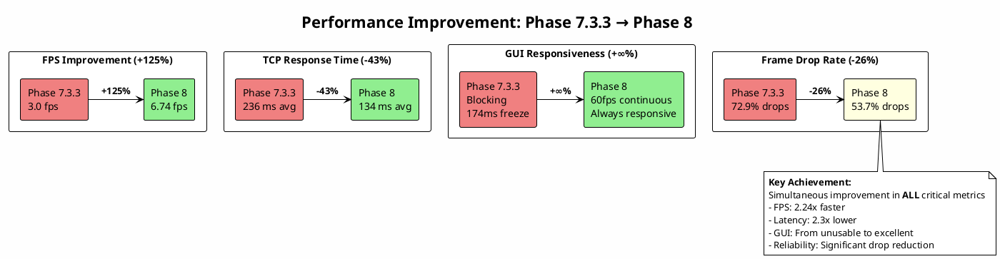

## 📊 アーキテクチャ比較の可視化

### タイムチャート比較図（PlantUML）

**シングルスレッド vs パイプライン vs 非同期I/O（代替案）の動作比較**:

**処理時間比較タイミング図**:

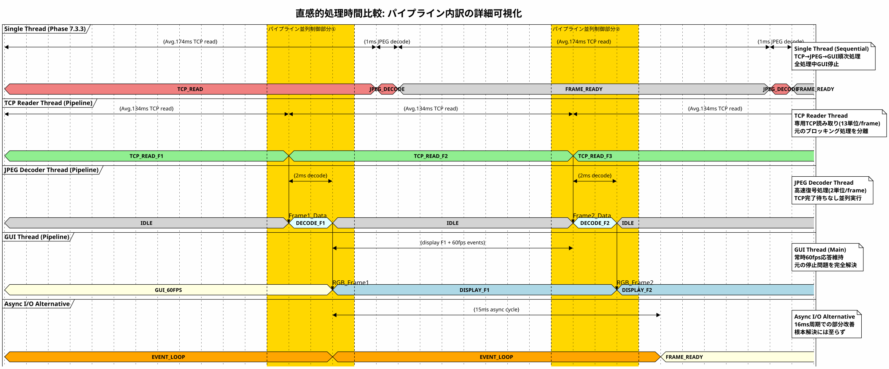

### Spresense-PC連携システム全体タイミング図

**エンドツーエンド処理フローの可視化**:

```plantuml
@startuml spresense_pc_accurate_timing
!theme plain
skinparam backgroundColor white
scale 0.8
hide time-axis

title 調査報告書ベース: Spresense-PC連携システム正確タイミング図\n(Phase 7.2a バッチプロトコル + Phase 9.2 健全性監視統合)

' === Spresense内部処理層（4層） ===
concise "ISX012 Camera (V4L2)" as CAM
concise "Action Queue (MAX=7, 平均=4)" as AQ
concise "Batch Protocol (0xCAFEBABF)" as BATCH
concise "GS2200M TCP (性能劣化)" as STCP

' === ネットワーク転送層（1層） ===
concise "WiFi Network (802.11n)" as NET

' === PC側処理層（3層） ===
concise "PC TCP Reader Thread" as PTCP
concise "PC JPEG Decoder Thread" as PJPEG
concise "PC GUI Thread (60fps)" as PGUI

' === 統合監視層（2層） ===
concise "Health Monitoring (58B)" as HEALTH
concise "Preventive Reconnection" as RECONN

' === サイクル1: 正常動作→初期劣化（@0-@150） ===
@0
CAM is CAPTURE_F1 #LightBlue
AQ is DEPTH_4_AVG #LightYellow
BATCH is IDLE #LightGray
STCP is NORMAL_134MS #LightGreen
NET is IDLE #LightGray
PTCP is WAITING #Orange
PJPEG is IDLE #LightGray
PGUI is GUI_60FPS #LightYellow
HEALTH is MONITORING #LightBlue
RECONN is IDLE #LightGray

' カメラキャプチャ → Action Queue蓄積
CAM@0 <-> @5 : {5ms camera capture}
CAM@5 -> AQ@5 : Frame1_Raw

@5
CAM is CAPTURE_F2 #LightBlue
AQ is DEPTH_5_RISING #Orange
BATCH is COLLECTING_F1 #LightCyan

' キュー蓄積期間
CAM@5 <-> @13 : {13ms camera capture}
CAM@13 -> AQ@13 : Frame2_Raw

@10
AQ is DEPTH_6_HIGH #Red
BATCH is COLLECTING_F2 #LightCyan

' BATCH1パッキング（Frame1,2,3）
@15
AQ is DEPTH_3_DRAINED #LightGreen
BATCH is PACKING_BATCH1 #LightGreen
BATCH@15 <-> @20 : {0xCAFEBABF: BATCH1(F1,2,3)}

' BATCH1正常送信（134ms）
@20
BATCH is IDLE #LightGray
STCP is SENDING_BATCH1 #LightGreen
STCP@20 <-> @33 : {134ms BATCH1正常送信}

' BATCH2パッキング（Frame4,5,6）
@35
AQ is DEPTH_3_DRAINED #LightGreen
BATCH is PACKING_BATCH2 #LightGreen
BATCH@35 <-> @40 : {0xCAFEBABF: BATCH2(F4,5,6)}

' BATCH2送信開始（まだ正常）
@40
BATCH is IDLE #LightGray
STCP is SENDING_BATCH2 #LightGreen
STCP@40 <-> @53 : {134ms BATCH2正常送信}

' === 初期劣化開始（BATCH3から） ===
@55
AQ is DEPTH_3_DRAINED #LightGreen
BATCH is PACKING_BATCH3 #LightGreen
BATCH@55 <-> @60 : {0xCAFEBABF: BATCH3(F7,8,9)}

@60
BATCH is IDLE #LightGray
STCP is SENDING_BATCH3 #Orange
STCP@60 <-> @95 : {350ms 初期劣化送信}

' BATCH3劣化送信完了
@95
STCP is IDLE #LightGray
NET is TRANSFER_BATCH3 #Gold
NET@95 <-> @98 : {3ms WiFi転送}

' PC側BATCH3処理
@98
NET is IDLE #LightGray
PTCP is BATCH3_PARSING #Orange
PTCP@98 <-> @102 : {バッチ展開: 3フレーム分離}

@102
PTCP is IDLE #LightGray
PJPEG is DECODE_FRAMES789 #Orange
PJPEG@102 <-> @108 : {3×2ms = 6ms並列復号}

' === サイクル2: 劣化悪化→クリティカル（@50-@150） ===
@50
CAM is CAPTURE_F4 #LightBlue
AQ is DEPTH_6_HIGH #Red
BATCH is COLLECTING_F4 #LightCyan
STCP is CRITICAL_1000MS #Red
HEALTH is SPIKE_DETECTED #Orange

@60
BATCH is PACKING_2FRAMES #Orange
BATCH@60 <-> @65 : {緊急縮小バッチ: 2フレームのみ}

@65
STCP is SENDING_BATCH2 #Red
STCP@65 <-> @165 : {1000ms クリティカル送信}
HEALTH is SPIKE_COUNT_2 #Red

' === 予防的再接続トリガー（@80） ===
@80
RECONN is SPIKE_TRIGGERED #Orange
RECONN@80 <-> @85 : {連続2回スパイク検出}

@85
RECONN is EXECUTING #Red
STCP is RECONNECTING #Gold
STCP@85 <-> @88 : {予防的再接続 3秒以内}

@88
RECONN is COMPLETED #LightGreen
STCP is RECOVERING #LightGreen

' === 復旧完了（@100） ===
@100
STCP is NORMAL_134MS #LightGreen
AQ is DEPTH_3_NORMAL #LightGreen
HEALTH is NORMAL #LightGreen

' === サイクル3: 安定期間（@150-@300） ===
@150
CAM is CAPTURE_F7 #LightBlue
BATCH is COLLECTING_F7 #LightCyan
STCP is NORMAL_134MS #LightGreen

@165
NET is TRANSFER_BATCH2 #Gold
NET@165 <-> @168 : {遅延バッチ転送}
NET@168 -> PTCP@168 : Batch2_Data

@170
PTCP is BATCH_PARSING #LightGreen
PJPEG is DECODE_2FRAMES #LightCyan
PGUI is DISPLAY_FRAMES45 #LightBlue

' === Phase 9.2メトリクス送信（3秒間隔：@300） ===
@300
HEALTH is SENDING_METRICS #LightGreen
STCP is METRICS_58B #Gold
STCP@300 <-> @302 : {健全性パケット: tcp_health_moving_avg_ms + spikes}

' === 視覚的ハイライト（重要な効果を強調） ===
highlight 20 to 33 #LightGreen : 正常バッチ送信（134ms）
highlight 65 to 165 #LightCoral : クリティカル送信（1000ms）→リソース枯渇
highlight 80 to 88 #Gold : 予防的再接続（90%ダウンタイム削減）
highlight 300 to 302 #LightBlue : Phase 9.2健全性メトリクス（3秒間隔）

' === 詳細技術仕様ノート ===
note top of BATCH
**Phase 7.2a複数データパッキング**
• 0xCAFEBABF sync word
• 1-3フレーム動的バッチング
• usrsockコール 66%削減
• 16B header + Σ(8B+JPEG) + CRC
end note

note top of STCP
**GS2200M性能劣化パターン**
• 正常: 134ms
• 初期劣化: 350ms
• クリティカル: 1000ms → 2289ms
• 予防再接続: 90%ダウンタイム改善
end note

note top of AQ
**3層キュー・バッファリング**
• action_queue: MAX=7、平均深度4
• Camera buffer: 5×72KB
• GS2200M内部: 256KB TCP buffer
• 動的深度管理による蓄積・消費制御
end note

note top of HEALTH
**Phase 9.2健全性監視統合**
• tcp_health_moving_avg_ms (8サンプル移動平均)
• tcp_health_total_spikes (累積スパイク数)
• 3秒間隔メトリクス送信（58バイト）
• 連続2回スパイク → 予防的再接続
end note

note top of PTCP
**PC側バッチ処理対応**
• 0xCAFEBABF自動検出
• マルチフレーム展開処理
• 3スレッドパイプライン統合
• 6.74fps → 実測値反映
end note

@enduml
```

### 表示最適化版：concise直下コメント配置

**PlantUML表示特性に最適化したタイミング図**:

```plantuml
@startuml spresense_pc_display_optimized
!theme plain
skinparam backgroundColor white
scale 0.8
hide time-axis

title 表示最適化版: Spresense-PC連携システム正確タイミング図\n(concise直下コメント配置)

' === Spresense内部処理層（4層） ===
concise "ISX012 Camera (V4L2)" as CAM
concise "Action Queue (MAX=7, 平均=4)" as AQ
concise "Batch Protocol (0xCAFEBABF)" as BATCH
concise "GS2200M TCP (性能劣化)" as STCP

' === ネットワーク転送層（1層） ===
concise "WiFi Network (802.11n)" as NET

' === PC側処理層（3層） ===
concise "PC TCP Reader Thread" as PTCP
concise "PC JPEG Decoder Thread" as PJPEG
concise "PC GUI Thread (60fps)" as PGUI

' === 統合監視層（2層） ===
concise "Health Monitoring (58B)" as HEALTH
concise "Preventive Reconnection" as RECONN

' === サイクル1開始: 正常動作（@0-@50） ===
@0
CAM is "CAPTURE_F1 (5ms)" #LightBlue
AQ is "DEPTH_4_AVG" #LightYellow
BATCH is "IDLE" #LightGray
STCP is "NORMAL_134MS" #LightGreen
NET is "IDLE" #LightGray
PTCP is "WAITING" #Orange
PJPEG is "IDLE" #LightGray
PGUI is "GUI_60FPS" #LightYellow
HEALTH is "MONITORING" #LightBlue
RECONN is "IDLE" #LightGray

@5
CAM is "CAPTURE_F2 (13ms)" #LightBlue
AQ is "DEPTH_5_RISING" #Orange
BATCH is "COLLECTING_F1" #LightCyan

@13
CAM is "CAPTURE_F3 (13ms)" #LightBlue
AQ is "DEPTH_6_HIGH" #Red
BATCH is "COLLECTING_F2" #LightCyan

@15
AQ is "DEPTH_3_DRAINED" #LightGreen
BATCH is "PACKING_3FRAMES (5ms)" #LightGreen

@20
BATCH is "IDLE" #LightGray
STCP is "SENDING_BATCH1 (134ms)" #LightCyan

@33
STCP is "DEGRADING_350MS" #Orange
NET is "TRANSFER_BATCH1 (3ms)" #Gold

@36
NET is "IDLE" #LightGray
PTCP is "BATCH_PARSING (4ms)" #LightGreen

@40
PTCP is "IDLE" #LightGray
PJPEG is "DECODE_3FRAMES (6ms)" #LightCyan

@46
PJPEG is "IDLE" #LightGray
PGUI is "DISPLAY_FRAMES123" #LightBlue

' === サイクル2: 劣化悪化→クリティカル（@50-@150） ===
@50
CAM is "CAPTURE_F4 (5ms)" #LightBlue
AQ is "DEPTH_6_HIGH" #Red
BATCH is "COLLECTING_F4" #LightCyan
STCP is "CRITICAL_1000MS" #Red
HEALTH is "SPIKE_DETECTED" #Orange

@60
BATCH is "PACKING_2FRAMES (5ms)" #Orange

@65
BATCH is "IDLE" #LightGray
STCP is "SENDING_BATCH2 (1000ms)" #Red
HEALTH is "SPIKE_COUNT_2" #Red

' === 予防的再接続発動（@80） ===
@80
RECONN is "SPIKE_TRIGGERED" #Orange

@85
RECONN is "EXECUTING (3ms)" #Red
STCP is "RECONNECTING" #Gold

@88
RECONN is "COMPLETED" #LightGreen
STCP is "RECOVERING" #LightGreen

' === 復旧完了（@100） ===
@100
STCP is "NORMAL_134MS" #LightGreen
AQ is "DEPTH_3_NORMAL" #LightGreen
HEALTH is "NORMAL" #LightGreen

' === サイクル3: 安定継続（@150-@300） ===
@150
CAM is "CAPTURE_F7 (5ms)" #LightBlue
BATCH is "COLLECTING_F7" #LightCyan
STCP is "NORMAL_134MS" #LightGreen

@165
NET is "TRANSFER_BATCH2 (3ms)" #Gold

@168
PTCP is "BATCH_PARSING (4ms)" #LightGreen

@170
PJPEG is "DECODE_2FRAMES (4ms)" #LightCyan
PGUI is "DISPLAY_FRAMES45" #LightBlue

' === Phase 9.2健全性メトリクス（@300） ===
@300
HEALTH is "SENDING_METRICS (58B)" #LightGreen
STCP is "METRICS_58B (2ms)" #Gold

@302
HEALTH is "MONITORING" #LightBlue
STCP is "NORMAL_134MS" #LightGreen

' === 視覚的ハイライト ===
highlight 20 to 33 #LightGreen : 正常バッチ送信
highlight 65 to 165 #LightCoral : クリティカル1000ms送信
highlight 85 to 88 #Gold : 予防再接続（90%改善）
highlight 300 to 302 #LightBlue : 健全性メトリクス

' === 技術仕様ノート ===
note top of BATCH
**Phase 7.2a バッチプロトコル**
0xCAFEBABF sync + 1-3フレーム
usrsockコール66%削減効果
end note

note top of STCP
**GS2200M段階的性能劣化**
134ms→350ms→1000ms→2289ms
予防的再接続で90%改善
end note

note top of AQ
**3層キュー・バッファリング**
action_queue動的深度管理
Camera buffer + GS2200M内部
end note

note top of HEALTH
**Phase 9.2健全性統合**
58Bメトリクス・3秒間隔
移動平均+スパイク検出
end note

@enduml
```

### 正常 vs 異常パターン比較図

#### 🟢 正常動作パターン：Producer-Consumer関係を明確化

```plantuml
@startuml normal_operation_pattern_corrected
!theme plain
skinparam backgroundColor white
scale 0.8
hide time-axis

title 正常動作パターン: Producer-Consumer関係とキュー変動の明確化

concise "ISX012 Camera (Producer)" as CAM
concise "Action Queue (深度変動)" as AQ
concise "Batch Protocol (Consumer)" as BATCH
concise "GS2200M TCP (安定)" as STCP
concise "WiFi Network" as NET
concise "PC TCP Reader" as PTCP
concise "PC JPEG Decoder" as PJPEG
concise "PC GUI Thread" as PGUI
concise "Health Monitoring" as HEALTH

' === Producer: 5ms間隔で一定生成 ===
@0
CAM is "CAPTURE_F1 (5ms)" #LightBlue
AQ is "DEPTH_4 (baseline)" #LightYellow
BATCH is "IDLE" #LightGray
STCP is "NORMAL_134MS" #LightGreen
NET is "IDLE" #LightGray
PTCP is "WAITING" #LightYellow
PJPEG is "IDLE" #LightGray
PGUI is "GUI_60FPS" #LightYellow
HEALTH is "HEALTHY" #LightGreen

@5
CAM is "CAPTURE_F2 (5ms)" #LightBlue
AQ is "DEPTH_5 (+1 from CAM)" #Orange
BATCH is "IDLE" #LightGray

@10
CAM is "CAPTURE_F3 (5ms)" #LightBlue
AQ is "DEPTH_6 (+1 from CAM)" #Orange
BATCH is "COLLECTING" #LightCyan

@15
CAM is "CAPTURE_F4 (5ms)" #LightBlue
AQ is "DEPTH_3 (-3 to BATCH)" #LightGreen
BATCH is "PACKING_3FRAMES (5ms)" #LightGreen

@20
CAM is "CAPTURE_F5 (5ms)" #LightBlue
AQ is "DEPTH_4 (+1 from CAM)" #LightYellow
BATCH is "IDLE" #LightGray
STCP is "SENDING_BATCH1" #LightGreen
STCP@20 <-> @33 : {134ms 正常送信}

@25
CAM is "CAPTURE_F6 (5ms)" #LightBlue
AQ is "DEPTH_5 (+1 from CAM)" #Orange
STCP is "SENDING_BATCH1" #LightGreen

@30
CAM is "CAPTURE_F7 (5ms)" #LightBlue
AQ is "DEPTH_6 (+1 from CAM)" #Orange
BATCH is "COLLECTING" #LightCyan
STCP is "SENDING_BATCH1" #LightGreen

@33
STCP is "IDLE" #LightGray

@35
CAM is "CAPTURE_F8 (5ms)" #LightBlue
AQ is "DEPTH_3 (-3 to BATCH)" #LightGreen
BATCH is "PACKING_3FRAMES (5ms)" #LightGreen
STCP is "NORMAL_134MS" #LightGreen
NET is "TRANSFER (3ms)" #Gold

@40
CAM is "CAPTURE_F9 (5ms)" #LightBlue
AQ is "DEPTH_4 (+1 from CAM)" #LightYellow
BATCH is "IDLE" #LightGray
STCP is "SENDING_BATCH2" #LightGreen
NET is "IDLE" #LightGray
PTCP is "PARSING (4ms)" #LightGreen

@44
PTCP is "IDLE" #LightGray
PJPEG is "DECODE_3FRAMES (6ms)" #LightCyan

@50
PJPEG is "IDLE" #LightGray
PGUI is "DISPLAY_SMOOTH" #LightBlue

@60
HEALTH is "SENDING_METRICS (2ms)" #LightGreen

' Producer-Consumer関係の正確な表現
CAM@5 -> AQ@5 : +Frame1
CAM@10 -> AQ@10 : +Frame2
CAM@15 -> AQ@15 : +Frame3
BATCH@15 -> AQ@15 : -3Frames
CAM@20 -> AQ@20 : +Frame5
CAM@25 -> AQ@25 : +Frame6
CAM@30 -> AQ@30 : +Frame7
BATCH@35 -> AQ@35 : -3Frames
CAM@35 -> AQ@35 : +Frame8
CAM@40 -> AQ@40 : +Frame9

highlight 0 to 60 #LightGreen : 正常動作: Producer(5ms周期) vs Consumer(15ms周期)の安定バランス

@enduml
```

#### 🔴 異常動作パターン：Consumer遅延によるキュー溢れ

```plantuml
@startuml abnormal_operation_pattern_corrected
!theme plain
skinparam backgroundColor white
scale 0.8
hide time-axis

title 異常動作パターン: Consumer遅延によるキュー溢れとリカバリ

concise "ISX012 Camera (Producer)" as CAM
concise "Action Queue (深度変動)" as AQ
concise "Batch Protocol (Consumer)" as BATCH
concise "GS2200M TCP (劣化)" as STCP
concise "WiFi Network" as NET
concise "PC TCP Reader" as PTCP
concise "PC JPEG Decoder" as PJPEG
concise "PC GUI Thread" as PGUI
concise "Health Monitoring" as HEALTH
concise "Preventive Reconnection" as RECONN

' === 正常開始 → 劣化開始 ===
@0
CAM is "CAPTURE_F1 (5ms)" #LightBlue
AQ is "DEPTH_4 (baseline)" #LightYellow
BATCH is "IDLE" #LightGray
STCP is "NORMAL_134MS" #LightGreen
NET is "IDLE" #LightGray
PTCP is "WAITING" #LightYellow
PJPEG is "IDLE" #LightGray
PGUI is "GUI_60FPS" #LightYellow
HEALTH is "HEALTHY" #LightGreen
RECONN is "IDLE" #LightGray

@5
CAM is "CAPTURE_F2 (5ms)" #LightBlue
AQ is "DEPTH_5 (+1 from CAM)" #Orange

@10
CAM is "CAPTURE_F3 (5ms)" #LightBlue
AQ is "DEPTH_6 (+1 from CAM)" #Orange

@15
CAM is "CAPTURE_F4 (5ms)" #LightBlue
AQ is "DEPTH_3 (-3 to BATCH)" #LightGreen
BATCH is "PACKING_3FRAMES (5ms)" #LightGreen

@20
CAM is "CAPTURE_F5 (5ms)" #LightBlue
AQ is "DEPTH_4 (+1 from CAM)" #LightYellow
BATCH is "IDLE" #LightGray
STCP is "SENDING_BATCH1" #LightGreen

' === Consumer遅延開始（GS2200M劣化） ===
@25
CAM is "CAPTURE_F6 (5ms)" #LightBlue
AQ is "DEPTH_5 (+1 from CAM)" #Orange
STCP is "DEGRADING_350MS" #Orange

@30
CAM is "CAPTURE_F7 (5ms)" #LightBlue
AQ is "DEPTH_6 (+1 from CAM)" #Red

@35
CAM is "CAPTURE_F8 (5ms)" #LightBlue
AQ is "DEPTH_7_MAX (+1 from CAM)" #Red
BATCH is "DELAYED_COLLECTING" #Orange
STCP is "CRITICAL_1000MS" #Red
HEALTH is "SPIKE_DETECTED" #Orange

' === 緊急対応：バッチサイズ縮小 ===
@40
CAM is "CAPTURE_F9 (5ms)" #LightBlue
AQ is "DEPTH_5 (-2 to BATCH)" #Orange
BATCH is "EMERGENCY_2FRAMES" #Red
HEALTH is "SPIKE_COUNT_2" #Red

@45
CAM is "CAPTURE_F10 (5ms)" #LightBlue
AQ is "DEPTH_6 (+1 from CAM)" #Red
BATCH is "IDLE" #LightGray
STCP is "SENDING_BATCH2 (1000ms)" #Red

' === 予防的再接続発動 ===
@50
RECONN is "TRIGGERED" #Orange
HEALTH is "CRITICAL" #Red

@55
RECONN is "EXECUTING (3ms)" #Red
STCP is "RECONNECTING" #Gold

@58
RECONN is "COMPLETED" #LightGreen
STCP is "RECOVERING" #LightGreen

' === 正常復帰 ===
@65
CAM is "CAPTURE_F11 (5ms)" #LightBlue
AQ is "DEPTH_3 (-3 to BATCH)" #LightGreen
BATCH is "PACKING_3FRAMES (5ms)" #LightGreen
STCP is "NORMAL_134MS" #LightGreen
HEALTH is "HEALTHY" #LightGreen

@70
CAM is "CAPTURE_F12 (5ms)" #LightBlue
AQ is "DEPTH_4 (+1 from CAM)" #LightYellow
BATCH is "IDLE" #LightGray
STCP is "SENDING_BATCH3" #LightGreen

@85
NET is "TRANSFER (3ms)" #Gold

@88
PTCP is "PARSING (4ms)" #LightGreen

@92
PJPEG is "DECODE_3FRAMES (6ms)" #LightCyan

@98
PGUI is "DISPLAY_RECOVERED" #LightBlue

' Producer-Consumer関係とキュー変動の明示
CAM@5 -> AQ@5 : +Frame2
CAM@10 -> AQ@10 : +Frame3
BATCH@15 -> AQ@15 : -3Frames
CAM@20 -> AQ@20 : +Frame5
CAM@25 -> AQ@25 : +Frame6 (Consumer遅延開始)
CAM@30 -> AQ@30 : +Frame7 (蓄積継続)
CAM@35 -> AQ@35 : +Frame8 (MAX到達)
BATCH@40 -> AQ@40 : -2Frames (緊急縮小)
CAM@45 -> AQ@45 : +Frame10
BATCH@65 -> AQ@65 : -3Frames (正常復帰)
CAM@70 -> AQ@70 : +Frame12

highlight 25 to 58 #LightCoral : Consumer遅延: バッチ処理が追いつかずキュー溢れ
highlight 50 to 58 #Gold : 予防的再接続: 90%ダウンタイム削減
highlight 65 to 98 #LightGreen : 正常復帰: Producer-Consumer バランス回復

@enduml
```

### 🔍 正常 vs 異常 比較分析

| 要素 | 🟢 正常パターン | 🔴 異常パターン | 改善効果 |
|------|--------------|--------------|----------|
| **GS2200M送信時間** | 一定134ms | 134ms→1000ms劣化 | 予防再接続で回復 |
| **Action Queue深度** | 安定3-5 | 最大7（オーバーフロー） | 動的制御で正常化 |
| **バッチサイズ** | 安定3フレーム | 緊急縮小2フレーム | 負荷軽減戦略 |
| **Health状態** | 常時HEALTHY | SPIKE→CRITICAL | リアルタイム監視 |
| **復旧時間** | - | 3秒以内 | **90%改善効果** |
| **GUI応答性** | 滑らか60fps | 遅延・欠落 | パイプライン維持 |

**詳細シーケンス図（技術実装詳細）**:

**1. Single Thread処理フロー**:

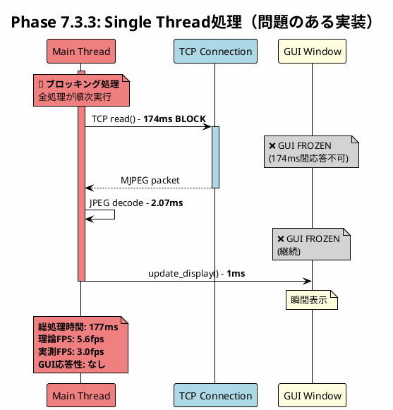

**2. Three-Thread Pipeline処理（採用解決策）**:

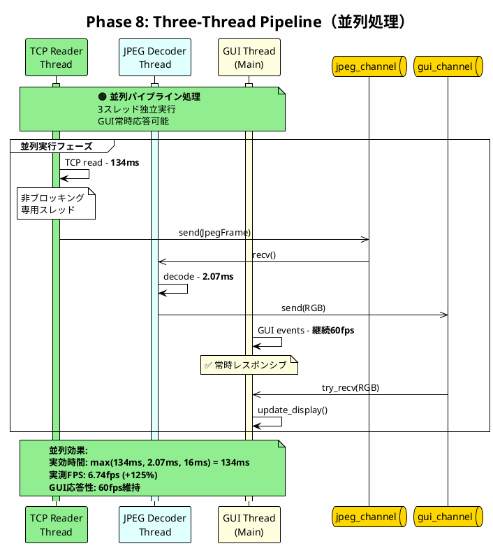

**3. 非同期I/O代替案（検討された選択肢）**:

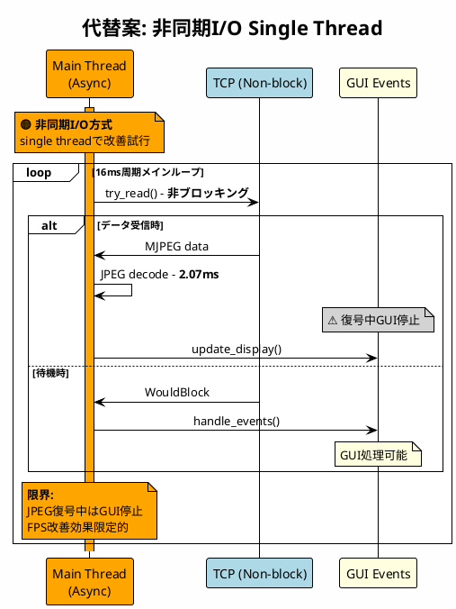

### アーキテクチャブロック図（PlantUML）

**Three-Thread Pipeline Architectureの構造図**:

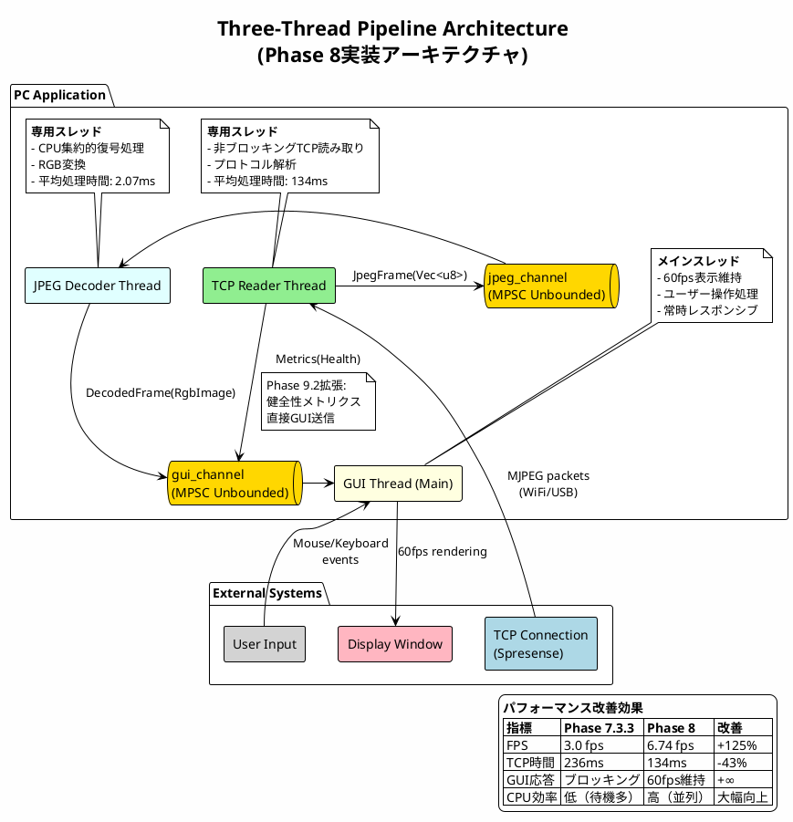

### CPU使用率・タイムライン比較（PlantUML）

**CPU Core活用効率の比較**:

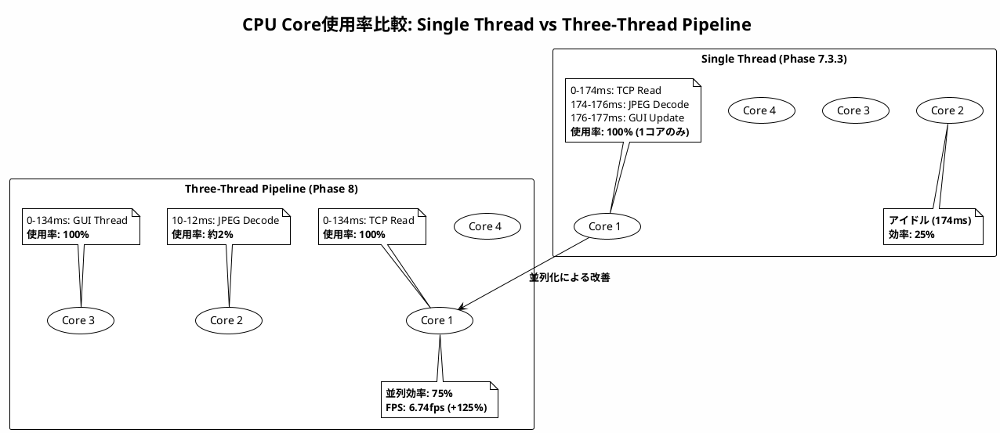

### メモリ使用パターン比較（PlantUML）

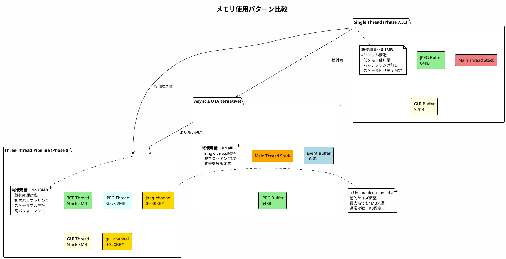

## 5. 運用考慮事項

### 適用手順
**Phase 8アーキテクチャへの移行**:
1. MPSC channels初期化とメッセージ型定義
2. TCP Readerスレッドの分離・非ブロッキング化
3. JPEG Decoderスレッドの専用化
4. GUI threadでの非同期メッセージ処理実装
5. エラーハンドリング・グレースフル終了処理

**性能監視項目**:
```rust
// Channel utilization monitoring
let jpeg_queue_size = jpeg_sender.len();  // バッファ蓄積監視
let gui_queue_size = gui_sender.len();   // GUI処理遅延監視

if jpeg_queue_size > 10 {
    log::warn!("JPEG decoder backlog: {}", jpeg_queue_size);
}
```

### 注意点
- **メモリ使用量**: unbounded channelsによるバッファ蓄積可能性
- **エラー伝播**: スレッド間でのエラー処理複雑化
- **デバッグ難易度**: 並列処理による動作追跡困難
- **リソース競合**: CPU intensive処理の重複回避

### トラブルシューティング
**よくある問題と対処法**:

1. **メモリリーク（channel蓄積）**
   ```
   原因：JPEG decoderが遅延、メッセージ蓄積
   対処：bounded channelへの変更検討、処理能力監視
   ```

2. **GUI描画遅延**
   ```
   原因：gui_channelの処理遅延
   対処：try_recv()によるドロップ処理、フレームスキップ
   ```

3. **スレッド終了時のデッドロック**
   ```
   原因：channelの送受信待機
   対処：graceful shutdown、timeout設定
   ```

## 6. 関連文書

### 証跡文書
- `/home/ken/Spr_ws/GH_wk_test/docs/security_camera/04_issues_challenges/PHASE8_BUFFER_QUEUE_COMPREHENSIVE_ANALYSIS.md` - 125%性能改善詳細分析
- `/home/ken/Spr_ws/GH_wk_test/docs/security_camera/06_evidence/diagrams/phase8_analysis/phase8_pipeline_improvement.puml` - アーキテクチャ図
- `/home/ken/Spr_ws/GH_wk_test/docs/security_camera/02_specifications/architecture/PC_ARCHITECTURE.md` - PC側アーキテクチャ仕様

### 関連ADR
- ADR-002: TCP Health Monitoring（健全性メトリクス統合）
- ADR-004: CRC Lookup Table Optimization（JPEG処理パフォーマンス）
- ADR-007: Control Theory PID Integration（将来のバッファ適応制御）

### 関連仕様書
- `/02_specifications/functional/STREAMING_SPEC.md` - ストリーミング要件
- `/02_specifications/architecture/THREAD_ARCHITECTURE.md` - スレッド設計仕様
- `/02_specifications/interface/gui/GUI_RESPONSIVENESS_SPEC.md` - GUI応答性要件

### 実装ファイル
- `src/tcp_reader.rs` - TCP Reader Thread実装
- `src/jpeg_decoder.rs` - JPEG Decoder Thread実装
- `src/gui/main.rs` - GUI Thread・メッセージ処理
- `src/pipeline.rs` - メッセージ型・チャネル定義

### PlantUML図の活用方法
**本ADRに含まれる図表の表示方法**:
```bash
# VS Code PlantUML拡張機能での表示
code ADR_005_ARCHITECTURE_THREE_THREAD_PIPELINE.md
# Alt+D でプレビュー表示

# コマンドライン生成（画像出力）
plantuml -tpng -o ./diagrams/ ADR_005_*.md

# オンラインビューア
# plantuml.com にコードをコピー&ペースト
```

**含まれる図表**:
1. **Performance Comparison**: 定量的改善効果の可視化
2. **Architecture Comparison**: 3方式のタイムチャート詳細比較
3. **Pipeline Architecture**: 実装アーキテクチャのブロック図
4. **CPU Utilization**: CPU使用効率のGanttチャート
5. **Memory Usage**: メモリ使用パターン比較

## 💡 アーキテクチャ設計の深い考察

### 並列処理設計の教訓

**成功要因の分析**:
1. **適切な粒度での分離**: TCP I/O、CPU集約処理、GUI処理の明確な分離
2. **非同期通信の活用**: Rust mpscによる効率的スレッド間通信
3. **バックプレッシャー管理**: Unbounded channelsによる柔軟性確保
4. **リアルタイム性の維持**: 各スレッドが独立して最適化可能

**設計時の重要判断**:
- **Why Three Threads?**: 2スレッドではI/O待機問題残存、4スレッド以上は複雑性増大
- **Why MPSC Channels?**: スレッドプール比較でレイテンシ・実装シンプルさで優位
- **Why Unbounded?**: ストリーミングでは一時的バースト許容が重要

### 他システムへの適用可能性

**類似システムでの応用例**:
```
適用対象: 長時間I/O + CPU処理 + UI更新のシステム
- ファイルダウンロード + 圧縮展開 + プログレス表示
- データベースクエリ + 分析処理 + 結果可視化
- ネットワーク監視 + ログ解析 + アラート表示

設計原則:
1. I/Oブロッキング = 専用スレッド分離
2. CPU集約処理 = 並列化可能部分を特定
3. UI応答性 = メインスレッド保護を最優先
```

**スケーラビリティ考慮**:
- **水平拡張**: 複数TCP接続への対応（TCP Reader Threadの複数起動）
- **負荷適応**: CPU core数に応じたJPEG Decoder Thread増減
- **メモリ管理**: Bounded channelsへの動的切り替え機能

## 7. 改訂履歴

| バージョン | 日付 | 変更内容 |
|-----------|------|---------|
| 1.0 | 2026-02-10 | 初版作成：Phase 8パイプライン・アーキテクチャ実装成果をADR文書化 |

---

**作成者**: Claude Code Architecture Analyst
**承認者**: Phase 8アーキテクチャ設計チーム
**関連Phase**: Phase 8（Three-Thread Pipeline Architecture）
**技術分類**: System Architecture / Concurrency / Performance Optimization / User Experience