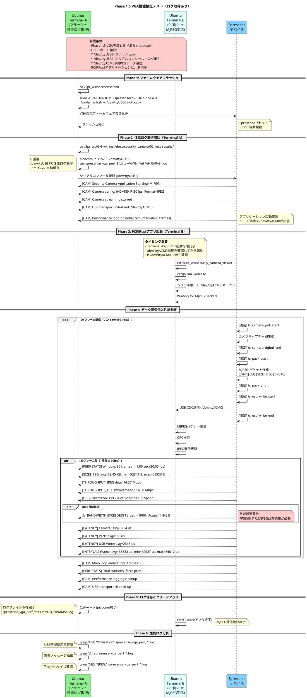
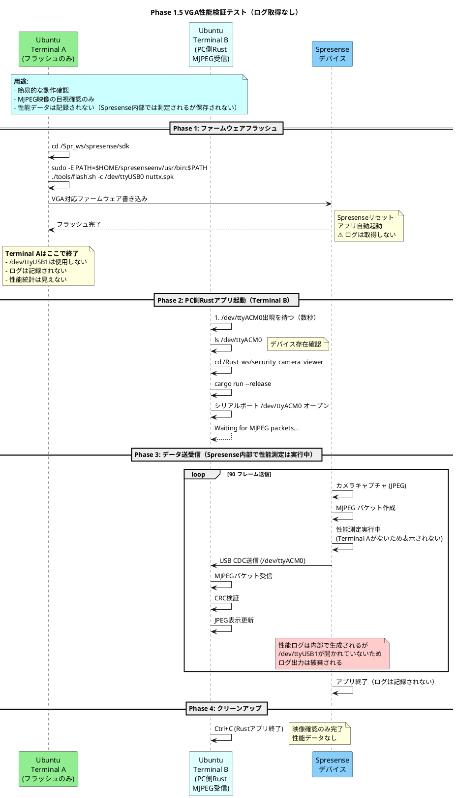
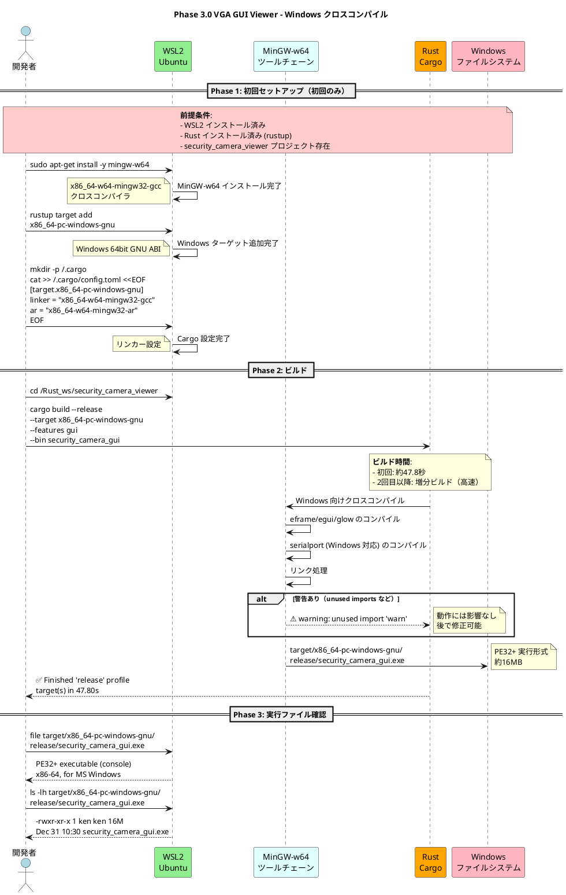

# テスト手順フローチャート

**作成日**: 2025-12-21
**最終更新**: 2025-12-31 (Phase 3.0 Windows クロスコンパイル対応)
**対象**: Phase 1B USB CDC データ転送テスト / Phase 1.5 VGA性能検証テスト / Phase 3.0 VGA GUI Viewer テスト

このドキュメントでは、Phase 1B/1.5 テストにおける Windows/Ubuntu の操作手順と、複数の Ubuntu 端末での操作の流れを視覚化します。

## 重要な変更点（2025-12-28）

**USB シリアルコンソールの設定変更**:
- `CONFIG_SYSTEM_CDCACM=y` - sercon/serdisコマンドを有効化
- `CONFIG_NSH_USBCONSOLE=y` - NuttShell起動時に自動的にUSBコンソールを有効化

**影響**:
- **Phase 1.5以降**: NuttShell起動時に自動的に`/dev/ttyACM0`が有効化されます
- **serconコマンド**: 引き続き利用可能（手動制御が必要な場合）
- **互換性**: 従来の手動sercon方式も引き続きサポート

詳細は「[USB シリアルコンソール接続の変更点](#usb-シリアルコンソール接続の変更点-2025-12-28)」を参照してください。

---

## 目次

- [Phase 1B: USB CDC データ転送テスト](#phase-1b-全体フローシーケンス図)
- [Phase 1.5: VGA性能検証テスト（ログ取得あり/なし）](#phase-15-全体フローシーケンス図)
- [Phase 3.0: VGA GUI Viewer テスト（Windows クロスコンパイル）](#phase-30-全体フローシーケンス図)
- [Phase 0: 初回セットアップ](#phase-0-初回セットアップ-初回のみ必要)
- [端末の役割まとめ](#端末の役割まとめ)
- [USB デバイス構成](#usb-デバイス構成)
- [トラブルシューティング早見表](#トラブルシューティング早見表)

---

## Phase 1B: 全体フローシーケンス図

```plantuml
@startuml
title Phase 1B USB CDC データ転送テスト手順

actor "Windows\nPowerShell" as Windows #LightBlue
participant "Ubuntu\nTerminal 1\n(ビルド・フラッシュ\nUSB CDC・受信・検証)" as Term1 #LightGreen
participant "Ubuntu\nTerminal 2\n(Spresense操作\nminicom)" as Term2 #LightCyan
participant "Spresense\nデバイス" as Spresense #LightSkyBlue

opt 初回セットアップのみ
    note over Windows #FFCCCC
      **Windows 側初回セットアップ**
      1. WSL2 インストール
      2. usbipd-win インストール
         winget install --interactive --exact dorssel.usbipd-win
    end note

    Windows -> Windows: usbipd-win インストール確認
    note right: 📝 初回のみ\nusbipd list で確認

    note over Term1, Term2 #CCFFCC
      **Ubuntu (WSL2) 側初回セットアップ**
      1. 基本パッケージインストール
         sudo apt-get update
         sudo apt-get install -y build-essential python3 python3-serial minicom
      2. Spresense ツールチェーンセットアップ
         spresenseenv のインストール
      3. NuttX/SDK のクローン・セットアップ
    end note

    Term1 -> Term1: sudo apt-get install\nbuild-essential python3 python3-serial
    note left: 📝 初回のみ\n基本ツールインストール

    Term1 -> Term1: Spresense ツールチェーン\nセットアップ
    note left: 📝 初回のみ\n~/spresenseenv/\narm-none-eabi-gcc

    Term1 -> Term1: NuttX/SDK クローン
    note left: 📝 初回のみ\n~/Spr_ws/spresense/

    Term1 -> Term1: Kconfig 設定\nCONFIG_CXD56_USBDEV=y\nCONFIG_SYSTEM_CDCACM=y
    note left: 📝 初回のみ\nUSB CDC 有効化
end

== Phase 1: ビルド ==

Term1 -> Term1: cd ~/Spr_ws/spresense/sdk
Term1 -> Term1: ./build.sh
note left: PATH設定:\n$HOME/spresenseenv/usr/bin
Term1 -> Term1: nuttx.spk 生成完了

== Phase 2: フラッシュ (CP2102) ==

Windows -> Windows: usbipd list
note right: BUSID 1-11:\nCP210x (COM3)\nコンソール/フラッシュ用

alt 初回デバイス接続
    Windows -> Windows: usbipd bind --busid 1-11
    note right: 📝 初回のみ\nデバイスをWSL2用に登録
    Windows -> Windows: usbipd attach --wsl --busid 1-11
    note right: WSL2に接続
else 2回目以降
    Windows -> Windows: usbipd attach --wsl --busid 1-11
    note right: WSL2に接続\n(bind済みのためattachのみ)
end

alt 初回ドライバーロード
    Term1 -> Term1: sudo modprobe cp210x
    note left: 📝 初回のみ\nCP2102ドライバーロード\n/dev/ttyUSB0 作成
else ドライバー既にロード済み
    Term1 -> Term1: ls /dev/ttyUSB0
    note right: デバイス確認のみ
end

Term1 -> Term1: sudo tools/flash.sh\n-c /dev/ttyUSB0 nuttx.spk
Term1 -> Spresense: nuttx.spk 書き込み
Spresense --> Term1: フラッシュ完了
Term1 -> Term1: Spresense リブート待機

== Phase 2.5: Spresense コンソール接続 (minicom) ==

alt 初回 minicom 設定
    Term2 -> Term2: sudo minicom -s
    note left: 📝 初回のみ\nSerial port setup:\n- Device: /dev/ttyUSB0\n- Bps: 115200 8N1\n- Hardware Flow Control: No\n設定を "dfl" として保存
else minicom 既に設定済み
    note over Term2: 設定済みのためスキップ
end

Term2 -> Term2: minicom
note left: minicom 起動\n/dev/ttyUSB0, 115200bps

Term2 -> Spresense: シリアル接続確立
Spresense --> Term2: NuttShell (NSH) プロンプト\nnsh>

note over Term2, Spresense #LIGHTYELLOW
  **minicom 操作メモ**
  - 終了: Ctrl+A → X
  - 履歴: 上下矢印キー
  - クリア: Ctrl+L
end note

alt CONFIG_NSH_USBCONSOLE=y (Phase 1.5以降)
    note over Spresense #LIGHTGREEN
      **自動起動**
      NuttShell起動時に自動的に
      /dev/ttyACM0 が有効化される
      sercon コマンド不要
    end note
    Spresense --> Spresense: CDC/ACM自動有効化
else 従来の手動方式
    Term2 -> Spresense: sercon (NuttX NSH コマンド)
    Spresense --> Term2: CDC/ACM serial driver registered
    note right: 🔴 **重要!**\nSpresense側で\n/dev/ttyACM0 を準備\n(Linux側接続前)
end

== Phase 3: USB CDC セットアップ (CXD5602) ==

Windows -> Windows: usbipd list
note right: BUSID 1-1:\nSony 054c:0bc2 (COM4)\nCDC ACM データ転送用

alt 初回デバイス接続
    Windows -> Windows: usbipd bind --busid 1-1
    note right: 📝 初回のみ\nデバイスをWSL2用に登録
    Windows -> Windows: usbipd attach --wsl --busid 1-1
    note right: WSL2に接続
else 2回目以降
    Windows -> Windows: usbipd attach --wsl --busid 1-1
    note right: WSL2に接続\n(bind済みのためattachのみ)
end

alt 初回ドライバーロード
    Term1 -> Term1: sudo modprobe cdc-acm
    note right: 📝 初回のみ\nCDC ACMドライバーロード\n/dev/ttyACM0 作成
else ドライバー既にロード済み
    Term1 -> Term1: ls /dev/ttyACM0
    note right: デバイス確認のみ
end

Term1 -> Term1: ls -l /dev/ttyACM0
note right: デバイス存在確認\ncrw-rw---- root dialout

Term1 -> Term1: sudo chmod 666 /dev/ttyACM0
note right: 権限設定 (全ユーザー読み書き)

Term1 -> Term1: stty -F /dev/ttyACM0\nraw -echo 115200
note right: 🔴 **最重要!**\nTTY Raw モード設定\nバイナリデータ破損防止

== Phase 4: データ受信準備 ==

Term1 -> Term1: rm -f /tmp/mjpeg_stream.bin
note right: 古いファイル削除

Term1 -> Term1: cat /dev/ttyACM0 >\n/tmp/mjpeg_stream.bin
note right: データ受信待機\n(ブロッキング状態)

== Phase 5: Spresense 実行 ==

Term2 -> Spresense: security_camera (アプリ実行)

Spresense -> Spresense: [CAM] Application Starting
Spresense -> Spresense: [CAM] USB transport initialized\n(/dev/ttyACM0)

loop 90 フレーム送信
    Spresense -> Spresense: カメラキャプチャ (JPEG)
    Spresense -> Spresense: MJPEG パケット作成\n[SYNC|SEQ|SIZE|JPEG|CRC16]
    Spresense -> Term1: USB CDC 送信\n(write /dev/ttyACM0)
    Term1 -> Term1: データ追記 →\n/tmp/mjpeg_stream.bin

    alt フレーム 1, 30, 60, 90
        Spresense --> Term2: [CAM] Frame N:\nJPEG=X bytes,\nPacket=Y bytes,\nUSB sent=Y, Seq=N-1
    end
end

Spresense -> Spresense: [CAM] Main loop ended,\ntotal frames: 90
Spresense --> Term2: [CAM] USB transport cleaned up\n(total sent: 672972 bytes)

== Phase 6: データ受信完了 ==

Term2 -> Term1: Spresense 完了を確認
Term1 -> Term1: Ctrl+C (cat 停止)
note right: 受信完了\n/tmp/mjpeg_stream.bin\n~657 KB (672,972 bytes)

== Phase 7: 検証 ==

Term1 -> Term1: ls -lh /tmp/mjpeg_stream.bin
note left: ファイルサイズ確認\n期待: ~657K

Term1 -> Term1: hexdump -C\n/tmp/mjpeg_stream.bin | head -30
note left: プロトコルヘッダ確認\nbe ba fe ca (SYNC_WORD)\n00 00 00 00 (SEQUENCE=0)\nff d8 (JPEG SOI)

Term1 -> Term1: hexdump -C\n/tmp/mjpeg_stream.bin |\ngrep -c "be ba fe ca"
Term1 -> Term1: **90**
note right: ✅ 成功!\n90個の同期ワード検出

Term1 -> Term1: hexdump -C\n/tmp/mjpeg_stream.bin |\ngrep -c "ff d8"
Term1 -> Term1: **90**
note right: ✅ 成功!\n90個のJPEG SOI検出

@enduml
```



---

## Phase 1.5: 全体フローシーケンス図

### Phase 1.5-A: 性能ログ取得あり（推奨）



### Phase 1.5-B: 性能ログ取得なし（映像確認のみ）



---

## Phase 1.5: 操作手順詳細

### 方式A: 性能ログ取得あり（推奨）

**用途**:
- USB帯域使用率の測定
- JPEGサイズの統計取得
- レイテンシ分析
- 帯域超過の検出

**必要な端末**: 2端末

#### Terminal A: フラッシュ + 性能ログ取得

```bash
# ステップ1: ファームウェアフラッシュ
cd ~/Spr_ws/spresense/sdk
sudo -E PATH=$HOME/spresenseenv/usr/bin:$PATH ./tools/flash.sh -c /dev/ttyUSB0 nuttx.spk

# Spresenseリセット後、数秒待つ

# ステップ2: 性能ログ取得開始
cd ~/Spr_ws/GH_wk_test/docs/security_camera/02_test_results/
picocom -b 115200 /dev/ttyUSB1 | tee spresense_vga_perf_$(date +%Y%m%d_%H%M%S).log

# 以下のログが表示される:
# [CAM] Security Camera Application Starting (MJPEG)
# [CAM] Camera config: 640x480 @ 30 fps, Format=JPEG
# [CAM] Performance logging initialized (interval=30 frames)
# ...
# [PERF STATS] Window: 30 frames in 1.00 sec (30.00 fps)
# [USB] Utilization: 119.2% of 12 Mbps Full Speed
# ⚠️  BANDWIDTH EXCEEDED! ...

# picocom終了: Ctrl+A → X
```

**使用デバイス**:
- `/dev/ttyUSB0`: フラッシュ専用
- `/dev/ttyUSB1`: シリアルコンソール（性能ログ出力）

#### Terminal B: PC側Rustアプリ

```bash
# Terminal Aでアプリ起動を確認後に実行
# /dev/ttyACM0が出現するまで待つ（数秒）

ls /dev/ttyACM0  # 存在確認

cd ~/Rust_ws/security_camera_viewer
cargo run --release

# MJPEG映像がリアルタイム表示される
# Ctrl+C で終了
```

**使用デバイス**:
- `/dev/ttyACM0`: MJPEGデータ通信

#### ログ分析

```bash
# Terminal A（picocom終了後）

# USB帯域使用率確認
grep "USB.*Utilization" spresense_vga_perf_*.log

# 警告抽出
grep "⚠️" spresense_vga_perf_*.log

# 平均JPEGサイズ
grep "SIZE.*JPEG:" spresense_vga_perf_*.log | awk '{print $6}'

# レイテンシ確認
grep "LATENCY" spresense_vga_perf_*.log
```

---

### 方式B: 性能ログ取得なし（簡易確認）

**用途**:
- 映像表示の目視確認のみ
- 性能データは不要
- 迅速なテスト実行

**必要な端末**: 1端末（Terminal Bのみ）

**注意**: Spresense内部では性能測定は実行されますが、`/dev/ttyUSB1`を開いていないため、ログ出力は破棄されます。

#### Terminal A: フラッシュのみ（その後閉じてOK）

```bash
cd ~/Spr_ws/spresense/sdk
sudo -E PATH=$HOME/spresenseenv/usr/bin:$PATH ./tools/flash.sh -c /dev/ttyUSB0 nuttx.spk

# フラッシュ完了後、Terminal Aは閉じてOK
```

#### Terminal B: PC側Rustアプリのみ

```bash
# /dev/ttyACM0出現を待つ（数秒）
ls /dev/ttyACM0

cd ~/Rust_ws/security_camera_viewer
cargo run --release

# MJPEG映像表示のみ確認
# Ctrl+C で終了
```

---

## Phase 1.5: USB デバイス構成

### Spresense 3ポート接続

| デバイス | 用途 | Terminal A（ログあり） | Terminal B | Terminal A（ログなし） |
|---------|------|---------------------|-----------|---------------------|
| `/dev/ttyUSB0` | フラッシュ専用 | ✅ 使用 | - | ✅ 使用 |
| `/dev/ttyUSB1` | シリアルコンソール（性能ログ） | ✅ 使用 | - | ❌ 不使用 |
| `/dev/ttyACM0` | MJPEGデータ通信 | - | ✅ 使用 | ✅ 使用（Terminal B） |

### 物理接続図

```
Spresense ─┬─ /dev/ttyUSB0  (CP2102 Boot Loader)
           │   └→ tools/flash.sh でフラッシュ
           │
           ├─ /dev/ttyUSB1  (CP2102 Serial Console)
           │   └→ picocom で性能ログ取得（方式Aのみ）
           │
           └─ /dev/ttyACM0  (CXD5602 USB CDC-ACM)
               └→ Rustアプリケーションでデータ受信
```

---

## Phase 1.5: 性能検証項目

### 測定メトリクス（方式Aのみ取得可能）

| メトリクス | 目標値 | 測定タイミング |
|-----------|-------|--------------|
| 平均JPEGサイズ | 50-80 KB | 30フレーム毎 |
| USB帯域使用率 | <100% (12 Mbps以下) | 30フレーム毎 |
| 実測FPS | 30 fps | 30フレーム毎 |
| フレーム間隔 | 33.3 ± 1 ms | 30フレーム毎 |
| カメラ取得時間 | <10 ms | 30フレーム毎（平均） |
| USB送信時間 | <3 ms | 30フレーム毎（平均） |

### 警告の見方

**USB帯域超過警告**:
```
[USB] Utilization: 119.2% of 12 Mbps Full Speed
⚠️  BANDWIDTH EXCEEDED! Target: <100%, Actual: 119.2%
⚠️  Recommend: Reduce FPS or JPEG quality
```

**対策**:
1. フレームレート調整（30fps → 20fps）
2. JPEG品質調整（サイズ削減）
3. 一時的にQVGAへ戻す

---

## Phase 3.0: 全体フローシーケンス図

**Phase 3.0: VGA GUI Viewer テスト (Windows クロスコンパイル)**

Phase 3.0 では、WSL2 の OpenGL/GLX 制限を回避するため、Windows 向けクロスコンパイルを使用します。

### Phase 3.0: アーキテクチャ概要

```
WSL2 (Ubuntu)                    Windows 11
┌─────────────────────┐         ┌─────────────────────┐
│                     │         │                     │
│ MinGW-w64           │         │ security_camera_    │
│ クロスコンパイラ     │ ビルド→  │ gui.exe             │
│                     │         │ (PE32+ 実行形式)    │
│ Rust Toolchain      │         │                     │
│ x86_64-pc-windows-  │         │ ネイティブ          │
│ gnu                 │         │ OpenGL/GPU 使用     │
└─────────────────────┘         └─────────────────────┘
         ↓                               ↓
    /dev/ttyACM0 ←────────────────→  COM4 (WSL2経由)
         ↓
    Spresense (VGA 37.33 fps)
```

### Phase 3.0-A: Windows クロスコンパイルビルド



### Phase 3.0-B: Windows GUI テスト実行

```plantuml
@startuml
title Phase 3.0 VGA GUI Viewer - Windows 実行とトラブルシューティング

actor "開発者" as Dev #LightBlue
participant "WSL2\nUbuntu" as WSL #LightGreen
participant "Windows\nGUI Application" as WinGUI #LightPink
participant "シリアル\nポート" as Serial #LightCyan
participant "Spresense\nVGA 37.33fps" as Spresense #LightSkyBlue

== Phase 1: 事前確認 ==

note over Dev, Spresense #FFCCCC
  **重要**:
  - Spresense が USB 接続されている
  - VGA ファームウェア (37.33 fps) がフラッシュ済み
  - WSL2 で /dev/ttyACM0 が見えている
  - Windows デバイスマネージャーで COM ポート確認
end note

Dev -> WSL: ls -l /dev/ttyACM0
WSL --> Dev: crw-rw-rw- 1 root root\n166, 0 Dec 31 10:59 /dev/ttyACM0
note right: ✅ デバイス存在確認

Dev -> WSL: lsof /dev/ttyACM0
alt ポートが使用中
    WSL --> Dev: cat 16772 /dev/ttyACM0
    note right #FFCCCC: ⚠️ ブロッキングプロセス発見

    Dev -> WSL: kill 16772
    WSL -> WSL: プロセス強制終了
    note left: cat などの\n読み取りプロセスを終了

    Dev -> WSL: lsof /dev/ttyACM0
    WSL --> Dev: (空の出力)
    note right: ✅ ポート解放完了
else ポートが空き
    WSL --> Dev: (空の出力)
    note right: ✅ ポート使用可能
end

== Phase 2: Windows COM ポート確認 ==

note over Dev #LIGHTYELLOW
  **Windows 側で確認**:
  デバイスマネージャー
  → ポート (COM & LPT)
  → USB Serial Device (COMx)

  または PowerShell で:
  Get-WmiObject Win32_SerialPort |
  Select Name, DeviceID
end note

Dev -> Dev: Windows デバイスマネージャー確認
note right: 例: COM4\nSpresense USB CDC

== Phase 3: GUI アプリケーション起動 ==

Dev -> WSL: cd ~/Rust_ws/security_camera_viewer
Dev -> WSL: ./target/x86_64-pc-windows-gnu/\nrelease/security_camera_gui.exe

WSL -> WinGUI: Windows ネイティブ実行
WinGUI -> WinGUI: GUI ウィンドウ表示\n(1280×720 初期サイズ)

note over WinGUI #LIGHTGREEN
  **GUI 画面構成**:
  ┌────────────────────────────┐
  │ 左パネル: 設定エリア        │
  │  □ Auto-detect Spresense   │
  │  Serial Port: [COM4     ]  │
  │  ▶ Start / ⏹ Stop         │
  ├────────────────────────────┤
  │ 中央: MJPEG 映像表示       │
  │  640×480 VGA 画像          │
  ├────────────────────────────┤
  │ 下パネル: 統計情報         │
  │  📊 FPS: 30.5 fps          │
  │  🎬 Frames: 1234           │
  │  ❌ Errors: 0              │
  │  ⏱ Decode: 8.3ms          │
  └────────────────────────────┘
end note

== Phase 4: シリアルポート設定 ==

Dev -> WinGUI: □ Auto-detect のチェックを外す
note right: 手動設定モードに切り替え

Dev -> WinGUI: Serial Port 欄に "COM4" と入力
note right: Windows COM ポート名を使用\n(/dev/ttyACM0 は使用不可)

== Phase 5: 接続開始 ==

Dev -> WinGUI: ▶ Start ボタンをクリック

WinGUI -> Serial: シリアルポート "COM4" をオープン

alt シリアルポート接続成功
    Serial -> Serial: COM4 オープン成功
    WinGUI -> WinGUI: Status: "Connected" に変更
    note left: ✅ 接続成功

    WinGUI -> Serial: データ読み取りスレッド開始

    loop MJPEG パケット受信
        Spresense -> Serial: MJPEG パケット送信\n(be ba fe ca + JPEG データ)
        Serial -> WinGUI: パケット受信

        WinGUI -> WinGUI: CRC16 検証
        WinGUI -> WinGUI: JPEG デコード
        WinGUI -> WinGUI: 画面更新

        WinGUI -> WinGUI: 統計更新\nFPS, Frames, Errors, Decode時間

        note over WinGUI #LIGHTGREEN
          **リアルタイム統計**:
          - FPS: 30+ fps (目標値)
          - Decode: <10ms (目標値)
          - Errors: 0 (エラーなし)
        end note
    end

else シリアルポート接続失敗
    Serial --> WinGUI: Error: 指定されたファイルが\n見つかりません。

    note over Dev, WinGUI #FFCCCC
      **トラブルシューティング**:
      1. Windows デバイスマネージャーで COM ポート番号再確認
      2. WSL2 で /dev/ttyACM0 が使用中でないか確認
         lsof /dev/ttyACM0
      3. 使用中の場合はプロセスを終了:
         kill <PID>
      4. GUI を再起動して再試行
    end note

    Dev -> Dev: トラブルシューティング実施
end

== Phase 6: 性能測定（30秒間） ==

note over Dev, Spresense #LIGHTYELLOW
  **測定項目**:
  - 📊 FPS (目標: 30+ fps)
  - ⏱ Decode 時間 (目標: <10ms)
  - ❌ Errors (目標: 0)
  - 🎬 Frames (カウントアップ確認)
  - 解像度表示 (640×480 確認)
end note

Dev -> Dev: 30秒間観察し、統計を記録

== Phase 7: 停止とデータ記録 ==

Dev -> WinGUI: ⏹ Stop ボタンをクリック
WinGUI -> Serial: シリアルポート切断
WinGUI -> WinGUI: 受信スレッド停止
WinGUI -> WinGUI: Status: "Disconnected"

Dev -> Dev: 測定結果を記録\n(FPS, Decode時間, Errors)

@enduml
```



---

## Phase 3.0: 操作手順詳細

### 初回セットアップ（Phase 3.0 用）

**前提条件**:
- WSL2 インストール済み
- Rust インストール済み
- `/home/ken/Rust_ws/security_camera_viewer` プロジェクト存在

#### Step 1: MinGW-w64 インストール

```bash
# WSL2 Ubuntu で実行
sudo apt-get update
sudo apt-get install -y mingw-w64

# 確認
x86_64-w64-mingw32-gcc --version
# 期待される出力: x86_64-w64-mingw32-gcc (GCC) X.X.X
```

#### Step 2: Rust Windows ターゲット追加

```bash
rustup target add x86_64-pc-windows-gnu

# 確認
rustup target list | grep windows-gnu
# 期待される出力: x86_64-pc-windows-gnu (installed)
```

#### Step 3: Cargo リンカー設定

```bash
mkdir -p ~/.cargo
cat >> ~/.cargo/config.toml << 'EOF'

[target.x86_64-pc-windows-gnu]
linker = "x86_64-w64-mingw32-gcc"
ar = "x86_64-w64-mingw32-ar"
EOF

# 確認
cat ~/.cargo/config.toml
```

#### Step 4: Windows 向けビルド

```bash
cd /home/ken/Rust_ws/security_camera_viewer

# GUIアプリケーションをWindows向けにビルド
cargo build --release --target x86_64-pc-windows-gnu --features gui --bin security_camera_gui

# ビルド時間: 初回は約47.8秒（依存関係のコンパイル）
```

#### Step 5: 実行ファイル確認

```bash
ls -lh target/x86_64-pc-windows-gnu/release/security_camera_gui.exe
# 期待される出力: -rwxr-xr-x 1 ken ken 16M Dec 31 10:30 security_camera_gui.exe

file target/x86_64-pc-windows-gnu/release/security_camera_gui.exe
# 期待される出力: PE32+ executable (console) x86-64, for MS Windows
```

---

### テスト実行手順（Phase 3.0）

#### 事前準備

**1. Spresense 接続確認（WSL2 側）**:

```bash
# デバイス存在確認
ls -l /dev/ttyACM0
# 期待される出力: crw-rw-rw- 1 root root 166, 0 Dec 31 10:59 /dev/ttyACM0

# ポートが使用中でないか確認
lsof /dev/ttyACM0
# 空の出力ならOK

# もし使用中のプロセスがあれば終了
# kill <PID>
```

**2. Windows COM ポート確認**:

**方法1**: デバイスマネージャー
1. Windows で「デバイスマネージャー」を開く
2. 「ポート (COM & LPT)」を展開
3. "USB Serial Device (COMx)" を確認
4. COM ポート番号をメモ（例: COM3, COM4）

**方法2**: PowerShell コマンド
```powershell
# PowerShell で実行
Get-WmiObject Win32_SerialPort | Select Name, DeviceID
```

#### GUI アプリケーション起動

```bash
# WSL2 Ubuntu で実行
cd /home/ken/Rust_ws/security_camera_viewer
./target/x86_64-pc-windows-gnu/release/security_camera_gui.exe
```

Windows 側で GUI ウィンドウが表示されます（1280×720 初期サイズ）。

#### GUI 設定と接続

**1. 自動検出を無効化**:
- 左パネルの "Auto-detect Spresense" のチェックを**外す**

**2. シリアルポートを設定**:
- "Serial Port" 欄に Windows COM ポート名を入力（例: `COM4`）
- ⚠️ `/dev/ttyACM0` は使用できません（Windows では COM ポート名が必要）

**3. 接続開始**:
- "▶ Start" ボタンをクリック
- Status が "Connected" になることを確認

#### 性能測定（30秒間）

底部パネルの統計を観察し、以下を記録:

| 項目 | 目標値 | 測定値（記録してください） |
|------|--------|--------------------------|
| **📊 FPS** | 30+ fps | _____ fps |
| **⏱ Decode** | <10 ms | _____ ms |
| **❌ Errors** | 0 | _____ |
| **🎬 Frames** | カウントアップ | _____ |
| **解像度** | 640×480 | _____ × _____ |

**測定手順**:
1. Start ボタンクリック後、5秒待つ（初期安定化）
2. 30秒間観察し、FPS と Decode 時間を記録
3. Stop ボタンをクリック
4. Errors が 0 であることを確認

#### 停止とクリーンアップ

```bash
# GUI で Stop ボタンをクリック
# または GUI ウィンドウを閉じる

# WSL2 側で確認（必要に応じて）
lsof /dev/ttyACM0  # 空であることを確認
```

---

## Phase 3.0: トラブルシューティング

### 問題1: "Spresense device not found" (自動検出失敗)

**エラーメッセージ**:
```
[ERROR] Spresense device not found (VID=054C, PID=0BC2)
```

**原因**: Windows ネイティブ実行では USB デバイスの VID/PID 検出方法が異なる

**解決策**:
1. 自動検出を無効化（チェックを外す）
2. COM ポート名を手動入力（例: COM4）

---

### 問題2: "指定されたパスが見つかりません" (/dev/ttyACM0)

**エラーメッセージ**:
```
[ERROR] Failed to open serial port /dev/ttyACM0: 指定されたパスが見つかりません。
```

**原因**: Windows ネイティブ実行では Linux スタイルのパス (`/dev/ttyACM0`) が使用できない

**解決策**:
1. Windows COM ポート名を使用（例: `COM3`, `COM4`）
2. デバイスマネージャーで正しい COM ポート番号を確認

---

### 問題3: "指定されたファイルが見つかりません" (COM4)

**エラーメッセージ**:
```
[ERROR] Failed to open serial port COM4: 指定されたファイルが見つかりません。
```

**原因**:
- WSL2 側で `/dev/ttyACM0` が別のプロセスに占有されている
- Windows 側から COM ポートにアクセスできない

**解決策**:

**Step 1**: WSL2 側でポートを確認
```bash
lsof /dev/ttyACM0
```

**Step 2**: 使用中のプロセスがあれば終了
```bash
# 例: cat プロセス (PID 16772) が使用中の場合
kill 16772

# 確認
lsof /dev/ttyACM0  # 空の出力になるはず
```

**Step 3**: GUI を再起動して再接続

---

### 問題4: リンカーエラー (ビルド時)

**エラーメッセージ**:
```
error: linker `x86_64-w64-mingw32-gcc` not found
```

**原因**: MinGW-w64 がインストールされていない、または PATH に含まれていない

**解決策**:
```bash
# MinGW-w64 をインストール
sudo apt-get install -y mingw-w64

# インストール確認
which x86_64-w64-mingw32-gcc

# Cargo 設定を確認
cat ~/.cargo/config.toml
```

---

### 問題5: FPS が低い（<20 fps）

**原因**:
- Spresense 側の問題（ファームウェアが古い）
- USB 接続の問題
- デコード処理の遅延

**解決策**:

**Step 1**: Spresense ファームウェア確認
```bash
# VGA 37.33 fps 版がフラッシュされているか確認
# Phase 1.5 ファームウェアを再フラッシュ
```

**Step 2**: USB 接続確認
```bash
# WSL2 側
dmesg | tail -50 | grep -i "cdc_acm\|ttyACM"
```

**Step 3**: GUI 側のログ確認
- Decode 時間が 10ms を超えていないか確認
- Errors カウントが増えていないか確認

---

## Phase 3.0: 性能評価基準

### 成功基準

| 項目 | 目標値 | 評価基準 |
|------|--------|---------|
| **FPS** | 30+ fps | ✅ 合格: ≥30 fps<br>⚠️ 要改善: 20-29 fps<br>❌ 不合格: <20 fps |
| **Decode 時間** | <10 ms | ✅ 合格: <10 ms<br>⚠️ 要改善: 10-15 ms<br>❌ 不合格: >15 ms |
| **Errors** | 0 | ✅ 合格: 0<br>⚠️ 要改善: 1-5<br>❌ 不合格: >5 |
| **映像品質** | 640×480, 明瞭 | ✅ 合格: 解像度正確、ノイズなし<br>⚠️ 要改善: 軽微なノイズ<br>❌ 不合格: 頻繁なノイズ、乱れ |

### QVGAとの比較（参考）

| 項目 | QVGA (Phase 1B) | VGA (Phase 3.0) | 増加率 |
|------|-----------------|-----------------|--------|
| ピクセル数 | 76,800 | 307,200 | **4倍** |
| JPEG平均サイズ | ~20 KB | ~64 KB | **3.2倍** |
| 目標 FPS | 30 fps | 30 fps | - |
| デコード時間（推定） | ~3 ms | ~8-10 ms | **3倍** |

---

## Phase 3.0: Windows クロスコンパイルの利点と制限

### 利点 ✅

1. **WSLg OpenGL 制限を回避**
   - WSL2 の GLXBadFBConfig エラーを完全に回避
   - Windows ネイティブ OpenGL ドライバー使用

2. **パフォーマンス向上**
   - GPU アクセラレーション利用可能
   - ネイティブ実行による高速化

3. **配布が容易**
   - .exe ファイルを Windows ユーザーに直接配布可能
   - WSL2 不要で実行可能

4. **開発効率**
   - WSL2 で開発、Windows で実行
   - クロスプラットフォーム検証

### 制限 ⚠️

1. **初回ビルド時間**
   - 約47.8秒（依存関係のコンパイル）
   - 2回目以降は増分ビルドで高速化

2. **実行ファイルサイズ**
   - 約16MB（静的リンクのため）
   - リリース時は strip で削減可能

3. **シリアルポート名の違い**
   - WSL2: `/dev/ttyACM0`
   - Windows: `COMx`
   - 手動設定が必要

4. **クロスコンパイル環境の準備**
   - MinGW-w64 インストール必須
   - Rust ターゲット追加必須
   - Cargo 設定必須

---

## Phase 3.0: 関連ドキュメント

- **クロスコンパイル詳細ガイド**: [`/home/ken/Rust_ws/CROSS_COMPILE_GUIDE.md`](../../../../Rust_ws/CROSS_COMPILE_GUIDE.md)
- **Windows ビルドガイド**: [`/home/ken/Rust_ws/security_camera_viewer/WINDOWS_BUILD.md`](../../../../Rust_ws/security_camera_viewer/WINDOWS_BUILD.md)
- **VGA テストセットアップ**: [`/home/ken/Rust_ws/security_camera_viewer/VGA_TEST_SETUP.md`](../../../../Rust_ws/security_camera_viewer/VGA_TEST_SETUP.md)
- **Phase 3.0 計画**: [`/home/ken/Spr_ws/GH_wk_test/docs/security_camera/PHASE3_PLAN.md`](../PHASE3_PLAN.md)

---

## Phase 0: 初回セットアップ (初回のみ必要)

### Windows 側

**必要なソフトウェア**:

1. **WSL2 (Windows Subsystem for Linux 2)**
   ```powershell
   # PowerShell (管理者権限)
   wsl --install
   wsl --set-default-version 2
   ```

2. **usbipd-win** (USB デバイスを WSL2 に接続)
   ```powershell
   # PowerShell (管理者権限)
   winget install --interactive --exact dorssel.usbipd-win
   ```

3. **確認**
   ```powershell
   usbipd list
   ```

### Ubuntu (WSL2) 側

**必要なパッケージのインストール**:

```bash
# 基本ツール
sudo apt-get update
sudo apt-get install -y build-essential python3 python3-serial git kconfig-frontends gperf libncurses5-dev flex bison genromfs xxd

# USB ドライバー (初回ロード)
sudo modprobe cp210x    # CP2102用
sudo modprobe cdc-acm   # CDC ACM用
```

**Spresense ツールチェーンのセットアップ**:

```bash
# 1. ツールチェーンのダウンロードとインストール
mkdir -p ~/spresenseenv
cd ~/spresenseenv
# spresense SDK に含まれる install-tools.sh を使用してインストール
# 詳細は Spresense 公式ドキュメント参照
```

**NuttX/SDK のクローンとセットアップ**:

```bash
# 2. プロジェクトディレクトリ作成
mkdir -p ~/Spr_ws/spresense
cd ~/Spr_ws/spresense

# 3. NuttX と SDK のクローン/セットアップ
# (既にセットアップ済みの場合はスキップ)
```

**USB CDC 機能の有効化** (📝 重要な初回設定):

`nuttx/.config` ファイルに以下を追加:
```bash
CONFIG_CXD56_USBDEV=y
CONFIG_SYSTEM_CDCACM=y
```

または `make menuconfig` で設定:
- `Board Selection → CXD56xx Configuration → [*] USB`
- `Application Configuration → System NSH Add-Ons → [*] USB CDC/ACM Device Commands`

---

## 端末の役割まとめ

### Windows PowerShell (管理者権限)

**役割**: USB デバイスを WSL2 に接続

**操作**:

1. **デバイス一覧確認**:
   ```powershell
   usbipd list
   ```

2. **初回のみ: デバイスを WSL2 用に登録 (bind)**:
   ```powershell
   usbipd bind --busid 1-11   # CP2102 (コンソール/フラッシュ用)
   usbipd bind --busid 1-1    # CXD5602 USB Device (CDC ACM データ転送用)
   ```
   📝 **初回のみ必要**: `bind` コマンドでデバイスを WSL2 用に登録します。一度 bind すれば、次回以降は不要です。

3. **WSL2 に接続 (attach)**:
   ```powershell
   usbipd attach --wsl --busid 1-11   # CP2102 (コンソール/フラッシュ用)
   usbipd attach --wsl --busid 1-1    # CXD5602 USB Device (CDC ACM データ転送用)
   ```
   📝 **毎回必要**: WSL2 を起動するたびに `attach` が必要です。

**必要なタイミング**:
- **初回**: `bind` → `attach`
- **2回目以降**: `attach` のみ

---

### Ubuntu Terminal 1: ビルド・フラッシュ・USB CDC・受信・検証

**役割**: ビルド、フラッシュ、USB CDC セットアップ、データ受信、検証

**操作フロー**:
```bash
# 1. ビルド
cd ~/Spr_ws/spresense/sdk
./build.sh

# 2. フラッシュ (初回のみ modprobe が必要)
sudo modprobe cp210x  # 初回のみ
sudo tools/flash.sh -c /dev/ttyUSB0 nuttx.spk

# 注意: Terminal 2で minicom起動し、sercon コマンドを先に実行

# 3. USB CDC セットアップ (初回のみ modprobe が必要)
sudo modprobe cdc-acm  # 初回のみ
sudo chmod 666 /dev/ttyACM0
stty -F /dev/ttyACM0 raw -echo 115200  # 🔴 最重要!

# 4. データ受信
rm -f /tmp/mjpeg_stream.bin
cat /dev/ttyACM0 > /tmp/mjpeg_stream.bin
# (Spresense 完了後 Ctrl+C で停止)

# 5. 検証
ls -lh /tmp/mjpeg_stream.bin
hexdump -C /tmp/mjpeg_stream.bin | head -30
hexdump -C /tmp/mjpeg_stream.bin | grep -c "be ba fe ca"  # 期待: 90
hexdump -C /tmp/mjpeg_stream.bin | grep -c "ff d8"         # 期待: 90
```

---

### Ubuntu Terminal 2: Spresense 操作 (minicom)

**役割**: Spresense との通信、アプリ実行

**初回セットアップ** (初回のみ):
```bash
# minicom 設定
sudo minicom -s

# Serial port setup で設定:
# - Serial Device: /dev/ttyUSB0
# - Bps/Par/Bits: 115200 8N1
# - Hardware Flow Control: No
# - Software Flow Control: No

# "Save setup as dfl" で設定を保存
# "Exit" で終了
```

**操作フロー**:
```bash
# minicom 起動
minicom

# Spresense が起動すると NuttShell プロンプトが表示される:
# nsh>

# Spresense 操作 (minicom 内)
# 🔴 重要: Linux側のUSB CDC セットアップ前に sercon を実行
nsh> sercon              # CDC/ACM ドライバー有効化 (先に実行)

# この後、Terminal 1 で USB CDC セットアップ (Phase 3) を実行

# データ受信準備完了後にアプリ実行
nsh> security_camera     # アプリ実行
```

**minicom 操作メモ**:
- **終了**: `Ctrl+A` → `X`
- **履歴**: 上下矢印キー
- **画面クリア**: `Ctrl+L`
- **スクロールバック**: `Ctrl+A` → `B`

**出力例** (minicom に表示):
```
[CAM] Security Camera Application Starting (MJPEG)
[CAM] USB transport initialized (/dev/ttyACM0)
[CAM] Frame 1: JPEG=8832 bytes, Packet=8846 bytes, USB sent=8846, Seq=0
[CAM] Frame 30: JPEG=7424 bytes, Packet=7438 bytes, USB sent=7438, Seq=29
[CAM] Frame 60: JPEG=7296 bytes, Packet=7310 bytes, USB sent=7310, Seq=59
[CAM] Frame 90: JPEG=7104 bytes, Packet=7118 bytes, USB sent=7118, Seq=89
[CAM] Main loop ended, total frames: 90
[CAM] USB transport cleaned up (total sent: 672972 bytes)
```

**重要ポイント**:
- `stty raw` 設定が **最重要**
- 設定しないとバイナリデータが破損する
- `cat` コマンドは Spresense が完了するまでブロッキング
- Spresense 完了後、**Ctrl+C** で停止

---


## USB デバイス構成

### 2つの USB 接続

| BUSID | VID:PID    | デバイス | 用途 | WSL2 デバイス | Terminal |
|-------|------------|---------|------|---------------|----------|
| 1-11  | 10c4:ea60  | CP210x USB to UART Bridge | コンソール/フラッシュ | /dev/ttyUSB0 | Terminal 1, 2 |
| 1-1   | 054c:0bc2  | Sony Corp. CDC/ACM Serial | データ転送 | /dev/ttyACM0 | Terminal 1, 2 |

### 物理接続

```
PC (Windows)
├─ USB Port 1 ─► Spresense Main Board (CP2102) ─► WSL2: /dev/ttyUSB0
│                                                  ├─ フラッシュ: tools/flash.sh
│                                                  └─ コンソール: minicom/screen (オプション)
│
└─ USB Port 2 ─► Spresense Extension Board (CXD5602 USB Device) ─► WSL2: /dev/ttyACM0
                                                                     └─ データ転送: cat > file.bin
```

---

## 最重要ポイント

### 🔴 TTY Raw モード設定

**問題**:
- デフォルトの TTY モードは canonical (cooked) mode
- 制御文字 (`\n`, `\r`, `^C`, etc.) が変換される
- バイナリデータが破損する

**解決策**:
```bash
stty -F /dev/ttyACM0 raw -echo 115200
```

**設定確認**:
```bash
stty -F /dev/ttyACM0 -a | grep -E "raw|echo"
# 期待: -isig -icanon min 1 time 0 -echo -echoe -echok ...
```

**必ず実行するタイミング**:
- USB CDC セットアップ直後
- データ受信 (`cat /dev/ttyACM0`) の **前**

---

## トラブルシューティング早見表

### Phase 1B/1.5 共通

| 問題 | 原因 | 解決策 | Terminal |
|-----|------|-------|----------|
| `/dev/ttyACM0` が見つからない | ドライバー未ロード | `sudo modprobe cdc-acm` | Terminal 1, 2 |
| 同期ワードが見つからない | TTY が cooked mode | `stty -F /dev/ttyACM0 raw -echo 115200` | Terminal 1, 2 |
| カメラ初期化失敗 (-17) | デバイス busy | `nsh> reboot` | Terminal 1, 2 |
| `/dev/ttyUSB0` デバイスロック | ロックファイル残存 | `sudo rm -f /var/lock/LCK..ttyUSB0` | Terminal 1, 2 |
| USB デバイスが見えない | WSL2 未アタッチ | `usbipd attach --wsl --busid <ID>` | Windows |

### Phase 3.0 Windows クロスコンパイル

| 問題 | 原因 | 解決策 | 環境 |
|-----|------|-------|------|
| `linker 'x86_64-w64-mingw32-gcc' not found` | MinGW-w64 未インストール | `sudo apt-get install -y mingw-w64` | WSL2 |
| GLXBadFBConfig エラー | WSLg OpenGL 制限 | Windows クロスコンパイルを使用 | WSL2 → Windows |
| "Spresense device not found" (VID=054C, PID=0BC2) | 自動検出が Windows で動作しない | Auto-detect のチェックを外し、COM ポート名を手動入力 | Windows GUI |
| "指定されたパスが見つかりません" (/dev/ttyACM0) | Windows は Linux パスを認識しない | Windows COM ポート名 (COM3, COM4) を使用 | Windows GUI |
| "指定されたファイルが見つかりません" (COM4) | WSL2 側でポートが占有されている | `lsof /dev/ttyACM0` で確認後 `kill <PID>` | WSL2 |
| FPS が低い (<20 fps) | ファームウェア/USB/デコード問題 | VGA ファームウェア再フラッシュ、USB 接続確認、ログ確認 | 全体 |

---

## 参考資料

### Phase 1B/1.5 関連

- **詳細手順**: [`02_PHASE1_SUCCESS_GUIDE.md`](../03_manuals/02_PHASE1_SUCCESS_GUIDE.md)
- **最小手順**: [`01_QUICK_START.md`](../03_manuals/01_QUICK_START.md)
- **USB CDC セットアップ**: [`03_USB_CDC_SETUP.md`](../03_manuals/03_USB_CDC_SETUP.md)
- **トラブルシューティング**: [`04_TROUBLESHOOTING.md`](../03_manuals/04_TROUBLESHOOTING.md)
- **教訓**: [`03_LESSONS_LEARNED.md`](../05_project/03_LESSONS_LEARNED.md)

### Phase 3.0 関連

- **Phase 3.0 計画**: [`PHASE3_PLAN.md`](../PHASE3_PLAN.md)
- **クロスコンパイル詳細ガイド**: [`/home/ken/Rust_ws/CROSS_COMPILE_GUIDE.md`](../../../../Rust_ws/CROSS_COMPILE_GUIDE.md)
- **Windows ビルドガイド**: [`/home/ken/Rust_ws/security_camera_viewer/WINDOWS_BUILD.md`](../../../../Rust_ws/security_camera_viewer/WINDOWS_BUILD.md)
- **VGA テストセットアップ**: [`/home/ken/Rust_ws/security_camera_viewer/VGA_TEST_SETUP.md`](../../../../Rust_ws/security_camera_viewer/VGA_TEST_SETUP.md)

---

## USB シリアルコンソール接続の変更点 (2025-12-28)

### 従来の方式 (Phase 1B)

**手動sercon実行**:
```
nsh> sercon
CDC/ACM serial driver registered
```

**必要なCONFIG**:
```bash
CONFIG_CDCACM=y
CONFIG_SYSTEM_CDCACM=y
```

### 新しい方式 (Phase 1.5以降)

**自動起動 + 手動sercon両対応**:

**必要なCONFIG**:
```bash
CONFIG_CDCACM=y
CONFIG_SYSTEM_CDCACM=y       # sercon/serdisコマンド
CONFIG_NSH_USBCONSOLE=y      # 自動起動
```

**動作**:
1. NuttShell起動時に自動的に`/dev/ttyACM0`が有効化される
2. `sercon`コマンドも引き続き使用可能（手動制御が必要な場合）

### テスト手順への影響

#### Phase 1B（従来）
```
1. minicom起動
2. nsh> sercon ← 必須
3. /dev/ttyACM0セットアップ
4. データ受信
```

#### Phase 1.5以降（自動起動）
```
1. ファームウェア書き込み
2. Spresenseリセット（自動的に/dev/ttyACM0有効化）
3. /dev/ttyACM0セットアップ（数秒待つ）
4. データ受信
```

**注意点**:
- `/dev/ttyACM0`の出現には数秒かかる場合があります
- `ls /dev/ttyACM0`で存在確認してから操作を開始してください
- トラブル時は従来通り`sercon`コマンドで手動制御可能

### トラブルシューティング

**問題**: `sercon: command not found`

**原因**: `CONFIG_SYSTEM_CDCACM`が無効

**解決策**: [USB シリアルコンソール接続トラブルシューティングガイド](../../../case_study/prompts/usb_console_troubleshooting.md)を参照

**関連PlantUML図**: [usb_console_troubleshooting_flow.puml](../../../case_study/diagrams/usb_console_troubleshooting_flow.puml)

---

**作成者**: Claude Code (Sonnet 4.5)
**最終更新**: 2025-12-31 (Phase 3.0 Windows クロスコンパイル追加)
