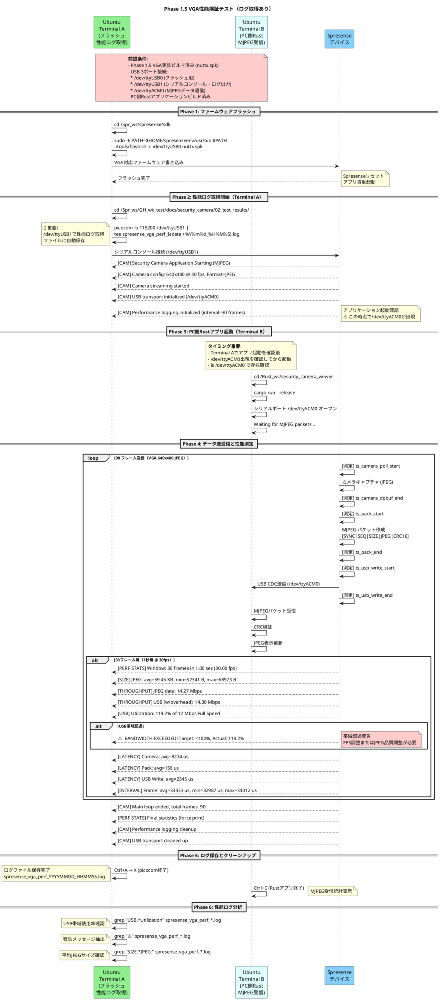
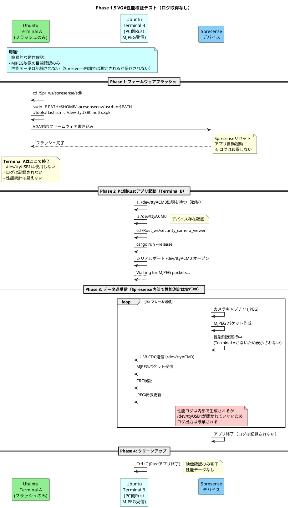

# テスト手順フローチャート

**作成日**: 2025-12-21
**最終更新**: 2025-12-25 (Phase 1.5追加)
**対象**: Phase 1B USB CDC データ転送テスト / Phase 1.5 VGA性能検証テスト

このドキュメントでは、Phase 1B/1.5 テストにおける Windows/Ubuntu の操作手順と、複数の Ubuntu 端末での操作の流れを視覚化します。

---

## 目次

- [Phase 1B: USB CDC データ転送テスト](#phase-1b-全体フローシーケンス図)
- [Phase 1.5: VGA性能検証テスト（ログ取得あり/なし）](#phase-15-全体フローシーケンス図)
- [Phase 0: 初回セットアップ](#phase-0-初回セットアップ-初回のみ必要)
- [端末の役割まとめ](#端末の役割まとめ)
- [USB デバイス構成](#usb-デバイス構成)
- [トラブルシューティング早見表](#トラブルシューティング早見表)

---

## Phase 1B: 全体フローシーケンス図

```plantuml
@startuml
title Phase 1B USB CDC データ転送テスト手順

actor "Windows\nPowerShell" as Windows #LightBlue
participant "Ubuntu\nTerminal 1\n(ビルド・フラッシュ\nUSB CDC・受信・検証)" as Term1 #LightGreen
participant "Ubuntu\nTerminal 2\n(Spresense操作\nminicom)" as Term2 #LightCyan
participant "Spresense\nデバイス" as Spresense #LightSkyBlue

opt 初回セットアップのみ
    note over Windows #FFCCCC
      **Windows 側初回セットアップ**
      1. WSL2 インストール
      2. usbipd-win インストール
         winget install --interactive --exact dorssel.usbipd-win
    end note

    Windows -> Windows: usbipd-win インストール確認
    note right: 📝 初回のみ\nusbipd list で確認

    note over Term1, Term2 #CCFFCC
      **Ubuntu (WSL2) 側初回セットアップ**
      1. 基本パッケージインストール
         sudo apt-get update
         sudo apt-get install -y build-essential python3 python3-serial minicom
      2. Spresense ツールチェーンセットアップ
         spresenseenv のインストール
      3. NuttX/SDK のクローン・セットアップ
    end note

    Term1 -> Term1: sudo apt-get install\nbuild-essential python3 python3-serial
    note left: 📝 初回のみ\n基本ツールインストール

    Term1 -> Term1: Spresense ツールチェーン\nセットアップ
    note left: 📝 初回のみ\n~/spresenseenv/\narm-none-eabi-gcc

    Term1 -> Term1: NuttX/SDK クローン
    note left: 📝 初回のみ\n~/Spr_ws/spresense/

    Term1 -> Term1: Kconfig 設定\nCONFIG_CXD56_USBDEV=y\nCONFIG_SYSTEM_CDCACM=y
    note left: 📝 初回のみ\nUSB CDC 有効化
end

== Phase 1: ビルド ==

Term1 -> Term1: cd ~/Spr_ws/spresense/sdk
Term1 -> Term1: ./build.sh
note left: PATH設定:\n$HOME/spresenseenv/usr/bin
Term1 -> Term1: nuttx.spk 生成完了

== Phase 2: フラッシュ (CP2102) ==

Windows -> Windows: usbipd list
note right: BUSID 1-11:\nCP210x (COM3)\nコンソール/フラッシュ用

alt 初回デバイス接続
    Windows -> Windows: usbipd bind --busid 1-11
    note right: 📝 初回のみ\nデバイスをWSL2用に登録
    Windows -> Windows: usbipd attach --wsl --busid 1-11
    note right: WSL2に接続
else 2回目以降
    Windows -> Windows: usbipd attach --wsl --busid 1-11
    note right: WSL2に接続\n(bind済みのためattachのみ)
end

alt 初回ドライバーロード
    Term1 -> Term1: sudo modprobe cp210x
    note left: 📝 初回のみ\nCP2102ドライバーロード\n/dev/ttyUSB0 作成
else ドライバー既にロード済み
    Term1 -> Term1: ls /dev/ttyUSB0
    note right: デバイス確認のみ
end

Term1 -> Term1: sudo tools/flash.sh\n-c /dev/ttyUSB0 nuttx.spk
Term1 -> Spresense: nuttx.spk 書き込み
Spresense --> Term1: フラッシュ完了
Term1 -> Term1: Spresense リブート待機

== Phase 2.5: Spresense コンソール接続 (minicom) ==

alt 初回 minicom 設定
    Term2 -> Term2: sudo minicom -s
    note left: 📝 初回のみ\nSerial port setup:\n- Device: /dev/ttyUSB0\n- Bps: 115200 8N1\n- Hardware Flow Control: No\n設定を "dfl" として保存
else minicom 既に設定済み
    note over Term2: 設定済みのためスキップ
end

Term2 -> Term2: minicom
note left: minicom 起動\n/dev/ttyUSB0, 115200bps

Term2 -> Spresense: シリアル接続確立
Spresense --> Term2: NuttShell (NSH) プロンプト\nnsh>

note over Term2, Spresense #LIGHTYELLOW
  **minicom 操作メモ**
  - 終了: Ctrl+A → X
  - 履歴: 上下矢印キー
  - クリア: Ctrl+L
end note

Term2 -> Spresense: sercon (NuttX NSH コマンド)
Spresense --> Term2: CDC/ACM serial driver registered
note right: 🔴 **重要!**\nSpresense側で\n/dev/ttyACM0 を準備\n(Linux側接続前)

== Phase 3: USB CDC セットアップ (CXD5602) ==

Windows -> Windows: usbipd list
note right: BUSID 1-1:\nSony 054c:0bc2 (COM4)\nCDC ACM データ転送用

alt 初回デバイス接続
    Windows -> Windows: usbipd bind --busid 1-1
    note right: 📝 初回のみ\nデバイスをWSL2用に登録
    Windows -> Windows: usbipd attach --wsl --busid 1-1
    note right: WSL2に接続
else 2回目以降
    Windows -> Windows: usbipd attach --wsl --busid 1-1
    note right: WSL2に接続\n(bind済みのためattachのみ)
end

alt 初回ドライバーロード
    Term1 -> Term1: sudo modprobe cdc-acm
    note right: 📝 初回のみ\nCDC ACMドライバーロード\n/dev/ttyACM0 作成
else ドライバー既にロード済み
    Term1 -> Term1: ls /dev/ttyACM0
    note right: デバイス確認のみ
end

Term1 -> Term1: ls -l /dev/ttyACM0
note right: デバイス存在確認\ncrw-rw---- root dialout

Term1 -> Term1: sudo chmod 666 /dev/ttyACM0
note right: 権限設定 (全ユーザー読み書き)

Term1 -> Term1: stty -F /dev/ttyACM0\nraw -echo 115200
note right: 🔴 **最重要!**\nTTY Raw モード設定\nバイナリデータ破損防止

== Phase 4: データ受信準備 ==

Term1 -> Term1: rm -f /tmp/mjpeg_stream.bin
note right: 古いファイル削除

Term1 -> Term1: cat /dev/ttyACM0 >\n/tmp/mjpeg_stream.bin
note right: データ受信待機\n(ブロッキング状態)

== Phase 5: Spresense 実行 ==

Term2 -> Spresense: security_camera (アプリ実行)

Spresense -> Spresense: [CAM] Application Starting
Spresense -> Spresense: [CAM] USB transport initialized\n(/dev/ttyACM0)

loop 90 フレーム送信
    Spresense -> Spresense: カメラキャプチャ (JPEG)
    Spresense -> Spresense: MJPEG パケット作成\n[SYNC|SEQ|SIZE|JPEG|CRC16]
    Spresense -> Term1: USB CDC 送信\n(write /dev/ttyACM0)
    Term1 -> Term1: データ追記 →\n/tmp/mjpeg_stream.bin

    alt フレーム 1, 30, 60, 90
        Spresense --> Term2: [CAM] Frame N:\nJPEG=X bytes,\nPacket=Y bytes,\nUSB sent=Y, Seq=N-1
    end
end

Spresense -> Spresense: [CAM] Main loop ended,\ntotal frames: 90
Spresense --> Term2: [CAM] USB transport cleaned up\n(total sent: 672972 bytes)

== Phase 6: データ受信完了 ==

Term2 -> Term1: Spresense 完了を確認
Term1 -> Term1: Ctrl+C (cat 停止)
note right: 受信完了\n/tmp/mjpeg_stream.bin\n~657 KB (672,972 bytes)

== Phase 7: 検証 ==

Term1 -> Term1: ls -lh /tmp/mjpeg_stream.bin
note left: ファイルサイズ確認\n期待: ~657K

Term1 -> Term1: hexdump -C\n/tmp/mjpeg_stream.bin | head -30
note left: プロトコルヘッダ確認\nbe ba fe ca (SYNC_WORD)\n00 00 00 00 (SEQUENCE=0)\nff d8 (JPEG SOI)

Term1 -> Term1: hexdump -C\n/tmp/mjpeg_stream.bin |\ngrep -c "be ba fe ca"
Term1 -> Term1: **90**
note right: ✅ 成功!\n90個の同期ワード検出

Term1 -> Term1: hexdump -C\n/tmp/mjpeg_stream.bin |\ngrep -c "ff d8"
Term1 -> Term1: **90**
note right: ✅ 成功!\n90個のJPEG SOI検出

@enduml
```



---

## Phase 1.5: 全体フローシーケンス図

### Phase 1.5-A: 性能ログ取得あり（推奨）



### Phase 1.5-B: 性能ログ取得なし（映像確認のみ）



---

## Phase 1.5: 操作手順詳細

### 方式A: 性能ログ取得あり（推奨）

**用途**:
- USB帯域使用率の測定
- JPEGサイズの統計取得
- レイテンシ分析
- 帯域超過の検出

**必要な端末**: 2端末

#### Terminal A: フラッシュ + 性能ログ取得

```bash
# ステップ1: ファームウェアフラッシュ
cd ~/Spr_ws/spresense/sdk
sudo -E PATH=$HOME/spresenseenv/usr/bin:$PATH ./tools/flash.sh -c /dev/ttyUSB0 nuttx.spk

# Spresenseリセット後、数秒待つ

# ステップ2: 性能ログ取得開始
cd ~/Spr_ws/GH_wk_test/docs/security_camera/02_test_results/
picocom -b 115200 /dev/ttyUSB1 | tee spresense_vga_perf_$(date +%Y%m%d_%H%M%S).log

# 以下のログが表示される:
# [CAM] Security Camera Application Starting (MJPEG)
# [CAM] Camera config: 640x480 @ 30 fps, Format=JPEG
# [CAM] Performance logging initialized (interval=30 frames)
# ...
# [PERF STATS] Window: 30 frames in 1.00 sec (30.00 fps)
# [USB] Utilization: 119.2% of 12 Mbps Full Speed
# ⚠️  BANDWIDTH EXCEEDED! ...

# picocom終了: Ctrl+A → X
```

**使用デバイス**:
- `/dev/ttyUSB0`: フラッシュ専用
- `/dev/ttyUSB1`: シリアルコンソール（性能ログ出力）

#### Terminal B: PC側Rustアプリ

```bash
# Terminal Aでアプリ起動を確認後に実行
# /dev/ttyACM0が出現するまで待つ（数秒）

ls /dev/ttyACM0  # 存在確認

cd ~/Rust_ws/security_camera_viewer
cargo run --release

# MJPEG映像がリアルタイム表示される
# Ctrl+C で終了
```

**使用デバイス**:
- `/dev/ttyACM0`: MJPEGデータ通信

#### ログ分析

```bash
# Terminal A（picocom終了後）

# USB帯域使用率確認
grep "USB.*Utilization" spresense_vga_perf_*.log

# 警告抽出
grep "⚠️" spresense_vga_perf_*.log

# 平均JPEGサイズ
grep "SIZE.*JPEG:" spresense_vga_perf_*.log | awk '{print $6}'

# レイテンシ確認
grep "LATENCY" spresense_vga_perf_*.log
```

---

### 方式B: 性能ログ取得なし（簡易確認）

**用途**:
- 映像表示の目視確認のみ
- 性能データは不要
- 迅速なテスト実行

**必要な端末**: 1端末（Terminal Bのみ）

**注意**: Spresense内部では性能測定は実行されますが、`/dev/ttyUSB1`を開いていないため、ログ出力は破棄されます。

#### Terminal A: フラッシュのみ（その後閉じてOK）

```bash
cd ~/Spr_ws/spresense/sdk
sudo -E PATH=$HOME/spresenseenv/usr/bin:$PATH ./tools/flash.sh -c /dev/ttyUSB0 nuttx.spk

# フラッシュ完了後、Terminal Aは閉じてOK
```

#### Terminal B: PC側Rustアプリのみ

```bash
# /dev/ttyACM0出現を待つ（数秒）
ls /dev/ttyACM0

cd ~/Rust_ws/security_camera_viewer
cargo run --release

# MJPEG映像表示のみ確認
# Ctrl+C で終了
```

---

## Phase 1.5: USB デバイス構成

### Spresense 3ポート接続

| デバイス | 用途 | Terminal A（ログあり） | Terminal B | Terminal A（ログなし） |
|---------|------|---------------------|-----------|---------------------|
| `/dev/ttyUSB0` | フラッシュ専用 | ✅ 使用 | - | ✅ 使用 |
| `/dev/ttyUSB1` | シリアルコンソール（性能ログ） | ✅ 使用 | - | ❌ 不使用 |
| `/dev/ttyACM0` | MJPEGデータ通信 | - | ✅ 使用 | ✅ 使用（Terminal B） |

### 物理接続図

```
Spresense ─┬─ /dev/ttyUSB0  (CP2102 Boot Loader)
           │   └→ tools/flash.sh でフラッシュ
           │
           ├─ /dev/ttyUSB1  (CP2102 Serial Console)
           │   └→ picocom で性能ログ取得（方式Aのみ）
           │
           └─ /dev/ttyACM0  (CXD5602 USB CDC-ACM)
               └→ Rustアプリケーションでデータ受信
```

---

## Phase 1.5: 性能検証項目

### 測定メトリクス（方式Aのみ取得可能）

| メトリクス | 目標値 | 測定タイミング |
|-----------|-------|--------------|
| 平均JPEGサイズ | 50-80 KB | 30フレーム毎 |
| USB帯域使用率 | <100% (12 Mbps以下) | 30フレーム毎 |
| 実測FPS | 30 fps | 30フレーム毎 |
| フレーム間隔 | 33.3 ± 1 ms | 30フレーム毎 |
| カメラ取得時間 | <10 ms | 30フレーム毎（平均） |
| USB送信時間 | <3 ms | 30フレーム毎（平均） |

### 警告の見方

**USB帯域超過警告**:
```
[USB] Utilization: 119.2% of 12 Mbps Full Speed
⚠️  BANDWIDTH EXCEEDED! Target: <100%, Actual: 119.2%
⚠️  Recommend: Reduce FPS or JPEG quality
```

**対策**:
1. フレームレート調整（30fps → 20fps）
2. JPEG品質調整（サイズ削減）
3. 一時的にQVGAへ戻す

---

## Phase 0: 初回セットアップ (初回のみ必要)

### Windows 側

**必要なソフトウェア**:

1. **WSL2 (Windows Subsystem for Linux 2)**
   ```powershell
   # PowerShell (管理者権限)
   wsl --install
   wsl --set-default-version 2
   ```

2. **usbipd-win** (USB デバイスを WSL2 に接続)
   ```powershell
   # PowerShell (管理者権限)
   winget install --interactive --exact dorssel.usbipd-win
   ```

3. **確認**
   ```powershell
   usbipd list
   ```

### Ubuntu (WSL2) 側

**必要なパッケージのインストール**:

```bash
# 基本ツール
sudo apt-get update
sudo apt-get install -y build-essential python3 python3-serial git kconfig-frontends gperf libncurses5-dev flex bison genromfs xxd

# USB ドライバー (初回ロード)
sudo modprobe cp210x    # CP2102用
sudo modprobe cdc-acm   # CDC ACM用
```

**Spresense ツールチェーンのセットアップ**:

```bash
# 1. ツールチェーンのダウンロードとインストール
mkdir -p ~/spresenseenv
cd ~/spresenseenv
# spresense SDK に含まれる install-tools.sh を使用してインストール
# 詳細は Spresense 公式ドキュメント参照
```

**NuttX/SDK のクローンとセットアップ**:

```bash
# 2. プロジェクトディレクトリ作成
mkdir -p ~/Spr_ws/spresense
cd ~/Spr_ws/spresense

# 3. NuttX と SDK のクローン/セットアップ
# (既にセットアップ済みの場合はスキップ)
```

**USB CDC 機能の有効化** (📝 重要な初回設定):

`nuttx/.config` ファイルに以下を追加:
```bash
CONFIG_CXD56_USBDEV=y
CONFIG_SYSTEM_CDCACM=y
```

または `make menuconfig` で設定:
- `Board Selection → CXD56xx Configuration → [*] USB`
- `Application Configuration → System NSH Add-Ons → [*] USB CDC/ACM Device Commands`

---

## 端末の役割まとめ

### Windows PowerShell (管理者権限)

**役割**: USB デバイスを WSL2 に接続

**操作**:

1. **デバイス一覧確認**:
   ```powershell
   usbipd list
   ```

2. **初回のみ: デバイスを WSL2 用に登録 (bind)**:
   ```powershell
   usbipd bind --busid 1-11   # CP2102 (コンソール/フラッシュ用)
   usbipd bind --busid 1-1    # CXD5602 USB Device (CDC ACM データ転送用)
   ```
   📝 **初回のみ必要**: `bind` コマンドでデバイスを WSL2 用に登録します。一度 bind すれば、次回以降は不要です。

3. **WSL2 に接続 (attach)**:
   ```powershell
   usbipd attach --wsl --busid 1-11   # CP2102 (コンソール/フラッシュ用)
   usbipd attach --wsl --busid 1-1    # CXD5602 USB Device (CDC ACM データ転送用)
   ```
   📝 **毎回必要**: WSL2 を起動するたびに `attach` が必要です。

**必要なタイミング**:
- **初回**: `bind` → `attach`
- **2回目以降**: `attach` のみ

---

### Ubuntu Terminal 1: ビルド・フラッシュ・USB CDC・受信・検証

**役割**: ビルド、フラッシュ、USB CDC セットアップ、データ受信、検証

**操作フロー**:
```bash
# 1. ビルド
cd ~/Spr_ws/spresense/sdk
./build.sh

# 2. フラッシュ (初回のみ modprobe が必要)
sudo modprobe cp210x  # 初回のみ
sudo tools/flash.sh -c /dev/ttyUSB0 nuttx.spk

# 注意: Terminal 2で minicom起動し、sercon コマンドを先に実行

# 3. USB CDC セットアップ (初回のみ modprobe が必要)
sudo modprobe cdc-acm  # 初回のみ
sudo chmod 666 /dev/ttyACM0
stty -F /dev/ttyACM0 raw -echo 115200  # 🔴 最重要!

# 4. データ受信
rm -f /tmp/mjpeg_stream.bin
cat /dev/ttyACM0 > /tmp/mjpeg_stream.bin
# (Spresense 完了後 Ctrl+C で停止)

# 5. 検証
ls -lh /tmp/mjpeg_stream.bin
hexdump -C /tmp/mjpeg_stream.bin | head -30
hexdump -C /tmp/mjpeg_stream.bin | grep -c "be ba fe ca"  # 期待: 90
hexdump -C /tmp/mjpeg_stream.bin | grep -c "ff d8"         # 期待: 90
```

---

### Ubuntu Terminal 2: Spresense 操作 (minicom)

**役割**: Spresense との通信、アプリ実行

**初回セットアップ** (初回のみ):
```bash
# minicom 設定
sudo minicom -s

# Serial port setup で設定:
# - Serial Device: /dev/ttyUSB0
# - Bps/Par/Bits: 115200 8N1
# - Hardware Flow Control: No
# - Software Flow Control: No

# "Save setup as dfl" で設定を保存
# "Exit" で終了
```

**操作フロー**:
```bash
# minicom 起動
minicom

# Spresense が起動すると NuttShell プロンプトが表示される:
# nsh>

# Spresense 操作 (minicom 内)
# 🔴 重要: Linux側のUSB CDC セットアップ前に sercon を実行
nsh> sercon              # CDC/ACM ドライバー有効化 (先に実行)

# この後、Terminal 1 で USB CDC セットアップ (Phase 3) を実行

# データ受信準備完了後にアプリ実行
nsh> security_camera     # アプリ実行
```

**minicom 操作メモ**:
- **終了**: `Ctrl+A` → `X`
- **履歴**: 上下矢印キー
- **画面クリア**: `Ctrl+L`
- **スクロールバック**: `Ctrl+A` → `B`

**出力例** (minicom に表示):
```
[CAM] Security Camera Application Starting (MJPEG)
[CAM] USB transport initialized (/dev/ttyACM0)
[CAM] Frame 1: JPEG=8832 bytes, Packet=8846 bytes, USB sent=8846, Seq=0
[CAM] Frame 30: JPEG=7424 bytes, Packet=7438 bytes, USB sent=7438, Seq=29
[CAM] Frame 60: JPEG=7296 bytes, Packet=7310 bytes, USB sent=7310, Seq=59
[CAM] Frame 90: JPEG=7104 bytes, Packet=7118 bytes, USB sent=7118, Seq=89
[CAM] Main loop ended, total frames: 90
[CAM] USB transport cleaned up (total sent: 672972 bytes)
```

**重要ポイント**:
- `stty raw` 設定が **最重要**
- 設定しないとバイナリデータが破損する
- `cat` コマンドは Spresense が完了するまでブロッキング
- Spresense 完了後、**Ctrl+C** で停止

---


## USB デバイス構成

### 2つの USB 接続

| BUSID | VID:PID    | デバイス | 用途 | WSL2 デバイス | Terminal |
|-------|------------|---------|------|---------------|----------|
| 1-11  | 10c4:ea60  | CP210x USB to UART Bridge | コンソール/フラッシュ | /dev/ttyUSB0 | Terminal 1, 2 |
| 1-1   | 054c:0bc2  | Sony Corp. CDC/ACM Serial | データ転送 | /dev/ttyACM0 | Terminal 1, 2 |

### 物理接続

```
PC (Windows)
├─ USB Port 1 ─► Spresense Main Board (CP2102) ─► WSL2: /dev/ttyUSB0
│                                                  ├─ フラッシュ: tools/flash.sh
│                                                  └─ コンソール: minicom/screen (オプション)
│
└─ USB Port 2 ─► Spresense Extension Board (CXD5602 USB Device) ─► WSL2: /dev/ttyACM0
                                                                     └─ データ転送: cat > file.bin
```

---

## 最重要ポイント

### 🔴 TTY Raw モード設定

**問題**:
- デフォルトの TTY モードは canonical (cooked) mode
- 制御文字 (`\n`, `\r`, `^C`, etc.) が変換される
- バイナリデータが破損する

**解決策**:
```bash
stty -F /dev/ttyACM0 raw -echo 115200
```

**設定確認**:
```bash
stty -F /dev/ttyACM0 -a | grep -E "raw|echo"
# 期待: -isig -icanon min 1 time 0 -echo -echoe -echok ...
```

**必ず実行するタイミング**:
- USB CDC セットアップ直後
- データ受信 (`cat /dev/ttyACM0`) の **前**

---

## トラブルシューティング早見表

| 問題 | 原因 | 解決策 | Terminal |
|-----|------|-------|----------|
| `/dev/ttyACM0` が見つからない | ドライバー未ロード | `sudo modprobe cdc-acm` | Terminal 1, 2 |
| 同期ワードが見つからない | TTY が cooked mode | `stty -F /dev/ttyACM0 raw -echo 115200` | Terminal 1, 2 |
| カメラ初期化失敗 (-17) | デバイス busy | `nsh> reboot` | Terminal 1, 2 |
| `/dev/ttyUSB0` デバイスロック | ロックファイル残存 | `sudo rm -f /var/lock/LCK..ttyUSB0` | Terminal 1, 2 |
| USB デバイスが見えない | WSL2 未アタッチ | `usbipd attach --wsl --busid <ID>` | Windows |

---

## 参考資料

- **詳細手順**: [`02_PHASE1_SUCCESS_GUIDE.md`](../03_manuals/02_PHASE1_SUCCESS_GUIDE.md)
- **最小手順**: [`01_QUICK_START.md`](../03_manuals/01_QUICK_START.md)
- **USB CDC セットアップ**: [`03_USB_CDC_SETUP.md`](../03_manuals/03_USB_CDC_SETUP.md)
- **トラブルシューティング**: [`04_TROUBLESHOOTING.md`](../03_manuals/04_TROUBLESHOOTING.md)
- **教訓**: [`03_LESSONS_LEARNED.md`](../05_project/03_LESSONS_LEARNED.md)

---

**作成者**: Claude Code (Sonnet 4.5)
**最終更新**: 2025-12-21
