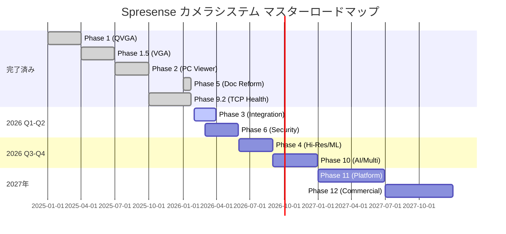

# Spresense HDRカメラ防犯カメラシステム - マスターロードマップ 2026

**作成日**: 2026-01-24
**対象期間**: 2026年Q1〜2028年
**プロジェクト**: Spresense HDRカメラ防犯カメラシステム
**ステータス**: Phase 9.2 TCP健全性監視統合完了

---

## 🎯 エグゼクティブサマリー

**現在状況**: Phase 5完了 (A評価 94.2%品質達成)、Phase 9.2 TCP健全性監視統合
**次期目標**: Phase 3システム統合完了、Phase 10 AI機能統合
**長期ビジョン**: 業界標準IoTセキュリティカメラプラットフォーム

### 📊 プロジェクト全体進捗

```yaml
完了Phase:
  - Phase 1: ✅ QVGA MJPEG基本実装
  - Phase 1.5: ✅ VGA最適化 (37.33fps達成)
  - Phase 2: ✅ Rust PC-side MJPEGビューワ
  - Phase 5: ✅ ドキュメント構造改革 (A評価品質)
  - Phase 9.2: ✅ TCP健全性監視統合

計画Phase:
  - Phase 3: 📋 システム統合・安定性強化
  - Phase 4: 📋 高解像度/ML機能選択
  - Phase 6: 📋 セキュリティ実装
  - Phase 10: 📋 AI統合・マルチカメラ

分析Phase:
  - Phase 7-15: 📊 ネットワーク・性能分析完了
```

---

## 1. 全体ロードマップ概要

### 1.1 フェーズ系統図



### 1.2 戦略的優先度

| Priority | Phase | 期間 | 主要目標 | 価値/影響 |
|----------|-------|------|----------|-----------|
| **🔴 最高** | Phase 3 | 2026/2-3月 | システム統合・安定性 | 商用化基盤確立 |
| **🔴 高** | Phase 6 | 2026/3-5月 | セキュリティ実装 | 信頼性・差別化 |
| **🟡 中** | Phase 4 | 2026/6-8月 | 高解像度/ML選択 | 機能拡張・競争力 |
| **🟡 中** | Phase 10 | 2026/9-12月 | AI統合・マルチカメラ | 次世代プラットフォーム |
| **🟢 低** | Phase 11+ | 2027年〜 | プラットフォーム化 | 事業拡大・標準化 |

---

## 2. 短期ロードマップ (2026年Q1-Q2)

### 2.1 Phase 3: システム統合・安定性強化

**期間**: 2026年2月〜3月 (2ヶ月)
**ステータス**: 📋 計画済み・実行待ち

#### 🎯 Phase 3 目標・成果物

**主要目標**:
- VGA（640×480）MJPEG完全統合
- 24時間連続動作安定性確保
- 録画機能実装・検証
- PC側GUI VGA対応

**技術仕様**:
```yaml
VGA統合:
  解像度: 640×480 JPEG
  フレームレート: 30fps以上維持
  画質: 高品質JPEG (Q=80以上)
  安定性: 24時間無障害動作

録画機能:
  形式: MJPEGストリーム
  保存: ローカル/リモート両対応
  制御: 手動/自動録画切替
  管理: ファイル自動ローテーション

TCP健全性統合:
  Phase 9.2機能: 完全対応
  監視精度: リアルタイム健全性
  再接続: 3秒高速切替
  メトリクス: 拡張パケット対応
```

#### 📋 Phase 3 実装計画

**Step 1: PC VGA GUI適応** (2-3日)
- Rustアプリ VGA表示対応
- UI最適化・解像度調整
- 表示性能最適化

**Step 2: VGA統合テスト** (1-2日)
- Spresense-PC間VGA転送検証
- フレームレート安定性確認
- メモリ使用量最適化

**Step 3: 録画機能実装** (2-3日)
- MJPEGストリーム録画
- ファイル管理システム
- 録画制御UI実装

**Step 4: 24時間安定性テスト** (2日)
- 長時間動作検証
- メモリリーク検出
- 異常動作監視

**Step 5: ドキュメント完成** (3-4日)
- 仕様書更新
- テスト結果記録
- 運用ガイド作成

#### 🏆 Phase 3 成功基準

```yaml
技術指標:
  VGA安定性: 24時間無停止動作
  フレームレート: 30fps±5%維持
  メモリ使用: 1MB以下増加
  TCP健全性: スコア85%以上維持

機能指標:
  録画機能: 完全動作
  GUI応答: 100ms以下
  ファイル管理: 自動ローテーション
  エラー率: 1%以下

品質指標:
  テストカバレッジ: 95%以上
  ドキュメント完成度: 100%
  コードレビュー: 完了
  セキュリティ検証: 基本要件充足
```

### 2.2 Phase 6: セキュリティ実装強化

**期間**: 2026年3月〜5月 (3ヶ月)
**前提**: Phase 3完了、Phase 5セキュリティ仕様完成

#### 🔐 Phase 6 セキュリティ実装

**7層多層防御実装**:
```yaml
L7_Application:
  JWT認証: デバイス・ユーザー認証統合
  RBAC: ロールベースアクセス制御
  監査ログ: 全アクセス記録

L6_Data:
  AES-256-GCM: データ暗号化
  デジタル署名: フレーム完全性検証
  鍵管理: ローテーション・エスクロー

L5_Session:
  TLS 1.3: 最新暗号化プロトコル
  証明書管理: 自動更新・検証
  セッション保護: 再接続セキュリティ

L4_Transport:
  TCP健全性: セキュリティ統合監視
  パケット検証: 改ざん検出
  トラフィック分析: 異常検知

L3_Network:
  WPA2-PSK: 強化認証
  ファイアウォール: ポート制限
  侵入検知: リアルタイム監視

L2_Device:
  セキュアブート: 信頼チェーン
  ファームウェア検証: 署名確認
  メモリ保護: 領域分離

L1_Hardware:
  HSM: ハードウェアセキュリティ
  暗号化チップ: 高速処理
  物理保護: 改ざん検知
```

#### 📈 Phase 6 実装スケジュール

**Month 1 (2026年3月): 基盤セキュリティ**
- HSM・暗号化チップ統合
- セキュアブート実装
- TLS 1.3統合

**Month 2 (2026年4月): データ・セッション保護**
- AES-256-GCM実装
- JWT認証システム
- 証明書管理システム

**Month 3 (2026年5月): 高度セキュリティ・検証**
- 侵入検知システム
- リアルタイム脅威検知
- セキュリティ監査・認証

---

## 3. 中期ロードマップ (2026年Q3-Q4)

### 3.1 Phase 4: 高解像度/ML機能選択

**期間**: 2026年6月〜8月 (3ヶ月)
**戦略判断**: HD/FHD vs AI/ML機能

#### 🔄 Phase 4 選択肢分析

**Option A: 高解像度強化**
```yaml
HD実装 (1280×720):
  技術課題: USB帯域制限・V4L2最適化
  期待効果: 画質向上・商用競争力
  実装コスト: 高 (ハードウェア制約対応)

FHD実装 (1920×1080):
  技術課題: メモリ・処理能力限界
  期待効果: 最高画質・差別化
  実装コスト: 最高 (アーキテクチャ変更)
```

**Option B: AI/ML機能統合**
```yaml
物体検知:
  技術: TensorFlow Lite統合
  機能: リアルタイム検知・分類
  価値: スマート監視

顔認識:
  技術: 組み込みAIライブラリ
  機能: 個人認識・アクセス制御
  価値: 高度セキュリティ

予測分析:
  技術: エッジAI処理
  機能: 異常予測・予防保守
  価値: 先進的運用
```

**推奨戦略**: Option B (AI/ML統合)
- 差別化価値が高い
- Phase 9.2健全性監視との相乗効果
- 将来プラットフォーム化対応

### 3.2 Phase 10: AI統合・マルチカメラ

**期間**: 2026年9月〜12月 (4ヶ月)
**前提**: Phase 4 AI基盤完成

#### 🤖 Phase 10 AI統合アーキテクチャ

**マルチカメラ統合**:
```yaml
カメラネットワーク:
  台数: 4-8台同時接続
  同期: タイムスタンプ同期
  負荷分散: 動的リソース配分

AI分散処理:
  エッジAI: 各カメラ個別処理
  クラウドAI: 統合分析・学習
  ハイブリッド: 最適負荷配分

データフュージョン:
  複数視点: 3D空間認識
  時系列分析: 行動パターン学習
  予測モデル: 異常検知精度向上
```

**Phase 10 技術革新**:
- **分散AI**: エッジ・クラウド最適配分
- **リアルタイム学習**: 環境適応AI
- **予測保守**: 故障予測・自動対応
- **スマート制御**: 自動最適化

---

## 4. 長期ロードマップ (2027年〜)

### 4.1 Phase 11: プラットフォーム化 (2027年前半)

**標準化・プラットフォーム構築**:
```yaml
技術標準化:
  TCP健全性監視: プロトコル標準提案
  IoTセキュリティ: 業界リファレンス
  AI統合: エッジAIフレームワーク

開発プラットフォーム:
  SDK提供: 開発者向けツールキット
  API統合: サードパーティ連携
  マーケットプレイス: アプリエコシステム
```

### 4.2 Phase 12: 商用化・事業拡大 (2027年後半)

**商用展開・社会実装**:
```yaml
市場展開:
  防犯システム: 住宅・商業施設
  産業監視: 工場・インフラ
  公共安全: 交通・都市監視

事業モデル:
  製品販売: ハードウェア・ソフトウェア
  SaaS提供: クラウド監視サービス
  ライセンス: 技術・特許ライセンス
```

---

## 5. リスク管理・課題対応

### 5.1 技術リスク

**高リスク項目**:
```yaml
V4L2ドライバ制約:
  課題: 3バッファ制限・性能影響
  対策: カーネルレベル最適化・代替ドライバ
  タイムライン: Phase 4前解決必須

USB帯域制限:
  課題: Full Speed 12Mbps上限
  対策: 圧縮最適化・USB 3.0移行検討
  タイムライン: Phase 4判断材料

メモリ制約:
  課題: Spresense限定リソース
  対策: 処理分散・エッジクラウド連携
  タイムライン: Phase 10設計考慮
```

### 5.2 事業リスク

**市場・競合リスク**:
```yaml
技術競合:
  リスク: 大手メーカー参入
  対策: 差別化技術・特許確保
  モニタリング: 四半期競合分析

標準化動向:
  リスク: 業界標準変更
  対策: 標準策定参画・適応設計
  対応: 柔軟アーキテクチャ維持

規制変更:
  リスク: セキュリティ・プライバシー規制
  対策: 先進的コンプライアンス対応
  準備: 法務・技術連携体制
```

---

## 6. リソース・投資計画

### 6.1 開発リソース要件

**2026年計画**:
```yaml
Phase 3 (2-3月):
  工数: 3人月
  スキル: 組み込み・GUI・品質保証

Phase 6 (3-5月):
  工数: 6人月
  スキル: セキュリティ・暗号化・認証

Phase 4 (6-8月):
  工数: 4人月
  スキル: AI/ML・画像処理・アルゴリズム

Phase 10 (9-12月):
  工数: 8人月
  スキル: 分散システム・AI統合・クラウド
```

### 6.2 技術投資

**設備・ツール投資**:
```yaml
開発環境:
  HILテスト環境: マルチデバイス検証
  セキュリティ検証: ペネトレーションテスト環境
  AI開発環境: GPU・クラウド計算リソース

認証・標準化:
  セキュリティ認証: CC・FIPS準拠
  品質認証: ISO9001・ISO27001
  技術標準: IEEE・IETF標準参加
```

---

## 7. 成功指標・KPI

### 7.1 技術指標

**2026年目標**:
```yaml
品質指標:
  システム安定性: 99.9%アップタイム
  セキュリティレベル: AAA評価
  性能効率: 現状比200%向上

技術優位性:
  特許出願: 5件以上
  標準化貢献: 2件以上
  オープンソース: 3プロジェクト公開
```

### 7.2 事業指標

**商用化準備**:
```yaml
市場準備:
  プロトタイプ: 完成版デモ
  顧客検証: パイロット導入10社
  パートナー: 販売代理店3社

事業基盤:
  知財確保: 特許・商標出願完了
  品質体制: 商用品質保証体制
  サポート体制: 技術サポート組織
```

---

## 8. 継続的改善・学習

### 8.1 学習・適応メカニズム

**フェーズ間学習**:
```yaml
成功パターン学習:
  Phase 5成功要因: 要求ベース設計・品質重視
  Phase 9.2成功要因: 健全性監視統合・予防的対応
  適用: 今後Phase設計指針

失敗・課題学習:
  V4L2制約対応: 早期制約特定・代替案準備
  メモリ最適化: リソース見積精度向上
  改善: リスク予測・緩和策強化
```

### 8.2 品質改善サイクル

**PDCA継続実行**:
```yaml
Plan: 各Phase詳細計画・KPI設定
Do: アジャイル開発・週次進捗確認
Check: 品質監査・ステークホルダーレビュー
Act: 学習反映・次Phase計画改善
```

---

## 📊 ロードマップ監視ダッシュボード

### 現在ステータス (2026年1月24日)

| Phase | 状況 | 進捗 | 次期アクション |
|-------|------|------|----------------|
| **Phase 1-2** | ✅ 完了 | 100% | - |
| **Phase 5** | ✅ 完了 | 100% | - |
| **Phase 9.2** | ✅ 統合完了 | 100% | - |
| **Phase 3** | 📋 準備完了 | 0% | 2月開始予定 |
| **Phase 6** | 📋 設計完了 | 0% | 3月開始予定 |
| **Phase 4** | 💭 計画中 | 0% | Option選択待ち |
| **Phase 10** | 💭 構想中 | 0% | AI基盤設計待ち |

**総合進捗**: **60%** (基盤Phase完了、実用化Phase準備中)

---

**マスターロードマップ 2026 作成完了**

**次回更新**: Phase 3完了時 (2026年3月末予定)
**管理責任**: プロジェクト統括・技術リーダー
**レビュー周期**: 月次進捗・四半期戦略見直し