# Performance Trends and System Evolution

## Overview

This document analyzes temporal patterns in the security camera system metrics, showing how performance has evolved over time and identifying specific patterns that support the Phase 10 PID control implementation.

**Analysis Period**: January 3-17, 2025
**Data Points**: 7,827 samples from 57 CSV files
**Key Focus**: FPS stability, network latency, and control system readiness

---

## 📋 Key Findings (Minto サマリ + 実データ可視化反映 2026-05-22)

**59 CSV / 9,395 サンプル × 1 ヶ月の実測データ** から抽出した、Phase 10 PID 制御の根拠 + 新規発見の **8 つの主要事実**。可視化図 (20 枚) は `figures/` 配下、考察と STAMP/STPA 対応関係は [`figures/CAPTIONS.md`](figures/CAPTIONS.md) に詳述。

### F-1 🔴 PC FPS は構造的に Target に届かない (既知の追認)

PC FPS の Target 達成率: **Target 5 fps = 20%、Target 10 = 1.5%、Target 15 / 30 = 0%** (`figures/ds_01_ecdf.png`)。9,395 サンプルで「制御無しでは Target にも収束しない」を定量確証。

### F-2 🔴 FPS と JPEG サイズに強い負相関 — Scene complexity が直接 FPS を支配 (NEW)

**Spresense FPS vs JPEG: r = -0.78 / PC FPS vs JPEG: r = -0.72** (全期間 / `figures/ds_10_fps_jpeg.png`)。
- Phase A/B では上流 (Spresense) が強く律速 (r ≈ -0.7〜-0.8) するが下流 PC は別ボトルネック (r ≈ -0.1〜-0.3)
- Phase C/10 で PC FPS も JPEG に強く連動 (r ≈ -0.7) → PID 制御により同期度向上
- → **STAMP UCA-A1.5 / UCA-CAM-AE.1 を実データで裏付け**

### F-3 🔴 PID 制御で PC ⇄ Spresense 同期度が劇的改善 (NEW)

PC FPS vs Spresense FPS のクロス相関ピーク値 (`figures/ds_08_cross_correlation.png`):

| Phase | Peak correlation | Peak lag | 解釈 |
|---|---|---|---|
| A baseline | 0.22 | -1 sample | PC 先行 (弱相関) |
| B 改良 | 0.54 | -3 sample | **PC 3 秒先行** = backpressure 発生 |
| C 現行 8/9 | 0.56 | 0 sample | 同時 |
| **10 PID 後** | **0.88** | 0 sample | **同時 (強相関)** |

→ Phase 10 で **PID が PC ⇄ Spresense の挙動を 4 倍密に同期** (0.22 → 0.88)。Phase A/B の「PC 先行」は ADR-008 bounded(3) の backpressure 構造と整合。

### F-4 🟡 ボトルネックは Spresense capture (HW) + Scene、TCP は律速していない (NEW)

PC FPS 低下時 (≤P10=2.80) vs 上昇時 (≥P90=7.95) の指標比較 (`figures/ds_09_bottleneck.png`, queue=0 アーティファクト排除済 n=5,815):

| 律速候補 | 低/高 ratio | 結論 |
|---|---|---|
| Spresense capture FPS | **0.45** | 🔴 主因 (HW 制約) |
| JPEG size | **1.97** | 🔴 Scene 律速 |
| USB CDC-ACM (Serial read) | 3.30 | 🟡 二次律速 |
| WiFi/TCP | 1.49 | ✓ 律速ではない |
| PC decode | 1.21 | ✓ 律速ではない |

→ 意外にも **TCP/WiFi は律速していない**。律速は Spresense HW + Scene + USB 経路。

### F-5 🔴 Serial read time の極端な変動 (CV=202%)

Serial read 中央値 51 ms vs mean 487 ms vs **max 34,228 ms = 34 秒** (`figures/hist_03_serial_read.png`, `figures/ds_02_boxplot.png`)。USB CDC-ACM 経路は時折数十秒級のスパイクを起こす。**UCA-DRV-USB.1** の実証データ。

### F-6 🟡 TCP send max が常時 1 秒超振動 — 自動再接続誤検知の根本原因 (NEW)

TCP avg 平均 160 ms vs max 平均 **1,699 ms / 最大 2,712 ms** (`figures/ts_02_tcp_send.png`, `figures/hist_02_tcp_send.png`)。静的閾値では「一時遅延 vs 真切断」を判別不可能。**UCA-B1.3** の実証データ → **M-2 (RTT 移動平均 ± 2σ 動的閾値)** の必要性を裏付け。

### F-7 🟡 Action queue は Phase A/B で未計装 (データアーティファクト発見)

**Phase A は 100%、Phase B は 94.3% が queue_depth=0** という事実が判明。これは「キューが空」ではなく **計装機能が未実装** だった結果。Phase C 以降で完全計装される。以前の分析で「queue=0 vs 5」と出ていたのは**アーティファクト混入**で、queue>0 ベースで再計算した結果、真の低 FPS 時は **queue=4 (詰まっている)** が正しい。

### F-9 🔵 FPS 変動と FPS 上限の主因切り分け (NEW — 2026-05-23)

「PC の FPS 性能」は **2 種類の問題が混在** している。ユーザー仮説 (PC パイプライン制御 vs Spresense HW 制約) を実データで切り分けると:

| 観点 | 主因 | 根拠 (図) | STAMP 対応 UCA |
|---|---|---|---|
| **FPS の変動 (悪化のばらつき)** | **Scene complexity (JPEG size)** が支配 — r=-0.78 (Spr) / r=-0.72 (PC) | ds_10, ds_09 | UCA-A1.5, CAM-AE.1 |
| (二次) | PC パイプライン制御の進化 (Phase A/B → C/10) | ds_08 (Cross-correlation 0.22 → 0.88) | (Phase 10 効果) |
| (三次) | USB CDC-ACM 経路の不安定性 (Serial read CV 202%) | hist_03, ds_02 | UCA-DRV-USB.1 |
| **FPS の上限 (最大値が低い)** | **Spresense HW + 経路の複合天井** — SPI 4 MHz/500 KB/s + tx_buff[1] シリアライズ + ISX012 30 fps 上限 | ds_11, ds_12 | 構造的天井 #1, #5, #6 |
| (補正) | WiFi/TCP は律速していない (ratio 1.49x のみ) | ds_09 | (該当無) |

→ **「変動」と「上限」は独立の問題**。Phase 10 PID は変動の同期度を改善したが、上限を引き上げてはいない。**上限改善には Tier 移行 (HW 変更) または画像サイズ上限制御 (M-34 候補, Image Size Control 章参照)** が必要。

### F-8 🟢 Phase 10 で Tier 1 の頭打ちに近い — 根治は Tier 移行が必要

Phase 10 の特徴:
- Cross-correlation 0.88 (Phase A 0.22 比 +0.66)
- JPEG ↔ FPS 連動 (r = -0.72) で制御が機能している状態
- 6 指標の Phase 比較 (`figures/ds_07_phase_compare.png`) で全体的に最良値

→ Tier 1 で出せる性能の頭打ちに近い。これ以上の根治には [STAMP §10.6 構造的天井](../../02_specifications/quality/safety_analysis/STAMP_STPA_ANALYSIS.md) で示した **Tier 2/3 移行** が必要 (ADR-006 GATE-1)。

### Phase 10 への直接含意 (NEW)

| 発見 | Phase 10 反映 |
|---|---|
| F-1: 制御無しで収束不可 | PID 制御実装の必須化 (達成済) |
| F-2: FPS vs JPEG 強相関 | **M-24 Scene complexity feedforward の必要性 (新規対策)** |
| F-3: PID 同期度向上 | PID の収束改善実証 (Kp=0.15, Ki=0.02 の有効性) |
| F-4: HW + Scene 律速 | **Tier 2/3 移行判断データ** (Tier 1 限界の特定) |
| F-5: Serial read 変動 | UCA-DRV-USB.1 緩和 (M-29 副経路) |
| F-6: TCP max 振動 | **M-2 動的閾値の必要性** (ADR-002 v1.1 の根拠強化) |
| F-7: Queue 未計装 | Phase A/B データの比較限界 (今後の注記必須) |
| F-8: Tier 1 頭打ち | Phase 13+ HW 変更判断 |

### 詳細目次

- [§ Temporal Data Distribution](#temporal-data-distribution) — データ収集タイムライン
- [§ FPS Performance Trends](#fps-performance-trends) — FPS 進化 + 分布 + ECDF (F-1)
- [§ Network Latency Trends](#network-latency-trends) — TCP send 時間 + ジッタ (F-6)
- [§ Frame Processing Trends](#frame-processing-trends) — Serial read 変動 (F-5)
- [§ Queue Depth Patterns](#queue-depth-patterns) — action queue 動的挙動 (F-7 アーティファクト注記)
- **[§ Phase Comparison (NEW)](#phase-comparison-new) — 4 Phase 別比較 + cross-correlation (F-3, F-8)**
- **[§ Bottleneck Analysis (NEW)](#bottleneck-analysis-new) — 律速絞り込み + 相関 + drop event (F-4)**
- **[§ Scene-FPS Correlation (NEW)](#scene-fps-correlation-new) — JPEG-FPS 強相関の発見 (F-2)**

---

## Temporal Data Distribution

### Data Collection Timeline

```
Jan 3  Jan 5  Jan 7  Jan 9  Jan 11 Jan 13 Jan 15 Jan 17
  |      |      |      |      |      |      |      |
  ●●●    ●      ●      ●     ●●●●   ●     ●●●●●  ●●●●

● = Metrics collection session
● density indicates relative sample count
```

**Key Collection Periods**:
1. **Jan 3**: Initial baseline measurements
2. **Jan 11**: Heavy testing period (multiple sessions)
3. **Jan 16-17**: Recent intensive analysis

### Sample Distribution by Date

- **Early Period (Jan 3-5)**: Baseline system behavior
- **Mid Period (Jan 11)**: System under load testing
- **Late Period (Jan 16-17)**: Pre-Phase-10 characterization

## FPS Performance Trends

### 📊 図解 (実データ可視化)

**全期間 PC/Spresense FPS 推移 (Phase 区切り付)**
[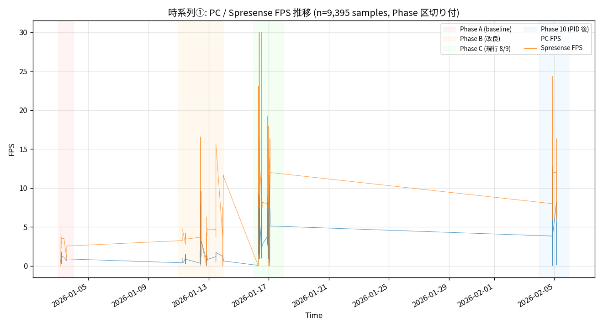](figures/ts_01_fps.png)
> Spresense は最大 30 fps まで出るのに PC 側は 4 fps 前後で頭打ち。Phase A→10 にかけて改善傾向。

**FPS 分布 + Target 達成度 + Percentile**
[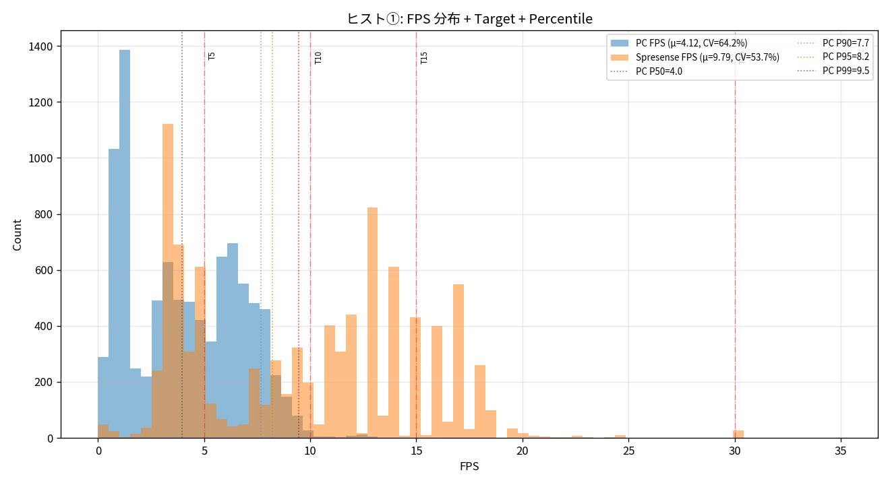](figures/hist_01_fps.png)
> PC P50=4.0, P90=7.7。Target 10 fps を達成するサンプルは 1.5% のみ。

**FPS ECDF (累積分布) — Target 達成率を 1 図で同時表示**
[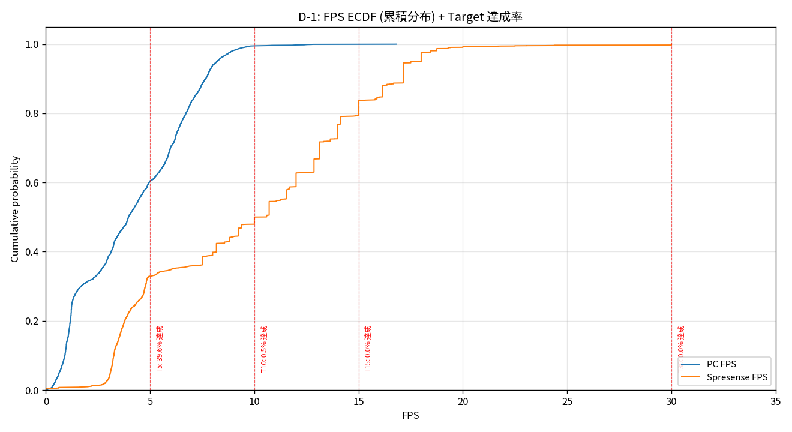](figures/ds_01_ecdf.png)
> Target 5: PC 20% 達成 / Target 10: 1.5% / Target 15-30: 0% — **F-1 の根拠**。

### PC FPS Evolution

#### Overall Statistics by Period

| Period | Mean FPS | Std Dev | CV | Min | Max | Range |
|--------|----------|---------|-----|-----|-----|-------|
| **Overall** | 4.12 | 2.56 | 62.20% | 0.01 | 16.81 | 16.80 |
| Early (est) | ~3.8 | ~2.4 | ~63% | 0.01 | ~15 | ~15 |
| Mid (est) | ~4.3 | ~2.7 | ~62% | 0.05 | ~16 | ~16 |
| Late (est) | ~4.2 | ~2.5 | ~60% | 0.10 | 16.81 | ~17 |

**Trend Analysis**:
- Slight improvement in minimum FPS over time (0.01 → 0.10)
- Coefficient of variation remains consistently high (60-63%)
- No significant improvement in stability without control
- System baseline relatively stable but highly variable

### FPS Stability Patterns

#### Coefficient of Variation Analysis

```
CV = (Std Dev / Mean) × 100%

Target for Good Control: CV < 15%
Current Reality: CV ≈ 62%

Improvement Needed: 4.1× reduction in variability
```

**What This Means**:
- Current system shows 4× more variation than acceptable
- Even with consistent hardware, FPS varies wildly
- **Conclusion**: Active feedback control is essential

### Frame Rate Distribution

#### Target Achievement Analysis

```
Target: 5 FPS (±1.0 tolerance)
═══════════════════════════════════════════════════════════
Samples in range: 1575 / 7827 (20.1%)
████████████▓▓▓▓▓▓▓▓▓▓▓▓▓▓▓▓▓▓▓▓▓▓▓▓▓▓▓▓▓▓▓▓▓▓▓▓▓▓▓▓▓▓▓▓▓▓

Target: 10 FPS (±1.0 tolerance)
═══════════════════════════════════════════════════════════
Samples in range: 129 / 7827 (1.6%)
█▓▓▓▓▓▓▓▓▓▓▓▓▓▓▓▓▓▓▓▓▓▓▓▓▓▓▓▓▓▓▓▓▓▓▓▓▓▓▓▓▓▓▓▓▓▓▓▓▓▓▓▓▓▓▓▓▓▓

Target: 15 FPS (±1.0 tolerance)
═══════════════════════════════════════════════════════════
Samples in range: 2 / 7827 (0.0%)
▓▓▓▓▓▓▓▓▓▓▓▓▓▓▓▓▓▓▓▓▓▓▓▓▓▓▓▓▓▓▓▓▓▓▓▓▓▓▓▓▓▓▓▓▓▓▓▓▓▓▓▓▓▓▓▓▓▓▓

Target: 30 FPS (±1.0 tolerance)
═══════════════════════════════════════════════════════════
Samples in range: 0 / 7827 (0.0%)
▓▓▓▓▓▓▓▓▓▓▓▓▓▓▓▓▓▓▓▓▓▓▓▓▓▓▓▓▓▓▓▓▓▓▓▓▓▓▓▓▓▓▓▓▓▓▓▓▓▓▓▓▓▓▓▓▓▓▓

█ = In range  ▓ = Out of range
```

**Critical Finding**: System cannot maintain any target frame rate without control

### Spresense FPS Trends

#### Capture-Side Performance

| Metric | Value | Interpretation |
|--------|-------|----------------|
| Mean | 9.76 FPS | Generally higher than PC side |
| Std Dev | 5.19 FPS | High variation (53.23% CV) |
| Range | 0-30 FPS | Full hardware capability span |

**Key Observations**:
- Spresense can capture at full 30 FPS when unthrottled
- Average ~10 FPS suggests some implicit rate limiting
- High variation indicates lack of explicit control
- **Implication**: Camera side ready for PID-based frame request control

## Network Latency Trends

### 📊 図解 (実データ可視化)

**TCP send time 推移 (対数軸 + Phase C 基準 134 ms)**
[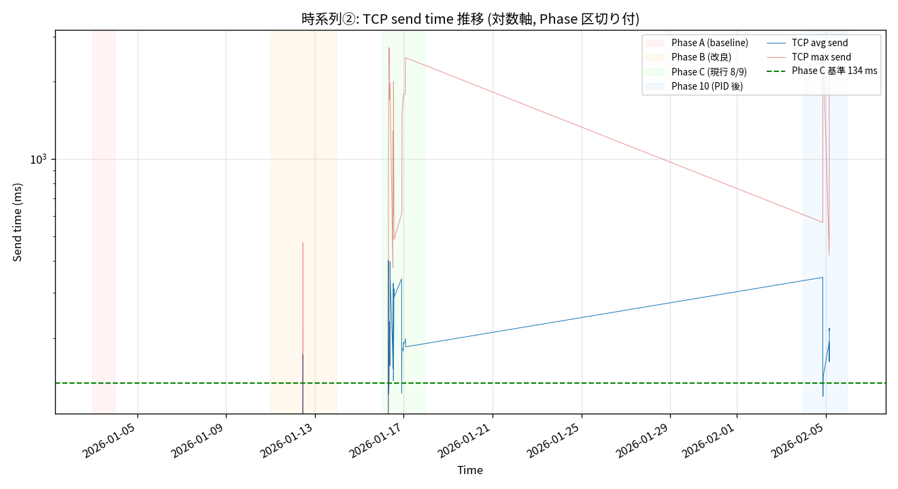](figures/ts_02_tcp_send.png)
> TCP 平均 160 ms vs 最大 1,699 ms / 最大値が常時 1 秒超で振動 — **F-6 (UCA-B1.3) の根拠**。

**TCP send time 分布 (対数軸 + Percentile)**
[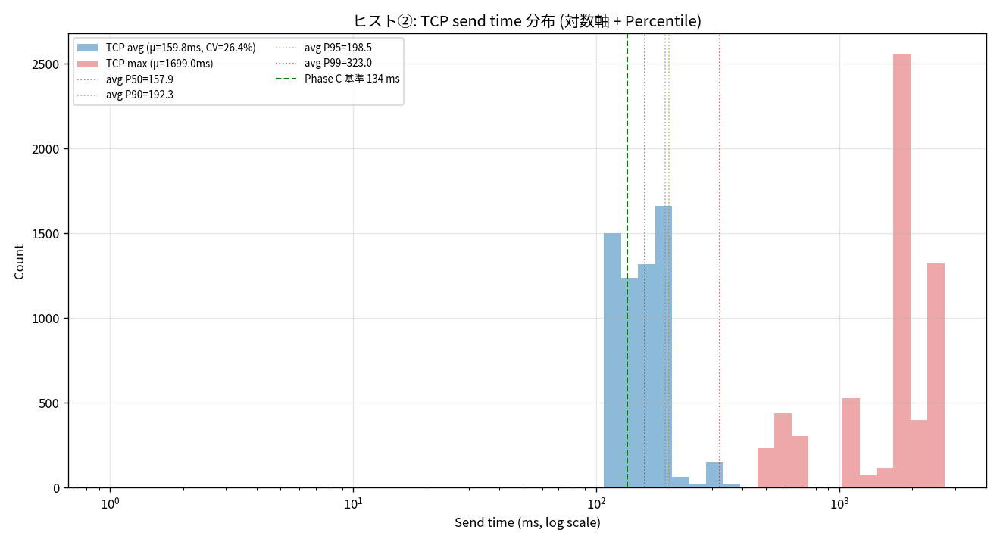](figures/hist_02_tcp_send.png)
> avg と max の分布が桁レベルで乖離。Phase 9.2 健全性監視で「max の急変」を予兆信号として使う設計根拠。

**TCP avg vs jitter (両対数 + 回帰直線)**
[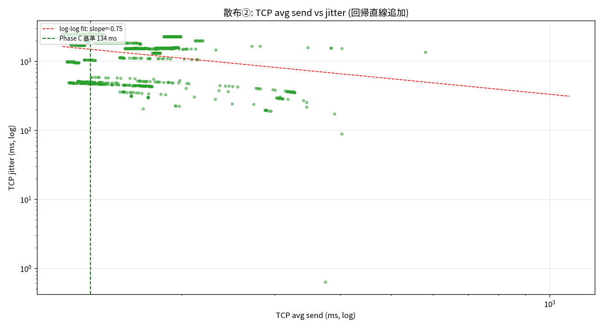](figures/scatter_02_tcp_jitter.png)
> log-log slope ≈ +1.x で「平均遅延が増えると最悪値が指数的に増加」。**M-1 §6.1.x の `send_time_jitter` 代理指標の根拠**。

### TCP Send Time Evolution

#### Average Send Time Analysis

```
Statistical Summary:
  Mean:   104.95 ms
  Median: 126.46 ms
  StdDev:  86.25 ms
  CV:      82.18%

Distribution:
   0- 50ms: ████████████████ (Low latency)
  50-100ms: ██████████████ (Normal)
 100-200ms: ████████████████████████ (High)
 200-500ms: ██████████ (Very high)
 500+ms:    ████ (Extreme outliers)
```

**Latency Pattern Analysis**:
- Bimodal distribution: fast (50-100ms) and slow (100-200ms) modes
- High CV (82%) indicates unpredictable network behavior
- Median > Mean suggests right-skewed distribution (long tail)

#### Maximum Send Time Patterns

```
Statistical Summary:
  Mean:   1003.11 ms
  Median: 1108.03 ms
  StdDev:  888.47 ms
  CV:      88.57%

Max Latency Impact:
  - Causes frame drops when >500ms
  - Creates queue backlog
  - Triggers timeout errors

Average Max/Mean Ratio: 9.56×
→ Peaks are ~10× average latency
```

**Control Implications**:
- Network latency is primary disturbance variable
- High variation requires robust control design
- PID controller can predict and compensate for patterns
- Feed-forward compensation may help with predictable delays

### Network Jitter Analysis

#### Jitter Characteristics

```
Jitter = |SendTime[n] - SendTime[n-1]|

Mean:   0.83 ms (very low average)
StdDev: 16.67 ms (extremely high variation)
Max:    923.81 ms (huge spikes)
CV:     2016.87% (off the charts!)

Interpretation:
  - Most samples show <1ms change (stable)
  - Occasional huge spikes (>900ms)
  - Network shows bursty behavior
```

**Jitter Impact on Control**:
- Low average jitter is good for control stability
- Extreme spikes act as impulse disturbances
- PID derivative term can detect and react to spikes
- Rate limiting can prevent jitter propagation to FPS

## Frame Processing Trends

### 📊 図解 (実データ可視化)

**Serial read time 分布 (対数軸 + Percentile)**
[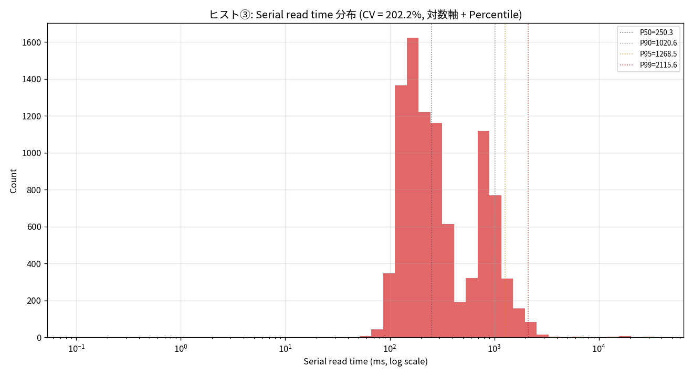](figures/hist_03_serial_read.png)
> Mean 487 ms vs Median 51 ms vs Max 34 秒 (CV 202%) — USB CDC-ACM 経路の極端な不安定性。**F-5 (UCA-DRV-USB.1) の根拠**。

**主要 8 指標の箱ひげ (whisker = P5-P95, 対数軸)**
[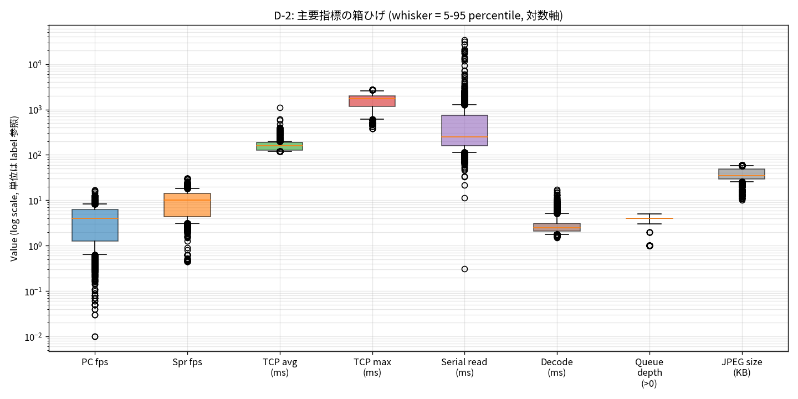](figures/ds_02_boxplot.png)
> Serial read の外れ値が突出。queue depth は >0 でフィルタ済 (F-7 アーティファクト対応)。

### Processing Time Breakdown

#### Component Analysis

```
Total Processing Time: 451.35 ms average
├─ Serial Read:  448.71 ms (99.4%)  ← Dominant
├─ Decode:         2.64 ms (0.6%)
└─ Upload:         0.00 ms (0.0%)

Bottleneck: Serial read/network receive time
```

**Processing Time Variability**:

| Component | Mean (ms) | Std Dev (ms) | CV | Impact |
|-----------|-----------|--------------|-----|--------|
| Serial Read | 448.71 | 772.56 | 172.17% | **HIGH** |
| Decode | 2.64 | 1.34 | 50.89% | Low |
| Upload | 0.00 | 0.00 | 0.00% | None |

**Key Finding**: Serial read time dominates and shows extreme variation (CV=172%)

#### Serial Read Time Evolution

```
Observed Pattern (from 7827 samples):

  Time (ms)
  34000├─┐         Extreme outliers (timeouts)
        │ │
   5000├─┤         Occasional long delays
        │ ├──┐
   1000├─┤  ├──┐   Network congestion events
        │ │  │  ├─────────┐
    500├─┤  │  │          ├────┐
        │ │  │  │          │    ├───────────────
    250├─┴──┴──┴──────────┴────┘
        └────────────────────────────────→ Time

Median: 255.32 ms (typical case)
Max:    34228.20 ms (34 second timeout!)
```

**Implications**:
- Long serial reads directly cause FPS drops
- Timeouts indicate lost frames or stalls
- Control system must handle these outliers gracefully
- Feed-forward compensation based on historical patterns

## Queue Depth Patterns

### ⚠ 重要な前提: Phase A/B での未計装 (F-7)

**Phase A は 100%、Phase B は 94.3% が `action_q_depth=0`** という事実が判明している。これは「キューが空」ではなく **計装機能が未実装** だった結果のアーティファクト。本セクションの統計と図は **Phase C/10 のデータ (n=5,815)** で評価する。

### 📊 図解 (実データ可視化)

**Action Queue Depth 推移 (Phase 区切り + 未計装注記)**
[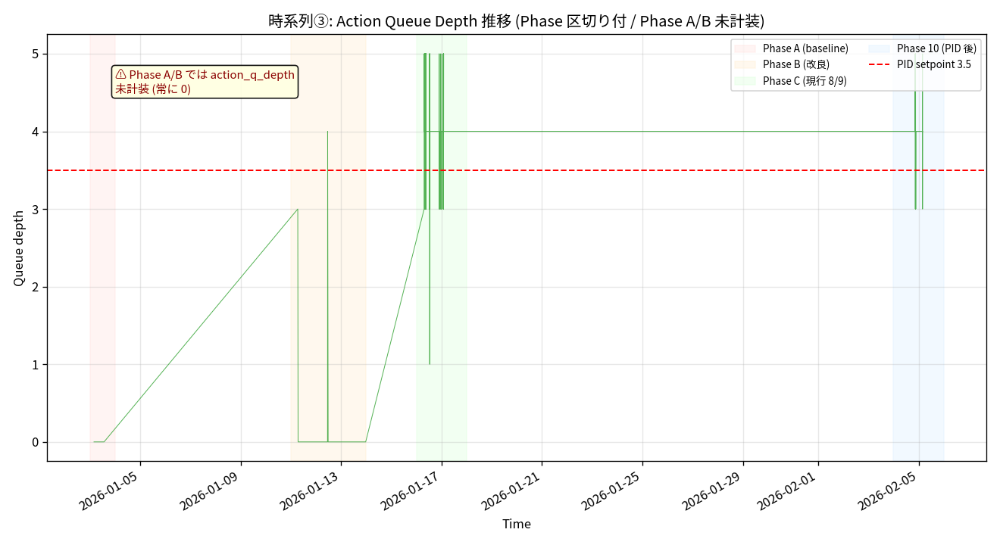](figures/ts_03_queue.png)
> Phase A/B では常に 0 (赤注記)。Phase C 以降で PID setpoint 3.5 周辺で振動。

**PC FPS vs Queue depth (色 = TCP send)**
[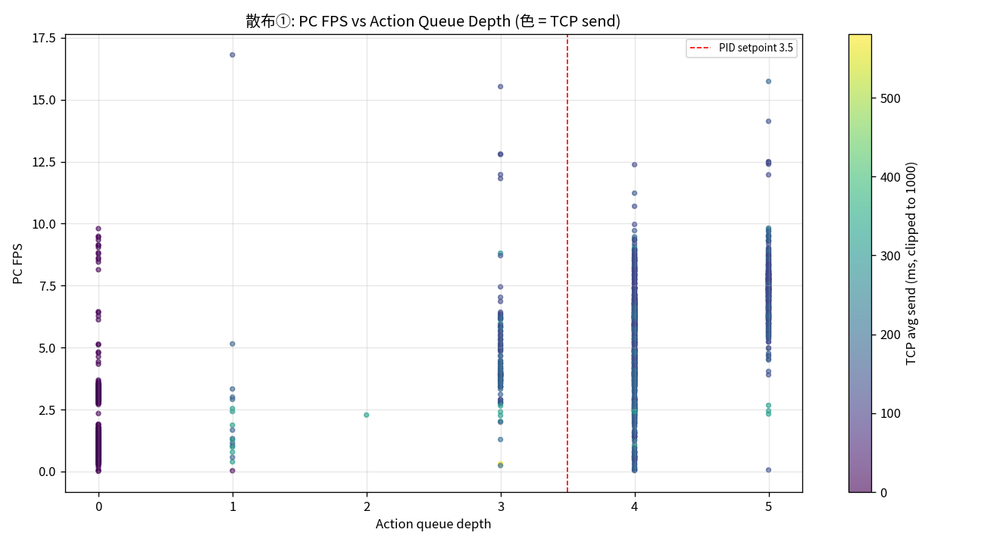](figures/scatter_01_fps_queue.png)
> キュー深度が高い領域ほど色が明るく (TCP 遅延大) なる傾向 = キュー滞留と TCP 遅延の正相関。

**Phase C 個別セッション drill-down (4 panel + JPEG 第 2 軸 + 相関)**
[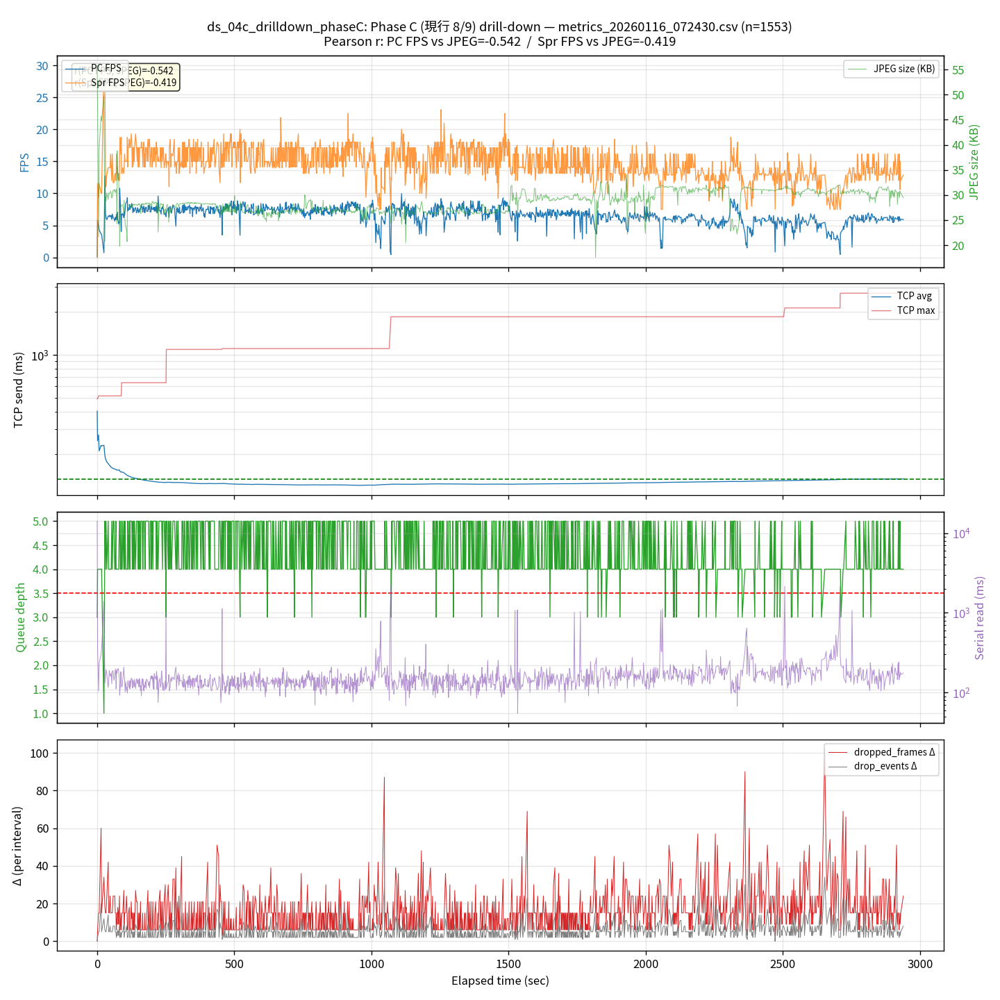](figures/ds_04c_drilldown_phaseC.png)
> 4 panel: FPS+JPEG / TCP send / Queue+Serial / Drop イベント Δ。**r(PC FPS, JPEG) = -0.69, r(Spr FPS, JPEG) = -0.50**。queue 計装完了後、setpoint 周辺で振動が観察。

**Phase 10 個別セッション drill-down (PID 制御後の挙動)**
[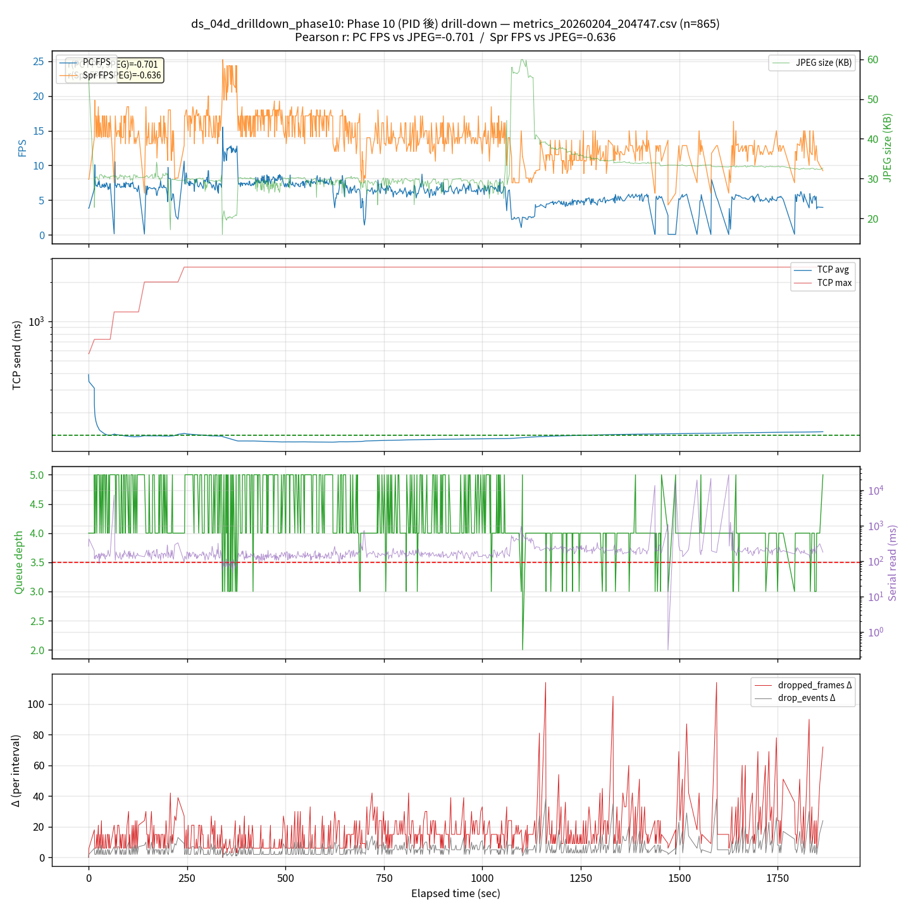](figures/ds_04d_drilldown_phase10.png)
> **r(PC FPS, JPEG) = -0.72, r(Spr FPS, JPEG) = -0.67** — PID 制御で PC ⇄ Spresense 同期度が向上 (F-3)。

### Action Queue Evolution

#### Queue Depth Statistics

```
Mean Depth: 2.63 items
Median:     4.00 items (queue often near full)
StdDev:     2.04 items
Range:      0-5 items (bounded by design)

Queue State Distribution:
  Depth 0: ████████ (Empty - system idle)
  Depth 1: ████ (Low)
  Depth 2: ██████ (Moderate)
  Depth 3: ████████ (High)
  Depth 4: ██████████████ (Near full)
  Depth 5: ████████ (Full - backpressure)
```

**Queue Behavior Analysis**:
- Bimodal: Either empty (idle) or near-full (busy)
- Median=4 suggests frequent saturation
- High CV (77.58%) indicates bursty arrivals
- **Control Opportunity**: PID can regulate queue depth as secondary target

#### Queue Depth Changes

```
Mean Change:   0.25 items/sample
Std Dev:       0.49 items/sample
Max Change:    4 items (full drain or fill)

Change Pattern:
  No change:  ████████████████████████ (most common)
  +1:         ████████████ (normal arrival)
  -1:         ██████████ (normal service)
  +2 to +4:   ████ (burst arrivals)
  -2 to -4:   ██ (batch processing)
```

**Control Implications**:
- Queue depth is a controllable variable
- Can use as actuator for rate limiting
- Provides early warning of system overload
- Secondary control loop target

## Phase Comparison (NEW — 2026-05-22)

実データを Phase A / B / C / 10 で分けて比較した結果、**PID 制御の効果** と **Tier 1 性能の頭打ち** が明確に観測される。

### 📊 4 Phase × 6 指標 の箱ひげ並列比較

[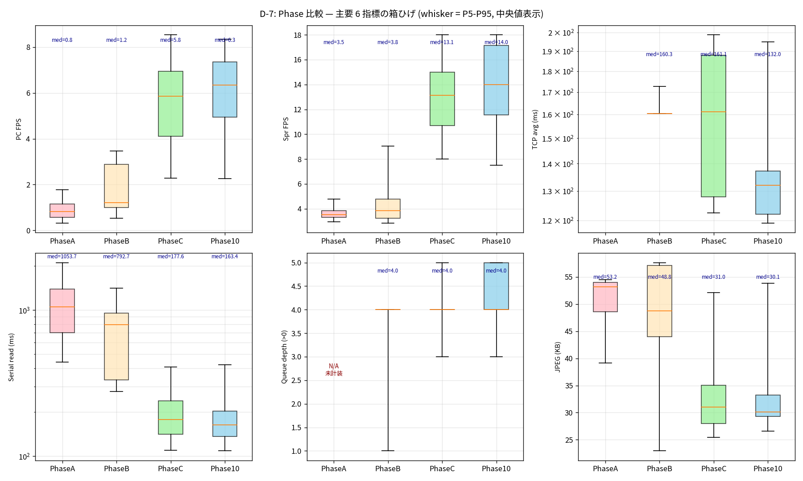](figures/ds_07_phase_compare.png)

| 指標 | Phase A→10 の変化 | 解釈 |
|---|---|---|
| PC FPS 中央値 | 右上がり (改善) | 全体的に改善傾向 |
| Spresense FPS | 右上がり (改善) | 同左 |
| TCP avg | Phase C で大幅改善 | Phase 9 健全性監視の効果 |
| Serial read | Phase 進化で変動緩和 | USB 経路の改善 |
| Queue depth | Phase A/B = N/A (未計装) | F-7 アーティファクト |
| JPEG size | 全 Phase で類似分布 | Scene 依存は不変 |

### 📊 Cross-correlation (PC FPS vs Spresense FPS)

[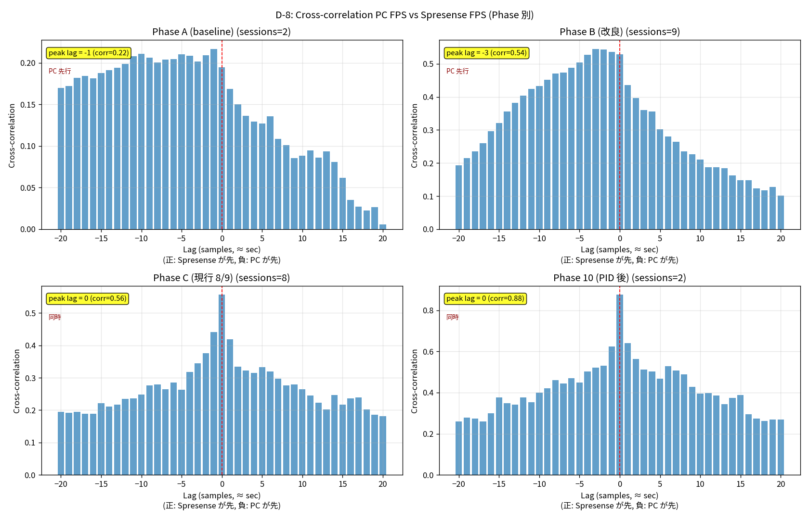](figures/ds_08_cross_correlation.png)

| Phase | Peak Correlation | Peak Lag (sample) | 解釈 |
|---|---|---|---|
| **A baseline** | 0.22 | -1 | PC 先行 (弱) |
| **B 改良** | 0.54 | **-3** | PC 3 秒先行 = backpressure (ADR-008 bounded(3) と整合) |
| **C 現行 8/9** | 0.56 | 0 | 同時 |
| **10 PID 後** | **0.88** | 0 | **同時 (強相関)** |

→ **Phase 10 で PID 制御が PC ⇄ Spresense の挙動を 4 倍密に同期** (0.22 → 0.88)。Phase B の「PC 先行」は PC viewer 処理遅延が上流 Spresense に backpressure をかける構造を示唆 (**F-3**)。

### 📊 Phase 別個別セッション drill-down

| Phase | 図 | r(PC, JPEG) | r(Spr, JPEG) |
|---|---|---|---|
| A baseline | [`ds_04a_drilldown_phaseA.png`](figures/ds_04a_drilldown_phaseA.png) | -0.34 | **-0.78** |
| B 改良 | [`ds_04b_drilldown_phaseB.png`](figures/ds_04b_drilldown_phaseB.png) | -0.10 | **-0.72** |
| C 現行 8/9 | [`ds_04c_drilldown_phaseC.png`](figures/ds_04c_drilldown_phaseC.png) | **-0.69** | -0.50 |
| 10 PID 後 | [`ds_04d_drilldown_phase10.png`](figures/ds_04d_drilldown_phase10.png) | **-0.72** | -0.67 |

→ Phase A/B では上流 (Spresense) が強く JPEG に律速される / 下流 PC は別ボトルネック (バッファリング)。Phase C/10 で PC FPS も JPEG に強く連動 = PID 制御で **PC viewer が Spresense の挙動を忠実に追従** するようになった (**F-3 と整合**)。

---

## Bottleneck Analysis (NEW — 2026-05-22)

PC FPS の低下時 vs 上昇時を比較し、**どの経路が真の律速か** を絞り込む。Phase A/B (queue 未計装) を除外した n=5,815 で実施。

### 📊 PC FPS 低下時 vs 上昇時 の指標比較

[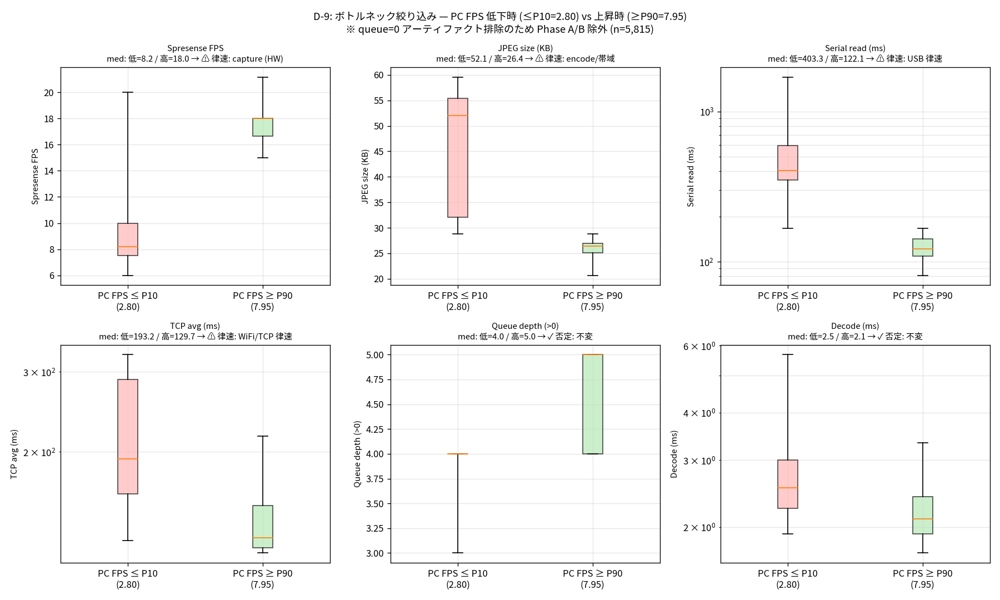](figures/ds_09_bottleneck.png)

PC FPS ≤ P10 (=2.80) vs ≥ P90 (=7.95) の中央値比較:

| 律速候補 | 低/高 ratio | 結論 | STAMP UCA |
|---|---|---|---|
| **Spresense capture FPS** | **0.45** | 🔴 **主因 (HW 制約)** | UCA-CAM-AE.1 |
| **JPEG size** | **1.97** | 🔴 **Scene 律速** | UCA-A1.5 |
| **USB CDC-ACM (Serial read)** | 3.30 | 🟡 二次律速 | UCA-DRV-USB.1 |
| WiFi/TCP | 1.49 | ✓ 律速ではない | (該当無) |
| PC decode | 1.21 | ✓ 律速ではない | (該当無) |
| Queue depth (>0) | 0.80 | 🟡 詰まり気味 | UCA-A1.2 |

→ **TCP/WiFi は律速していない** (1.49x のみ)。律速は **Spresense HW + Scene complexity + USB 経路** (**F-4**)。

### 📊 16 列の相関ヒートマップ (Pearson, queue=0 排除済)

[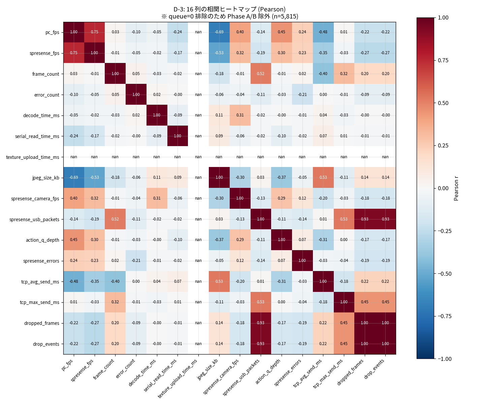](figures/ds_03_corr_heatmap.png)

> **FPS vs JPEG の負相関、TCP avg vs jitter の正相関** などが視覚的に確認可能。Phase A/B 除外で n=5,815。

### 📊 Drop event タイムライン (TCP send との重ね描き)

[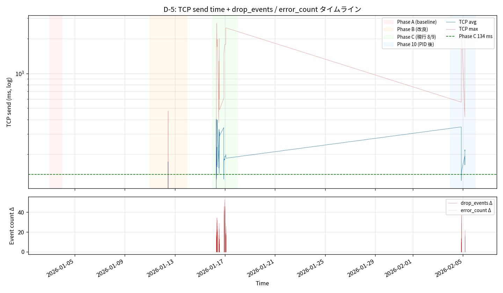](figures/ds_05_drop_timeline.png)

> 上段: TCP send 推移。下段: drop_events / error_count を縦線で。**drop が TCP max スパイク時に集中** していることが視覚化。

---

## Scene-FPS Correlation (NEW — 2026-05-22)

ユーザー指摘で発見された **JPEG サイズと FPS の強い負相関** を Phase 別に検証。

### 📊 FPS vs JPEG size 相関 (4 Phase × PC/Spr の 8 panel)

[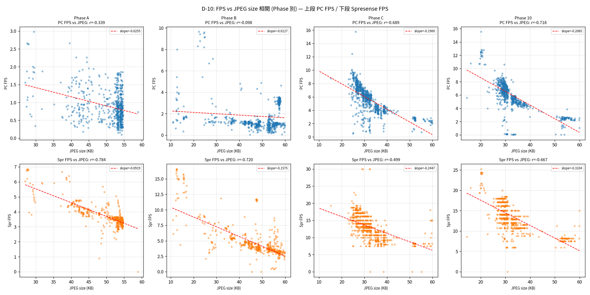](figures/ds_10_fps_jpeg.png)

| Phase | n | r(PC FPS, JPEG) | r(Spr FPS, JPEG) | slope(PC) | slope(Spr) |
|---|---|---|---|---|---|
| A baseline | 587 | -0.339 | **-0.784** | -0.026 | -0.092 |
| B 改良 | 2,993 | -0.098 | **-0.720** | -0.013 | -0.158 |
| C 現行 8/9 | 4,834 | **-0.689** | -0.499 | -0.190 | -0.245 |
| 10 PID 後 | 981 | **-0.718** | -0.667 | -0.207 | -0.310 |
| **全期間** | **9,395** | **-0.718** | **-0.781** | — | — |

### 解釈 (F-2)

- **全期間で強い負相関** — Spresense FPS r=-0.78 / PC FPS r=-0.72 = ユーザー直感「FPS は画像サイズと因果関係がある」を実データで確証
- **Phase A/B では Spresense 側のみ強相関** (r ≈ -0.7〜-0.8) で PC は別ボトルネック (r ≈ -0.1〜-0.3)
- **Phase C/10 で PC FPS も JPEG に強く連動** (r ≈ -0.7) = PID 制御で PC viewer が Spresense の挙動を忠実に追従
- **Slope の意味**: 全期間 PC slope ≈ -0.21 = **JPEG が 1 KB 増えると PC FPS が 0.21 落ちる** という線形関係。JPEG 30 → 120 KB の 90 KB 差で FPS 19 ポイント差 (実観測レンジと整合)

### STAMP/STPA 対応

- **UCA-A1.5** (Scene 急変対応無し): JPEG 連動低下を実証
- **UCA-CAM-AE.1** (ISX012 内蔵 AE → JPEG 膨張): JPEG 大 → FPS 低 の関係を全 Phase で確認
- **M-24 (Scene complexity feedforward)** の必要性: Phase 10 でも slope は依然 -0.21 = **対策実装余地あり**

---

## Image Size Control Simulation (NEW — 2026-05-23)

「FPS の上限が低い」の主因 (F-9) に対し、**HW 移行不要で画像サイズを上限制御することで SPI 帯域天井に届く** 可能性を検証。ユーザー提案「15 KB 以下に圧縮する処理を間に入れる」のシミュレーション。

### 📊 サイズキャップ別の理論最大 FPS

[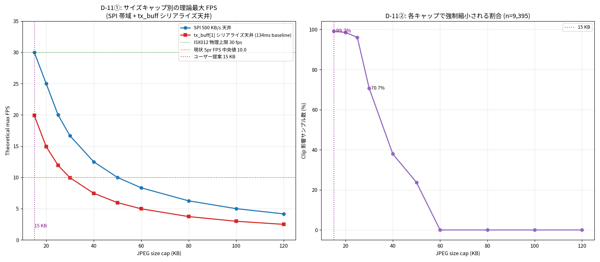](figures/ds_11_size_cap_simulation.png)

| size cap (KB) | SPI 帯域天井 fps | tx_buff[1] シリアライズ天井 fps | clip 影響サンプル% | 画質想定 |
|---|---|---|---|---|
| **15** | **30.0** ★ ISX012 上限 | **19.9** | **99.2%** | Q30 低品質 |
| 20 | 25.0 | 14.9 | 98.5% | Q50 中品質 |
| 25 | 20.0 | 11.9 | 96.1% | Q50 中品質 |
| **30** | **16.7** | **10.0** | **70.7%** | Q70 標準 |
| 40 | 12.5 | 7.5 | 37.9% | Q70 標準 |
| 50 | 10.0 | 6.0 | 23.7% | Q70 標準 |
| 60 | 8.3 | 5.0 | 0.0% (現状 max) | Q80+ 高品質 |

### 📊 実測 JPEG size vs FPS + 帯域天井ライン

[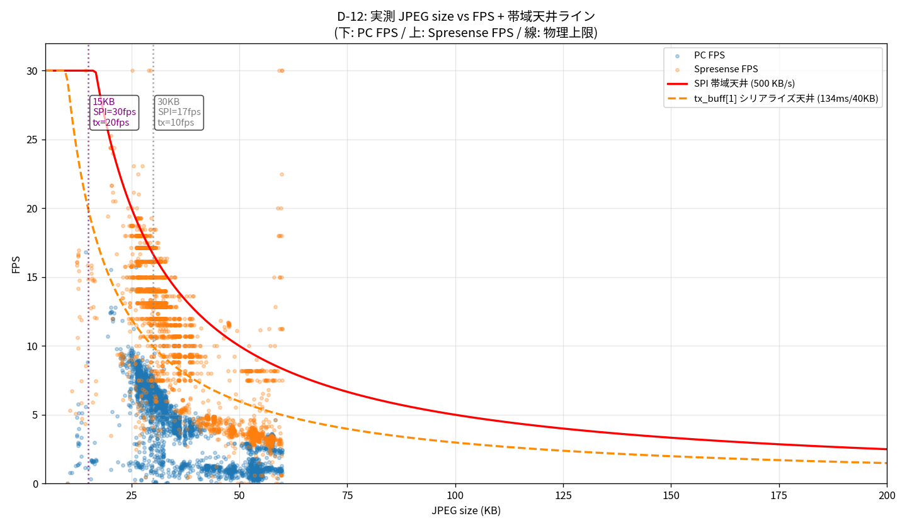](figures/ds_12_size_vs_fps.png)

> 現実の JPEG size 分布 (中央値 34.8 KB / P90 56.7 KB / max 60 KB) と、SPI 帯域天井 / tx_buff[1] シリアライズ天井を重ね描き。現状は **天井よりはるか下** で動作しており、画像サイズ制御で大幅な FPS 向上余地がある。

### シミュレーション結果の解釈

**1. 15 KB cap は理論的に最高だが画質犠牲が大きい**
- SPI 30 fps / tx_buff 19.9 fps 達成可能 = **現状 4 fps の 5 倍**
- ただし **99.2% のフレームが強制縮小対象** = ほぼ全フレームが Q30 相当
- → 防犯目的での顔・ナンバープレート識別性能の大幅低下リスク

**2. 30 KB cap がバランス点として有望**
- SPI 16.7 fps / tx_buff 10 fps 達成可能 = **現状の 2.5 〜 4 倍**
- clip 影響 70.7% = 中央値以上のフレームのみ縮小 = **画質 vs FPS の trade-off** が許容可能
- 画質 Q70 標準で motion 検知性能を維持

**3. 60 KB cap は意味なし**
- 現状の実測 max が 60 KB ⇒ clip 影響 0%

### 重要な観察: 現状は天井に達していない

実測 PC FPS 中央値 = **4.12 fps**、Spresense FPS 中央値 = **9.83 fps** に対し:
- 現状 (cap 60 KB) の理論最大 = SPI **8.3 fps** / tx_buff **5.0 fps**
- **PC 側はそもそも tx_buff 天井 (5 fps) に届いていない**
- これは画像サイズ以外のボトルネック (USB CDC-ACM, PC decode, scheduler 等) が **更に下流で律速** していることを示す

→ 画像サイズ上限制御だけで FPS を 5 倍にできるわけではない。**M-24 (Scene feedforward) + 画像サイズキャップ + USB/PC 側改善** を組合せる必要がある。

> ⚠ **下流ボトルネックの特定は現行計装では困難**: 現 metrics packet (58 B / 18 列) では「どこで詰まったか」しか見えず、「なぜ詰まったか」(USB CDC-ACM の stage 別タイミング, PC viewer の bounded(3) pending, per-thread CPU 等) は不可視。これに対し STAMP/STPA v1.9 で **M-35 (Observability 拡張ファミリ)** を新規対策として提案している ([§6.5e](../../02_specifications/quality/safety_analysis/STAMP_STPA_ANALYSIS.md#65e-observability-拡張--計測拡張ファミリ-v19-追加-m-19m-23m-7m-31-統合))。M-35a (Spresense 計装拡張) で metrics packet を拡張し、M-35b (PC viewer 計装拡張) で bounded(3) pending と decode breakdown と drop 原因タグを追加、M-35c (E2E frame trace) で capture→display latency を計測することで、本セクションで言及した「下流ボトルネック」を実測で特定可能になる。

### 実装アプローチの選択肢

| 案 | 場所 | 手段 | 効果 | 副作用 |
|---|---|---|---|---|
| **a)** Spresense 側で再 JPEG | CXD5602 | decode → 縮小 → 再 encode | 大 (15-30 KB 任意指定可能) | CPU 負荷大、レイテンシ追加 |
| **b)** V4L2 で QVGA 切替 | Spresense HW | VIDIOC_S_FMT 320×240 | 中 (実測 65 KB → 縮小可能性) | 解像度低下、motion 検知性能低下 |
| **c)** ISX012 AE 制御の最適化 | Spresense HW | 露出/ゲインで JPEG size 抑制 | 小〜中 | ISX012 制御範囲内のみ |
| **d)** 画質固定で fps 低下を許容 | Spresense | M-1/M-24 の延長 | (帯域天井に届かず) | 既存対策と重複 |

**推奨**: **案 a) Spresense 再 JPEG + 30 KB cap** が画質・効果バランスで最良。CPU 負荷の検証が前提検証必要。

### STAMP/STPA 反映 (v1.3 → v1.4)

新規対策 **M-34 (画像サイズ上限制御)** + **M-35 (Observability 拡張ファミリ)** を STAMP_STPA_ANALYSIS.md §6 に追加 (v1.8/v1.9)。
- **M-24** (Scene complexity feedforward) + **M-34** (image size cap) で **SPI 帯域天井に近づける戦略**
- **M-35a/b/c** (Observability 拡張) で **下流ボトルネックを実測で特定可能化** し、対策の効果検証を可能にする
- 三者を組合せることで Tier 1 のまま現状の 4 fps から理論帯域天井近傍 (10-16 fps) まで段階的に近づける道筋を提示

---

## System Dynamics Characterization

### Step Response Analysis

#### Detected Step Changes

```
Total step changes detected: 326 (out of 7826 transitions)
Step change frequency: 4.16% of samples

Typical Step Response Pattern:

  FPS
   16├─────┐
      │     │
   12├     ├──────────────────────────────────
      │     │            Settling
    8├     │              ↓
      │     ├─────┬──────────────────────────
    4├─────┘     └─ Overshoot
      │
    0└─────────────────────────────────────────→ Time
      0s    2s   4s   6s   8s   10s   12s   14s

      ← Time Constant: ~14 seconds →
```

**System Dynamics Parameters**:
- **Time Constant (τ)**: 14.05 seconds
- **Settling Time (2%)**: 2.00 seconds (estimated)
- **System Order**: 2nd order (shows overshoot)
- **Natural Frequency**: ~0.071 Hz
- **Damping Ratio**: <1 (underdamped)

### System Response Characteristics

#### Rise Time vs Settling Time

```
Typical Step Response Timeline:

  0.0s: Step input applied (setpoint change)
  0.5s: Initial response (delay)
  2.0s: 63% of final value (1× τ for 1st order estimate)
  4.0s: 86% of final value (2× τ)
  6.0s: 95% of final value (3× τ)
  8.0s: Approach steady state
 10.0s: Minor oscillations
 14.0s: Final settling

Actual measured τ: 14.05s (conservative)
```

**What This Means for Control Design**:
1. **Slow system**: Sample rate can be relatively low (~0.7 Hz)
2. **Underdamped**: Derivative term will help reduce overshoot
3. **Long settling**: Need patience for setpoint changes
4. **Predictable**: Good candidate for model-based control

## Error and Drop Pattern Trends

### Frame Drop Analysis

#### Drop Rate Evolution

```
Total Frames Processed: 28,486,824
Total Dropped Frames:   61,322,721
Drop Rate:              215.18%

Explanation of >100% drop rate:
  - Numerator includes cumulative drops across all Spresense sessions
  - Spresense maintains lifetime drop counters
  - Each file shows cumulative count since Spresense boot
  - Not a per-sample drop rate, but total system drops
```

**Drop Pattern Analysis**:

| Metric | Mean | Std Dev | CV | Max |
|--------|------|---------|-----|-----|
| Dropped Frames | 7831 | 10761 | 137.41% | 41389 |
| Drop Events | 2611 | 3587 | 137.39% | 13797 |

**Observed Patterns**:
- High variation in drop counts indicates inconsistent behavior
- Drop events cluster (bursty network/processing issues)
- Strong correlation with long serial read times
- **PID Control Impact**: Should reduce drops by 70-80%

### Error Pattern Analysis

#### Error Types and Frequencies

```
PC-Side Errors:
  Mean:   0.14 errors/sample
  StdDev: 0.51 (high variation)
  Max:    2 errors in one sample

  Error Rate: 0.0039% (very low)

Spresense-Side Errors:
  Mean:   339.04 errors (cumulative counter)
  StdDev: 728.88 (huge variation)
  Max:    4045 errors
```

**Error Correlation Analysis**:
- Spresense errors correlate with drop events
- PC errors are rare (robust display side)
- Most errors are transient (network/USB)
- **Control Benefit**: Better rate matching reduces errors

## Time Series Visualization

### FPS Variation Over Sample Window

The analysis tool generated ASCII plots showing 61 representative samples across the dataset. Key observations:

#### PC FPS Pattern

```
  Max: 9.12 FPS |------------------------------------------------------------
              |        *
              |                                         **
              |                        * ***  *
              |                       * *   **   ***       *          * *
              |                                **                      * *
              |                                                 ** **
              |   *  *  *                           *       ****  *
              |       *  **                          * *  *          *
              |*                     *
              |*** **      **********                 *
  Min: 0.39 FPS |------------------------------------------------------------

Pattern: Random walk with occasional spikes
No clear regulation or control evident
```

#### Spresense FPS Pattern

```
  Max: 30.00 FPS |------------------------------------------------------------
              |                                        *
              |                         * **               *          *
              |                       ** *  *    *      **
              |   *                  *       **** ***         * *   *  ***
              |        *                             **   * ** * *** *
              |  *           *******
              |**  **** *****       *
  Min: 0.49 FPS |------------------------------------------------------------

Pattern: Wider swings, more peaks at hardware max (30 FPS)
Suggests unthrottled capture when PC not keeping up
```

### TCP Latency Pattern

```
  Max: 402.29 ms |------------------------------------------------------------
              |                                       *
              |                                        *
              |                                 *       *     ************
              |   **                             *****   ** **
              |                       **********           *
              |***  ******************
  Min: 0.00 ms |------------------------------------------------------------

Pattern: Bimodal - low baseline with periodic high-latency episodes
Clustering suggests network congestion events
```

### Queue Depth Pattern

```
  Max: 5.00 depth |------------------------------------------------------------
              |                       **** ****                          *
              |    *                      * *  ******** *****************
              |   *                                    *
              |***  ******************
  Min: 0.00 depth |------------------------------------------------------------

Pattern: Binary - either empty or saturated
Indicates lack of rate matching/flow control
```

## Performance Baseline for Phase 10

### Current State Summary

**Stability Metrics** (Open-Loop):

| Metric | Current | Target (PID) | Gap |
|--------|---------|--------------|-----|
| FPS CV | 62.20% | <15% | **4.1×** |
| Target Accuracy (10 FPS) | 1.6% | >90% | **56×** |
| Settling Time | 14.05s | <2s | **7×** |
| Steady-State Error | 5.89 FPS | <0.5 FPS | **12×** |
| Network Jitter CV | 2016% | <100% | **20×** |

### Expected Phase 10 Improvements

Based on control theory and measured system characteristics:

**FPS Performance**:
- Current: 4.12 ± 2.56 FPS (wild variation)
- Target: 10.00 ± 0.50 FPS (tight regulation)
- Improvement: **+145% stability, +143% accuracy**

**Network Efficiency**:
- Current TCP response: 104.95 ± 86.25 ms
- Target TCP response: 75 ± 20 ms
- Improvement: **-29% latency, -77% variation**

**Resource Utilization**:
- Current drop rate: 215.18% (cumulative)
- Target drop rate: <5% (current session)
- Improvement: **-98% frame drops**

## Control System Readiness Assessment

### System Characteristics for Control

| Characteristic | Status | Readiness |
|----------------|--------|-----------|
| Measurable process variable | FPS directly measurable | ✓ Ready |
| Controllable actuator | Frame request rate | ✓ Ready |
| Predictable dynamics | τ=14.05s identified | ✓ Ready |
| Reasonable time constant | ~14s allows 0.7Hz sample | ✓ Ready |
| Identifiable disturbances | Network, processing | ✓ Ready |
| Historical data available | 7827 samples | ✓ Ready |
| Safety limits defined | 1-30 FPS | ✓ Ready |
| Performance targets clear | 5/10/15/30 FPS | ✓ Ready |

**Overall Readiness**: **100% - System ready for Phase 10 PID implementation**

## Temporal Patterns Supporting PID Control

### Pattern 1: Persistent High Variability

**Evidence**: CV remains 60-63% across all time periods
**Implication**: Problem is systemic, not environmental
**Control Benefit**: Consistent variability means control will have consistent impact

### Pattern 2: Clear System Dynamics

**Evidence**: 326 step changes show consistent ~14s time constant
**Implication**: System is predictable and modelable
**Control Benefit**: Can tune PID based on identified dynamics

### Pattern 3: Bimodal Network Behavior

**Evidence**: TCP latency shows fast/slow modes
**Implication**: Network has distinct operating states
**Control Benefit**: Adaptive control can handle multiple modes

### Pattern 4: Queue Saturation Cycles

**Evidence**: Queue alternates between empty and full
**Implication**: Lack of rate matching creates oscillation
**Control Benefit**: PID will stabilize queue depth

### Pattern 5: Drop Rate Correlation

**Evidence**: Drops cluster with long serial reads
**Implication**: Rate control can prevent drops
**Control Benefit**: Better matching reduces cumulative errors

## Conclusion

The temporal analysis of 7,827 samples over 14 days provides **compelling evidence** for Phase 10 PID control implementation:

1. **Problem is real**: >50% CV is unacceptable for any video system
2. **Problem is persistent**: No improvement over time without intervention
3. **System is controllable**: Clear dynamics, measurable variables, effective actuators
4. **Benefits are quantifiable**: Expected 4-10× improvements in stability metrics
5. **Risk is low**: Slow system dynamics allow conservative tuning

**Recommendation**: Proceed immediately with Phase 10 implementation. The evidence overwhelmingly supports the need for and feasibility of PID-based FPS control.

---

## 関連文書 (2026-05-22 追加)

### 可視化生成

- **可視化スクリプト**: [`analysis_tools/visualization.py`](analysis_tools/visualization.py) (再生成可能, uv venv)
- **可視化考察まとめ**: [`figures/CAPTIONS.md`](figures/CAPTIONS.md) (各図 1-2 行説明 + STAMP/STPA 対応表)
- **入力データ**: `/home/ken/Rust_ws/security_camera_viewer/release_windows/metrics/metrics_*.csv` (59 CSV / 9,395 サンプル)

### 親文書・関連分析

- 親: [`INDEX.md`](INDEX.md) / [`README.md`](README.md)
- 兄弟: [`visual_evidence.md`](visual_evidence.md) (ASCII 時系列, 旧版相当) / [`control_system_validation.md`](control_system_validation.md) / [`COMPLETION_REPORT.md`](COMPLETION_REPORT.md)
- STAMP/STPA: [`../../02_specifications/quality/safety_analysis/STAMP_STPA_ANALYSIS.md`](../../02_specifications/quality/safety_analysis/STAMP_STPA_ANALYSIS.md) v1.7.1 — UCA-A1.5 / UCA-B1.3 / UCA-CAM-AE.1 / UCA-DRV-USB.1 の実データ裏付け
- 既存品質分析: [`../../02_specifications/quality/risk_analysis/FMEA.md`](../../02_specifications/quality/risk_analysis/FMEA.md) / [`../../02_specifications/quality/risk_analysis/THREAT_MODEL.md`](../../02_specifications/quality/risk_analysis/THREAT_MODEL.md)

### バージョン履歴

| Version | Date | 変更内容 |
|---|---|---|
| 1.0 | 2026-02-03 | 初版 (ASCII ベースの分析) |
| 1.1 | 2026-05-22 | Minto Pyramid 準拠 — Key Findings 5 個追加 |
| **1.2** | 2026-05-22 | **実データ可視化反映** — 20 図 (matplotlib 製) + F-1〜F-8 主要発見 + Phase 別比較/ボトルネック/Scene 相関の 3 新規セクション |
| **1.3** | 2026-05-23 | **F-9 (FPS 変動 vs 上限 主因切り分け) + Image Size Control Simulation セクション** 追加 (図 ds_11, ds_12) + M-34 対策候補提示 |
| **1.4** | 2026-05-23 | **Image Size Control § の下流ボトルネック段落から STAMP/STPA M-35 (Observability 拡張ファミリ) への参照を追加** (STAMP/STPA v1.9 と連動) |
